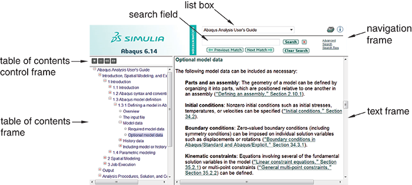

# 2.6.2 浏览和搜索 HTML 指南

您可以通过选择****帮助****搜索和浏览指南****来浏览和搜索整个 HTML 集合。出现的集合窗口包含文档集合中所有书名的列表。要查看特定指南，请单击感兴趣的标题；该指南将出现在新的浏览器窗口中。 （详细信息请参见[Using Abaqus Online Documentation](../hhp/hhp-link.md#hhp)。）

**要显示和搜索 HTML 指南：**

1. 从主菜单栏中，选择****帮助****搜索和浏览指南****。 Web 浏览器中将显示集合窗口，其中包含文档集合中所有书名的列表（按类别分组）。
2. 单击感兴趣的书名。包含您选择的指南的书籍窗口将在新的浏览器窗口中打开。图书窗口包含四个框架：导航框架、目录控制框架、目录框架和文本框架，如[Figure 2--6](pt01ch02s06s02.md#hhp-book)所示。 **图2--6** 图书窗口。3. 使用以下任意技术浏览指南的内容： **目录控件** 使用目录控制框架中的按钮来改变目录框架中显示的详细程度或更改框架的大小。单击可展开在线图书目录中的多个级别。单击可折叠目录中所有展开的部分。分别单击和可缩小或加宽目录框架。 **浏览** 使用文本框中的 和 箭头按顺序浏览文本。您还可以使用网络浏览器功能返回最近查看的页面。 **搜索** 使用导航框架中的搜索面板来搜索特定单词或短语。有关更多信息，请参阅[Chapter 4, "Searching the Abaqus HTML documentation," of Using Abaqus Online Documentation](../hhp/hhp-link.md#hhp-chp-html-search)。 **使用超链接** 使用超链接从一本书的一个部分移动到另一本书或从一本书移动到另一本书。

