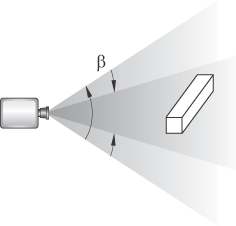
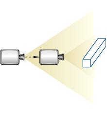

# 5.2.4 放大工具

当您选择放大工具和要在其中工作的视口时，Abaqus/CAE 进入放大模式，如放大光标 **** 所示。当您在放大模式下沿正方向拖动光标时，模型或图的视图会在视口内展开，并且橡皮带线指示相对放大倍数。同样，当您沿负方向拖动光标时，模型或图的视图会收缩，并且橡皮筋线会指示相对减少量。正方向和负方向取决于您在视图操作选项中的设置（请参阅["Using view manipulation shortcuts," Section 68.2](pt06ch68s02.md)）。如果您使用默认的 Abaqus/CAE 配置进行视图操作，则正方向为向右，负方向为向左。如果您使用非默认配置进行视图操作，则正方向为向上，负方向为向下。为了反映配置设置，橡皮筋线对于默认配置是水平的，对于非默认配置是垂直的。

拖动操作必须在视口中开始，但您可以在显示器的限制内继续拖动。您还可以反复拖动以获得所需的视图。放大工具仅识别拖动动作的水平（对于默认配置）或垂直（对于非默认配置）部分，如橡皮筋线所示。因此，您可以通过在屏幕上对角拖动来实现更精细的控制，因为与沿有效方向拖动相同距离相比，这会导致光标在有效方向上的运动分量更小。

使用放大工具的默认模式，顾名思义，放大视图；如[Figure 5--8](pt01ch05s02s04.md#viw-magnify1)所示，相机不相对于视图中的对象移动。放大倍率是通过改变视场角引起的，这与改变固定相机上的变焦时使用的方法相同。

**图 5-8** 放大视图。

执行操作时按住 **[Shift]** 即可访问放大工具的备用模式，该模式保持视野恒定并将相机移向或远离视图中的对象，如[Figure 5--9](pt01ch05s02s04.md#viw-magnify2)中所示。

**图 5-9** 将相机移近模型。

当电影模式打开时，以这种方式移动相机非常有用。那么你的视野就不受限制；您可以在模型中移动相机，这样您不想看到的任何部分都会被近平面或远平面移除，或者实际上位于相机后面。如果您不使用电影模式，则相机只能向前移动，直到到达模型的外部限制。

当 *X–Y* 图显示在视口中时，您可以放大数据视图以重点关注 *X–Y* 曲线的特定组成部分。当您更改 *X–Y* 图的放大倍数时，Abaqus/CAE 会更新轴中的值。

如果您忘记了自己的位置，可以使用[auto-fit](pt01ch05s06hlb06.md)工具重新缩放视图以适合视口。使用自动调整工具还会将相机目标重置到模型的中心。有关相关主题的信息，请单击以下任意项目：-["An overview of the view manipulation tools," Section 5.2.1](pt01ch05s02s01.md)-["Magnifying or reducing the view," Section 5.6.4](pt01ch05s06hlb04.md)-["Understanding camera modes and view options," Section 5.1](pt01ch05s01.md)

