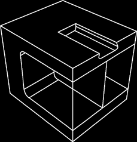
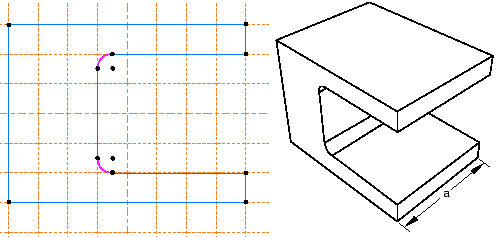
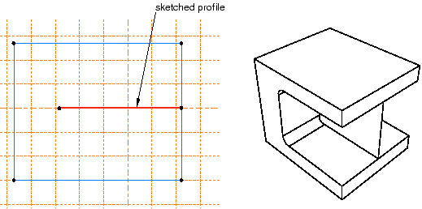
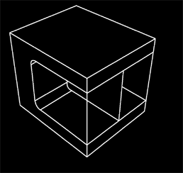
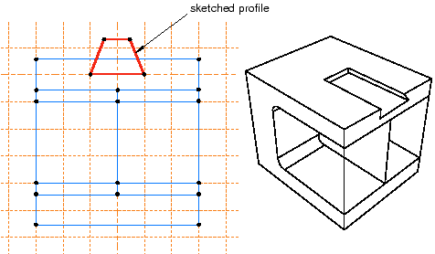

# 11.3.1 零件和特征之间的关系

在 Abaqus/CAE 中创建的零件具有基于特征的表示。特征是设计中有意义的部分，它为工程师提供了一种方便、自然的方式来构建和修改零件。在 Abaqus/CAE 中创建的零件是根据特征的有序列表以及定义每个特征的几何形状的参数构建的。您可以从以下形状特征中进行选择以在部件模块中构建零件：
- 固体
- 贝壳
- 电线
- 削减
- 混合

使用部件模块中的工具，您可以创建和编辑描述模型中每个零件所需的所有特征。 Abaqus/CAE 存储每个特征，并使用此信息来定义整个零件，在修改零件时重新生成零件，并在装配模块中生成零件的实例。有关零件如何与零件实例相关的更多信息，请参阅["What is a part instance?," Section 11.3.4](pt03ch11s03s04.md)。

以下序列说明了如何使用 Abaqus/CAE 中的可用功能构造[Figure 11--1](pt03ch11s03s01.md#prt-all-features)中的三维零件：

**图 11–1** 使用实体、壳、线、切割和混合特征构造的零件。

1. 构建零件时创建的第一个特征称为基本特征；您可以通过添加更多特征来构造零件的其余部分，这些特征可以修改基本特征或向基本特征添加细节。在此示例中，基本特征是 U 形零件；用户绘制了二维轮廓并将其拉伸以形成基本特征，如[Figure 11--2](pt03ch11s03s01.md#prt-all-features-base)中所示。 **图 11--2** 基本功能。草图和拉伸深度 (*a*) 是定义基本特征的可修改参数。您可以使用特征操纵工具集修改剖面草图或拉伸距离，重新访问基本特征并更改其大小或形状。如果需要，您可以删除基本特征并绘制新形状。
2. 添加加强腹板作为壳体特征。用户在其中一个内部面上绘制了一条线，并将草图拉伸到相反的面上，如[Figure 11--3](pt03ch11s03s01.md#prt-all-features-shell)中所示。草图是定义壳特征的唯一可修改参数。 **图11--3** shell 功能。3. 杆作为线特征添加到角上。通过连接用户选择的两个点来创建导线，如[Figure 11--4](pt03ch11s03s01.md#prt-all-features-wire)中所示。以这种方式创建的连线没有可修改的参数；如果您需要更改它们，则必须删除并重新创建它们。 **图 11--4** 电线特性。4. 在夹具顶部切出盲孔。用户绘制了一个二维轮廓，并将该轮廓通过指定的距离挤压到夹具中，如[Figure 11--5](pt03ch11s03s01.md#prt-all-features-cut)所示。草图和槽的深度是定义盲切特征的可修改参数。 **图11--5** 剪切特征。
5. 切口边缘呈圆形。用户选择要倒圆的边缘并提供倒圆的半径，如[Figure 11--6](pt03ch11s03s01.md#prt-all-features-round)中所示。半径是定义圆形特征的可修改参数。 **图11--6** 圆形特征。

如果新特征的几何形状依赖于现有特征，Abaqus/CAE 会在特征之间创建父子关系。新特征是子特征，它所依赖的特征是父特征。例如，在上述部分中，圆形特征是切割特征的子特征。如果更改切口的位置或大小，边缘仍保持圆形。同样，如果删除切割，Abaqus/CAE 也会删除倒圆角。

如果修改父特征，则修改可能会使父特征的子特征无效。例如，在上述零件中，如果您要增加切割深度以使其成为贯穿切割，则沿其边缘的圆角将会丢失；也就是说，修改后圆角将无法重新生成。 Abaqus/CAE 为您提供以下两种选择：
- 保留对父特征的更改，但抑制无法重新生成的特征。被抑制特征的子代也将被抑制。
- 中止对父特征的修改并返回到上次成功重新生成的状态。

有关相关主题的信息，请单击以下任意项目：-["What is feature-based modeling?," Section 11.3](pt03ch11s03.md)-["Modifying and manipulating features," Section 65.4](pt06ch65s04.md)

