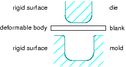
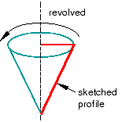
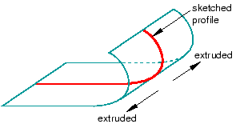
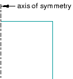

# 11.7.1 刚性部件

当您的模型包含相互接触的零件时，您可以指定一个或多个零件是刚性的。刚性零件表示比模型其余部分硬得多的零件，其变形可以忽略不计。

与定义为刚性的零件相反，定义为可变形的零件在与刚性零件或另一个可变形零件接触时可能会变形。例如，金属冲压工艺的模型可能使用可变形零件对毛坯进行建模，并使用刚性零件对模具进行建模，如[Figure 11--9](pt03ch11s07s01.md#prt-conc-rigid)中所示。

**图 11-9** 刚性和可变形零件。

在此示例中，模具被限制为不运动，并且模具在冲压过程中通过规定的路径移动。您可以通过选择刚体参考点并约束或规定其运动来控制刚性零件的运动。有关详细信息，请参阅["The reference point," Section 11.8.1](pt03ch11s08s01.md)。

计算效率是刚性零件相对于可变形零件的主要优势。在分析过程中，不会对刚性零件执行单元级计算。尽管需要一些计算工作来更新刚体的运动并组装集中载荷和分布载荷，但刚体的运动完全由参考点确定。要将零件的类型从可变形零件更改为刚性零件，反之亦然，您可以在模型树中的零件上单击鼠标按钮 3，然后从出现的菜单中选择 **编辑**。有关更多信息，请参阅["What is the difference between a rigid part and a rigid body constraint?," Section 11.7.3](pt03ch11s07s03.md)和[Chapter 27, "Display bodies](pt04ch27.md)。”

您可以在两种刚性零件之间进行选择：

**离散刚性零件**

声明为离散刚性零件的零件可以是任意三维、二维或轴对称形状。因此，您可以使用所有部件模块特征工具（实体、壳、线、切割和混合）来创建离散刚性零件。但是，只有包含壳和线的离散刚性零件才能与网格模块中的刚性单元进行网格划分。如果您尝试在装配模块中创建实体离散刚性零件的实例，Abaqus/CAE 将显示一条错误消息；您必须返回到部件模块并将实体的面转换为壳。

**分析刚性零件**

分析刚性零件与离散刚性零件类似，用于表示接触分析中的刚性零件。如果可能，在描述刚性零件时应使用分析刚性零件，因为它的计算成本比离散刚性零件便宜。分析刚性零件的形状不是任意的，轮廓必须是光滑的。您只能使用以下方法来创建分析刚性零件：
- 您可以绘制零件的二维轮廓，然后围绕对称轴旋转轮廓以形成三维旋转分析刚性零件，如[Figure 11--10](pt03ch11s07s01.md#prt-anal-rigid-rev)中所示。 **图 11--10** 旋转分析刚性零件。- 您可以绘制零件的二维轮廓并无限拉伸该轮廓以形成三维拉伸分析刚性零件。尽管 Abaqus/CAE 认为拉伸延伸至无穷大，但部件模块显示具有指定深度的三维拉伸分析刚性零件，如[Figure 11--11](pt03ch11s07s01.md#prt-anal-rigid-extrude)中所示。 **图 11--11** 挤压分析刚性零件。- 您可以绘制平面二维分析刚性零件的轮廓，如[Figure 11--12](pt03ch11s07s01.md#prt-anal-rigid-planar)中所示。 **图 11--12** 平面分析刚性零件。- 您可以绘制轴对称二维分析刚性零件的轮廓，如[Figure 11--13](pt03ch11s07s01.md#prt-anal-rigid-axi)中所示。 **图 11--13** 轴对称分析刚性零件。

您可以从包含以第三方格式存储的几何图形的文件中导入零件，并将其定义为可变形零件或离散刚性零件；但是，您无法将导入零件定义为分析刚性零件。作为替代方法，您可以将分析刚性零件的几何图形导入到草图中。然后，您可以创建新的分析刚性零件并将导入的草图复制到草绘器工具集中。

Abaqus/CAE 中的刚性零件相当于 Abaqus/Standard 或 Abaqus/Explicit 分析中的刚性表面。有关详细信息，请参阅以下内容： 
-["Analytical rigid surface definition," Section 2.3.4 of the Abaqus Analysis User's Guide](../usb/usb-link.md#usb-int-arigidsurf)-["Rigid body definition," Section 2.4 of the Abaqus Analysis User's Guide](../usb/usb-link.md#usbdefrigid)-["Rigid elements," Section 30.3.1 of the Abaqus Analysis User's Guide](../usb/usb-link.md#usb-elm-erigid)-["Contact interaction analysis: overview," Section 36.1.1 of the Abaqus Analysis User's Guide](../usb/usb-link.md#usb-cni-acontactoverview)

有关相关主题的信息，请单击以下任意项目：-["The reference point," Section 11.8.1](pt03ch11s08s01.md)-["Part types," Section 11.4.2](pt03ch11s04s02.md)-["How is a part defined in Abaqus/CAE?," Section 11.4](pt03ch11s04.md)-["Sketching simple objects," Section 20.10](pt03ch20s10.md)

