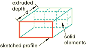
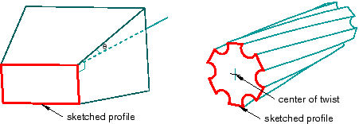
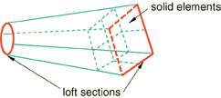
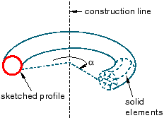
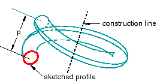
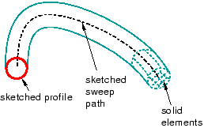

# 11.9.1 可靠的功能

要创建实体特征，请从主菜单栏中选择****形状****实体****或选择部件模块工具箱中的实体工具之一。绘制初始轮廓草图后，您可以执行以下操作之一来创建特征：
- 要创建拉伸实体特征，请将轮廓拉伸指定距离 (*d*)，如[Figure 11--15](pt03ch11s09s01.md#prt-solid-extrude)中所示。 **图 11--15** 拉伸实体特征。此外，您可以对拉伸应用拔模或扭转，如[Figure 11--16](pt03ch11s09s01.md#prt-solid-draft)中所示。 **图 11--16** 具有拔模斜度和扭曲的拉伸实体特征。您可以定义带拔模的挤出的拔模角或扭转中心以及带扭转的挤出的节距（发生 360 度扭转的挤出距离）。从主菜单栏中选择****形状****实体****拉伸****来创建此类特征。
- 要创建实体放样特征，请将形状从初始放样截面过渡到不同形状或方向的末端截面。 Abaqus/CAE 使用相切约束、中间截面和路径曲线确定起始截面和结束截面之间的形状。[Figure 11--17](pt03ch11s09s01.md#prt-solid-loft)中显示了一个简单的放样（只有两个放样截面、没有相切约束和一条直线路径）。从主菜单栏中选择****形状****实体****放样****来创建此类特征。 **图 11--17** 实体放样特征。
- 要创建旋转实体特征，请将轮廓旋转指定角度 ()。构造线用作旋转轴，如[Figure 11--18](pt03ch11s09s01.md#prt-solid-rev)所示。 **图 11--18** 旋转实体特征。此外，您还可以输入螺距值 (*p*)，以在轮廓旋转时沿旋转轴平移轮廓；[Figure 11--19](pt03ch11s09s01.md#prt-solid-revpitch)显示了带俯仰的立体旋转 360 度。从主菜单栏中选择****形状****实体****旋转****来创建此类特征。 **图 11--19** 带节距 (*p*) 的 360 度旋转实体特征。- 要创建扫掠实体特征，请沿指定路径扫掠轮廓，如[Figure 11--20](pt03ch11s09s01.md#prt-solid-sweep)中所示。从主菜单栏中选择****形状****实体****扫描****来创建此类特征。有关更多信息，请参见["Defining the sweep path and the sweep profile," Section 11.13.8](pt03ch11s13s08.md)。 **图 11--20** 扫掠实体特征。

您可以使用任何实体工具将实体特征添加到在三维建模空间中创建的可变形或离散零件。您无法将实体特征添加到二维或轴对称零件。

[Figure 11--15](pt03ch11s09s01.md#prt-solid-extrude)、[Figure 11--17](pt03ch11s09s01.md#prt-solid-loft)、[Figure 11--18](pt03ch11s09s01.md#prt-solid-rev)和[Figure 11--20](pt03ch11s09s01.md#prt-solid-sweep)说明了以后如何对每个特征进行网格划分。您可以使用 Abaqus/Standard 或 Abaqus/Explicit 中提供的任何三维实体连续体元素对实体特征进行网格划分。有关相关主题的信息，请单击以下任意项目：-["Adding a solid feature," Section 11.21](pt03ch11s21.md)-["What is feature-based modeling?," Section 11.3](pt03ch11s03.md)-["Meshing complex solids with hexahedral elements," Section 17.14.5](pt03ch17s14s05.md)

