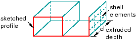
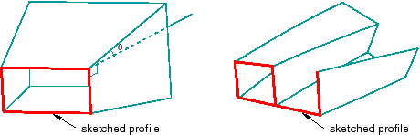
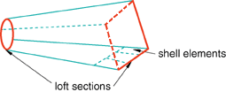
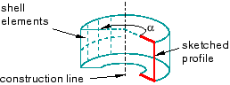
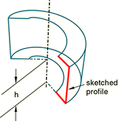
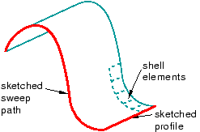
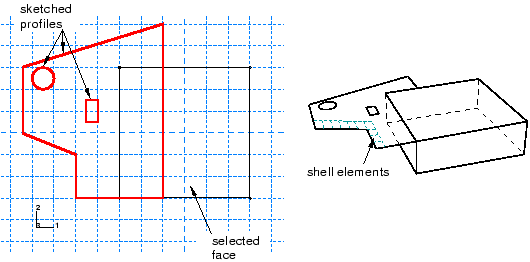
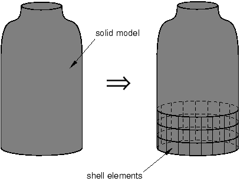

# 11.9.2 Shell 功能

壳特征是实体的理想化，其中与宽度和深度相比，厚度被认为很小。要创建壳体特征，请从主菜单栏中选择****形状****壳体****，或选择部件模块工具箱中的壳体工具之一。您可以使用外壳工具执行以下操作之一来创建外壳特征：
- 要创建拉伸壳特征，请绘制轮廓并将其拉伸指定距离 (*d*)，如[Figure 11--21](pt03ch11s09s02.md#prt-shell-extrude)中所示。 **图 11--21** 挤压外壳特征。此外，您可以对拉伸应用拔模或扭转，如[Figure 11--22](pt03ch11s09s02.md#prt-shell-draft)中所示。 **图 11--22** 具有拔模斜度和扭曲的挤压壳体特征。您可以定义带拔模的挤出的拔模角或扭转中心以及带扭转的挤出的节距（发生 360 度扭转的挤出距离）。从主菜单栏中选择****形状****壳****拉伸****来创建此类特征。
- 要创建壳放样特征，请将形状从初始放样截面过渡到不同形状或方向的末端截面。 Abaqus/CAE 使用相切约束、中间截面和路径曲线确定起始截面和结束截面之间的形状。[Figure 11--23](pt03ch11s09s02.md#prt-shell-loft)中显示了一个简单的放样（只有两个放样截面、没有相切约束和一条直线路径）。从主菜单栏中选择****Shape****Shell****Loft****来创建此类特征。 **图 11--23** 壳放样特征。
- 要创建旋转壳体特征，请绘制轮廓并将其旋转指定角度 (*α*)。构造线用作旋转轴，如[Figure 11--24](pt03ch11s09s02.md#prt-shell-rev)所示。 **图 11--24** 旋转壳体特征。此外，您还可以输入螺距值，使轮廓在旋转时沿旋转轴平移；[Figure 11--25](pt03ch11s09s02.md#prt-shell-revpitch)显示了带螺距的旋转壳体。 **图 11--25** 带节距的旋转壳体特征。尺寸 *h* 表示草图轮廓因节距而产生的平移；如果零件旋转了完整的 360 度，*h* 将等于螺距。从主菜单栏中选择****形状****壳****旋转****来创建此类特征。
- 要创建扫掠壳特征，请绘制轮廓并沿指定路径扫掠它，如[Figure 11--26](pt03ch11s09s02.md#prt-shell-sweep)中所示。 **图 11--26** 扫掠壳特征。从主菜单栏中选择****形状****壳****扫描****来创建此类特征。有关更多信息，请参见["Defining the sweep path and the sweep profile," Section 11.13.8](pt03ch11s13s08.md)。
- 要创建平面壳体特征，请在选定的平面或基准平面上绘制壳体的轮廓，如[Figure 11--27](pt03ch11s09s02.md#prt-shell-planar)中所示。 **图 11--27** 绘制的壳特征。在平面（例如，立方体的侧面）上绘制草图时，仅在延伸到面之外的位置创建壳特征；壳特征不能与面重叠。[Figure 11--27](pt03ch11s09s02.md#prt-shell-planar)中显示了立方体平面上的草图和生成的壳特征。在此示例中，壳特征是延伸超出立方体的选定面的翅片。从主菜单栏中选择****形状****壳****平面****来创建此类特征。
- 要从实体特征创建壳特征，请将实体特征的面转换为壳特征；实际上，将实体挖空。[Figure 11--28](pt03ch11s09s02.md#prt-shell-fromsolid)中显示了实体壳特征。从主菜单栏中选择****形状****壳****来自实体****来创建此类特征。 **图 11--28** 实体壳特征。

您可以使用任何外壳工具将外壳特征添加到您在三维建模空间中创建的零件中；但是，当您处理在二维或轴对称建模空间中创建的零件时，只能使用平面壳工具来添加壳特征。您可以使用属性模块创建指定所需厚度的截面，并将该截面分配给壳特征。有关更多信息，请参阅["Defining sections," Section 12.2.3](pt03ch12s02s03.md)和["Which properties can I assign to a part?," Section 12.3](pt03ch12s03.md)。

许多图都说明了随后如何对壳特征进行网格划分。您可以使用以下方法对壳特征进行网格划分：
- 二维或轴对称连续体单元（仅限于平面壳特征）
- 三维壳单元
- 膜元件

有关相关主题的信息，请单击以下任意项目：-["Adding a shell feature," Section 11.22](pt03ch11s22.md)-["What is feature-based modeling?," Section 11.3](pt03ch11s03.md)

