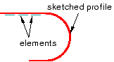
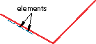
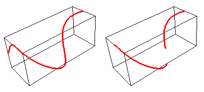

# 11.9.3 线功能

线在 Abaqus/CAE 中被描绘为一条线，用于理想化实体，其中其厚度和深度与其长度相比都被认为很小。要创建导线特征，请从主菜单栏中选择****形状****导线****，或选择部件模块工具箱中的导线工具之一。您可以使用连线工具在部件模块中创建连线特征来执行以下操作之一：
- 在选定的平面或基准平面上绘制线草图以创建草绘线特征，如[Figure 11--29](pt03ch11s09s03.md#prt-wire-sk)中所示。从主菜单栏中选择****形状****线****草图****来创建此类特征。 **图 11--29** 绘制的线特征。在平面（例如，立方体的侧面）上绘制草图时，仅在线特征延伸到面之外的位置创建线特征。
- 用直线连接两个或多个点，如[Figure 11--30](pt03ch11s09s03.md#prt-wire-poly)所示，或用样条曲线连接，如[Figure 11--31](pt03ch11s09s03.md#prt-wire-spline)所示。从主菜单栏中选择****形状****线****点对点****来创建此类特征。为“几何类型”选择“多段线”或“样条线”，分别创建直线或样条曲线。您可以选择通过创建边在现有零件上压印导线、将导线与现有零件合并或与现有零件分开创建导线。显示[Figure 11--31](pt03ch11s09s03.md#prt-wire-spline)中的长方体特征以供参考。左图显示了使用 **压印线** 或 **单独线** 选项的样条线的全长，而右图显示了使用 **合并线** 选项连接同一组点的样条线。您可以创建包含线特征中定义的线和顶点的几何图形集。 **图 11--30** 连接三个点的导线要素。**图 11--31** 连接实体特征的多个点的线特征。

您可以使用线工具将线特征添加到任何可变形或离散刚性零件。您无法将线特征添加到分析刚性零件；您只能修改定义该零件的原始草图。

您可以使用属性模块创建一个规定所需横截面几何形状的截面，并将该截面分配给线特征。 （有关详细信息，请参见["Defining sections," Section 12.2.3](pt03ch12s02s03.md)和["Which properties can I assign to a part?," Section 12.3](pt03ch12s03.md)。）您可以使用 Abaqus/Standard 或 Abaqus/Explicit 中提供的任何梁、桁架或轴对称壳单元对线特征进行建模。

**注意：**虽然您可以创建梁单元网格，但当前版本的 Abaqus/CAE 允许您仅将以下部分分配给线：
- 梁截面
- 桁架部分

有关相关主题的信息，请单击以下任意项目：-["Adding a wire feature," Section 11.23](pt03ch11s23.md)-["What is feature-based modeling?," Section 11.3](pt03ch11s03.md)

