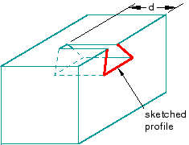
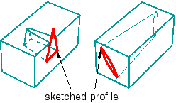
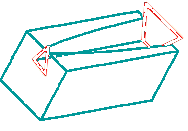
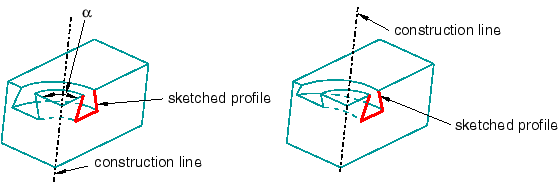
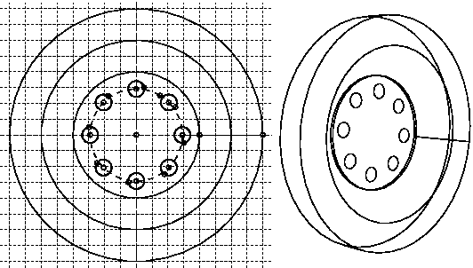

# 11.9.4 削减功能

切割是一种从零件上去除材料的特征。切口可以是圆形孔，也可以是任意形状。任何切割的草图轮廓都必须闭合。在许多情况下，整个轮廓将影响切割特征的形状，即使它最初不接触被切割的表面。要创建切割特征，请从主菜单栏中选择****形状****切割****或选择部件模块工具箱中的切割工具之一。

**注意：**大多数图在与零件表面相交处并未显示闭合切割轮廓。这些线已被删除以显示切割特征的形状。

绘制初始轮廓草图后，您可以执行以下操作之一来创建切割特征：
- 要创建挤压切口，请将轮廓挤压指定距离 (*d*)，如[Figure 11--32](pt03ch11s09s04.md#prt-extcut)中所示。 **图 11--32** 拉伸切割特征。此外，您可以对拉伸切口应用拔模或扭转，如[Figure 11--33](pt03ch11s09s04.md#prt-extcut-draft)中所示。您可以定义带拔模的拉伸切割的拔模角度或扭曲中心，以及带扭曲的拉伸切割的节距（发生 360 度扭曲的挤压距离）。从主菜单栏中选择****形状****剪切****拉伸****来创建此类特征。 **图 11--33** 具有拔模斜度和扭曲的拉伸切割特征。- 要创建切割放样特征，请将形状从初始放样截面过渡到不同形状或方向的末端截面，如[Figure 11--34](pt03ch11s09s04.md#prt-cut-loft)中所示。 Abaqus/CAE 使用相切约束、中间截面和路径曲线确定起始截面和结束截面之间的形状。从主菜单栏中选择****形状****剪切****放样****来创建此类特征。 **图 11--34** 切割放样特征。- 要创建旋转切割，请将轮廓旋转指定角度 (*α*)。构造线用作旋转轴。此外，您还可以输入螺距值，以在轮廓旋转时沿旋转轴平移轮廓并创建零件细节，例如螺纹。[Figure 11--35](pt03ch11s09s04.md#prt-revcut)显示旋转切削和带节距的旋转切削。从主菜单栏中选择****形状****切割****旋转****来创建此类特征。 **图 11--35** 旋转切削和带节距的旋转切削。
- 要创建扫掠切割，请沿指定路径扫掠轮廓，如[Figure 11--36](pt03ch11s09s04.md#prt-sweepcut)中所示。从主菜单栏中选择****形状****剪切****扫描****来创建此类特征。有关详细信息，请参阅["Defining the sweep path and the sweep profile," Section 11.13.8](pt03ch11s13s08.md)。 **图 11--36** 扫掠切割特征。- 要创建圆孔，请输入孔的直径及其中心距两个选定边的距离，如[Figure 11--37](pt03ch11s09s04.md#prt-holecut)中所示。从主菜单栏中选择****形状****切割****圆孔****来创建此类特征。 **图 11--37** 圆孔特征。

当您绘制拉伸、旋转或扫掠切削的轮廓时，可以在单个草图中绘制多个轮廓。当您退出草绘器时，Abaqus/CAE 会拉伸每个轮廓，并创建与每个轮廓相对应的切割，如[Figure 11--38](pt03ch11s09s04.md#prt-cut-multiple)中所示。

**图 11–38** 从单个草图中挤出多个轮廓。

剪切顺序存储为单个特征，您只能将其作为单个特征进行编辑。例如，如果更改拉伸深度，则特征中所有切削的深度都会发生变化。

您可以使用切割工具将切割特征添加到任何可变形或离散刚性零件。您不能向分析刚性零件添加切割特征；您只能修改定义该零件的原始草图。有关相关主题的信息，请单击以下任意项目：-["Adding a wire feature," Section 11.23](pt03ch11s23.md)-["What is feature-based modeling?," Section 11.3](pt03ch11s03.md)

