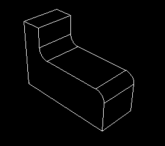
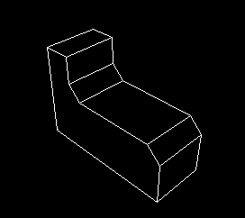

# 11.9.5 混合功能

混合特征可以平滑三维实体零件的边缘。要创建混合特征，请从主菜单栏中选择****形状****混合****或选择部件模块工具箱中的混合工具之一。您可以使用混合工具在部件模块中创建混合特征来执行以下操作之一：
- 使用指定半径的圆形混合平滑边缘，如[Figure 11--39](pt03ch11s09s05.md#prt-blend-fillet)中所示。从主菜单栏中选择****形状****混合****圆形/圆角****来创建此类特征。 **图 11--39** 圆形/圆角混合特征。- 使用指定长度的倒角混合对边缘进行斜切，如[Figure 11--40](pt03ch11s09s05.md#prt-blend-chamfer)中所示。从主菜单栏中选择****形状****混合****倒角****来创建此类特征。 **图 11--40** 倒角混合特征。

您可以使用混合工具来混合在三维建模空间中创建的可变形或离散刚性零件的边缘。您不能将混合特征添加到二维或轴对称零件；但是，您可以通过编辑零件的草图来混合其角。有关相关主题的信息，请单击以下任意项目：-["Adding a wire feature," Section 11.23](pt03ch11s23.md)-["What is feature-based modeling?," Section 11.3](pt03ch11s03.md)

