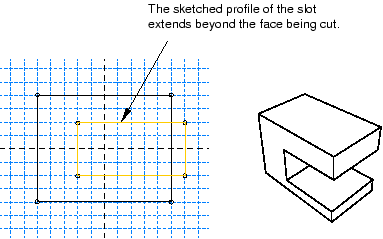

# 11.10 有效使用基于特征的建模

如果您了解 Abaqus/CAE 如何使用基于特征的建模以及如何应用定义特征的规则，您就可以设计出更有效的方法来创建零件。以下技术将帮助您创建可以轻松修改的坚固零件：

**制定策略**

基于特征的建模提供了灵活性，但也会增加模型的开销。例如，您可以使用特征操作工具集中的抑制工具抑制拉伸。或者，您可以通过使用切割特征将其移除来有效地抑制拉伸。尽管您可以随后通过删除剪切特征来恢复拉伸，但生成的零件包含额外的基于特征的信息，这些信息可能会减慢再生速度。通过使用几何缓存保存不同状态下的零件可以提高再生速度，但缓存使用其他操作可能需要的系统内存（有关详细信息，请参阅["Tuning feature regeneration," Section 65.3](pt06ch65s03.md)）。此外，如果向零件添加更多细节，依赖性可能会导致特征重新生成失败；而且，由于挤压不再可见，再生失败的原因可能很难确定。

在决定如何创建零件之前，您应该始终考虑将来是否需要修改该零件。如果您决定可能需要修改零件，则应考虑用于创建定义零件的特征的技术。最简单的技术可能无法提供修改功能所需的灵活性。您可能会发现编辑或抑制几何体的单个项目（例如拉伸、圆角或孔）很麻烦。

或者，如果您知道永远不会更改最终设计，则可能不需要基于特征的建模提供的灵活性，并且可以使用最简单、最方便的技术来定义零件。

一般来说，您应该先尝试在部件模块中完成零件的创建，然后再开始创建零件实例并将其放置在装配体中。在将属性（例如集、载荷和边界条件）应用到装配体之前，您应该尝试完成所有零件的创建。如果将属性应用到装配体，然后返回部件模块修改原始零件，Abaqus/CAE 可能无法确定应在何处应用属性。例如，如果您向某个面施加压力载荷，然后返回到部件模块将该面划分为两个区域，Abaqus/CAE 将仅向其中一个区域施加压力。

**使用参考几何体**

将特征添加到零件时，应始终使用基础参考几何体来定义新特征相对于现有特征的位置。在绘制特征草图时，您可以直接选择参考几何体；例如，如果您正在绘制一个圆，则可以从参考几何体中选择一个顶点来定义其中心。或者，您可能必须在参考几何图形和新特征之间添加尺寸。如果不使用参考几何体来定位新特征的草图并且随后修改零件，则对特征产生的更改可能是不可预测的。

**使用尺寸**

尺寸使定义特征的草图更加清晰，并记录您的设计意图以供将来参考。尺寸也会给草图添加约束。您可以在草绘器中修改尺寸，零件和装配体将相应地重新生成。

**注意创建功能的顺序**

零件的新特征是了解现有特征的。此外，如果新特征依赖于现有特征来获取定位信息，Abaqus/CAE 会在特征之间创建父子关系。父子关系以及创建特征的顺序在特征重新生成中起着重要作用。

仔细排序并遵循以下顺序的建模方案不太可能遇到不必要的或病态的建模问题：

1. 使用拉伸、旋转、切割和扫描创建零件的基本几何形状。
2. 添加拉伸、旋转、扫掠和平面特征。
3. 添加圆角或圆角特征。
4. 仅当几何图形的其余部分完成后才添加分区。

**允许一些重叠**

如果可能，您应该允许现有特征与填充孔或切孔的特征之间存在重叠。允许重叠可以使您的零件变得坚固，并且特征更有可能成功地重新生成。例如，当您切割槽时，将其绘制的轮廓延伸到正在切割的曲面上方，如[Figure 11--41](pt03ch11s10.md#prt-tips-cut)中所示。

**图 11–41** 槽口的草图轮廓应延伸到任何切割的表面之外。

**尽可能创建实体**

实体特征比壳特征更稳健。您可能会发现很难定位一组外壳特征并精确匹配边缘。相反，实体的各个部分可以重叠，公差变得不那么重要。使用实体的另一个优点是您可以使用倒圆角特征来定义几何体。如果您正在建模壳，则应尝试创建实体特征，并在完成形状定义后将实体转换为壳。此外，如果您随后想要向壳零件添加其他壳特征，其中壳零件是从实体生成的，则应执行以下操作：

1. 删除最后一个实体到壳特征，将模型转换回实体。
2. 添加新的可靠功能。
3. 创建新的实体到壳特征以将模型转换回壳。

有关相关主题的信息，请单击以下任意项目：-["What is feature-based modeling?," Section 11.3](pt03ch11s03.md)-["Modifying and manipulating features," Section 65.4](pt06ch65s04.md)-["Capturing your design and analysis intent," Section 11.11](pt03ch11s11.md)

