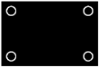

# 11.11 捕捉您的设计和分析意图

如果仔细使用，Abaqus/CAE 使用的基于特征的建模方法可以让您捕获设计和分析意图。

设计意图是根据设计考虑进行更改的能力。例如，当您添加切割特征时，您可以选择直通切割或盲切。如果切割特征代表螺栓孔，则您知道该孔必须始终完全穿过零件。因此，您应该选择贯通切割，并且 Abaqus/CAE 会识别出即使您更改零件的厚度，孔仍然保持贯通。

分析意图是根据分析考虑进行更改的能力。尽管 Abaqus/CAE 允许您创建具有复杂、详细几何形状的零件，但您的最终目标通常是对零件的网格表示进行有限元分析。过多的细节（例如圆角和小孔）可能会导致区域具有非常精细的网格，进而影响 Abaqus/Standard 或 Abaqus/Explicit 得出解决方案所需的时间。在部件模块中创建零件时提供的详细信息量应该反映您的目标。或者，您可以创建具有详细特征的零件，但在对装配体进行网格划分之前抑制它们。例如，如果一个模型需要几个小时来分析，您可能希望通过抑制特征来简化它；然后，您可以提交运行速度更快的分析并检查您的基本建模假设。如果简化模型的行为符合预期，您可以取消抑制特征并重新提交完整分析。

有关基于设计和分析意图的不同基于特征的设计方法的示例，请考虑[Figure 11--42](pt03ch11s11.md#prt-tips-cover)中所示的盖板。

**图 11–42** 盖板模型。

您可以通过多种方式创建对板进行建模的三维壳：

1. 绘制包含四个孔的基本特征草图。
2. 绘制一个矩形基本特征，并添加四个单独的切割特征。
3. 绘制一个矩形基本特征，并添加一个切割所有四个孔的单一切割特征。

三种方法中的任何一种都会生成相同的零件，但您的设计意图和分析意图决定了最佳方法。例如：- 您是否想针对不同的应用创建和分析具有不同尺寸孔的不同尺寸的板？如果所有四个孔的直径始终相同，则应将所有四个孔创建为单个切削特征。但是，如果各个孔的直径可能不同，则应创建四个单独的切割特征。
- 您想在最终设计之前抑制功能吗？例如，您可以在抑制孔的情况下执行一系列分析，以确定所需的板厚度。然后，您可以取消抑制孔并分析完成的模型。此外，抑制特征可以简化 Abaqus/CAE 生成的网格，或者抑制特征可以使装配体扫掠网格化。如果要抑制矩形盖板示例中的所有四个孔，则应将所有四个孔创建为单个切削特征。但是，如果要抑制单个孔，则应创建四个单独的切削特征。如果分析很简单并且您不需要分析简化模型，则应绘制包含四个孔的基本特征草图。

有关相关主题的信息，请单击以下任意项目：-["What is feature-based modeling?," Section 11.3](pt03ch11s03.md)-["Modifying and manipulating features," Section 65.4](pt06ch65s04.md)-["Using feature-based modeling effectively," Section 11.10](pt03ch11s10.md)

