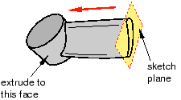

# 11.13.1 定义挤出距离

您可以绘制二维轮廓并将其拉伸以创建以下内容：
- 三维挤压实体特征。
- 三维挤压外壳特征。
- 三维挤压切割特征。

Abaqus/CAE 提供了以下定义挤出距离的方法：

****瞎的****

指定 Abaqus/CAE 拉伸草图的距离。草图和距离定义特征，并且可以使用特征操纵工具集进行编辑。创建拉伸实体、壳体和切割特征时可以使用此方法。[Figure 11--43](pt03ch11s13s01.md#prt-cut-blind)展示了实体零件中的盲挤压切割。

**图 11–43** 盲挤压切割。

****直到脸部****

选择 Abaqus/CAE 将草图拉伸到的单个面。选定的面不必与草图平面平行。所选面可以是非平面；但是，它必须完全包含挤压部分。如果选择此方法来定义挤出距离，则只能使用特征操作工具集修改草图；如果您希望拉伸到不同的面，则必须创建新的拉伸切削特征。创建拉伸实体、壳体和切割特征时可以使用此方法。[Figure 11--44](pt03ch11s13s01.md#prt-extsolid-upto)展示了拉伸到非平面的草图。

**图 11–44** 实体特征拉伸至非平面。

****通过所有****

此方法仅适用于拉伸切割特征。 Abaqus/CAE 将定义切口轮廓的草图完全挤出穿过零件。如果选择此方法来定义拉伸距离，则只能使用特征操纵工具集修改草图。[Figure 11--45](pt03ch11s13s01.md#prt-cut-thru)展示了实体零件中的全切。

**图 11–45** A 贯穿所有挤压切口。

