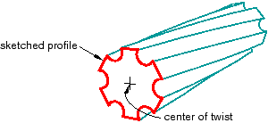

# 11.13.3 包括挤压中的扭曲

您可以选择在创建拉伸时包含扭曲。扭曲可用于创建扭曲的电缆、斜齿轮和其他复杂的形状，这些形状可以通过将恒定的横截面穿过一系列平行平面来形成。扭曲通过围绕平行于挤出方向的轴旋转草绘轮廓来修改挤出。扭转中心是草绘轮廓中的一个孤立点；它是用于扭转拉伸的轴穿过草图平面的点。螺距定义了轮廓将扭曲 360 度的挤出距离。您可以使用特征操纵工具集修改挤出轮廓、挤出方向、扭曲中心和螺距。

您可以在创建拉伸实体、壳体和切割特征期间添加扭曲。[Figure 11--46](pt03ch11s13s03.md#prt-extsolid-twist)说明了扭曲挤压。

**图 11–46** 扭曲挤压的实体特征。

如果要创建其中草绘轮廓旋转而不是拉伸的复杂形状（例如螺纹或螺旋弹簧），则可以在旋转实体、壳体或切削特征中包含螺距。有关所有可用特征类型的基本信息，请参阅["What types of features can you create?," Section 11.9](pt03ch11s09.md)，有关旋转特征的详细信息，请参阅["Defining the axis of revolution for axisymmetric parts and for revolved features," Section 11.13.5](pt03ch11s13s05.md)。有关相关主题的信息，请单击以下任意项目：-["Adding an extruded solid feature," Section 11.21.1](pt03ch11s21hlb01.md)-["Adding a revolved solid feature," Section 11.21.2](pt03ch11s21hlb02.md)-["Adding an extruded shell feature," Section 11.22.1](pt03ch11s22hlb01.md)-["Adding a revolved shell feature," Section 11.22.2](pt03ch11s22hlb02.md)-["Creating an extruded cut," Section 11.24.1](pt03ch11s24hlb01.md)-["Creating a revolved cut," Section 11.24.3](pt03ch11s24hlb03.md)-["Meshing complex solids with hexahedral elements," Section 17.14.5](pt03ch17s14s05.md)

