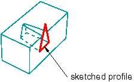

# 11.13.4 在挤压中包含拔模力

您可以选择创建带拔模的拉伸。拔模图可用于准确地表示小角度，该小角度通常用于轻松从模具中取出铸造或模制零件。挤压中的拔模也可用于创建锥形零件。

在直线挤压中，拔模角为 0，因此所有挤压表面都垂直于原始轮廓。拔模通过调整拉伸曲面与原始草图平面之间的角度来修改拉伸。 Abaqus/CAE 将拔模角的应用从内部特征反转到外部特征。如果草绘轮廓中的外部环正在扩张，则内部环正在收缩；此行为是拔模的预期行为，也是从工具中移除零件所需的行为（所有表面均朝同一方向逐渐变细）。

您可以使用特征操作工具集修改拔模以及拉伸轮廓和方向。您可以在创建拉伸实体、壳体和切割特征期间添加拔模。[Figure 11--47](pt03ch11s13s04.md#prt-cut-draft)展示了实体零件中带有拔模的挤压切削。

**图 11–47** 通过拔模拉伸的切割特征。

**注：**[Figure 11--47](pt03ch11s13s04.md#prt-cut-draft)中切割的完整草图轮廓是一个三角形，如图所示。如果轮廓是梯形，其顶边与块的边缘重合，则切割看起来会非常不同。当型材被挤压时，拔模力的应用使其变小。梯形轮廓的顶面将立即落在块的表面下方，而不是延伸穿过顶面。

Abaqus/CAE 无法对包含六面体单元拔模的拉伸实体进行网格划分，除非将实体划分为结构化区域。

