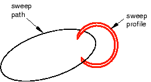
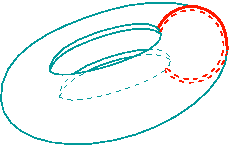
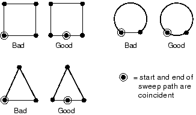

# 11.13.8 定义扫描路径和扫描轮廓

要创建扫掠特征，请从主菜单栏中选择****形状****实体****扫掠****、****形状****壳****扫掠****或****形状****剪切****扫掠****，或从部件模块工具箱中选择等效工具。 Abaqus/CAE 显示 **创建实体扫描**、**创建壳扫描** 或 **创建切割扫描** 对话框。

扫描操作分为两部分：首先定义扫描路径，然后定义扫描轮廓。沿着路径的长度扫描轮廓以形成三维实体、壳体或切割特征。扫描路径可以是您可以使用草绘器创建的任何连续路径，也可以是零件中任何一系列连接的边或线。后一个选项允许您定义三维扫描路径，例如点对点样条线；草图方法提供了更大的灵活性，但仅支持二维路径。[Figure 11--48](pt03ch11s13s08.md#prt-sweep-path-prof)显示扫描路径和扫描轮廓的示例。

**图 11–48** 扫描路径和轮廓的示例。

通过沿上述路径扫描扫描轮廓而创建的特征显示在[Figure 11--49](pt03ch11s13s08.md#prt-sweep-path-prof-final)中。

**图 11–49** 生成的扫描特征。

扫描轮廓可以在草绘器中定义，也可以通过选择几何图形中的组件来定义。对于实体或切割扫掠特征，您可以选择零件中的一个面作为扫掠轮廓；对于壳扫掠特征，您可以选择零件中的一条或多条边作为扫掠轮廓。

如果使用草绘器定义扫描路径或扫描轮廓，则可以使用特征操作工具集修改该特征。仅当您处理在三维建模空间中创建的可变形或离散零件时，扫描工具才可用。

您可以定义扫掠实体、扫掠壳或扫掠切割特征，其扫掠轮廓偏离扫掠路径。在这种情况下，Abaqus/CAE 将扫掠路径移动到穿过扫掠轮廓的平行位置，并在该位置创建扫掠特征。

您可以控制扫描轮廓的方向在沿着扫描路径行进时是否发生变化。当扫描路径是线性时，将拔模应用于扫描特征效果最佳。如果打开 **保持轮廓法向恒定**，Abaqus/CAE 不会更改扫描轮廓方向，并且扫描路径开头的轮廓将与扫描路径末尾的轮廓平行。如果关闭此选项，Abaqus/CAE 会调整扫描轮廓的方向，以便当轮廓沿着扫描路径行进时，扫描路径与轮廓法线之间的角度保持恒定。草稿选项和**保持配置文件正常不变**选项是互斥的；如果您选择其中一个选项，Abaqus/CAE 将关闭其中一个选项。

创建扫描实体或切割特征时，必须关闭扫描轮廓。但是，与扫描轮廓不同的是，无论您是创建扫描实体、壳还是切割特征，扫描路径都可以打开或关闭。如果扫描路径是闭合的，则路径的两端必须相切。例如，[Figure 11--50](pt03ch11s13s08.md#prt-sweep-invalid)中标记为“Bad”的闭合扫描路径是不允许的，因为路径的末端以一定角度相交。

**图 11–50** 有效和无效扫描路径。

在定义扫掠特征时，您可以应用扭曲或拔模。有关这些工具的更多信息，请参阅["What types of features can you create?," Section 11.9](pt03ch11s09.md)。您还可以打开**保留内部边界**以保留扫描实体特征与现有零件之间生成的任何面或边。内部边界可以创建可以结构化或扫掠网格化的区域，而无需求助于分区。有关相关主题的信息，请单击以下任意项目：-["What is feature-based modeling?," Section 11.3](pt03ch11s03.md)-["Adding a point-to-point wire feature," Section 11.23.2](pt03ch11s23hlb02.md)

