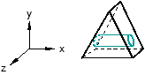
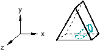
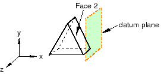
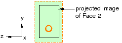
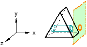
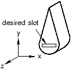
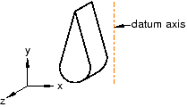
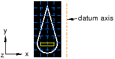

# 11.16.1 使用部件模块中的基准工具集

基准可以被视为参考几何体或构造辅助工具，可以在零件不包含必要的几何体时帮助您创建特征；您可以使用基准工具集创建基准几何。基准是零件的一个特征，并与零件的其余部分一起重新生成。此外，基准几何体是可见的，除非您通过从主菜单栏中选择****视图****零件显示选项****基准****来将其关闭。在“零件”模块中创建的基准与“装配”模块或任何其他基于装配的模块中零件的每个实例一起出现。

基准点被投影到草绘器中的草图平面上，并且可以选择投影点。但是，您无法在草绘器中引用基准轴或平面。下面给出了如何在部件模块中使用基准平面和轴的示例。

**基准面**

您可以直接在基准平面上绘制草图，并且在基准平面上绘制的任何特征都将投影到零件上。如果零件尚未包含方便的草图平面，则从基准平面投影草图非常有用。

例如，假设您想要直接穿过[Figure 11--57](pt03ch11s16s01.md#prt-datum-plane-cut)中所示的三维三角形零件切一个孔，平行于 *X* 轴。

**图 11–57** 所需的切割特征。

零件尚不具有适合绘制孔轮廓的面；直接在面上绘制轮廓会产生垂直于该面的孔，如[Figure 11--58](pt03ch11s16s01.md#prt-datum-plane-norm)中所示。

**图 11-58** 垂直于面部的切口。

要切割所需的孔，首先使用基准工具集在 *Y–Z* 主平面上创建基准平面，如[Figure 11--59](pt03ch11s16s01.md#prt-datum-plane)中所示。

**图 11–59** 基准平面。

其次，在新基准平面上绘制切割轮廓的草图，如[Figure 11--60](pt03ch11s16s01.md#prt-datum-plane-sketch)中所示。

**图 11–60** 基准平面上的草图。

当您退出草绘器时，Abaqus/CAE 将草绘的孔穿过零件，垂直于基准平面并平行于 *X* 轴。这种切割在[Figure 11--61](pt03ch11s16s01.md#prt-datum-plane-final)中进行了说明。

**图 11–61** 所需的切割。

**基准轴**

您可以使用基准工具集创建基准轴。然后，在向三维实体添加或修改特征时，您可以选择基准轴来控制草绘器网格上零件的方向。当零件尚不包含必要的轴时，创建基准轴非常有用。

例如，假设您要在零件上切出一个槽，如[Figure 11--62](pt03ch11s16s01.md#prt-datum-axis-slot)中所示。

**图 11–62** 所需的插槽。

绘制槽口草图很困难，因为选择零件的两个直边之一作为草图的垂直轴会导致草图网格线与您选择的线对齐，而不是与 *X* 或 *Y* 轴对齐。为了更轻松地创建具有所需方向的槽口，请首先使用基准工具集沿 *Y* 轴创建基准轴，如[Figure 11--63](pt03ch11s16s01.md#prt-datum-axis)中所示。

**图 11–63** 基准轴。

当您选择垂直且位于右侧的基准轴时，草绘器启动，其网格与零件的 *X* 和 *Y* 轴对齐，如[Figure 11--64](pt03ch11s16s01.md#prt-datum-axis-sketch)中所示。

**图 11–64** 生成的草图方向。

有关相关主题的信息，请单击以下任意项目：-["Understanding toolsets in the Part module," Section 11.16](pt03ch11s16.md)-[Chapter 62, "The Datum toolset](pt06ch62.md)”

