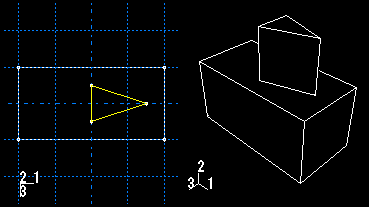

# 11.21.1 添加拉伸实体特征

从主菜单栏中选择****形状****实体****拉伸****，将拉伸实体特征添加到当前视口中的零件。您只能将拉伸实体特征添加到三维零件。

您可以通过绘制二维横截面草图并定义拉伸距离来添加拉伸实体特征。草图和生成的拉伸实体特征如下图所示：

您还可以通过选择要拉伸到的单个面来定义拉伸的距离。 Abaqus/CAE 拉伸草图，直到它与选定的面相交。

此外，您还可以选择中心点并指定 Abaqus/CAE 在挤压时用来扭曲横截面的节距。或者，Abaqus/CAE 可以在横截面被挤压时沿指定的拔模角度扩展或收缩横截面。有关更多信息，请参阅["Including twist in an extrusion," Section 11.13.3](pt03ch11s13s03.md)和["Including draft in an extrusion," Section 11.13.4](pt03ch11s13s04.md)。

**要添加拉伸实体特征：**

1. 从主菜单栏中，选择****形状****实体****拉伸****。 Abaqus/CAE 会在提示区域中显示提示来指导您完成该过程。 **提示：**您还可以使用工具添加拉伸实体特征，该工具位于部件模块工具箱中的实体工具中。有关部件模块工具箱中工具的图表，请参阅["Using the Part module toolbox," Section 11.17](pt03ch11s17.md)。
2. 如果需要，请指定用于选择拉伸实体特征草图原点的方法。从提示区域的 **草图原点** 字段中选择以下选项之一： - 选择 **自动计算** 以自动放置草图原点。 - 选择**指定**来定义自定义草图原点。 - 选择**会话默认**以使用您之前在会话中指定的自定义源。
3. 选择要从中挤出实体的平面。如果不存在合适的面，您可以选择基准平面或孤立单元面。 **提示：**如果您无法选择所需的平面，您可以使用 **选择** 工具栏更改选择行为。有关更多信息，请参阅["Using the selection options," Section 6.3](pt01ch06s03.md)。选定的面在视口中突出显示。
4. 如果选择**指定**作为**草图原点**方法，请通过单击视口中的点或在提示区域中输入原点的三维坐标来指定原点位置。您还可以通过切换“设置为会话默认值”来将此自定义原点设置为会话中所有草图的默认原点。
5. 在草绘器网格上选择一条边以及该边的方向。边缘不得垂直于选定的面。默认情况下，选定的边将垂直显示并位于草绘器网格的右侧。要为边缘选择不同的方向，请单击对话框右侧的箭头，然后从显示的列表中选择方向。 **提示：**如果没有具有所需方向的直边，您可以创建基准轴。然后，您可以选择基准轴来控制草绘器网格上零件的方向。 Abaqus/CAE 突出显示选定的边，进入草绘器，然后旋转零件，直到选定的面与草绘器网格的平面对齐，并且选定的边与所需方向的网格对齐。如果您不确定零件相对于草绘器网格的方向，请使用 **视图操作** 工具栏中的视图操作工具来查看其位置。使用重置视图工具返回到原始视图。
6. 使用草绘器绘制拉伸的二维轮廓。在提示区域中，单击“**完成**”退出草绘器并打开“**编辑拉伸**”对话框。 Abaqus/CAE 显示进入草绘器之前处于活动状态的零件视图。该零件包括绘制的轮廓和指示挤出方向的箭头。
7. 如有必要，单击 **编辑拉伸** 对话框中的以反转拉伸方向。如果很难看清箭头方向，请使用旋转工具旋转零件。
8. 选择以下结束条件之一： - 选择 **Blind** 并在 **Depth** 字段中输入一个值，以指定 Abaqus/CAE 将拉伸草绘轮廓的距离。 - 选择 **Up to Face** 以指定 Abaqus/CAE 将轮廓拉伸到选定的面。
9. 如果需要，请执行以下操作之一： - 开启**包括扭曲**，然后输入音高。节距是发生 360 度扭曲的挤出距离。绘制的挤出轮廓必须包含一个指示扭曲中心的孤立点。 - 启用**包括拔模**，然后输入拔模角度（大于 90 且小于 90）。正拔模角表示轮廓的外表面膨胀而内表面收缩。
10. 启用**保留内部边界**以保留在拉伸实体特征和现有零件之间生成的任何面或边。内部边界可以创建可以结构化或扫掠网格化的区域，而不必求助于分区。
11. 单击 **确定** 以拉伸轮廓。如果您选择了扭曲选项并且草图包含单个孤立点，Abaqus/CAE 将使用该点作为扭曲中心。如果您的草图不包含孤立点，Abaqus/CAE 将返回到草绘器以供您创建一个。如果草图包含多个孤立点，Abaqus/CAE 将返回草绘器并提示您选择一个孤立点作为扭曲中心。
12. 如果选择 **Up to Face**，Abaqus/CAE 会提示您选择要将轮廓拉伸到的面。选择满足以下要求的面： - 选定的面不必与草图平面平行， - 它可以是非平面， - 它必须完全包含拉伸选择，并且 - 它不能是基准平面。 Abaqus/CAE 创建拉伸实体特征。

有关相关主题的信息，请单击以下任意项目：-["What are extruding, revolving, and sweeping?," Section 11.13](pt03ch11s13.md)-["Meshing complex solids with hexahedral elements," Section 17.14.5](pt03ch17s14s05.md)-["What is feature-based modeling?," Section 11.3](pt03ch11s03.md)

