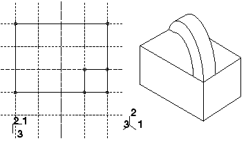
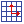
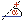

# 11.21.2 添加旋转实体特征

从主菜单栏中选择****形状****实体****旋转****，将旋转实体特征添加到当前视口中的零件。您只能将旋转实体特征添加到三维零件。

您可以通过在选定面上绘制二维横截面和构造线来添加旋转实体特征。构造线用作旋转轴，Abaqus/CAE 通过使用指定的旋转角度绕轴旋转横截面来创建实体特征。此外，您还可以指定沿旋转轴的节距和方向，Abaqus/CAE 使用该节距和方向在草图旋转轮廓时沿旋转轴平移草图。草图和生成的特征以节距旋转 180 度，如下图所示：

**要添加旋转实体特征：**

1. 从主菜单栏中，选择****形状****实体****旋转****。 Abaqus/CAE 会在提示区域中显示提示来指导您完成该过程。 **提示：**您还可以使用工具添加旋转实体特征，该工具位于部件模块工具箱中的实体工具中。有关部件模块工具箱中工具的图表，请参阅["Using the Part module toolbox," Section 11.17](pt03ch11s17.md)。
2. 如果需要，请指定用于选择旋转实体特征草图原点的方法。从提示区域的 **草图原点** 字段中选择以下选项之一： - 选择 **自动计算** 以自动放置草图原点。 - 选择**指定**来定义自定义草图原点。 - 选择**会话默认**以使用您之前在会话中指定的自定义源。
3. 选择要旋转实体的平面。如果不存在合适的面，您可以选择基准平面或孤立单元面。 **提示：**如果您无法选择所需的平面，您可以使用 **选择** 工具栏更改选择行为。有关更多信息，请参阅["Using the selection options," Section 6.3](pt01ch06s03.md)。选定的面在视口中突出显示。
4. 如果选择**指定**作为**草图原点**方法，请通过单击视口中的点或在提示区域中输入原点的三维坐标来指定原点位置。您还可以通过切换“设置为会话默认值”来将此自定义原点设置为会话中所有草图的默认原点。
5. 在草绘器网格上选择一条边以及该边的方向。边缘不得垂直于选定的面。默认情况下，选定的边将垂直显示并位于草绘器网格的右侧。要为边缘选择不同的方向，请单击对话框右侧的箭头，然后从显示的列表中选择方向。 **提示：**如果没有具有所需方向的直边，您可以创建基准轴。然后，您可以选择基准轴来控制草绘器网格上零件的方向。 Abaqus/CAE 突出显示选定的边，进入草绘器，然后旋转零件，直到选定的面与草绘器网格的平面对齐，并且选定的边与所需方向的网格对齐。如果您不确定零件相对于草绘器网格的方向，请使用 **视图操作** 工具栏中的视图操作工具来查看其位置。使用重置视图工具返回到原始视图。
6. 使用水平、垂直、角度或倾斜构造线工具绘制旋转轴。您可以通过从基础零件中选择基准轴来定位构造线。不能直接选择基准轴；您必须从基准轴的任一端选择一个点。
7. 使用草绘器绘制旋转特征的二维轮廓；草图不得与旋转轴交叉。
8. 在提示区域中，单击“**完成**”，表示您已完成轮廓和轴的草绘。如果草图包含多条构造线，Abaqus/CAE 会提示您选择将用作旋转轴的构造线。 Abaqus/CAE 显示进入草绘器之前处于活动状态的零件视图。该零件包括您绘制的轮廓和指示旋转方向的箭头。将出现 **编辑革命** 对话框。
9. 在 **编辑旋转** 对话框中，输入所需的旋转角度或接受默认值。
10. 单击 **旋转方向** 旁边的以更改箭头方向和关联的旋转方向。
11. 如果需要，请打开 **包括平移** 并输入正的螺距值。螺距值是轮廓在旋转 360 度期间沿旋转轴平移的距离。箭头显示旋转轴并指示草图沿轴平移的方向。如有必要，单击“编辑旋转”对话框中“俯仰方向”旁边的以反转箭头。
12. 如果需要，可启用**垂直于路径的扫描草图**以垂直于旋转路径旋转绘制的轮廓。仅当打开 **包括翻译** 时，此选项才可用。特征的初始轮廓将从草图平面旋转以创建特征。
13. 启用**保留内部边界**以保留在旋转实体特征和现有零件之间生成的任何面或边。内部边界可以创建可以结构化或扫掠网格化的区域，而不必求助于分区。
14. 单击 **确定** 接受指示的方向并创建旋转实体特征。 Abaqus/CAE 使用您选择的参数创建旋转特征。

有关相关主题的信息，请单击以下任意项目：-["Creating construction geometry," Section 20.11](pt03ch20s11.md)-["Adding a solid feature," Section 11.21](pt03ch11s21.md)-["Defining the axis of revolution for axisymmetric parts and for revolved features," Section 11.13.5](pt03ch11s13s05.md)-["Controlling the cross-section of a revolved feature with pitch," Section 11.13.7](pt03ch11s13s07.md)-["Meshing complex solids with hexahedral elements," Section 17.14.5](pt03ch17s14s05.md)-["What is feature-based modeling?," Section 11.3](pt03ch11s03.md)

