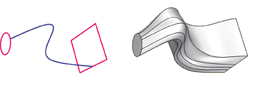
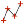
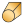

# 11.21.4 添加实体放样特征

从主菜单栏中选择****形状****实体****放样****，将实体放样特征添加到当前视口中的零件。您只能将实体放样特征添加到三维零件。

您可以通过从选定边创建两个或多个截面并定义一个或多个放样路径来添加实体放样特征。下图说明了放样截面、放样路径和生成的实体放样特征：

您可以允许 Abaqus/CAE 使用平滑路径连接每个放样截面的中心来定义单个放样路径。如果允许 Abaqus/CAE 定义路径，则可以将相切方法应用于放样的起始部分和结束部分。曲线和切线定义截面之间放样特征的路径。  或者，您可以通过选择将每个放样截面上的点连接到下一个放样截面上的点的曲线来定义一个或多个放样路径。每个放样路径必须提供连接每个连续放样部分的连续线。如果放样路径不平滑（如果沿路径的任意点有多个切线），当您尝试创建放样时，Abaqus/CAE 将显示一条错误消息。有关放样截面、放样路径和放样相切的详细信息，请参见["What is lofting?," Section 11.14](pt03ch11s14.md)。

**注意：**添加放样特征时不使用草绘器。因此，在创建放样之前，定义放样截面和放样路径的所有边都必须存在于零件几何体中。要创建放样路径或创建非平面放样截面，您可以使用工具（与部件模块工具箱中的线工具一起位于）来创建样条线（有关详细信息，请参阅["Adding a point-to-point wire feature," Section 11.23.2](pt03ch11s23hlb02.md)）。

**要添加实体放样特征：**

1. 从主菜单栏中，选择****形状****实体****放样****。 Abaqus/CAE 会在提示区域中显示提示来指导您完成该过程。 **提示：**您还可以使用工具添加实体放样特征，该工具位于部件模块工具箱中的实体工具中。有关部件模块工具箱中工具的图表，请参阅["Using the Part module toolbox," Section 11.17](pt03ch11s17.md)。将出现 **编辑放样** 对话框。
2. 通过从视口中的零件中选择边来创建放样剖面。有关创建放样剖面的详细说明，请参阅["Creating loft sections," Section 11.26.1](pt03ch11s26hlb01.md)。
3. 启用**保留内部边界**以保留放样实体特征与现有零件之间生成的任何面或边。内部边界可以创建可以结构化或扫掠网格化的区域，而不必求助于分区。
4. 完成创建放样剖面后，单击“**编辑放样**”对话框中的“**过渡**”选项卡。
5. 执行以下操作之一： - 单击“**选择路径**”，通过从视口中的零件选择边来创建放样路径（或多个路径）。 - 单击“**指定相切**”以使用放样相切创建放样路径（或多个路径）。有关创建放样路径的详细说明，请参见["Creating a loft path," Section 11.26.2](pt03ch11s26hlb02.md)。
6. 单击“**编辑放样**”对话框中的“**预览**”按钮。 Abaqus/CAE 显示将使用当前设置创建的放样的线框表示。
7. 如果需要，您可以添加或删除放样截面、更改放样路径定义方法或编辑放样相切选项以更改放样特征的形状。单击“**预览**”以在视口中查看更改的效果。
8. 如果需要，您可以在创建放样特征时对自相交进行 Abaqus/CAE 测试。此测试可防止创建难以或无法网格化和分析的特征，但随着放样特征复杂性的增加，计算成本会变得很高。有关详细信息，请参阅["Self-intersection checks," Section 11.14.4](pt03ch11s14s04.md)。要使用自相交检查，请选择 **特征****选项**** 打开 **特征选项** 对话框，然后打开 **执行自相交检查**。
9. 单击“**完成**”创建放样并关闭“**编辑放样**”对话框。如果您选择测试自相交并且测试失败，“编辑放样”对话框将重新出现，以便您进行更改。否则，将在视口中创建实体放样特征。

有关相关主题的信息，请单击以下任意项目：-["Adding a solid feature," Section 11.21](pt03ch11s21.md)-["What is feature-based modeling?," Section 11.3](pt03ch11s03.md)

