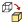

# 11.21.5 从外壳创建实体特征

从主菜单栏中选择****形状****实体****来自壳****，通过选择将形成封闭零件的面，从三维壳零件创建实体特征。 Abaqus/CAE 添加实体材料以将选定面定义的区域从壳更改为实体。

**要从壳创建实体特征：**

1. 从主菜单栏中，选择****形状****实体****来自外壳****。 Abaqus/CAE 会在提示区域中显示提示来指导您完成该过程。 **提示：**您还可以通过单击工具从壳体创建实体特征，该工具位于部件模块工具箱中的实体工具中。有关部件模块工具箱中工具的图表，请参阅["Using the Part module toolbox," Section 11.17](pt03ch11s17.md)。
2. 从壳中选择应转换为实体的面，然后单击鼠标按钮 2 以指示您已完成选择面。如果选择了多个面，Abaqus/CAE 会选择添加实体材料的方向，并将包含选定面的区域从壳更改为实体。
3. 如果选择单个面，Abaqus/CAE 会突出显示该面并显示一个箭头，指示添加材料以创建实体的方向。如果需要，请单击“**翻转**”以反转箭头的方向。
4. 单击鼠标按钮 2 确认箭头方向。 Abaqus/CAE 按照指示的方向填充壳并创建实体区域。
5. 单击“**完成**”以创建实体零件。

有关相关主题的信息，请单击以下任意项目：-["Adding a solid feature," Section 11.21](pt03ch11s21.md)-["What is feature-based modeling?," Section 11.3](pt03ch11s03.md)

