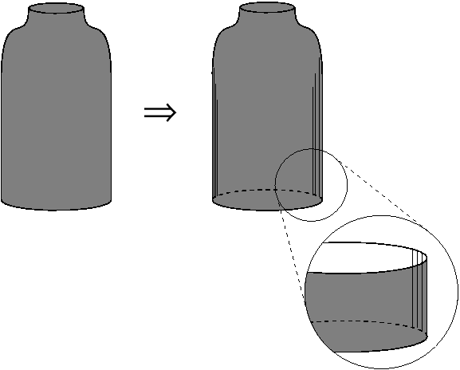

# 11.22.6 添加实体壳功能

从主菜单栏中选择****形状****壳****来自实体****，从实体特征的面创建壳特征。您只能将实体壳特征添加到三维零件。

您可以通过选择要从零件中删除的单元来添加实体壳特征； Abaqus/CAE 将与删除的单元相关的任何剩余面转换为壳。

**来自实体**工具是创建具有弯曲边缘的壳的简单方法，如下图所示。实体的弯曲边缘是通过使用圆形工具对边缘进行圆角化而创建的。

**要添加从实体生成壳的特征：**

1. 从主菜单栏中，选择****形状****壳****来自实体****。 Abaqus/CAE 会在提示区域中显示提示来指导您完成该过程。 **提示：**您还可以使用工具添加来自实体的壳特征，该工具位于部件模块工具箱中的壳工具中。有关部件模块工具箱中工具的图表，请参阅["Using the Part module toolbox," Section 11.17](pt03ch11s17.md)。
2. 选择一个或多个单元格以转换为外壳。 **[Shift]****+单击**其他单元格将其添加到您的选择中，**[Ctrl]****+单击**选定的单元格以取消选择它。单击鼠标按钮 2 表示您已完成选择要转换的单元格。 Abaqus/CAE 将选定的单元转换为壳。 **提示：**使用**上一步**按钮（）撤消一个或多个步骤；使用取消按钮 () 中止从实体创建壳。

有关相关主题的信息，请单击以下任意项目：-["Adding a shell feature," Section 11.22](pt03ch11s22.md)-[Chapter 20, "The Sketch module](pt03ch20.md)”
-["What is feature-based modeling?," Section 11.3](pt03ch11s03.md)

