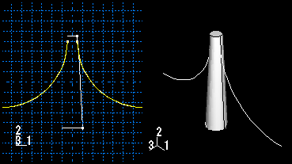

# 11.23.1 添加草绘线特征

从主菜单栏中选择****形状****导线****草图****，将绘制的平面导线特征添加到当前视口中的零件。无论当前视口中零件的建模空间如何，平面线工具始终可用。

您可以通过在选定平面上绘制特征草图来添加平面线特征。 Abaqus/CAE 移除与现有面重叠的线的任何部分。草图和生成的平面线如下图所示：

该草图完全定义了平面线特征，并且可以使用特征操作工具集进行修改。

**要添加草绘线特征：**

1. 从主菜单栏中，选择****形状****线****草图****。 Abaqus/CAE 会在提示区域中显示提示来指导您完成该过程。 **提示：**您还可以使用工具添加绘制的导线特征，该工具位于部件模块工具箱中的导线工具中。有关部件模块工具箱中工具的图表，请参阅["Using the Part module toolbox," Section 11.17](pt03ch11s17.md)。
2. 如果需要，请指定用于为草绘线特​​征的草图选择原点的方法。从提示区域的 **草图原点** 字段中选择以下选项之一： - 选择 **自动计算** 以自动放置草图原点。 - 选择**指定**来定义自定义草图原点。 - 选择**会话默认**以使用您之前在会话中指定的自定义源。
3. 如果零件的建模空间是二维或轴对称的，则 Abaqus/CAE 进入草绘器并对齐零件和草图的 *X* 轴和 *Y* 轴。如果零件是三维的，请执行以下操作： 1. 选择将放置导线的平面。如果不存在合适的面，您可以选择基准平面。 **提示：**如果您无法选择所需的平面，您可以使用 **选择** 工具栏更改选择行为。有关详细信息，请参阅["Using the selection options," Section 6.3](pt01ch06s03.md)。 2. 在草绘器网格上选择一条边以及边的方向。边缘不得垂直于选定的面。默认情况下，选定的边将垂直显示并位于草绘器网格的右侧。要为边缘选择不同的方向，请单击对话框右侧的箭头，然后从显示的列表中选择方向。 **提示：**如果所选面的边缘是弯曲的或未提供所需的方向，您可以创建基准轴。然后，您可以选择基准轴来控制草绘器网格上零件的方向。 Abaqus/CAE 突出显示选定的边，进入草绘器，然后旋转零件，直到选定的面与草绘器网格的平面对齐，并且选定的边与所需方向的网格对齐。如果您不确定零件相对于草绘器网格的方向，请使用 **视图操作** 工具栏中的视图操作工具来查看其位置。使用重置视图工具返回到原始视图。
4. 如果选择**指定**作为**草图原点**方法，请通过单击视口中的点或在提示区域中输入原点的三维坐标来指定原点位置。您还可以通过切换“设置为会话默认值”来将此自定义原点设置为会话中所有草图的默认原点。
5. 使用草绘器绘制平面线。在提示区域，单击“**完成**”表示您已完成绘制。零件返回到其原始方向，平面线位于所选面上。仅在延伸到零件面之外的位置创建线特征；线特征不能与面重叠。

有关相关主题的信息，请单击以下任意项目：-["What is feature-based modeling?," Section 11.3](pt03ch11s03.md)-["Adding a wire feature," Section 11.23](pt03ch11s23.md)-[Chapter 20, "The Sketch module](pt03ch20.md)”

