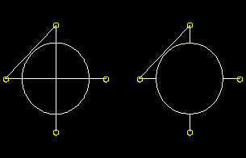

# 11.23.2 添加点对点连线功能

您可以将点对点导线特征添加到零件或装配体。对于装配级连线特征，您可以修改连线特征或从特征中删除连线，如["Creating or modifying wire features for multiple connectors," Section 15.12.9](pt03ch15s12hlb09.md)中所述。

装配级线特征是不可网格化的。导线特征包含当前视口中零件或装配体的连接点或零件或装配体与地面的连接点的导线。要对连接器建模，您必须在装配体上定义一个或多个导线特征。在零件或装配体上创建导线特征时，您可以创建包含导线特征中定义的导线的几何图形集。此外，当您在零件上创建线特征时，您可以创建包含在线特征中定义的顶点的几何图形集。

要在零件上添加导线特征，请从部件模块的主菜单栏中选择****形状****导线****点对点****。无论当前视口中零件的建模空间如何，点对点连线工具始终在部件模块中可用。要在装配上添加导线特征，请从相互作用模块的主菜单栏中选择****连接器****几何****创建导线特征****。

您可以通过选择几何类型、折线或样条线向零件添加点对点线特征；对于装配体，您只能添加折线线特征。您可以选择通过创建边在现有零件上压印导线、将导线与现有零件合并或与现有零件分开创建导线。导线合并选项仅在部件模块中可用。

如果要创建多段线导线，则接下来必须选择点选择方法并从当前零件或装配体中选取要连接的点。您可以选择不相交的点（即，不自动端到端连接）、链接点（即自动端到端连接）或连接到地面的点。 Abaqus/CAE 使用直线连接点对或将点连接到地面，具体取决于您选择的方法。连接零件中四个点的折线线特征如下图所示：

显示平面壳特征以供参考。左图显示了使用 **压印导线** 或 **单独导线** 选项的点对点导线的完整长度，而右图显示了使用 **合并导线** 选项连接同一组点的点对点导线。

如果要在零件上创建样条线，则链式点选择方法是唯一可用的方法。 Abaqus/CAE 通过使用沿样条线的所有点之间的三次样条拟合来计算曲线的形状；此外，样条的一阶和二阶导数是连续的。样条线特征如下图所示：

显示长方体特征以供参考。左图显示了使用 **压印线** 或 **单独线** 选项的样条线的全长，而右图显示了使用 **合并线** 选项连接同一组点的样条线。

在零件或装配体上创建线特征期间，您可以修改点选择。对于零件级线特征，在大多数情况下，一旦创建了线特征，就无法直接修改它。您可以使用几何编辑工具集从特征中删除线边缘。 （有关详细信息，请参阅["Removing wire edges," Section 69.6.6](pt06ch69s06hlb06.md)）。如果要更改连接的点或连接顺序，则必须删除连线并创建连接所需点的新连线。由于点对点连线依赖于其他特征创建的点，因此您可以使用特征操作工具集修改创建点的特征来修改连线。

虽然您无法创建具有非平面线基础特征的零件，但您可以通过使用空间中的单个点作为基础特征并输入其余点的坐标来创建非平面点对点线特征。在这种情况下，起点是您可以编辑以修改连线的唯一点。您还可以使用基准点，在这种情况下您可以编辑所有点。

**要将点对点导线特征添加到零件或装配体：**

1. 使用以下方法之一显示**创建线特征**对话框： - 从部件模块的主菜单栏中，选择****形状****线****点到点****。 **提示：**您还可以使用工具向零件添加点对点连线特征，该工具位于部件模块工具箱中的连线工具中。有关部件模块工具箱中工具的图表，请参阅["Using the Part module toolbox," Section 11.17](pt03ch11s17.md)。 - 从相互作用模块的主菜单栏中，选择****连接器****几何****创建导线特征****。 **提示：**您还可以使用相互作用模块工具箱中的工具向装配体添加导线特征。有关相互作用模块工具箱中工具的图表，请参阅["Using the Interaction module toolbox," Section 15.11](pt03ch15s11.md)。
2. 如果您要在部件模块中创建导线，请选择“**多段线**”来创建一条或多条直线，或选择“**样条线**”来创建连续的样条曲线。
3. 如果要将导线特征添加到零件，请在对话框的 **导线合并方案** 部分中指定合并选项。导线合并选项仅在部件模块中可用。 - 选择 **压印导线** 通过创建边缘将新创建的导线压印到现有零件上。 - 选择 **合并导线** 将新创建的导线与现有零件合并。 - 选择 **单独电线** 以创建与现有零件分开的电线；不会创建任何边，并且线不会与现有零件合并。
4. 在对话框的**点对**部分中，指定点选择方法。 - 选择 **不相交线** 以选择不会自动端到端连接的点。使用此方法指定用于建模连接器的电线（请参阅["Overview of connector modeling," Section 24.1](pt04ch24s01.md)）。您选择的前两个点分别成为点对的 **点 1** 和 **点 2**；您选择的接下来的两个点分别成为下一个点对的 **点 1** 和 **点 2**；等等。当您使用连接器对两点之间的多点约束进行建模时，**点 2** 的运动将约束为 **点 1** 的运动。 - 选择 **链式电线** 以选择自动端到端连接的点。您选择的第一个点将成为点对的 **点 1**，您选择的第二个点将成为该点对的 **点 2** 和下一个点对的 **点 1**，依此类推。对于样条线，**链式线**是唯一可用的选择方法，并且点单独显示而不是成对显示。 - 选择 **Wires to ground** 以选择接地点。使用此方法指定用于连接器建模的点对地线（请参阅["Overview of connector modeling," Section 24.1](pt04ch24s01.md)）。 Abaqus/CAE 自动生成您选择的点对的 **Point 2** 中的每个点（即，**Point 2** 连接到地面）。但是，您可能希望将 **Point 1** 连接到地面。如果是这样，您可以在完成点选择后修改导线定义。选择要修改的点对的行，然后单击 **交换** 以交换 **点 1** 和 **点 2** 的条目（如步骤 5 中所述）。
5. 在对话框的 **Point Pairs** 部分中，单击以选择导线将连接的点。 - 如果要将线特征添加到零件，您可以从视口中选择点，也可以在提示区域的文本框中输入坐标。 Abaqus/CAE 突出显示了您可以选择的所有要点。可能的选择有： - 顶点 - 直线和圆弧的中点 - 圆和圆弧的中心 - 基准点 - 如果要将线特征添加到装配体，则可以从视口中选择点。 Abaqus/CAE 突出显示了您可以选择的所有要点。可能的选择有： - 顶点 - 孤立节点 - 参考点 Abaqus/CAE 在提示区域中显示提示以指导您完成该过程。 **提示：**如果您无法选择所需的点，您可以使用 **选择** 工具栏来更改选择行为。有关详细信息，请参阅["Using the selection options," Section 6.3](pt01ch06s03.md)。当您选择点时，Abaqus/CAE 根据您当前的选择（以红色突出显示）显示已完成的点对点连线的表示。
6. 选择完点后，单击提示区域中的“**完成**”。 **创建线特征**对话框将再次出现。您选择用来定义导线的点列在 **点对** 表中。
7. 在 **点对** 表中，您可以执行以下操作： - 要向折线添加更多点对或向样条线添加更多点，请重复步骤 3 到 5。 **注意：**当您向样条线添加点时，新点将始终从最后一个现有点延伸现有样条线。将点对添加到多段线时，仅当您重新选择现有点之一时，它们才会连接到现有多段线。对于多段线，添加的点对点线段以洋红色突出显示。对于样条线，整条样条线以红色突出显示，因为其形状取决于整组点（包括新点和现有点）。 - 要编辑点，请在表中选择该点，单击，然后重新选择点。视口中的选择将更新以显示新编辑的点。 - 要识别视口中的特定点对，请选择所需的行。对于折线，连接所选点对的线以红色突出显示。对于样条线，所选行上的点的符号会突出显示。 - 要从折线中删除点对或从样条线中删除点，请选择所需的行并单击。 - 要将点对中 **点 1** 和 **点 2** 的条目交换为折线，请选择所需的行并单击。您还可以从 ASCII 文件输入表格数据。要从文件中输入数据，请在将光标悬停在表格中的单元格上的同时单击鼠标按钮 3；然后从出现的菜单中选择“从文件读取”。有关详细信息，请参阅["Entering tabular data," Section 3.2.7](pt01ch03s02s07.md)。
8. 在对话框的 **Set Creation** 部分中，执行以下操作： - 如果您希望 Abaqus/CAE 创建几何线集，请打开 **创建线集**。 - 如果您希望 Abaqus/CAE 在线定义中创建 **Point 1** 条目的几何集和 **Point 2** 条目的几何集，请打开 **Create set of vertices**。 **创建顶点集**选项仅在部件模块中可用。
9. 单击 **确定** 创建点对点连线特征。零件级线特征在视口中显示为实线，并显示在模型树中零件下的 **特征** 容器中。装配级线特征是不可网格化的，在视口中显示为虚线，并出现在装配体下 **特征** 容器的模型树中。

有关相关主题的信息，请单击以下任意项目：-["What is feature-based modeling?," Section 11.3](pt03ch11s03.md)-["Adding a wire feature," Section 11.23](pt03ch11s23.md)-["Creating or modifying wire features for multiple connectors," Section 15.12.9](pt03ch15s12hlb09.md)-[Chapter 20, "The Sketch module](pt03ch20.md)”

