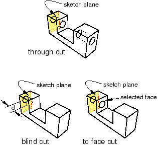

# 11.24.1 创建挤压切口

从主菜单栏中选择****形状****剪切****拉伸****，以在当前视口中创建穿过零件几何体的拉伸剪切。无论当前视口中零件的建模空间如何，拉伸切割工具始终可用。

通过在选定面上绘制切口的二维横截面并定义 Abaqus/CAE 挤出切口的距离，可以在三维零件中创建挤出切口。您可以选择以下方法之一来定义剪切挤出的距离：
- **盲**将切口从草图平面沿选定方向延伸，但仅延伸至指定深度。
- **直到面** 将切割从草图平面延伸到选定的面。
- **穿过全部** 将切割从草图平面沿选定方向延伸穿过几何体。

[Figure 11--66](pt03ch11s24hlb01.md#usi-prt-cutextrude-methods)中对这三种方法进行了说明。

**图 11–66** 创建挤压切口的三种方法。

通过直接在零件平面上绘制切口的二维横截面，可以在二维或轴对称平面零件中创建拉伸切口。切口始终完全穿过零件。

在三维零件中创建挤压切口时，您可以选择中心点并指定 Abaqus/CAE 在挤压时用来扭曲横截面的节距。或者，Abaqus/CAE 可以在横截面被挤压时沿指定的拔模角度扩展或收缩横截面。有关更多信息，请参阅["Including twist in an extrusion," Section 11.13.3](pt03ch11s13s03.md)和["Including draft in an extrusion," Section 11.13.4](pt03ch11s13s04.md)。

**创建挤压切口：**

1. 从主菜单栏中，选择****形状****剪切****拉伸****。 Abaqus/CAE 会在提示区域中显示提示来指导您完成该过程。 **提示：**您还可以使用工具创建拉伸切割，该工具位于部件模块工具箱中的切割工具中。有关部件模块工具箱中工具的图表，请参阅["Using the Part module toolbox," Section 11.17](pt03ch11s17.md)。
2. 如果需要，请指定用于选择拉伸切割特征草图原点的方法。从提示区域的 **草图原点** 字段中选择以下选项之一： - 选择 **自动计算** 以自动放置草图原点。 - 选择**指定**来定义自定义草图原点。 - 选择**会话默认**以使用您之前在会话中指定的自定义源。
3. 如果当前视口包含二维或轴对称平面零件，Abaqus/CAE 会进入草绘器，并在零件平面上绘制拉伸切口的闭合轮廓。如果当前视口包含三维零件，则必须执行以下操作： 1. 选择要从中挤出切口的平面。如果不存在合适的面，您可以选择基准平面或孤立单元面。 **提示：**如果您无法选择所需的平面，您可以使用 **选择** 工具栏更改选择行为。有关详细信息，请参阅["Using the selection options," Section 6.3](pt01ch06s03.md)。选定的面在视口中突出显示。 2. 如果选择**指定**作为**草图原点**方法，请通过单击视口中的点或在提示区域中输入原点的三维坐标来指定原点位置。您还可以通过切换“设置为会话默认值”来将此自定义原点设置为会话中所有草图的默认原点。 3. 在草绘器网格上选择一条边以及该边的方向。边缘不得垂直于选定的面。默认情况下，选定的边将垂直显示并位于草绘器网格的右侧。要为边缘选择不同的方向，请单击对话框右侧的箭头，然后从显示的列表中选择方向。 **提示：**如果所选面的边缘是弯曲的或未提供所需的方向，您可以创建基准轴。然后，您可以选择基准轴来控制草绘器网格上零件的方向。 Abaqus/CAE 突出显示选定的边，进入草绘器，然后旋转零件，直到选定的面与草绘器网格的平面对齐，并且选定的边与所需方向的网格对齐。如果您不确定零件相对于草绘器网格的方向，请使用 **视图操作** 工具栏中的视图操作工具来查看其位置。使用重置视图工具返回到原始视图。 4. 使用草绘器绘制拉伸切口的闭合二维轮廓。
4. 在提示区域中，单击“**完成**”，表示您已完成绘制轮廓草图。
5. 如果当前视口包含二维或轴对称平面零件，则该零件将返回其原始方向，并且 Abaqus/CAE 将使用绘制的轮廓切割平面。如果当前视口包含三维零件，Abaqus/CAE 会以其原始方向显示该零件，其中显示基础零件、绘制的轮廓以及指示拉伸方向的箭头。将出现 **编辑剪切** 对话框。完成以下步骤以在三维零件中创建拉伸切口： 1. 如有必要，单击 **编辑切口** 对话框中的以反转拉伸方向。如果很难看清箭头方向，请使用旋转工具旋转零件。 2. 选择以下结束条件之一： - 选择 **盲** 并在 **深度** 字段中输入一个值，以指定 Abaqus/CAE 将拉伸绘制的切割轮廓的距离。 - 选择 **Up to Face** 以指定 Abaqus/CAE 将切割拉伸到选定的面。 - 选择 **Through All** 以指定 Abaqus/CAE 将从草图平面挤出的切口完全穿过几何体。
6. 如果需要，请选择以下选项之一： - 选择 **扭曲** 并输入音调。节距是发生 360 度扭曲的挤出距离。绘制的切割轮廓必须包含一个指示扭曲中心的孤立点。 - 选择**拔模**并输入拔模角度（大于 90 且小于 90）。正拔模角表示轮廓的外表面膨胀而内表面收缩。
7. 单击 **确定** 以拉伸轮廓。如果您选择了扭曲选项并且草图包含单个孤立点，Abaqus/CAE 将使用该点作为扭曲中心。如果您的草图不包含孤立点，Abaqus/CAE 将返回到草绘器以供您创建一个。如果草图包含多个孤立点，Abaqus/CAE 将返回草绘器并提示您选择一个孤立点作为扭曲中心。
8. 如果选择 **Up to Face**，Abaqus/CAE 会提示您选择要将轮廓拉伸到的面。选择满足以下要求的面： - 选定的面不必与草图平面平行， - 它可以是非平面， - 它必须完全包含拉伸选择，并且 - 它不能是基准平面或孤立单元面。 Abaqus/CAE 创建拉伸切割特征。 **注意：**切割特征仅应用于零件几何体。剪切区域内的任何孤立单元都不受剪切影响。

有关相关主题的信息，请单击以下任意项目：-[Chapter 62, "The Datum toolset](pt06ch62.md)"
-["Adding a cut feature," Section 11.24](pt03ch11s24.md)-[Chapter 20, "The Sketch module](pt03ch20.md)”
-["What is feature-based modeling?," Section 11.3](pt03ch11s03.md)

