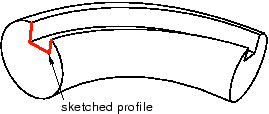

# 11.24.4 创建扫掠切割

从主菜单栏中选择****形状****切割****扫描****，以在当前视口中创建穿过零件几何图形的扫描外壳。您可以仅创建穿过三维零件的扫掠切割。

您可以通过首先定义扫描路径，然后定义扫描轮廓来添加扫描切割特征。有不同的方法可用于定义每个组件：
- 您可以通过在选定面上绘制路径草图或选择您希望扫描路径遵循的一系列边或线来定义扫描路径。草图方法提供了更大的灵活性，但仅支持二维路径。边/线方法使您能够沿着三维零件中的特征（例如样条线或一组边）定义三维扫掠路径。
- 您可以通过使用草绘器绘制扫描轮廓或选择模型中的一个面作为轮廓来定义扫描轮廓。扫描轮廓最初垂直于路径；您可以沿整个扫掠路径保持该方向恒定，也可以在沿其长度扫掠时保持扫掠轮廓垂直于扫掠路径。

下图显示了在选定面上绘制扫描路径并绘制闭合扫描轮廓的示例。轮廓的顶部边缘未显示。

定义扫掠路径的草图或一组边线以及定义扫掠轮廓的草图、边线或边线定义扫掠切削特征；如果使用草绘器定义扫描路径和扫描轮廓，则可以使用特征操作工具集对其进行修改。您可以定义扫掠切口，其扫掠轮廓偏离扫掠路径。在这种情况下，Abaqus/CAE 将扫描路径移动到穿过扫描轮廓的平行位置，并在该位置创建扫描切割特征。

当您定义扫掠特征时，您可以对其应用扭曲或拔模。有关这些工具的更多信息，请参阅["What types of features can you create?," Section 11.9](pt03ch11s09.md)。您可以打开“保持轮廓法线恒定”，以在扫描轮廓沿着扫描路径行进时保持相同的方向；如果关闭此选项，则扫描轮廓方向将随扫描路径的法向发生变化。此外，您可以在特征操作工具集中打开**保留内部边界**，以保留在扫掠壳体特征和现有零件之间生成的任何面或边。内部边界可以创建可以结构化或扫掠网格化的区域，而不必求助于分区。

**要创建扫掠切割特征：**

1. 从主菜单栏中，选择****形状****剪切****扫描****。 Abaqus/CAE 会在提示区域中显示提示来指导您完成该过程。 **提示：**您还可以使用工具创建扫描切割，该工具位于部件模块工具箱中的切割工具中。有关部件模块工具箱中工具的图表，请参阅["Using the Part module toolbox," Section 11.17](pt03ch11s17.md)。
2. 如果要绘制扫掠路径草图，请执行以下操作： 1. 从 **路径** 选项中，选择 **草图** 并单击。 Abaqus/CAE 会在提示区域中显示提示来指导您完成该过程。 2. 如果需要，请指定要用于为扫掠实体特征的草图选择原点的方法。从提示区域的 **草图原点** 字段中选择以下选项之一： - 选择 **自动计算** 以自动放置草图原点。 - 选择**指定**来定义自定义草图原点。 - 选择**会话默认**以使用您之前在会话中指定的自定义源。 3. 选择要在其上绘制扫描路径的平面。如果不存在合适的面，您可以选择基准平面或孤立单元面。 **提示：**如果您无法选择所需的平面，您可以使用 **选择** 工具栏更改选择行为。有关详细信息，请参阅["Using the selection options," Section 6.3](pt01ch06s03.md)。 4. 如果选择**指定**作为**草图原点**方法，请通过单击视口中的点或在提示区域中输入原点的三维坐标来指定原点位置。您还可以通过切换“设置为会话默认值”来将此自定义原点设置为会话中所有草图的默认原点。 5. 在草绘器网格上选择一条边以及该边的方向。边缘不得垂直于选定的面。默认情况下，选定的边将垂直显示并位于草绘器网格的右侧。要为边缘选择不同的方向，请单击对话框右侧的箭头，然后从显示的列表中选择方向。 **提示：**如果没有具有所需方向的直边，您可以创建基准轴。然后，您可以选择基准轴来控制草绘器网格上零件的方向。 Abaqus/CAE 突出显示选定的边，进入草绘器，然后旋转零件，以便选定的面与草绘器网格的平面对齐，并且选定的边与所需方向的网格对齐。如果您不确定零件相对于草绘器网格的方向，请使用 **视图操作** 工具栏中的视图操作工具来查看其位置。使用重置视图工具返回到原始视图。 6. 绘制扫描路径草图。扫掠路径必须满足以下准则： - 路径可以封闭，但两端必须平滑相接；例如，两端不应在拐角处相交。有关有效扫描路径的示例，请参阅["Defining the sweep path and the sweep profile," Section 11.13.8](pt03ch11s13s08.md)。 - 路径必须是连续的；例如，它不能分支。 - 生成的实体不能与其自身相交。在提示区域中，单击“**完成**”表示您已完成扫描路径的绘制。 Abaqus/CAE 退出草绘器并恢复零件的原始视图。突出显示的线指示扫描路径及其方向。 Abaqus/CAE 还会重新打开 **Create Cut Sweep** 对话框，并在 **Path** 选项中的 **Sketch** 标签旁边添加单词 **(Defined)**，以指示扫描路径已在草绘器中定义。
3. 如果要将扫掠路径指定为一系列边或线，请执行以下操作： 1. 从 **路径** 选项中，选择 **边** 并单击。 Abaqus/CAE 会在提示区域中显示提示来指导您完成该过程。 2. 如果需要，请在提示区域中指定是否要**单独**或**按边缘角度**选择扫描路径中的边缘。有关选择对象的更多信息，请参阅["Using the angle and feature edge method to select multiple objects," Section 6.2.3](pt01ch06s02hlb03.md)。 3. 选择要包含在扫描路径中的边。 Abaqus/CAE 显示零件上的扫描路径并指示扫描方向。 4. 在提示区域单击“是”确认扫掠路径方向，或单击“翻转”反转扫掠路径方向。 Abaqus/CAE 重新打开 **创建剪切扫描** 对话框，并在 **路径** 选项中的 **边 ** 标签旁边添加单词 **（定义）**，以指示已使用一系列边定义扫描路径。
4. 如果要绘制扫描轮廓的草图，请执行以下操作： 1. 从 **轮廓** 选项中，选择 **草图** 并单击。 Abaqus/CAE 会在提示区域中显示提示来指导您完成该过程。 2. 绘制扫描轮廓。扫描轮廓必须满足以下准则： - 轮廓必须闭合。 - 生成的实体不能与其自身相交。您可以在草绘器网格上的任何位置绘制轮廓； Abaqus/CAE 沿着与扫描路径平行的路径扫描轮廓。在提示区域中，单击 **完成** 表示您已完成扫描轮廓的绘制。 Abaqus/CAE 退出草绘器并恢复零件的原始视图。 3. 在草绘器网格上选择一条边以及该边的方向。所选边不得与扫描路径方向平行。默认情况下，选定的边将垂直显示并位于草绘器网格的右侧。要为边缘选择不同的方向，请单击对话框右侧的箭头，然后从显示的列表中选择方向。 Abaqus/CAE 突出显示所选边，再次进入草绘器，然后旋转零件，以便草绘器网格位于与扫掠路径起点垂直的平面上，且扫掠路径方向指向屏幕外。此外，选定的边沿所需方向与网格对齐。两条虚线的交点表示扫描路径的原点。 Abaqus/CAE 还会重新打开 **创建剪切扫描** 对话框，并在 **轮廓** 选项中的 **草图** 标签旁边添加单词 **（定义）**，以指示扫描轮廓已在草绘器中定义。
5. 如果要选择面作为扫描轮廓，请执行以下操作： 1. 从 **轮廓** 选项中，选择 **面**，然后单击。 Abaqus/CAE 会在提示区域中显示提示来指导您完成该过程。 2. 从视口中选择一个面。 Abaqus/CAE 突出显示选定的面并重新打开“创建实体扫描”对话框，并在“轮廓”选项中的“面”标签旁边添加“（定义）”一词，以指示扫描轮廓已使用面定义。
6. 如果需要，请执行以下任一操作： - 切换到 **包括扭曲**，然后输入音高。节距是发生 360 度扭曲的挤出距离。绘制的挤出轮廓必须包含一个指示扭曲中心的孤立点。 - 启用**包括拔模**，然后输入拔模角度（大于 90 且小于 90）。正拔模角表示轮廓的外表面膨胀而内表面收缩。如果选择 **保持轮廓正常不变** 选项，则无法应用拔模。 - 启用**保持轮廓法线恒定**以沿整个扫描路径保持相同的轮廓方向。如果关闭此选项，Abaqus/CAE 会调整轮廓方向，以便扫描轮廓与扫描路径法线之间的角度始终恒定。如果选择 **包括草稿** 选项，则无法打开此选项。 - 启用**保留内部边界**以保留在扫掠实体特征和现有零件之间生成的任何面或边。内部边界可以创建可以结构化或扫掠网格化的区域，而无需求助于分区。
7. 单击 **确定** 创建新的扫掠切割。 **注意：**切割特征仅应用于零件几何体。剪切区域内的任何孤立单元都不受剪切影响。

有关相关主题的信息，请单击以下任意项目：-["Defining the sweep path and the sweep profile," Section 11.13.8](pt03ch11s13s08.md)-[Chapter 20, "The Sketch module](pt03ch20.md)”
-["What is feature-based modeling?," Section 11.3](pt03ch11s03.md)

