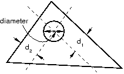
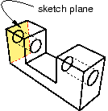
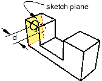

# 11.24.5 切割圆孔

从主菜单栏中选择****形状****剪切****圆孔****，在当前视口中的零件上剪切一个圆孔。无论当前视口中零件的建模空间如何，圆孔工具始终可用。

通过指定距两个选定直边的距离并指定孔的直径来切割圆孔，如下图所示：

该零件必须包含至少两个直边；例如，您不能使用此工具在圆形零件上切孔。

如果当前视口包含二维或轴对称平面零件，则孔始终穿过所有零件。但是，如果当前视口包含三维零件，Abaqus/CAE 会提示您选择切割类型。您可以选择 **Through All** 或 **Blind** 来定义切割深度。

从孔到每条边的距离、孔的直径和盲孔的深度是定义圆孔的特征，所有这三个特征都可以使用特征操纵工具集进行修改。创建剪切后，您无法更改剪切类型（全部剪切或盲目剪切）。

**要切割圆孔：**

1. 从主菜单栏中，选择****形状****切割****圆孔****。 Abaqus/CAE 会在提示区域中显示提示来指导您完成该过程。 **提示：**您还可以使用工具切割圆孔，该工具位于部件模块工具箱中的切割工具中。有关部件模块工具箱中工具的图表，请参阅["Using the Part module toolbox," Section 11.17](pt03ch11s17.md)。
2. 如果当前视口包含二维零件，请选择用于定位孔中心的第一条边。如果当前视口包含三维零件，则必须执行以下操作： 1. 从提示区域中的按钮中，选择以下切割类型之一： - 单击“**穿过全部**”以切割从选定面沿选定方向延伸穿过零件的圆孔。以下示例说明了贯通切割：- 单击“**盲孔**”以切割从选定面沿选定方向延伸但仅延伸到指定深度的圆孔。以下示例说明了盲切：2. 选择要切孔的面。 **提示：**如果您无法选择所需的面，您可以使用 **选择** 工具栏更改选择行为。有关更多信息，请参阅["Using the selection options," Section 6.3](pt01ch06s03.md)。出现一个箭头，指示切孔的轴线方向。 3. 如有必要，从提示区域的按钮中单击“**翻转**”以反转箭头。单击 **确定** 接受指示的方向。 **提示：**如果很难看清箭头方向，请使用旋转工具旋转零件。 4. 选择要定位孔中心的第一条边。选定的边不必与选定的面位于同一平面，但也不能垂直于选定的面。
3. 在提示区域的文本字段中，输入从选定边缘到孔中心的距离。
4. 选择要定位孔中心的第二条边。两条边不得平行。
5. 在提示区域的文本字段中，输入从选定边缘到孔中心的距离。
6. 在提示区域的文本字段中，输入孔的直径。如果当前视口包含二维或轴对称平面零件，Abaqus/CAE 会用圆孔切割该零件。如果当前视口包含三维零件并且您选择了盲切，则提示区域中会出现默认孔深度。单击鼠标按钮 2 接受默认值，或输入新的孔深度。零件返回到其原始方向，并从选定的面上切出圆孔。 **注意：**切割特征仅应用于零件几何体。剪切区域内的任何孤立元素都不受剪切影响。

有关相关主题的信息，请单击以下任意项目：-["Adding a cut feature," Section 11.24](pt03ch11s24.md)-[Chapter 20, "The Sketch module](pt03ch20.md)”
-["What is feature-based modeling?," Section 11.3](pt03ch11s03.md)

