# 12.9.1 定义弹性

您可以使用 **编辑材料** 对话框创建弹性材料并指定其弹性材料属性。您可以创建以下弹性材料模型：
- **有弹性**；见["Creating a linear elastic material model](pt03ch12s09s01.md#usi-prp-mechanical-elastic-elastic)”
- **各向同性超弹**；见["Creating an isotropic hyperelastic material model](pt03ch12s09s01.md#usi-prp-mechanical-elastic-hyperelastic)”
- **各向异性超弹**；见["Creating an anisotropic hyperelastic material model](pt03ch12s09s01.md#usi-prp-mechanical-elastic-hyperelastic-aniso)”
- **超级泡沫**；见["Creating a hyperfoam material model](pt03ch12s09s01.md#usi-prp-mechanical-elastic-hyperfoam)”
- **低密度泡沫**；见["Creating a low-density foam material model](pt03ch12s09s01.md#usi-prp-mechanical-elastic-lowdensfoam)”
- **低弹性**；参见["Creating a hypoelastic material model](pt03ch12s09s01.md#usi-prp-mechanical-elastic-hypoelastic)”
- **多孔弹性**；见["Creating a porous elastic material model](pt03ch12s09s01.md#usi-prp-mechanical-elastic-porouselastic)”
- **粘弹性**；见["Creating a viscoelastic material model](pt03ch12s09s01.md#usi-prp-mechanical-elastic-viscoelastic)”

有关详细信息，请参阅["Elastic behavior: overview," Section 22.1.1 of the Abaqus Analysis User's Guide](../usb/usb-link.md#usb-mat-celasticbehav)。

### 创建线弹性材料模型

线性弹性是 Abaqus 中可用的最简单的弹性形式。线弹性模型可以定义各向同性、正交各向异性或各向异性材料行为，并且对于小弹性应变有效。有关如何定义线弹性材料模型的详细信息，请参阅“["Specifying elastic material properties](pt03ch12s09s01.md#usi-prp-mechanical-elastic-elastic-overview)”。

提供了与线性弹性一起使用的失效理论。它们可用于获取后处理的输出请求。以下部分描述了如何指定这些故障模型：
-["Defining stress-based failure measures for an elastic model](pt03ch12s09s01.md#usi-prp-mechanical-elastic-elastic-stressfailure)”
-["Defining strain-based failure measures for an elastic model](pt03ch12s09s01.md#usi-prp-mechanical-elastic-elastic-strainfailure)”

#### 指定弹性材料属性

线弹性材料模型对于小弹性应变（通常小于 5%）有效；可以是各向同性、正交各向异性或完全各向异性；并且可以具有取决于温度和/或其他场变量的属性。有关详细信息，请参阅["Linear elastic behavior," Section 22.2.1 of the Abaqus Analysis User's Guide](../usb/usb-link.md#usb-mat-clinearelastic)。

**指定弹性材料属性：**

1. 从 **编辑材质** 对话框的菜单栏中，选择****机械****弹性****弹性****。 （有关显示 **编辑材质** 对话框的信息，请参阅["Creating or editing a material," Section 12.7.1](pt03ch12s07hlb01.md)。）
2. 从 **类型** 字段中，选择您将提供的数据类型以指定弹性材料属性。 - 选择 **Isotropic** 以指定各向同性弹性属性，如["Defining isotropic elasticity" in "Linear elastic behavior," Section 22.2.1 of the Abaqus Analysis User's Guide](../usb/usb-link.md#usb-mat-clinearelastic-isotropic)中所述。 - 选择 **工程常数** 通过给出工程常数来指定正交各向异性弹性属性，如["Defining orthotropic elasticity by specifying the engineering constants" in "Linear elastic behavior," Section 22.2.1 of the Abaqus Analysis User's Guide](../usb/usb-link.md#usb-mat-clinearelastic-engconst)中所述。 - 选择 **Lamina** 以指定平面应力中的正交各向异性弹性属性，如["Defining orthotropic elasticity in plane stress" in "Linear elastic behavior," Section 22.2.1 of the Abaqus Analysis User's Guide](../usb/usb-link.md#usb-mat-clinearelastic-planestress)中所述。 - 选择 **正交各向异性** 直接指定正交各向异性弹性属性，如["Defining orthotropic elasticity by specifying the terms in the elastic stiffness matrix" in "Linear elastic behavior," Section 22.2.1 of the Abaqus Analysis User's Guide](../usb/usb-link.md#usb-mat-clinearelastic-orthoterms)中所述。 - 选择 **Anisotropic** 以指定各向异性弹性属性，如["Defining fully anisotropic elasticity" in "Linear elastic behavior," Section 22.2.1 of the Abaqus Analysis User's Guide](../usb/usb-link.md#usb-mat-clinearelastic-anisotropic)中所述。 - 选择 **牵引** 指定扭曲单元的正交各向异性弹性属性，如["Defining orthotropic elasticity for warping elements" in "Linear elastic behavior," Section 22.2.1 of the Abaqus Analysis User's Guide](../usb/usb-link.md#usb-mat-clinearelastic-orthowarp)中所述，或定义粘性单元的非耦合弹性属性，如["Defining elasticity in terms of tractions and separations for cohesive elements" in "Linear elastic behavior," Section 22.2.1 of the Abaqus Analysis User's Guide](../usb/usb-link.md#usb-mat-clinearelastic-traction)中所述。 - 选择 **耦合牵引** 来指定粘性单元的耦合弹性属性，如["Defining elasticity in terms of tractions and separations for cohesive elements" in "Linear elastic behavior," Section 22.2.1 of the Abaqus Analysis User's Guide](../usb/usb-link.md#usb-mat-clinearelastic-traction)中所述。 - 选择 **剪切** 以指定线性各向同性偏向材料模型。有关更多信息，请参阅["Deviatoric behavior" in "Equation of state," Section 25.2.1 of the Abaqus Analysis User's Guide](../usb/usb-link.md#usb-mat-ceos-deviatoric)。
3. 要定义依赖于温度的行为数据，请打开**使用依赖于温度的数据**。标有 **Temp** 的列出现在 **Data** 表中。
4. 要定义依赖于字段变量的行为数据，请单击 **字段变量数量** 字段右侧的箭头以增加或减少字段变量的数量。 **字段**变量列出现在**数据**表中。
5. 如果要定义粘弹性材料的弹性行为，请单击 **模量时间尺度（针对粘弹性）** 字段右侧的箭头以指定​​长期或瞬时弹性响应。
6. 如果您想要修改弹性材料响应以便无法生成压缩应力，请切换到**无压缩**。详细信息请参见["No compression or no tension," Section 22.2.2 of the Abaqus Analysis User's Guide](../usb/usb-link.md#usb-mat-cnocompnoten)。
7. 如果您想要修改弹性材料响应以便无法生成拉伸应力，请切换到**无张力**。详情请参见["No compression or no tension," Section 22.2.2 of the Abaqus Analysis User's Guide](../usb/usb-link.md#usb-mat-cnocompnoten)。
8. 在**数据**表中输入材料属性。 - 对于 **各向同性** 数据，输入杨氏模量 *E* 和泊松比。 - 对于**工程常数**数据，输入主方向上的广义杨氏模量，、、；主方向上的泊松比，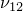、、；以及主方向上的剪切模量、、。 - 对于 **Lamina** 数据，输入杨氏模量、、；泊松比，；以及剪切模量、、。需要和剪切模量来定义壳中的横向剪切行为。 - 对于**正交各向异性**数据，输入 9 个弹性刚度参数：、等（单位为[FL2](../popups/usb-int-iconventions-unitsym.md)）。 - 对于**各向异性**数据，输入 21 个弹性刚度参数：、等（单位为[FL2](../popups/usb-int-iconventions-unitsym.md)）。 - 对于 **牵引** 数据，您的条目取决于您正在建模的单元类型。 - 对于使用翘曲单元建模的实体横截面 Timoshenko 梁单元，输入杨氏模量以及材料方向上的剪切模量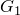和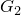。 - 对于具有非耦合牵引力的粘性单元，输入法线方向和两个局部剪切方向、和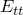上的弹性模量。 - 对于**耦合牵引力**数据，输入六个弹性模量：、、、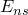、和。 - 对于**剪切**数据，输入**剪切模量**。
9. 如果需要，要定义材料的平面应力正交各向异性失效测量，请单击 **子选项**。有关详细信息，请参阅以下部分： -["Defining stress-based failure measures for an elastic model](pt03ch12s09s01.md#usi-prp-mechanical-elastic-elastic-stressfailure)" -["Defining strain-based failure measures for an elastic model](pt03ch12s09s01.md#usi-prp-mechanical-elastic-elastic-strainfailure)"
10. 单击“**确定**”创建材质并关闭“**编辑材质**”对话框。或者，您可以从 **编辑材质** 对话框中的菜单中选择要定义的另一种材质行为（有关详细信息，请参阅["Browsing and modifying material behaviors," Section 12.7.2](pt03ch12s07hlb02.md)）。

#### 为弹性模型定义基于应力的失效测量

使用 **子选项编辑器** 定义弹性材料模型基于应力的失效测量的应力限制。有关详细信息，请参阅["Plane stress orthotropic failure measures," Section 22.2.3 of the Abaqus Analysis User's Guide](../usb/usb-link.md#usb-mat-cfailuremeasures)。

**为弹性模型定义基于应力的失效测量：**

1. 按照["Specifying elastic material properties](pt03ch12s09s01.md#usi-prp-mechanical-elastic-elastic-overview)中的描述创建线弹性材料模型。"
2. 从“编辑材料”对话框的“子选项”菜单中，选择“失败应力”。 **子选项**编辑器出现。
3. 要定义依赖于温度的行为数据，请打开**使用依赖于温度的数据**。标有 **Temp** 的列出现在 **Data** 表中。
4. 要定义依赖于字段变量的行为数据，请单击 **字段变量数量** 字段右侧的箭头以增加或减少字段变量的数量。 **字段**变量列出现在**数据**表中。
5. 在**数据**表中，输入应力限制：**十应力纤维方向** 纤维方向上的拉伸应力限制，。 **Com Stress Fiber Dir** 纤维方向的压应力极限，。 **十个应力横向方向** 横向拉伸应力极限，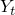。 **Com Stress Transv Dir** 横向压应力极限，。 **剪切强度** *X*--*Y* 平面中的剪切强度，*S*。 **叉积项系数** 叉积项系数，()。该值仅用于 Tsai-Wu 理论，如果提供了，则忽略该值。默认为零。 **应力极限** 双轴应力极限，。该值仅用于 Tsai-Wu 理论。如果此条目非零，则忽略。您可能需要展开对话框才能查看 **Data** 表中的所有列。有关如何输入数据的详细信息，请参阅["Entering tabular data," Section 3.2.7](pt01ch03s02s07.md)。
6. 单击“**确定**”返回“**编辑材质**”对话框。

#### 为弹性模型定义基于应变的失效测量

使用 **子选项编辑器** 定义弹性材料模型基于应变的失效测量的应变限制。有关详细信息，请参阅["Plane stress orthotropic failure measures," Section 22.2.3 of the Abaqus Analysis User's Guide](../usb/usb-link.md#usb-mat-cfailuremeasures)。

**定义基于应变的失效测量：**

1. 按照["Specifying elastic material properties](pt03ch12s09s01.md#usi-prp-mechanical-elastic-elastic-overview)中的描述创建线弹性材料模型。"
2. 从“编辑材料”对话框的“子选项”菜单中，选择“失效应变”。
3. 要定义依赖于温度的行为数据，请打开**使用依赖于温度的数据**。标有 **Temp** 的列出现在 **Data** 表中。
4. 要定义依赖于字段变量的行为数据，请单击 **字段变量数量** 字段右侧的箭头以增加或减少字段变量的数量。 **字段**变量列出现在**数据**表中。
5. 在**数据**表中，输入应变限值：**十应变纤维方向** 纤维方向上的拉伸应变限值，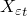。 **Com Strain Fiber Dir** 纤维方向的压缩应变极限，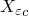。 **十应变横向方向** 横向拉伸应变极限，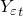。 **Com Strain Transv Dir** 横向压缩应变极限，。 **剪切应变** *X*--*Y* 平面中的剪切应变极限，。您可能需要展开对话框才能看到 **数据** 中的所有列。有关如何输入数据的详细信息，请参阅["Entering tabular data," Section 3.2.7](pt01ch03s02s07.md)。
6. 单击“**确定**”返回“**编辑材质**”对话框。

### 创建各向同性超弹性材料模型

各向同性超弹性模型描述了几乎不可压缩材料的行为，这些材料在大应变下表现出瞬时弹性响应。有关详细信息，请参阅["Hyperelastic behavior of rubberlike materials," Section 22.5.1 of the Abaqus Analysis User's Guide](../usb/usb-link.md#usb-mat-chyperelastic)。

#### 各向同性超弹性材料定义概述

各向同性超弹性材料用“应变能势”来描述，它将每单位参考体积（初始配置中的体积）存储在材料中的应变能定义为材料中该点应变的函数。 Abaqus 中提供了多种形式的应变能势来模拟不可压缩的各向同性弹性体。有关超弹性材料的更多信息，请参阅["Hyperelastic behavior of rubberlike materials," Section 22.5.1 of the Abaqus Analysis User's Guide](../usb/usb-link.md#usb-mat-chyperelastic)。

定义各向同性超弹性材料时，您可以选择直接指定材料参数或允许 Abaqus 根据您提供的测试数据计算它们。有关详细说明，请参阅以下部分：
-["Entering material parameters to define an isotropic hyperelastic material](pt03ch12s09s01.md#usi-prp-mechanical-elastic-hyperelastic-direct)”
-["Providing test data to define an isotropic hyperelastic material](pt03ch12s09s01.md#usi-prp-mechanical-elastic-hyperelastic-testdata)”

#### 输入材料参数来定义各向同性超弹性材料

您可以直接提供作为温度函数的超弹性应变能势参数。

**通过直接指定材料常数来指定各向同性超弹性材料：**

1. 从 **编辑材料** 对话框的菜单栏中，选择****机械****弹性****超弹性****。 （有关显示 **编辑材质** 对话框的信息，请参阅["Creating or editing a material," Section 12.7.1](pt03ch12s07hlb01.md)。）
2. 选择 **各向同性** 作为材料类型。
3. 单击 **应变能势** 字段右侧的箭头，然后选择所需的应变能势。 **Arruda-Boyce**：Arruda-Boyce 模型也称为八链模型。有关详细信息，请参阅["Arruda-Boyce form" in "Hyperelastic behavior of rubberlike materials," Section 22.5.1 of the Abaqus Analysis User's Guide](../usb/usb-link.md#usb-mat-chyperelastic-arruda)。 **马洛**：有关更多信息，请参阅["Marlow form" in "Hyperelastic behavior of rubberlike materials," Section 22.5.1 of the Abaqus Analysis User's Guide](../usb/usb-link.md#usb-mat-chyperelastic-marlow)。 **Mooney-Rivlin**：Mooney-Rivlin 模型相当于使用 N=1 的多项式模型。有关更多信息，请参阅[" Mooney-Rivlin form" in "Hyperelastic behavior of rubberlike materials," Section 22.5.1 of the Abaqus Analysis User's Guide](../usb/usb-link.md#usb-mat-chyperelastic-mooneyrivlin)。 **Neo Hooke**：Neo Hookean 模型相当于使用 N=1 的简化多项式模型。有关详细信息，请参阅["Neo-Hookean form" in "Hyperelastic behavior of rubberlike materials," Section 22.5.1 of the Abaqus Analysis User's Guide](../usb/usb-link.md#usb-mat-chyperelastic-neohooke)。 **奥格登**：有关更多信息，请参阅["Ogden form" in "Hyperelastic behavior of rubberlike materials," Section 22.5.1 of the Abaqus Analysis User's Guide](../usb/usb-link.md#usb-mat-chyperelastic-ogden)。 **多项式**：有关详细信息，请参阅["Polynomial form" in "Hyperelastic behavior of rubberlike materials," Section 22.5.1 of the Abaqus Analysis User's Guide](../usb/usb-link.md#usb-mat-chyperelastic-polynomial)。 **简化多项式**：简化多项式模型相当于将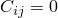的多项式模型用于。有关更多信息，请参阅["Reduced polynomial form" in "Hyperelastic behavior of rubberlike materials," Section 22.5.1 of the Abaqus Analysis User's Guide](../usb/usb-link.md#usb-mat-chyperelastic-reducedpoly)。 **用户定义**：您可以在用户子程序[`UHYPER`](../sub/sub-link.md#sub-xsl-uhyper)中定义应变能势相对于应变不变量的导数。此方法仅对 Abaqus/Standard 分析有效。有关更多信息，请参见["User subroutine specification in Abaqus/Standard" in "Hyperelastic behavior of rubberlike materials," Section 22.5.1 of the Abaqus Analysis User's Guide](../usb/usb-link.md#usb-mat-chyperelastic-user)。 **范德华**：范德华模型也称为 Kilian 模型。有关更多信息，请参阅["Van der Waals form" in "Hyperelastic behavior of rubberlike materials," Section 22.5.1 of the Abaqus Analysis User's Guide](../usb/usb-link.md#usb-mat-chyperelastic-vanderwaals)。 **Yeoh**：Yeoh 模型相当于使用 N=3 的简化多项式模型。有关更多信息，请参阅["Yeoh form" in "Hyperelastic behavior of rubberlike materials," Section 22.5.1 of the Abaqus Analysis User's Guide](../usb/usb-link.md#usb-mat-chyperelastic-yeoh)。 **未知**：如果您使用实验数据定义各向同性超弹性材料，您还可以选择暂时不指定特定的应变能势。您可以使用 **Evaluate** 选项来确定材料数据的最佳应变能潜力，并再次显示材料编辑器以完成材料定义；请参阅["Evaluating hyperelastic and viscoelastic material behavior," Section 12.4.7](pt03ch12s04s07.md)，了解更多信息。
4. 选择**系数**作为**输入源**。此**输入源**选项对于马洛模型或未知应变能势无效。
5. 如果要定义粘弹性材料的超弹性行为，请单击 **模量时间尺度（针对粘弹性）** 字段右侧的箭头以指定​​长期或瞬时弹性响应。
6. 如果选择“**用户定义**”作为应变能势，请执行以下步骤： - 切换“**包括压缩性**”以指示用户子程序[`UHYPER`](../sub/sub-link.md#sub-xsl-uhyper)定义的材料是可压缩的。否则，Abaqus 假定材料是不可压缩的。 - 指定所需的**属性值数量**作为用户子例程[`UHYPER`](../sub/sub-link.md#sub-xsl-uhyper)中的数据。
7. 如果选择 **Ogden**、**Polynomial** 或 **Reduced Polynomial** 作为应变能势，请单击 **应变能势阶** 字段左侧的箭头以选择一个值。
8. 要定义依赖于温度的行为数据，请打开 **使用依赖于温度的数据**。标有 **Temp** 的列出现在 **Data** 表中。
9. 在**数据**表中输入与所选应变能势相对应的材料属性。 ****阿鲁达-博伊斯**** 输入、和 *D*。 ****Mooney-Rivlin**** 输入、和。 ****尼奥·胡克**** 输入和。 ****Ogden**** 输入、和，其中 *i* 从 1 到 N，N 是为 **应变能势阶 ** 指定的值。 ****多项式**** 输入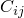，其中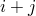从 1 到 N，以及，其中 *i* 从 1 到 N，N 是为 **应变能势阶** 指定的值。 ****降多项式**** 输入和，其中 *i* 从 1 到 N，N 是为 **应变能势阶 ** 指定的值。 ****范德华**** 输入、、*a*、和 *D*。 ****杨**** 输入、、、、和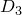。
10. 如果需要，从 **子选项** 菜单中选择 **滞后** 以定义滞后行为。详情请参见“["Defining hysteretic behavior for an isotropic hyperelastic material model](pt03ch12s09s01.md#usi-prp-mechanical-elastic-hyperelastic-hysteresis)”。
11. 单击“**确定**”创建材质并关闭“**编辑材质**”对话框。或者，您可以从 **编辑材质** 对话框中的菜单中选择要定义的另一种材质行为（有关详细信息，请参阅["Browsing and modifying material behaviors," Section 12.7.2](pt03ch12s07hlb02.md)）。

#### 提供测试数据来定义各向同性超弹性材料

Abaqus 可以根据您在**测试数据编辑器**中输入的测试数据计算材料参数。

**通过提供测试数据来指定各向同性超弹性材料：**

1. 从 **编辑材料** 对话框的菜单栏中，选择****机械****弹性****超弹性****。 （有关显示 **编辑材质** 对话框的信息，请参阅[Creating and editing materials, Section 12.7.](pt03ch12s07.md)。）
2. 选择 **各向同性** 作为材料类型。
3. 单击 **应变能势** 字段右侧的箭头，然后选择所需的应变能势。 **Arruda-Boyce**：Arruda-Boyce 模型也称为八链模型。有关详细信息，请参阅["Arruda-Boyce form" in "Hyperelastic behavior of rubberlike materials," Section 22.5.1 of the Abaqus Analysis User's Guide](../usb/usb-link.md#usb-mat-chyperelastic-arruda)。 **马洛**：有关更多信息，请参阅["Marlow form" in "Hyperelastic behavior of rubberlike materials," Section 22.5.1 of the Abaqus Analysis User's Guide](../usb/usb-link.md#usb-mat-chyperelastic-marlow)。 **Mooney-Rivlin**：Mooney-Rivlin 模型相当于使用 N=1 的多项式模型。有关更多信息，请参阅[" Mooney-Rivlin form" in "Hyperelastic behavior of rubberlike materials," Section 22.5.1 of the Abaqus Analysis User's Guide](../usb/usb-link.md#usb-mat-chyperelastic-mooneyrivlin)。 **Neo Hooke**：Neo Hookean 模型相当于使用 N=1 的简化多项式模型。有关详细信息，请参阅["Neo-Hookean form" in "Hyperelastic behavior of rubberlike materials," Section 22.5.1 of the Abaqus Analysis User's Guide](../usb/usb-link.md#usb-mat-chyperelastic-neohooke)。 **奥格登**：有关更多信息，请参阅["Ogden form" in "Hyperelastic behavior of rubberlike materials," Section 22.5.1 of the Abaqus Analysis User's Guide](../usb/usb-link.md#usb-mat-chyperelastic-ogden)。 **多项式**：有关详细信息，请参阅["Polynomial form" in "Hyperelastic behavior of rubberlike materials," Section 22.5.1 of the Abaqus Analysis User's Guide](../usb/usb-link.md#usb-mat-chyperelastic-polynomial)。 **简化多项式**：简化多项式模型相当于将的多项式模型用于。有关更多信息，请参阅["Reduced polynomial form" in "Hyperelastic behavior of rubberlike materials," Section 22.5.1 of the Abaqus Analysis User's Guide](../usb/usb-link.md#usb-mat-chyperelastic-reducedpoly)。 **用户定义**：您可以在用户子程序[`UHYPER`](../sub/sub-link.md#sub-xsl-uhyper)中定义应变能势相对于应变不变量的导数。此方法仅对 Abaqus/Standard 分析有效。有关更多信息，请参见["User subroutine specification in Abaqus/Standard" in "Hyperelastic behavior of rubberlike materials," Section 22.5.1 of the Abaqus Analysis User's Guide](../usb/usb-link.md#usb-mat-chyperelastic-user)。 **范德华**：范德华模型也称为 Kilian 模型。有关更多信息，请参阅["Van der Waals form" in "Hyperelastic behavior of rubberlike materials," Section 22.5.1 of the Abaqus Analysis User's Guide](../usb/usb-link.md#usb-mat-chyperelastic-vanderwaals)。 **Yeoh**：Yeoh 模型相当于使用 N=3 的简化多项式模型。有关更多信息，请参阅["Yeoh form" in "Hyperelastic behavior of rubberlike materials," Section 22.5.1 of the Abaqus Analysis User's Guide](../usb/usb-link.md#usb-mat-chyperelastic-yeoh)。 **未知**：如果您使用实验数据定义各向同性超弹性材料，您还可以选择暂时不指定特定的应变能势。您可以使用 **Evaluate** 选项来确定材料数据的最佳应变能潜力，然后再次显示材料编辑器以完成材料定义；请参阅["Evaluating hyperelastic and viscoelastic material behavior," Section 12.4.7](pt03ch12s04s07.md)，了解更多信息。
4. 选择“**测试数据**”作为“**输入源**”，以指示材料常数将根据对材料样本进行简单测试所获取的数据来计算。
5. 如果要定义粘弹性材料的超弹性行为，请单击 **模量时间尺度（针对粘弹性）** 字段右侧的箭头以指定​​长期或瞬时弹性响应。
6. 如果您选择 **Marlow** 作为应变能势，请选择您选择的 **定义偏响应的数据** 和 **定义体积响应的数据** 选项。 - 偏响应由步骤 8 中所述指定的 **单轴**、**双轴** 或 **平面** 测试数据定义。 - 体积响应由以下方法之一定义： - **忽略测试数据**：Abaqus/Standard 假定完全不可压缩行为，而 Abaqus/Explicit 假定与泊松比 0.475 相对应的压缩性。 - **体积测试数据**：直接指定体积测试数据，如步骤 8 中所述。 - **泊松比**：指定各向同性超弹性材料的泊松比值。 - **横向标称应变**：横向标称应变指定为单轴、双轴或平面测试数据的一部分，如步骤 8 中所述。
7. 如果选择 **Ogden**、**Polynomial** 或 **Reduced Polynomial** 作为应变能势，请单击 **应变能势阶** 字段左侧的箭头以选择一个值。
8. 如果选择 **Van der Waals** 作为应变能势，请选择指定 **Beta** 的方法： - 选择 **拟合值** 从测试数据的非线性最小二乘拟合确定的值。 - 选择**指定**，然后输入一个值直接指定。允许的值为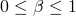。如果只有一种测试数据，建议设置=0。
9. 您可以为多达四个简单测试指定实验应力-应变数据：单轴、等双轴、平面以及体积压缩测试（如果材料可压缩）。使用**测试数据**菜单指定实验数据。有关详细信息，请参阅以下部分： -["Specifying uniaxial test data for an isotropic hyperelastic material model](pt03ch12s09s01.md#usi-prp-mechanical-elastic-hyper-uniaxial)" -["Specifying biaxial test data for an isotropic hyperelastic material model](pt03ch12s09s01.md#usi-prp-mechanical-elastic-hyper-biaxial)" -["Specifying planar test data for an isotropic hyperelastic material model](pt03ch12s09s01.md#usi-prp-mechanical-elastic-hyper-planar)" -["Specifying volumetric test data for an isotropic hyperelastic material model](pt03ch12s09s01.md#usi-prp-mechanical-elastic-hyper-volumetric)"
10. 如果需要，从 **子选项** 菜单中选择 **滞后** 以定义滞后行为。详情请参见“["Defining hysteretic behavior for an isotropic hyperelastic material model](pt03ch12s09s01.md#usi-prp-mechanical-elastic-hyperelastic-hysteresis)”。
11. 单击“**确定**”创建材质并关闭“**编辑材质**”对话框。或者，您可以从 **编辑材质** 对话框中的菜单中选择要定义的另一种材质行为（有关详细信息，请参阅["Browsing and modifying material behaviors," Section 12.7.2](pt03ch12s07hlb02.md)）。

#### 指定各向同性超弹性材料模型的单轴测试数据

使用 **测试数据编辑器** 指定 Abaqus 可以校准超弹性材料系数的单轴测试数据。有关详细信息，请参阅["Hyperelastic behavior of rubberlike materials," Section 22.5.1 of the Abaqus Analysis User's Guide](../usb/usb-link.md#usb-mat-chyperelastic)。

**指定单轴测试数据：**

1. 创建各向同性超弹性材料模型，如["Providing test data to define an isotropic hyperelastic material](pt03ch12s09s01.md#usi-prp-mechanical-elastic-hyperelastic-testdata)中所述。"
2. 从“编辑材料”对话框的“测试数据”菜单中，选择“单轴测试数据”。出现 **测试数据编辑器**。
3. 如果您希望 Abaqus 对应力应变数据应用平滑滤波器，请打开 **应用平滑**。如果您使用 Marlow 模型，则特别推荐此选项。
4. 如果您请求数据平滑，请单击 **应用平滑** 字段右侧的箭头，以指定 Abaqus 将在其中拟合最小二乘多项式的每个数据点右侧和左侧的数据点数量。
5. 如果您要定义 Marlow 模型，则可以选择以下选项： - 要包括横向标称应变数据，请打开 **包括横向标称应变**。标记为 **横向标称应变** 的列出现在 **数据** 表中。 - 要定义依赖于温度的行为数据，请打开**使用依赖于温度的数据**。标有 **Temp** 的列出现在 **Data** 表中。 - 要定义依赖于字段变量的行为数据，请单击“**字段变量数**”字段右侧的箭头以增加或减少字段变量的数量。 **字段**变量列出现在**数据**表中。
6. 在**数据**表中，输入测试数据：**标称应力** 标称应力，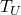。 **标称应变** 标称应变，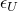。 **横向标称应变** 标称横向应变，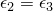。 **温度** 温度，。 **字段 *n*** 预定义的字段变量。您可能需要展开对话框才能查看 **Data** 表中的所有列。有关如何输入数据的详细信息，请参阅["Entering tabular data," Section 3.2.7](pt01ch03s02s07.md)。
7. 单击“**确定**”返回“**编辑材质**”对话框。

#### 指定各向同性超弹性材料模型的双轴测试数据

使用 **测试数据编辑器** 指定 Abaqus 可以校准超弹性材料系数的双轴测试数据。有关详细信息，请参阅["Hyperelastic behavior of rubberlike materials," Section 22.5.1 of the Abaqus Analysis User's Guide](../usb/usb-link.md#usb-mat-chyperelastic)。

**指定双轴测试数据：**

1. 创建各向同性超弹性材料模型，如["Providing test data to define an isotropic hyperelastic material](pt03ch12s09s01.md#usi-prp-mechanical-elastic-hyperelastic-testdata)中所述。"
2. 从“编辑材料”对话框的“测试数据”菜单中，选择“双轴测试数据”。出现 **测试数据编辑器**。
3. 如果您希望 Abaqus 对应力应变数据应用平滑滤波器，请打开 **应用平滑**。如果您使用的是 Marlow 模型，则特别推荐此选项。
4. 如果您请求数据平滑，请单击 **应用平滑** 字段右侧的箭头，以指定 Abaqus 将在其中拟合最小二乘多项式的每个数据点右侧和左侧的数据点数量。
5. 如果您要定义 Marlow 模型，则可以选择以下选项： - 要包括横向标称应变数据，请打开 **包括横向标称应变**。标记为 **横向标称应变** 的列出现在 **数据** 表中。 - 要定义依赖于温度的行为数据，请打开**使用依赖于温度的数据**。标有 **Temp** 的列出现在 **Data** 表中。 - 要定义依赖于字段变量的行为数据，请单击 **字段变量数量** 字段右侧的箭头以增加或减少字段变量的数量。 **字段**变量列出现在**数据**表中。
6. 在**数据**表中，输入测试数据：**标称应力** 标称应力，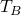。 **标称应变** 标称应变，。 **横向标称应变** 标称横向应变，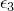。 **温度** 温度，。 **字段 *n*** 预定义的字段变量。您可能需要展开对话框才能查看 **Data** 表中的所有列。有关如何输入数据的详细信息，请参阅["Entering tabular data," Section 3.2.7](pt01ch03s02s07.md)。
7. 单击“**确定**”返回“**编辑材质**”对话框。

#### 指定各向同性超弹性材料模型的平面测试数据

使用 **测试数据编辑器** 指定 Abaqus 可以校准超弹性材料系数的平面测试数据。有关详细信息，请参阅["Hyperelastic behavior of rubberlike materials," Section 22.5.1 of the Abaqus Analysis User's Guide](../usb/usb-link.md#usb-mat-chyperelastic)。

**指定平面测试数据：**

1. 创建各向同性超弹性材料模型，如["Providing test data to define an isotropic hyperelastic material](pt03ch12s09s01.md#usi-prp-mechanical-elastic-hyperelastic-testdata)中所述。"
2. 从“编辑材料”对话框的“测试数据”菜单中，选择“平面测试数据”。出现 **测试数据编辑器**。
3. 如果您希望 Abaqus 对应力应变数据应用平滑滤波器，请打开 **应用平滑**。如果您使用的是 Marlow 模型，则特别推荐此选项。
4. 如果您请求数据平滑，请单击 **应用平滑** 字段右侧的箭头，以指定 Abaqus 将在其中拟合最小二乘多项式的每个数据点右侧和左侧的数据点数量。
5. 如果您要定义 Marlow 模型，则可以选择以下选项： - 要包括横向标称应变数据，请打开 **包括横向标称应变**。标记为 **横向标称应变** 的列出现在 **数据** 表中。 - 要定义依赖于温度的行为数据，请打开**使用依赖于温度的数据**。标有 **Temp** 的列出现在 **Data** 表中。 - 要定义依赖于字段变量的行为数据，请单击 **字段变量数量** 字段右侧的箭头以增加或减少字段变量的数量。 **字段**变量列出现在**数据**表中。
6. 在**数据**表中，输入测试数据：**标称应力** 标称应力，。 **标称应变** 标称应变，。 **横向标称应变** 标称横向应变，。 **温度** 温度，。 **字段 *n*** 预定义的字段变量。您可能需要展开对话框才能查看 **Data** 表中的所有列。有关如何输入数据的详细信息，请参阅["Entering tabular data," Section 3.2.7](pt01ch03s02s07.md)。
7. 单击“**确定**”返回“**编辑材质**”对话框。

#### 指定各向同性超弹性材料模型的体积测试数据

使用 **测试数据编辑器** 指定 Abaqus 可以校准超弹性材料系数的体积测试数据。有关详细信息，请参阅["Hyperelastic behavior of rubberlike materials," Section 22.5.1 of the Abaqus Analysis User's Guide](../usb/usb-link.md#usb-mat-chyperelastic)。

**指定体积测试数据：**

1. 创建各向同性超弹性材料模型，如["Providing test data to define an isotropic hyperelastic material](pt03ch12s09s01.md#usi-prp-mechanical-elastic-hyperelastic-testdata)中所述。"
2. 从“编辑材料”对话框的“测试数据”菜单中，选择“体积测试数据”。出现 **测试数据编辑器**。
3. 如果您希望 Abaqus 对应力应变数据应用平滑滤波器，请打开 **应用平滑**。如果您使用的是 Marlow 模型，则特别推荐此选项。
4. 如果您请求数据平滑，请单击 **应用平滑** 字段右侧的箭头，以指定 Abaqus 将在其中拟合最小二乘多项式的每个数据点右侧和左侧的数据点数量。
5. 如果您要定义 Marlow 模型，则可以选择以下选项： - 要定义依赖于温度的行为数据，请打开 **使用依赖于温度的数据**。标有 **Temp** 的列出现在 **Data** 表中。 - 要定义依赖于字段变量的行为数据，请单击 **字段变量数量** 字段右侧的箭头以增加或减少字段变量的数量。 **字段**变量列出现在**数据**表中。
6. 在**数据**表中，输入测试数据：**压力** 总压应力，*p*。 **体积比** 体积比（当前体积/原始体积），*J*。 **温度** 温度，。 **字段 *n*** 预定义的字段变量。您可能需要展开对话框才能查看 **Data** 表中的所有列。有关如何输入数据的详细信息，请参阅["Entering tabular data," Section 3.2.7](pt01ch03s02s07.md)。
7. 单击“**确定**”返回“**编辑材质**”对话框。

#### 定义各向同性超弹性材料模型的滞后行为

使用**子选项编辑器**定义各向同性超弹性材料的应变率相关响应，该材料在循环载荷下表现出明显的滞后。有关详细信息，请参阅["Hysteresis in elastomers," Section 22.8.1 of the Abaqus Analysis User's Guide](../usb/usb-link.md#usb-mat-chysteresis)。

**定义迟滞材料行为：**

1. 创建各向同性超弹性材料模型，如["Entering material parameters to define an isotropic hyperelastic material](pt03ch12s09s01.md#usi-prp-mechanical-elastic-hyperelastic-direct)" 或["Providing test data to define an isotropic hyperelastic material](pt03ch12s09s01.md#usi-prp-mechanical-elastic-hyperelastic-testdata)" 中所述。
2. 从“编辑材质”对话框的“子选项”菜单中，选择“滞后”。 **子选项编辑器**出现。在**子选项编辑器**的**数据**表中，输入蠕变行为数据：**应力缩放因子** 应力缩放因子，*S*。 **蠕变参数** 蠕变参数，*A*。 **有效应力指数** 有效应力指数，*m*。 **蠕变应变指数** 蠕变应变指数，。您可能需要展开对话框才能查看 **Data** 表中的所有列。有关如何输入数据的详细信息，请参阅["Entering tabular data," Section 3.2.7](pt01ch03s02s07.md)。
3. 单击**确定**返回**编辑材质**对话框。

### 创建各向异性超弹性材料模型

各向异性超弹性模型为表现出高度各向异性和非线性弹性行为的材料（例如生物医学软组织和纤维增强弹性体）提供了建模功能。有关详细信息，请参阅["Anisotropic hyperelastic behavior," Section 22.5.3 of the Abaqus Analysis User's Guide](../usb/usb-link.md#usb-mat-canisohyperelastic)。

**通过指定材料常数来指定各向异性超弹性材料：**

1. 从 **编辑材料** 对话框的菜单栏中，选择****机械****弹性****超弹性****。 （有关显示 **编辑材质** 对话框的信息，请参阅["Creating or editing a material," Section 12.7.1](pt03ch12s07hlb01.md)。）
2. 选择 **各向异性** 作为材质类型。
3. 单击 **应变能势** 字段右侧的箭头，然后选择所需的应变能势。 **Fung 各向异性**：对于完全各向异性的基于应变的 Fung 模型，您必须指定 21 个独立分量。有关详细信息，请参阅["Generalized Fung form" in "Anisotropic hyperelastic behavior," Section 22.5.3 of the Abaqus Analysis User's Guide](../usb/usb-link.md#usb-mat-canisohyperelastic-fung)。 **Fung-正交各向异性**：对于基于正交各向异性应变的 Fung 模型，您必须指定 9 个独立分量。有关详细信息，请参阅["Generalized Fung form" in "Anisotropic hyperelastic behavior," Section 22.5.3 of the Abaqus Analysis User's Guide](../usb/usb-link.md#usb-mat-canisohyperelastic-fung)。 **Holzapfel**：这种形式的基于不变的应变能势用于对具有分布式胶原纤维方向的动脉层进行建模。有关更多信息，请参阅["Holzapfel-Gasser-Ogden form" in "Anisotropic hyperelastic behavior," Section 22.5.3 of the Abaqus Analysis User's Guide](../usb/usb-link.md#usb-mat-canisohyperelastic-holzapfel)。 **用户**：您可以使用用户子程序直接定义基于应变或基于不变的应变能势的形式。有关更多信息，请参阅["User-defined form: strain-based" in "Anisotropic hyperelastic behavior," Section 22.5.3 of the Abaqus Analysis User's Guide](../usb/usb-link.md#usb-mat-chyperelastic-user-strn)和["User-defined form: invariant-based" in "Anisotropic hyperelastic behavior," Section 22.5.3 of the Abaqus Analysis User's Guide](../usb/usb-link.md#usb-mat-chyperelastic-user-inv)。
4. 要定义取决于场变量的材料参数，请单击**场变量数**字段右侧的箭头以增加或减少场变量的数量。 **字段**变量列出现在数据表中。
5. 对于应变能势的 **Fung 各向异性**、**Fung 正交各向异性** 和 **Holzapfel** 形式，请打开 **使用温度相关系数** 来定义取决于温度的材料参数。标有 **Temp** 的列出现在数据表中。
6. 如果要定义粘弹性材料的超弹性行为，请单击 **模数** 字段右侧的箭头以指定​​ **长期** 或 **瞬时** 弹性响应。有关详细信息，请参阅["Viscoelasticity" in "Anisotropic hyperelastic behavior," Section 22.5.3 of the Abaqus Analysis User's Guide](../usb/usb-link.md#usb-mat-canisohyperelastic-viscoelas)。
7. 对于 Holzapfel 应变能势，单击 **局部方向数** 字段右侧的箭头，以增加或减少材料中首选局部方向（或纤维方向）的数量。默认（也是最小值）为 1。有关详细信息，请参阅下面的["Local directions for anisotropic hyperelastic materials" in "Defining elasticity," Section 12.9.1](pt03ch12s09s01.md#usi-prp-mechanical-elastic-hyperelastic-aniso-dirs)和["Holzapfel-Gasser-Ogden form" in "Anisotropic hyperelastic behavior," Section 22.5.3 of the Abaqus Analysis User's Guide](../usb/usb-link.md#usb-mat-canisohyperelastic-holzapfel)。
8. 对于用户定义的应变能势，您必须指定以下选项： - 选择 **应变** 或 **不变** 作为用户子程序定义的公式。 - 选择 **不可压缩** 或 **可压缩** 作为用户子例程定义的材料类型。有关详细信息，请参阅["Compressibility" in "Anisotropic hyperelastic behavior," Section 22.5.3 of the Abaqus Analysis User's Guide](../usb/usb-link.md#usb-mat-canisohyperelastic-compress)。 - 指定所需的**属性值数量**作为用户子例程中的数据。
9. 在数据表中输入与所选应变能势相对应的材料参数。 ****Fung-各向异性**** 输入、、、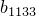、、、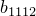、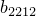、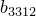、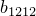、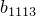、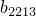、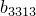、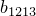、、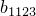、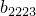、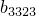、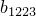、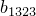、、（[FL2](../popups/usb-int-iconventions-unitsym.md)的单元）和（[F1L2](../popups/usb-int-iconventions-unitsym.md)的单元）。 ****Fung-正交各向异性**** 输入、、、、、、、、、（[FL2](../popups/usb-int-iconventions-unitsym.md)的单位）和（[FL2](../popups/usb-int-iconventions-unitsym.md)的单位）[F1L2](../popups/usb-int-iconventions-unitsym.md)）。 ****Holzapfel**** 输入（[FL2](../popups/usb-int-iconventions-unitsym.md)的单位）、（[F1L2](../popups/usb-int-iconventions-unitsym.md)的单位）、（[FL2](../popups/usb-int-iconventions-unitsym.md)的单位）、和光纤色散参数()。您可能需要展开该对话框才能查看数据表中的所有列。有关如何输入数据的详细信息，请参阅["Entering tabular data," Section 3.2.7](pt01ch03s02s07.md)。
10. 单击“**确定**”创建材质并关闭“**编辑材质**”对话框。或者，您可以从 **编辑材质** 对话框中的菜单中选择要定义的另一种材质行为（有关详细信息，请参阅["Browsing and modifying material behaviors," Section 12.7.2](pt03ch12s07hlb02.md)）。

#### 各向异性超弹性材料的局部方向

在 Abaqus/CAE 中，材料的局部方向矢量是正交的，并且与指定材料方向的轴对齐。最佳实践是在 Abaqus/CAE 中使用离散方向来分配方向。有关定义离散方向的信息，请参阅["Using discrete orientations for material orientations and composite layup orientations," Section 12.16](pt03ch12hla01.md)。

### 创建超泡沫材料模型

您可以创建超泡沫材料模型来描述多孔固体，其孔隙率允许非常大的体积变化。有关超泡沫材料的更多信息，请参阅["Hyperelastic behavior in elastomeric foams," Section 22.5.2 of the Abaqus Analysis User's Guide](../usb/usb-link.md#usb-mat-chyperfoam)。

#### 超泡沫材料定义概述

定义超泡沫材料时，您可以选择直接指定材料参数或允许 Abaqus 根据您提供的测试数据计算它们。有关详细说明，请参阅以下部分：
-["Entering material parameters to define a hyperelastic foam material](pt03ch12s09s01.md#usi-prp-mechanical-elastic-hyperfoam-direct)”
-["Providing test data to define a hyperelastic foam material model](pt03ch12s09s01.md#usi-prp-mechanical-elastic-hyperfoam-testdata)”

有关超泡沫材料的更多信息，请参阅["Hyperelastic behavior in elastomeric foams," Section 22.5.2 of the Abaqus Analysis User's Guide](../usb/usb-link.md#usb-mat-chyperfoam)。

#### 输入材料参数来定义超弹性泡沫材料

您可以直接提供超弹性泡沫应变能势参数作为温度的函数。

**直接指定超弹性泡沫材料参数：**

1. 从 **编辑材料** 对话框的菜单栏中，选择****机械****弹性****Hyperfoam****。 （有关显示 **编辑材质** 对话框的信息，请参阅["Creating or editing a material," Section 12.7.1](pt03ch12s07hlb01.md)。）
2. 单击 **应变能势阶** 字段右侧的箭头可增大或减小应变能势 N 的阶次。
3. 要指定取决于温度的材料参数，请打开**使用与温度相关的数据**。标有 **Temp** 的列出现在 **Data** 表中。
4. 如果要定义粘弹性材料的超泡沫行为，请单击 **模量时间尺度（针对粘弹性）** 字段右侧的箭头以指定​​长期或瞬时弹性响应。
5. 在 **数据** 表中，输入材料参数：：**mu*i*、alpha*i* 和 nu*i*** 材料参数、和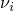。 **温度** 温度。您可能需要展开对话框才能查看 **Data** 表中的所有列。有关如何输入数据的详细信息，请参阅["Entering tabular data," Section 3.2.7](pt01ch03s02s07.md)。
6. 单击“**确定**”创建材质并关闭“**编辑材质**”对话框。或者，您可以从 **编辑材质** 对话框中的菜单中选择要定义的另一种材质行为（有关详细信息，请参阅["Browsing and modifying material behaviors," Section 12.7.2](pt03ch12s07hlb02.md)）。

#### 提供测试数据来定义超弹性泡沫材料模型

Abaqus 可以根据您在**测试数据编辑器**中输入的测试数据计算材料参数。

**通过提供测试数据来定义超弹性泡沫材料：**

1. 从 **编辑材料** 对话框的菜单栏中，选择****机械****弹性****Hyperfoam****。 （有关显示 **编辑材质** 对话框的信息，请参阅["Creating or editing a material," Section 12.7.1](pt03ch12s07hlb01.md)。）
2. 打开**使用测试数据（必须指定子选项）**。
3. 单击 **应变能势阶** 字段右侧的箭头可增大或减小应变能势 N 的阶次。
4. 指出您想要如何定义泊松效应： - 如果您想要输入在整个计算过程中保持恒定的泊松比，请打开**使用常量泊松比**。 - 如果您希望根据体积测试数据和/或其他测试数据中的横向应变定义泊松效应，请关闭**使用恒定泊松比**。
5. 如果要定义粘弹性材料的超泡沫行为，请单击 **模量时间尺度（针对粘弹性）** 字段右侧的箭头以指定​​长期或瞬时弹性响应。
6. 使用 **测试数据** 菜单指定 Abaqus 可以计算材料参数的实验数据。有关详细说明，请参阅以下部分： -["Specifying uniaxial test data for a hyperelastic foam material model](pt03ch12s09s01.md#usi-prp-mechanical-elastic-hyperfoam-uniaxial)" -["Specifying biaxial test data for a hyperelastic foam material model](pt03ch12s09s01.md#usi-prp-mechanical-elastic-hyperfoam-biaxial)" -["Specifying simple shear test data for a hyperelastic foam material model](pt03ch12s09s01.md#usi-prp-mechanical-elastic-hyperfoam-simpleshear)" -["Specifying planar test data for a hyperelastic foam material model](pt03ch12s09s01.md#usi-prp-mechanical-elastic-hyperfoam-planar)" -["Specifying volumetric test data for a hyperelastic foam material model](pt03ch12s09s01.md#usi-prp-mechanical-elastic-hyperfoam-volumetric)"
7. 单击“**确定**”创建材质并关闭“**编辑材质**”对话框。或者，您可以从 **编辑材质** 对话框中的菜单中选择要定义的另一种材质行为（有关详细信息，请参阅["Browsing and modifying material behaviors," Section 12.7.2](pt03ch12s07hlb02.md)）。

#### 指定超弹性泡沫材料模型的单轴测试数据

使用 **测试数据编辑器** 指定 Abaqus 可以校准超弹性泡沫材料系数的单轴测试数据。有关详细信息，请参阅["Hyperelastic behavior in elastomeric foams," Section 22.5.2 of the Abaqus Analysis User's Guide](../usb/usb-link.md#usb-mat-chyperfoam)。

**指定单轴测试数据：**

1. 创建超弹性泡沫材料模型，如["Providing test data to define a hyperelastic foam material model](pt03ch12s09s01.md#usi-prp-mechanical-elastic-hyperfoam-testdata)中所述。”
2. 从“编辑材料”对话框的“子选项”菜单中，选择“单轴测试数据”。出现 **测试数据编辑器**。
3. 在**数据**表中，输入单轴测试数据：**标称应力** 标称应力，。 **标称应变** 标称应变，。 **横向标称应变** 标称横向应变，。如果您已在 **编辑材质** 对话框中输入常量泊松比，则无需此参数。您可能需要展开对话框才能查看 **Data** 表中的所有列。有关如何输入数据的详细信息，请参阅["Entering tabular data," Section 3.2.7](pt01ch03s02s07.md)。
4. 单击**确定**返回**编辑材质**对话框。

#### 指定超弹性泡沫材料模型的双轴测试数据

使用 **测试数据编辑器** 指定 Abaqus 可以校准超泡沫材料系数的双轴测试数据。有关详细信息，请参阅["Hyperelastic behavior in elastomeric foams," Section 22.5.2 of the Abaqus Analysis User's Guide](../usb/usb-link.md#usb-mat-chyperfoam)。

**指定双轴测试数据：**

1. 创建超弹性泡沫材料模型，如["Providing test data to define a hyperelastic foam material model](pt03ch12s09s01.md#usi-prp-mechanical-elastic-hyperfoam-testdata)中所述。”
2. 从“编辑材料”对话框的“子选项”菜单中，选择“双轴测试数据”。出现 **测试数据编辑器**。
3. 在**数据**表中，输入测试数据：**标称应力** 标称应力，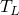。 **标称应变** 标称应变，。 **横向标称应变** 标称横向应变，。如果您已在 **编辑材质** 对话框中输入常量泊松比，则无需此参数。您可能需要展开对话框才能查看 **Data** 表中的所有列。有关如何输入数据的详细信息，请参阅["Entering tabular data," Section 3.2.7](pt01ch03s02s07.md)。
4. 单击**确定**返回**编辑材质**对话框。

#### 指定超弹性泡沫材料模型的简单剪切测试数据

使用 **测试数据编辑器** 指定简单的剪切测试数据，Abaqus 可以根据这些数据校准超泡沫材料系数。有关详细信息，请参阅["Hyperelastic behavior in elastomeric foams," Section 22.5.2 of the Abaqus Analysis User's Guide](../usb/usb-link.md#usb-mat-chyperfoam)。

**指定简单剪切测试数据：**

1. 创建超弹性泡沫材料模型，如["Providing test data to define a hyperelastic foam material model](pt03ch12s09s01.md#usi-prp-mechanical-elastic-hyperfoam-testdata)中所述。”
2. 从“编辑材料”对话框的“子选项”菜单中，选择“简单剪切测试数据”。出现 **测试数据编辑器**。
3. 在**数据**表中，输入测试数据：**标称应力** 标称剪切应力，。 **标称应变** 标称剪切应变，。 **标称横向应力** 标称横向应力，（垂直于具有剪切应力的边缘）。该压力值是可选的，但强烈建议使用。如果给出，将获得更准确的材料响应。您可能需要展开对话框才能查看 **Data** 表中的所有列。有关如何输入数据的详细信息，请参阅["Entering tabular data," Section 3.2.7](pt01ch03s02s07.md)。
4. 单击**确定**返回**编辑材质**对话框。

#### 指定超弹性泡沫材料模型的平面测试数据

使用 **测试数据编辑器** 指定 Abaqus 可以校准超泡沫材料系数的平面测试数据。仅平面测试数据是不够的；您还必须在材料定义中包含单轴和/或双轴测试数据。请参阅以下部分了解更多信息：
-["Hyperelastic behavior in elastomeric foams," Section 22.5.2 of the Abaqus Analysis User's Guide](../usb/usb-link.md#usb-mat-chyperfoam)-["Specifying uniaxial test data for a hyperelastic foam material model](pt03ch12s09s01.md#usi-prp-mechanical-elastic-hyperfoam-uniaxial)”
-["Specifying biaxial test data for a hyperelastic foam material model](pt03ch12s09s01.md#usi-prp-mechanical-elastic-hyperfoam-biaxial)”

**指定平面测试数据：**

1. 创建超弹性泡沫材料模型，如["Providing test data to define a hyperelastic foam material model](pt03ch12s09s01.md#usi-prp-mechanical-elastic-hyperfoam-testdata)中所述。”
2. 从“编辑材料”对话框的“子选项”菜单中，选择“平面测试数据”。出现 **测试数据编辑器**。
3. 在**数据**表中，输入测试数据：**标称应力** 标称应力，。 **标称应变** 载荷方向的标称应变，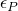。 **标称横向应变** 标称横向应变，。如果您已在 **编辑材质** 对话框中输入常量泊松比，则无需此参数。您可能需要展开对话框才能查看 **Data** 表中的所有列。有关如何输入数据的详细信息，请参阅["Entering tabular data," Section 3.2.7](pt01ch03s02s07.md)。
4. 单击**确定**返回**编辑材质**对话框。

#### 指定超弹性泡沫材料模型的体积测试数据

使用 **测试数据编辑器** 指定 Abaqus 可以校准超泡沫材料系数的体积测试数据。有关详细信息，请参阅["Hyperelastic behavior of rubberlike materials," Section 22.5.1 of the Abaqus Analysis User's Guide](../usb/usb-link.md#usb-mat-chyperelastic)。

**指定体积测试数据：**

1. 创建超弹性泡沫材料模型，如["Providing test data to define a hyperelastic foam material model](pt03ch12s09s01.md#usi-prp-mechanical-elastic-hyperfoam-testdata)中所述。”
2. 从“编辑材料”对话框的“测试数据”菜单中，选择“体积测试数据”。出现 **测试数据编辑器**。
3. 在**数据**表中，输入测试数据：**压力** 压力，*p*。 **体积比** 体积比（当前体积/原始体积），*J*。您可能需要展开对话框才能查看 **Data** 表中的所有列。有关如何输入数据的详细信息，请参阅["Entering tabular data," Section 3.2.7](pt01ch03s02s07.md)。
4. 单击**确定**返回**编辑材质**对话框。

### 创建低密度泡沫材料模型

您可以创建材料模型来描述具有显着速率敏感行为的低密度、高可压缩弹性泡沫（例如聚氨酯泡沫）。 Abaqus 根据您在**测试数据编辑器**中输入的测试数据计算材料参数。您必须提供拉伸和压缩的单轴测试数据。您的测试数据必须指定不同应变率值的单轴应力-应变曲线。

有关如何指定低密度泡沫材料属性的详细信息，请参阅["Specifying low-density foam material properties](pt03ch12s09s01.md#usi-prp-mechanical-elastic-lowdensfoam-props)”。

#### 指定低密度泡沫材料属性

在 **编辑材质** 对话框中输入属性，如下所述。有关低密度泡沫材料的更多信息，请参阅["Low-density foams," Section 22.9.1 of the Abaqus Analysis User's Guide](../usb/usb-link.md#usb-mat-clowdensfoam)。

**指定低密度泡沫材料属性：**

1. 从**编辑材料**对话框的菜单栏中，选择****机械****弹性****低密度泡沫****。 （有关显示 **编辑材质** 对话框的信息，请参阅["Creating or editing a material," Section 12.7.1](pt03ch12s07hlb01.md)。）
2. 选择**应变率测量**。 - 选择 **体积**（默认）以使用在体积保持变形模式（例如简单剪切）下不会产生速率敏感行为的标称体积应变率。 - 选择 **Principal** 以使 Abaqus 使用沿每个主方向评估的应变率。有关详细信息，请参阅["Strain rate" in "Low-density foams," Section 22.9.1 of the Abaqus Analysis User's Guide](../usb/usb-link.md#usb-mat-clowdensfoam-strainrate)。
3. 打开**外推应力-应变曲线超出最大应变率**以激活基于斜率（相对于应变率）的应变率外推。有关详细信息，请参阅["Extrapolation of stress-strain curves" in "Low-density foams," Section 22.9.1 of the Abaqus Analysis User's Guide](../usb/usb-link.md#usb-mat-clowdensfoam-extrapolation)。
4. 切换**最大允许主拉伸应力**，输入泡沫材料可以承受的截止值。 Abaqus 计算的最大主拉应力将被迫保持在该值或以下。有关详细信息，请参阅["Tension cutoff and failure" in "Low-density foams," Section 22.9.1 of the Abaqus Analysis User's Guide](../usb/usb-link.md#usb-mat-clowdensfoam-tensioncutoff)。
5. 如果您指定了 **最大允许主拉应力** 的值，请打开 **删除超过最大值的单元** 以使 Abaqus 删除达到最大主拉应力的任何单元。这是一种简单的破裂建模方法。
6. 您可以接受 **松弛系数** 的默认值，或输入 **mu0**、**mu1** 和 **alpha** 的新值。有关这些材料参数的详细说明，请参阅["Relaxation coefficients" in "Low-density foams," Section 22.9.1 of the Abaqus Analysis User's Guide](../usb/usb-link.md#usb-mat-clowdensfoam-relax)。
7. 要定义材料的单轴测试数据，请单击**单轴测试数据**。有关详细信息，请参阅以下部分： -["Specifying uniaxial tension test data for a low-density foam material model](pt03ch12s09s01.md#usi-prp-mechanical-elastic-lowdensfoam-ttestdata)" -["Specifying uniaxial compression test data for a low-density foam material model](pt03ch12s09s01.md#usi-prp-mechanical-elastic-lowdensfoam-ctestdata)"
8. 单击“**确定**”创建材质并关闭“**编辑材质**”对话框。或者，您可以从 **编辑材质** 对话框中的菜单中选择要定义的另一种材质行为（有关详细信息，请参阅["Browsing and modifying material behaviors," Section 12.7.2](pt03ch12s07hlb02.md)）。

#### 指定低密度泡沫材料模型的单轴拉伸测试数据

使用**测试数据编辑器**指定张力的单轴测试数据。

**指定单轴拉伸测试数据：**

1. 按照["Specifying low-density foam material properties](pt03ch12s09s01.md#usi-prp-mechanical-elastic-lowdensfoam-props)中的描述创建低密度泡沫材料模型。”
2. 从“编辑材料”对话框的“单轴测试数据”菜单中，选择“单轴拉伸测试数据”。出现 **测试数据编辑器**。
3. 要指定依赖于温度的测试数据，请打开**使用依赖于温度的数据**。标有 **Temp** 的列出现在 **Data** 表中。
4. 要指定依赖于字段变量的测试数据，请单击**字段变量数量**字段右侧的箭头以增加或减少字段变量的数量。 **字段**变量列出现在**数据**表中。
5. 在**数据**表中，输入测试数据：**标称应力** 标称应力，。 **标称应变** 标称应变，。 **标称应变率** 标称应变率，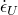。 （提供正值来指定加载响应，提供负值来指定卸载。） **Temp** 温度，。 **字段 *n*** 预定义的字段变量。您可能需要展开对话框才能查看 **Data** 表中的所有列。有关如何输入数据的详细信息，请参阅["Entering tabular data," Section 3.2.7](pt01ch03s02s07.md)。
6. 单击“**确定**”返回“**编辑材质**”对话框。

#### 指定低密度泡沫材料模型的单轴压缩测试数据

使用**测试数据编辑器**指定用于压缩的单轴测试数据。

**指定单轴压缩测试数据：**

1. 按照["Specifying low-density foam material properties](pt03ch12s09s01.md#usi-prp-mechanical-elastic-lowdensfoam-props)中的描述创建低密度泡沫材料模型。”
2. 从“编辑材料”对话框的“单轴测试数据”菜单中，选择“单轴压缩测试数据”。出现 **测试数据编辑器**。
3. 要指定依赖于温度的测试数据，请打开**使用依赖于温度的数据**。标有 **Temp** 的列出现在 **Data** 表中。
4. 要指定依赖于字段变量的测试数据，请单击**字段变量数量**字段右侧的箭头以增加或减少字段变量的数量。 **字段**变量列出现在**数据**表中。
5. 在**数据**表中，输入测试数据： **标称应力** 输入标称应力的绝对值。 **标称应变** 输入标称应变的绝对值。 **标称应变率** 标称应变率，。 （提供正值来指定加载响应，提供负值来指定卸载。） **Temp** 温度，。 **字段 *n*** 预定义的字段变量。您可能需要展开对话框才能查看 **Data** 表中的所有列。有关如何输入数据的详细信息，请参阅["Entering tabular data," Section 3.2.7](pt01ch03s02s07.md)。
6. 单击“**确定**”返回“**编辑材质**”对话框。

### 创建亚弹性材料模型

您可以创建亚弹性材料定义来描述非线性、小应变弹性材料。您可以选择直接在材料编辑器中输入亚弹性材料参数或在用户子程序[`UHYPEL`](../sub/sub-link.md#sub-xsl-uhypel)中定义材料参数。用户子程序[`UHYPEL`](../sub/sub-link.md#sub-xsl-uhypel)允许您指定与温度相关的数据。

有关更多信息，请参阅以下部分：
-["Hypoelastic behavior," Section 22.4.1 of the Abaqus Analysis User's Guide](../usb/usb-link.md#usb-mat-chypoelastic)-["UHYPEL," Section 1.1.37 of the Abaqus User Subroutines Reference Guide](../sub/sub-link.md#sub-rtn-uuhypel)

**创建亚弹性材料：**

1. 从 **编辑材料** 对话框的菜单栏中，选择****机械****弹性****次弹性****。 （有关显示 **编辑材质** 对话框的信息，请参阅["Creating or editing a material," Section 12.7.1](pt03ch12s07hlb01.md)。）
2. 选择以下选项之一来指定材料参数： - 开启**使用用户子例程 UHYPEL**。 - 在**数据**区域中输入材料参数：**杨氏模量** 瞬时杨氏模量，*E*。 **泊松比** 瞬时泊松比，。 **I1** 第一个应变不变量，。 **I2** 第二个应变不变量，。 **I3** 第三株不变量，。您可能需要展开对话框才能查看 **Data** 表中的所有列。有关如何输入数据的详细信息，请参阅["Entering tabular data," Section 3.2.7](pt01ch03s02s07.md)。
3. 单击“**确定**”创建材质并关闭“**编辑材质**”对话框。或者，您可以从 **编辑材质** 对话框中的菜单中选择要定义的另一种材质行为（有关详细信息，请参阅["Browsing and modifying material behaviors," Section 12.7.2](pt03ch12s07hlb02.md)）。

### 创建多孔弹性材料模型

多孔弹性材料模型定义多孔材料的弹性参数。有关详细信息，请参阅["Elastic behavior of porous materials," Section 22.3.1 of the Abaqus Analysis User's Guide](../usb/usb-link.md#usb-mat-celasticporous)。

**定义多孔弹性材料：**

1. 从**编辑材料**对话框的菜单栏中，选择****机械****弹性****多孔弹性****。 （有关显示 **编辑材质** 对话框的信息，请参阅["Creating or editing a material," Section 12.7.1](pt03ch12s07hlb01.md)。）
2. 单击 **剪切** 字段右侧的箭头，然后选择用于定义多孔材料中偏弹性行为的选项： - 选择 **G** 以指定恒定剪切模量。在这种情况下，剪切行为不受材料压实的影响。 **剪切模量**列出现在**数据**表中。 - 选择 **Poisson** 以允许 Abaqus 根据体积模量和泊松比计算瞬时剪切模量。在这种情况下，弹性剪切刚度随着材料被压实而增加。 **泊松比**列出现在**数据**表中。
3. 要定义依赖于温度的行为数据，请打开**使用依赖于温度的数据**。标有 **Temp** 的列出现在 **Data** 表中。
4. 要定义依赖于字段变量的行为数据，请单击 **字段变量数量** 字段右侧的箭头以增加或减少字段变量的数量。 **字段**变量列出现在**数据**表中。
5. 在**数据**表中，输入材料参数：**对数体积模量** 对数体积模量，。 （无量纲。）**G** 剪切模量，*G*。如果您从 **剪切** 选项列表中选择 **G**，请输入此值。 **泊松比** 泊松比，。如果您从 **剪切** 选项列表中选择 **泊松**，请输入此值。 **拉伸极限** 弹性拉伸极限，。 （该值不能为负数。） **温度** 温度，。 **字段 *n*** 预定义的字段变量。您可能需要展开对话框才能查看 **Data** 表中的所有列。有关如何输入数据的详细信息，请参阅["Entering tabular data," Section 3.2.7](pt01ch03s02s07.md)。
6. 单击“**确定**”创建材质并关闭“**编辑材质**”对话框。或者，您可以从 **编辑材质** 对话框中的菜单中选择要定义的另一种材质行为（有关详细信息，请参阅["Browsing and modifying material behaviors," Section 12.7.2](pt03ch12s07hlb02.md)）。

### 创建粘弹性材料模型

您可以将材料中的粘弹性行为定义为频率的函数（对于稳态、小振动分析）或减少的时间的函数（对于瞬态分析）。有关更多信息，请参阅以下部分：
-["Time domain viscoelasticity," Section 22.7.1 of the Abaqus Analysis User's Guide](../usb/usb-link.md#usb-mat-ctimevisco)-["Frequency domain viscoelasticity," Section 22.7.2 of the Abaqus Analysis User's Guide](../usb/usb-link.md#usb-mat-cfreqvisco)

#### 粘弹性材料定义概述

有关在 **编辑材料** 对话框中定义粘弹性的详细说明，请参阅以下部分：
-["Defining time domain viscoelasticity](pt03ch12s09s01.md#usi-prp-mechanical-elastic-viscoelastic-time)”
-["Defining frequency domain viscoelasticity](pt03ch12s09s01.md#usi-prp-mechanical-elastic-viscoelastic-frequency)”

有关粘弹性的更多信息，请参阅["Time domain viscoelasticity," Section 22.7.1 of the Abaqus Analysis User's Guide](../usb/usb-link.md#usb-mat-ctimevisco)和["Defining frequency domain viscoelasticity](pt03ch12s09s01.md#usi-prp-mechanical-elastic-viscoelastic-frequency)。

#### 定义时域粘弹性

这种类型的材料模型描述了材料的各向同性速率相关行为，必须在时域中对由内部阻尼效应引起的耗散损耗进行建模。

Abaqus 假设时域粘弹性由 Prony 级数展开定义。您可以直接为 Prony 级数中的每一项指定 Prony 级数参数。或者，Abaqus 可以使用您提供的与时间相关的蠕变测试数据、与时间相关的松弛测试数据或与频率相关的循环测试数据来计算 Prony 级数中的项。

有关时域粘弹性的更多信息，请参阅["Time domain viscoelasticity," Section 22.7.1 of the Abaqus Analysis User's Guide](../usb/usb-link.md#usb-mat-ctimevisco)。

**定义时域粘弹性：**

1. 从 **编辑材质** 对话框的菜单栏中，选择****机械****弹性****粘弹性****。 （有关显示 **编辑材质** 对话框的信息，请参阅["Creating or editing a material," Section 12.7.1](pt03ch12s07hlb01.md)。）
2. 单击**域**字段右侧的箭头，然后选择**时间**。
3. 单击 **Time** 字段右侧的箭头，然后选择用于确定粘弹性材料参数的选项： - 如果要直接输入每项的 Prony 级数参数，请选择 **Prony**。 - 如果您希望 Abaqus 根据您提供的蠕变测试数据计算 Prony 系列中的参数，请选择 **蠕变测试数据**。如果选择此选项，则必须在**测试数据编辑器**中输入剪切测试数据和/或体积测试数据。 - 如果您希望 Abaqus 从松弛测试数据计算 Prony 级数参数，请选择 **松弛测试数据**。如果选择此选项，则必须在**测试数据编辑器**中输入剪切测试数据和/或体积测试数据。 - 如果您希望 Abaqus 从频率相关的循环测试数据计算 Prony 级数参数，请选择 **频率数据**。
4. 如果您从 **Time** 选项列表中选择了任何测试数据选项，则可以指定与 Prony 系列参数校准相关的两个附加参数： - 单击 **Prony 系列中的最大项数** 字段右侧的箭头以指定​​ Prony 系列中的最大项数 (*N*)。 Abaqus 将执行从到NMAX 的最小二乘拟合，直到针对误差容限达到最低 *N* 的收敛。 - 在**允许的平均均方根误差**字段中，输入最小二乘拟合中数据点的误差容限。
5. 如果您从 **Time** 选项列表中选择了 **Prony**，请在 **Data** 表中输入 Prony 参数。 **g_i Prony** 剪切松弛或剪切牵引松弛模量比，。 **k_i Prony** 整体松弛或正常牵引松弛模量比，。 **tau_i Prony** 松弛时间，。您可能需要展开对话框才能查看 **Data** 表中的所有列。有关如何输入数据的详细信息，请参阅["Entering tabular data," Section 3.2.7](pt01ch03s02s07.md)。
6. 如果您从 **时间** 选项列表中选择了 **频率数据**，请在 **数据** 表中输入频率相关测试数据。 **欧米茄 g* 实数**的实数部分。 **Omega g* imag**的虚部。 **欧米茄 k* 实数**的实数部分。 **Omega k* imag**的虚部。 **频率** 频率，*f*，以每次周期为单位。您可能需要展开对话框才能查看 **Data** 表中的所有列。有关如何输入数据的详细信息，请参阅["Entering tabular data," Section 3.2.7](pt01ch03s02s07.md)。
7. 如果适用，请单击“**测试数据**”以指定用于定义粘弹性行为的测试数据。有关详细信息，请参阅以下部分： -["Specifying shear test data](pt03ch12s09s01.md#usi-prp-mechanical-elastic-viscoelastic-shear)" -["Specifying volumetric test data](pt03ch12s09s01.md#usi-prp-mechanical-elastic-viscoelastic-volumetric)" -["Specifying combined test data](pt03ch12s09s01.md#usi-prp-mechanical-elastic-viscoelastic-combined)"
8. 要指定简单热流变 (TRS) 温度效应，请使用 **子选项** 菜单。详情请参见["Specifying thermo-rheologically simple (TRS) temperature dependence for time domain viscoelasticity](pt03ch12s09s01.md#usi-prp-mechanical-elastic-viscoelastic-trs)。”
9. 单击“**确定**”创建材质并关闭“**编辑材质**”对话框。或者，您可以从 **编辑材质** 对话框中的菜单中选择要定义的另一种材质行为（有关详细信息，请参阅["Browsing and modifying material behaviors," Section 12.7.2](pt03ch12s07hlb02.md)）。

#### 指定时域粘弹性的热流变简单 (TRS) 温度依赖性

您可以通过输入 Williams-Landel-Ferry 近似的参数或使用用户子例程[`UTRS`](../sub/sub-link.md#sub-xsl-utrs)来定义平移函数。有关时域粘弹性中温度影响的更多信息，请参阅["Time domain viscoelasticity," Section 22.7.1 of the Abaqus Analysis User's Guide](../usb/usb-link.md#usb-mat-ctimevisco)。

**定义移位函数：**

1. 创建时域粘弹性材料，如["Defining time domain viscoelasticity](pt03ch12s09s01.md#usi-prp-mechanical-elastic-viscoelastic-time)中所述。”
2. 从“编辑材质”对话框的“子选项”菜单中，选择“Trs”。 **子选项编辑器**出现。
3. 单击 **Shift function** 字段右侧的箭头，然后选择所需的选项。 - 选择 **WLF** 以使用 Williams-Landel-Ferry 近似定义平移函数。 - 选择**用户子程序 UTRS** 以使用用户子程序[`UTRS`](../sub/sub-link.md#sub-xsl-utrs)定义移位功能。
4. 如果您从 **Shift** 功能选项列表中选择 **WLF**，请在 **数据** 表中输入所需数据： **Theta 0** 参考温度，。 **C1** 校准常数，。 **C2** 校准常数，。您可能需要展开对话框才能查看 **Data** 表中的所有列。有关如何输入数据的详细信息，请参阅["Entering tabular data," Section 3.2.7](pt01ch03s02s07.md)。
5. 单击**确定**返回**编辑材质**对话框。

#### 定义频域粘弹性

这种类型的材料模型描述了小稳态谐波振荡中与频率相关的材料行为。在这些情况下，必须在频域中对内部阻尼效应引起的耗散损耗进行建模。

通过将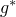和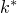（对于可压缩材料）的实部和虚部作为频率的函数来定义材料行为的耗散部分。模量可以通过以下三种方式之一定义为频率的函数：通过幂律、通过表格输入或通过剪切和体积松弛模量的 Prony 级数表达式。

有关频域粘弹性的更多信息，请参阅["Frequency domain viscoelasticity," Section 22.7.2 of the Abaqus Analysis User's Guide](../usb/usb-link.md#usb-mat-cfreqvisco)。

**定义频域粘弹性：**

1. 从 **编辑材质** 对话框的菜单栏中，选择****机械****弹性****粘弹性****。 （有关显示 **编辑材质** 对话框的信息，请参阅["Creating or editing a material," Section 12.7.1](pt03ch12s07hlb01.md)。）
2. 单击 **Domain** 字段右侧的箭头，然后选择 **Frequency**。
3. 单击 **频率** 字段右侧的箭头，然后选择用于确定粘弹性材料参数的选项： - 选择 **公式** 以通过幂律公式定义频率依赖性。 - 选择 **表格** 以表格形式定义频率响应。您必须提供和的实部和虚部（其中是圆频率）作为频率（以周期/时间为单位）的函数。 - 如果您希望 Abaqus 根据无量纲剪切和体积松弛模量的时域 Prony 级数描述来计算频率依赖性，请选择 **Prony**。 - 如果您希望 Abaqus 根据您提供的蠕变测试数据计算 Prony 系列中的参数，请选择 **蠕变测试数据**。如果选择此选项，则必须在**测试数据编辑器**中输入剪切测试数据和/或体积测试数据。 - 如果您希望 Abaqus 从松弛测试数据计算 Prony 级数参数，请选择 **松弛测试数据**。如果选择此选项，则必须在**测试数据编辑器**中输入剪切测试数据和/或体积测试数据。
4. 如果您从“频率”选项列表中选择了“蠕变测试数据”或“松弛测试数据”，则可以指定与 Prony 系列参数校准相关的两个附加参数： - 单击“Prony 系列中的最大项数”字段右侧的箭头，指定 Prony 系列中的最大项数 (*N*)。 Abaqus 将执行从到NMAX 的最小二乘拟合，直到针对误差容限达到最低 *N* 的收敛。 - 在**允许的平均均方根误差**字段中，输入最小二乘拟合中数据点的误差容限。
5. 如果从“频率”选项列表中选择“表格”，则可以指定两个附加选项： **类型** 此参数指定您是定义连续体材料属性还是有效厚度方向垫片属性。如果要定义连续材料属性，请选择 **各向同性**。当粘弹性材料模型用于任何连续体、结构或特殊用途元素（其材料响应是使用连续体材料属性进行建模）时，此选择是合适的。如果您要定义有效的厚度方向垫片属性，请选择 **牵引力**。仅对于其行为直接使用垫片行为模型进行建模的垫片单元支持此选项。 **预载** 此参数指定用于定义频域粘弹性材料属性或有效厚度方向垫片属性的预载性质。选择 **单轴** 以指定材料属性对应于单轴测试。选择 **体积** 以指定材料属性对应于体积测试。此设置不能用于定义有效的厚度方向垫片属性。选择 **单轴和体积** 以指定材料属性对应于这两种类型的测试。此设置不能用于定义有效的厚度方向垫片属性。如果您选择不指定预加载参数，请选择**无**。
6. 如果您从 **频率** 选项列表中选择了 **公式**，请在 **数据** 表中输入以下数据： **g1*real**的实部。 **g1*imag**的虚部。 **a** *a* 的值。 **k1*real**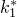的实部。 **k1*imag**的虚部。如果材料不可压缩，则忽略该值。 **b** *b* 的值。如果材料不可压缩，则忽略该值。您可能需要展开对话框才能查看 **Data** 表中的所有列。有关如何输入数据的详细信息，请参阅["Entering tabular data," Section 3.2.7](pt01ch03s02s07.md)。
7. 如果您从 **Frequency** 选项列表中选择了 **Tabular**，请输入与您的 **Type** 和 **Preload** 选择相关的数据（并非所有以下参数都适用）： **Omega g* real**的实部。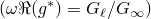**Omega g* imag**的虚部。**欧米茄 k* 实数**的实数部分。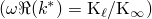如果材料不可压缩，则忽略该值。 **Omega k* imag**的虚部。如果材料不可压缩，则忽略该值。 **频率** 频率，*f*，以每次周期为单位。 **损耗模量** 单轴或体积损耗模量。 **储能模量** 单轴或体储能模量。 **单轴应变** 单轴标称应变（定义单轴预载水平）。 **体积比** 体积比，*J*（当前体积/原始体积；定义体积预载水平）。 **归一化损耗模量**的实部。适用于无预紧情况下的厚度方向垫片性能。 **归一化剪切模量**的虚部。适用于无预紧情况下的厚度方向垫片性能。您可能需要展开对话框才能看到所有列。有关如何输入数据的详细信息，请参阅["Entering tabular data," Section 3.2.7](pt01ch03s02s07.md)。
8. 如果您从 **频率** 选项列表中选择 **Prony**，请在 **数据** 表中输入以下数据： **g_i Prony**，剪切松弛模量的 Prony 级数展开式中第一项的模量比。 **k_i Prony**，体积松弛模量的 Prony 级数展开式中第一项的模量比。 **tau_i Prony**，Prony 级数展开中第一项的弛豫时间。您可能需要展开对话框才能查看 **Data** 表中的所有列。有关如何输入数据的详细信息，请参阅["Entering tabular data," Section 3.2.7](pt01ch03s02s07.md)。
9. 如果适用，请使用 **测试数据** 菜单指定用于定义粘弹性行为的测试数据。有关详细信息，请参阅以下部分： -["Specifying shear test data](pt03ch12s09s01.md#usi-prp-mechanical-elastic-viscoelastic-shear)" -["Specifying volumetric test data](pt03ch12s09s01.md#usi-prp-mechanical-elastic-viscoelastic-volumetric)" -["Specifying combined test data](pt03ch12s09s01.md#usi-prp-mechanical-elastic-viscoelastic-combined)"
10. 单击“**确定**”创建材质并关闭“**编辑材质**”对话框。或者，您可以从 **编辑材质** 对话框中的菜单中选择要定义的另一种材质行为（有关详细信息，请参阅["Browsing and modifying material behaviors," Section 12.7.2](pt03ch12s07hlb02.md)）。

#### 指定剪切测试数据

您可以使用**测试数据编辑器**指定归一化剪切蠕变柔度或松弛模量作为时间的函数。有关使用剪切测试数据定义粘弹性材料行为的信息，请参阅["Time domain viscoelasticity," Section 22.7.1 of the Abaqus Analysis User's Guide](../usb/usb-link.md#usb-mat-ctimevisco)或["Frequency domain viscoelasticity," Section 22.7.2 of the Abaqus Analysis User's Guide](../usb/usb-link.md#usb-mat-cfreqvisco)。

**指定剪切测试数据：**

1. 按照["Defining time domain viscoelasticity](pt03ch12s09s01.md#usi-prp-mechanical-elastic-viscoelastic-time)" 或["Defining frequency domain viscoelasticity](pt03ch12s09s01.md#usi-prp-mechanical-elastic-viscoelastic-frequency)" 中所述创建粘弹性材料模型。
2. 从“编辑材料”对话框的“测试数据”菜单中，选择“剪切测试数据”。出现 **测试数据编辑器**。
3. 在**长期归一化剪切柔量或模量**字段中，输入蠕变测试数据的长期归一化剪切柔量或松弛测试数据的长期归一化剪切模量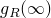。
4. 在 **数据** 表中，输入以下数据： **js 或 gR** 用于蠕变测试数据的归一化剪切柔量() 或用于松弛测试数据的归一化剪切松弛模量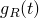(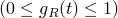)。 **时间**时间，*t*。有关如何输入数据的详细信息，请参阅["Entering tabular data," Section 3.2.7](pt01ch03s02s07.md)。
5. 单击**确定**返回**编辑材质**对话框。

#### 指定体积测试数据

您可以使用**测试数据编辑器**指定归一化整体蠕变柔量或松弛模量作为时间的函数。有关使用体积测试数据定义粘弹性材料行为的信息，请参阅["Time domain viscoelasticity," Section 22.7.1 of the Abaqus Analysis User's Guide](../usb/usb-link.md#usb-mat-ctimevisco)或["Frequency domain viscoelasticity," Section 22.7.2 of the Abaqus Analysis User's Guide](../usb/usb-link.md#usb-mat-cfreqvisco)。

**指定体积测试数据：**

1. 按照["Defining time domain viscoelasticity](pt03ch12s09s01.md#usi-prp-mechanical-elastic-viscoelastic-time)" 或["Defining frequency domain viscoelasticity](pt03ch12s09s01.md#usi-prp-mechanical-elastic-viscoelastic-frequency)" 中所述创建粘弹性材料模型。
2. 从“编辑材料”对话框的“测试数据”菜单中，选择“体积测试数据”。出现 **测试数据编辑器**。
3. 在**长期标准化体积柔量或模量**字段中，输入蠕变测试数据的长期标准化体积柔量或松弛测试数据的长期标准化体积模量。
4. 在 **数据** 表中，输入以下数据： **jK 或 kR** 用于蠕变测试数据的归一化体积柔量或用于松弛测试数据的归一化体积模量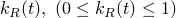。 **时间**时间，*t*。有关如何输入数据的详细信息，请参阅["Entering tabular data," Section 3.2.7](pt01ch03s02s07.md)。
5. 单击**确定**返回**编辑材质**对话框。

#### 指定组合测试数据

您可以使用**测试数据编辑器**同时指定归一化剪切和体积蠕变柔量或松弛模量作为时间的函数。有关使用组合测试数据定义粘弹性材料行为的信息，请参阅["Time domain viscoelasticity," Section 22.7.1 of the Abaqus Analysis User's Guide](../usb/usb-link.md#usb-mat-ctimevisco)或["Frequency domain viscoelasticity," Section 22.7.2 of the Abaqus Analysis User's Guide](../usb/usb-link.md#usb-mat-cfreqvisco)。

**指定组合测试数据：**

1. 按照["Defining time domain viscoelasticity](pt03ch12s09s01.md#usi-prp-mechanical-elastic-viscoelastic-time)" 或["Defining frequency domain viscoelasticity](pt03ch12s09s01.md#usi-prp-mechanical-elastic-viscoelastic-frequency)" 中所述创建粘弹性材料模型。
2. 从“编辑材料”对话框的“测试数据”菜单中，选择“组合测试数据”。出现 **测试数据编辑器**。
3. 在**长期归一化剪切柔量或模量**字段中，输入蠕变测试数据的长期归一化剪切柔量或松弛测试数据的长期归一化剪切模量。
4. 在**长期标准化体积柔量或模量**字段中，输入蠕变测试数据的长期标准化体积柔量或松弛测试数据的长期标准化体积模量。
5. 在 **数据** 表中，输入以下数据： **js 或 gR** 用于蠕变测试数据的归一化剪切柔量() 或用于松弛测试数据的归一化剪切松弛模量()。 **jK 或 kR** 用于蠕变测试数据的归一化体积柔量或用于松弛测试数据的归一化体积模量。 **时间**时间，*t*。有关如何输入数据的详细信息，请参阅["Entering tabular data," Section 3.2.7](pt01ch03s02s07.md)。
6. 单击“**确定**”返回“**编辑材质**”对话框。

