# 12.9.2 定义塑性

您可以使用 **编辑材料** 对话框来创建塑料材料并指定其材料属性。您可以创建以下塑料材料模型：
- **经典金属塑性**；见["Defining classical metal plasticity](pt03ch12s09s02.md#usi-prp-mechanical-plastic-plastic)”
- **瓶盖塑性**；见["Defining cap plasticity](pt03ch12s09s02.md#usi-prp-mechanical-plastic-capplastic)”
- **铸铁塑性**；见["Defining cast iron plasticity](pt03ch12s09s02.md#usi-prp-mechanical-plastic-castiron)”
- **粘土塑性**；见["Defining clay plasticity](pt03ch12s09s02.md#usi-prp-mechanical-plastic-clay)”
- **混凝土塑性受损**；见["Defining concrete damaged plasticity](pt03ch12s09s02.md#usi-prp-mechanical-plastic-concretedamaged)”
- **混凝土涂抹裂缝**；参见["Defining concrete smeared cracking](pt03ch12s09s02.md#usi-prp-mechanical-plastic-concretesmeared)”
- **可压碎泡沫塑料**；见["Defining crushable foam plasticity](pt03ch12s09s02.md#usi-prp-mechanical-plastic-crushablefoam)”
- **德鲁克-普拉格塑性**；见["Defining Drucker-Prager plasticity](pt03ch12s09s02.md#usi-prp-mechanical-plastic-druckerprager)”
- **莫尔-库仑塑性**；见["Defining Mohr-Coulomb plasticity](pt03ch12s09s02.md#usi-prp-mechanical-plastic-mohrcoulomb)”
- **多孔金属塑性**；见["Defining porous metal plasticity](pt03ch12s09s02.md#usi-prp-mechanical-plastic-porousmetal)”
- **蠕变**；参见["Defining a creep law](pt03ch12s09s02.md#usi-prp-mechanical-plastic-creep)”
- **肿胀**；参见["Defining swelling](pt03ch12s09s02.md#usi-prp-mechanical-plastic-swelling)”
- **粘性**；参见["Defining the viscous component of a two-layer viscoplasticity model](pt03ch12s09s02.md#usi-prp-mechanical-plastic-viscous)”

有关详细信息，请参阅["Inelastic behavior," Section 23.1.1 of the Abaqus Analysis User's Guide](../usb/usb-link.md#usb-mat-cplastic)。

### 定义经典金属塑性

经典金属塑性模型允许您定义金属在相对较低温度下的屈服和非弹性流动，其中载荷相对单调，蠕变效应并不重要。有关详细信息，请参阅["Classical metal plasticity," Section 23.2.1 of the Abaqus Analysis User's Guide](../usb/usb-link.md#usb-mat-cmetalplastic)。

#### 经典金属塑性概述

当您使用 **编辑材料** 对话框定义材料的经典塑性行为时，必须选择以下选项之一来指定硬化行为：
- 选择 **各向同性** 来模拟硬化，其中屈服面在所有方向上均匀地改变尺寸，使得当发生塑性应变时，屈服应力在所有应力方向上增加（或减少）。详细说明请参见“["Using an isotropic hardening model to define classical metal plasticity](pt03ch12s09s02.md#usi-prp-mechanical-plastic-plastic-isotropic)”。
- 选择**运动学**来模拟具有恒定硬化率的材料的循环载荷。详细说明请参见“["Using a linear kinematic cyclic hardening model to define classical metal plasticity](pt03ch12s09s02.md#usi-prp-mechanical-plastic-plastic-kinematic)”。
- 选择 **Johnson-Cook** 在 Abaqus/Explicit 中模拟各向同性硬化，其中屈服应力作为等效塑性应变、应变率和温度的分析函数提供。详细说明请参见“["Using the Johnson-Cook hardening model to define classical metal plasticity](pt03ch12s09s02.md#usi-prp-mechanical-plastic-plastic-johnsoncook)”。
- 选择**用户**，通过用户子程序[`UHARD`](../sub/sub-link.md#sub-xsl-uhard)描述各向同性硬化的屈服应力。详细说明请参见“["Specifying user subroutine](pt03ch12s09s02.md#usi-prp-mechanical-plastic-plastic-user)[`UHARD`](../sub/sub-link.md#sub-xsl-uhard)定义经典金属塑性”。
- 选择“**组合**”以对具有非线性各向同性/运动硬化的材料的循环载荷进行建模。详细说明请参见“["Using a nonlinear isotropic/kinematic cyclic hardening model to define classical metal plasticity](pt03ch12s09s02.md#usi-prp-mechanical-plastic-plastic-combined)”。

有关选择 **强化** 选项的一般信息，请参阅["Hardening" in "Classical metal plasticity," Section 23.2.1 of the Abaqus Analysis User's Guide](../usb/usb-link.md#usb-mat-cmetalplastic-hardening)。

#### 使用各向同性硬化模型定义经典金属塑性

各向同性硬化模型对于涉及总塑性应变的情况或在整个分析过程中应变空间中每个点的应变基本上处于同一方向的情况非常有用。

**定义各向同性硬化模型：**

1. 从 **编辑材料** 对话框的菜单栏中，选择****机械****塑性****塑料****。 （有关显示 **编辑材质** 对话框的信息，请参阅["Creating or editing a material," Section 12.7.1](pt03ch12s07hlb01.md)。）
2. 单击**硬化**字段右侧的箭头，然后选择**各向同性**。
3. Toggle on **Use strain-rate-dependent data** if you want enter test data showing yield stress values versus equivalent plastic strain at different equivalent plastic strain rates. A **Rate** column appears in the **Data** table. Alternatively, if you want to define strain rate dependence using yield stress ratios, you must select **Rate Dependent** from the **Suboptions** menu.有关详细信息，请参阅“["Defining rate-dependent yield with yield stress ratios](pt03ch12s09s02.md#usi-prp-mechanical-plastic-plastic-rate)”。有关速率依赖性的背景信息，请参阅["Rate-dependent yield," Section 23.2.3 of the Abaqus Analysis User's Guide](../usb/usb-link.md#usb-mat-cratedependent)。
4. 启用**使用与温度相关的数据**来定义取决于温度的行为数据。标有 **Temp** 的列出现在 **Data** 表中。
5. To define behavior data that depend on field variables, click the arrows to the right of the **Number of field variables** field to increase or decrease the number of field variables.
6. 在**数据**表中输入以下数据： **屈服应力** 开始屈服的应力。 **塑性应变** 塑性应变。 **速率** 等效塑性应变率，应力-应变曲线适用于此。 **温度** 温度。 **字段 *n*** 预定义的字段变量。您可能需要展开对话框才能查看 **Data** 表中的所有列。有关如何输入数据的详细信息，请参阅["Entering tabular data," Section 3.2.7](pt01ch03s02s07.md)。
7. 如果需要，请使用 **子选项** 菜单输入其他数据。有关详细信息，请参阅以下部分： -["Defining rate-dependent yield with yield stress ratios](pt03ch12s09s02.md#usi-prp-mechanical-plastic-plastic-rate)" -["Specifying the annealing temperature of an elastic-plastic material](pt03ch12s09s02.md#usi-prp-mechanical-plastic-plastic-anneal)"
8. 单击“**确定**”创建材质并关闭“**编辑材质**”对话框。或者，您可以从 **编辑材质** 对话框中的菜单中选择要定义的另一种材质行为（有关详细信息，请参阅["Browsing and modifying material behaviors," Section 12.7.2](pt03ch12s07hlb02.md)）。

#### 使用线性运动循环硬化模型定义经典金属塑性

使用线性运动学模型定义恒定的循环硬化速率。有关详细信息，请参阅["Models for metals subjected to cyclic loading," Section 23.2.2 of the Abaqus Analysis User's Guide](../usb/usb-link.md#usb-mat-chardening)。

**定义线性运动硬化模型：**

1. 从 **编辑材料** 对话框的菜单栏中，选择****机械****塑性****塑料****。 （有关显示 **编辑材质** 对话框的信息，请参阅["Creating or editing a material," Section 12.7.1](pt03ch12s07hlb01.md)。）
2. 单击 **Hardening** 字段右侧的箭头，然后选择 **Kinematic**。
3. 启用**使用与温度相关的数据**来定义取决于温度的行为数据。标有 **Temp** 的列出现在 **Data** 表中。
4. 在**数据**表中输入以下数据： **屈服应力** 开始屈服的应力。 **塑性应变** 塑性应变。 **温度** 温度。您可能需要展开对话框才能查看 **Data** 表中的所有列。有关如何输入数据的详细信息，请参阅["Entering tabular data," Section 3.2.7](pt01ch03s02s07.md)。
5. 如果需要，请使用 **子选项** 菜单输入其他数据。有关详细信息，请参阅以下部分： -["Defining anisotropic yield and creep](pt03ch12s09s02.md#usi-prp-mechanical-plastic-plastic-potential)" -["Using the Oak Ridge National Laboratory (ORNL) constitutive model in plasticity and creep calculations](pt03ch12s09s02.md#usi-prp-mechanical-plastic-plastic-ornl)" -["Specifying cycled yield stress data for the ORNL model](pt03ch12s09s02.md#usi-prp-mechanical-plastic-plastic-cycledplastic)" -["Specifying the annealing temperature of an elastic-plastic material](pt03ch12s09s02.md#usi-prp-mechanical-plastic-plastic-anneal)"
6. 单击“**确定**”创建材质并关闭“**编辑材质**”对话框。或者，您可以从 **编辑材质** 对话框中的菜单中选择要定义的另一种材质行为（有关详细信息，请参阅["Browsing and modifying material behaviors," Section 12.7.2](pt03ch12s07hlb02.md)）。

#### 使用 Johnson-Cook 硬化模型定义经典金属塑性

Johnson-Cook 塑性模型特别适合模拟金属的高应变率变形。该模型是米塞斯塑性的一种特殊类型，包括硬化定律和速率依赖性的分析形式。一般用于绝热瞬态动力分析。有关详细信息，请参阅["Johnson-Cook plasticity," Section 23.2.7 of the Abaqus Analysis User's Guide](../usb/usb-link.md#usb-mat-cjohnsoncook)。

**定义 Johnson-Cook 硬化模型：**

1. 从 **编辑材料** 对话框的菜单栏中，选择****机械****塑性****塑料****。 （有关显示 **编辑材质** 对话框的信息，请参阅["Creating or editing a material," Section 12.7.1](pt03ch12s07hlb01.md)。）
2. 单击 **强化** 字段右侧的箭头，然后选择 **Johnson-Cook**。
3. 在 **数据** 表中输入以下数据： **A、B、n 和 m** 在转变温度或低于转变温度时测量的材料参数。 **熔化温度** 熔化温度，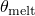，高于该温度材料会熔化并表现得像流体。 **转变温度** 转变温度，。在转变温度或低于转变温度时，屈服应力的表达不依赖于温度。您可能需要展开对话框才能查看 **Data** 表中的所有列。有关如何输入数据的详细信息，请参阅["Entering tabular data," Section 3.2.7](pt01ch03s02s07.md)。
4. 如果需要，请使用 **子选项** 菜单输入其他数据。有关详细信息，请参阅以下部分： -["Defining rate-dependent yield with yield stress ratios](pt03ch12s09s02.md#usi-prp-mechanical-plastic-plastic-rate)" -["Specifying the annealing temperature of an elastic-plastic material](pt03ch12s09s02.md#usi-prp-mechanical-plastic-plastic-anneal)"
5. 单击“**确定**”创建材质并关闭“**编辑材质**”对话框。或者，您可以从 **编辑材质** 对话框中的菜单中选择要定义的另一种材质行为（有关详细信息，请参阅["Browsing and modifying material behaviors," Section 12.7.2](pt03ch12s07hlb02.md)）。

#### 指定用户子程序[`UHARD`](../sub/sub-link.md#sub-xsl-uhard)来定义经典金属塑性

用户子程序[`UHARD`](../sub/sub-link.md#sub-xsl-uhard)允许您定义各向同性塑性或组合硬化模型的屈服面尺寸和硬化参数。

**使用用户子程序[`UHARD`](../sub/sub-link.md#sub-xsl-uhard)定义经典金属塑性：**

1. 从 **编辑材料** 对话框的菜单栏中，选择****机械****塑性****塑料****。 （有关显示 **编辑材质** 对话框的信息，请参阅["Creating or editing a material," Section 12.7.1](pt03ch12s07hlb01.md)。）
2. 单击“**强化**”字段右侧的箭头，然后选择“**用户**”。
3. 在 **数据** 表中，输入用户子程序[`UHARD`](../sub/sub-link.md#sub-xsl-uhard)中所需的 **硬化属性** 的数量。
4. 单击“**确定**”创建材质并关闭“**编辑材质**”对话框。或者，您可以从 **编辑材质** 对话框中的菜单中选择要定义的另一种材质行为（有关详细信息，请参阅["Browsing and modifying material behaviors," Section 12.7.2](pt03ch12s07hlb02.md)）。

#### 使用非线性各向同性/运动循环硬化模型来定义经典金属塑性

该模型的演化规律由两部分组成： 
- 非线性运动硬化组件，描述了应力空间中屈服面通过背应力的平移。
- 各向同性硬化分量，描述了定义屈服面尺寸的等效应力随塑性变形的变化。

您可以通过从 **编辑材料** 对话框中的 **硬化** 选项列表中选择 **组合** 并输入所需数据来定义运动硬化组件。

您可以通过从 **子选项** 菜单中选择 **循环强化** 并在出现的 **子选项编辑器** 中输入数据来定义各向同性硬化组件。

有关循环强化的更多信息，请参阅["Models for metals subjected to cyclic loading," Section 23.2.2 of the Abaqus Analysis User's Guide](../usb/usb-link.md#usb-mat-chardening)。

**定义非线性各向同性/运动硬化模型：**

1. 从 **编辑材料** 对话框的菜单栏中，选择****机械****塑性****塑料****。 （有关显示 **编辑材质** 对话框的信息，请参阅["Creating or editing a material," Section 12.7.1](pt03ch12s07hlb01.md)。）
2. 单击“**强化**”字段右侧的箭头，然后选择“**组合**”。
3. 单击 **数据类型** 字段右侧的箭头，然后指定如何定义模型的运动硬化组件： - 选择 **半周期** 以提供从单向拉伸或压缩实验的前半周期获得的应力-应变数据。 - 选择**参数**直接指定运动硬化参数和。 - 选择“**稳定**”以提供从经历对称应变循环的样本的稳定循环中获得的应力-应变数据。
4. 要指定模型中包含的反应力数量，请单击 **反应力数量** 字段右侧的箭头。默认的反应力数量为 1。允许的最大反应力数量为 10。如果您从 **数据类型** 选项列表中选择 **参数**，则表中会出现其他列，用于指定多个反应力的运动硬化参数。
5. 启用**使用与温度相关的数据**来定义取决于温度的行为数据。标有 **Temp** 的列出现在 **Data** 表中。
6. 要定义依赖于字段变量的行为数据，请单击 **字段变量数量** 字段右侧的箭头以增加或减少字段变量的数量。
7. 如果您从 **数据类型** 选项列表中选择 **稳定**，则可以选择打开 **使用应变范围相关数据**。如果不同应变范围的应力-应变曲线形状显着不同，则此选项非常有用。
8. 在**数据**表中，输入与您的**数据类型**选择相关的数据（并非所有以下参数都适用）： **屈服应力** 开始屈服时的应力。 **塑性应变** 塑性应变。 **零塑性应变时的屈服应力** 零塑性应变时的屈服应力，。 **运动硬参数 C1** 运动硬化参数，。 **Gamma 1** 运动硬化参数，。 **运动硬参数 C*k* 和 Gamma *k*** 用于多个背应力的运动硬化参数和。 **温度** 温度。 **字段 *n*** 预定义的字段变量。 **应变范围** 获得应力-应变曲线的应变范围。您可能需要展开对话框才能查看 **Data** 表中的所有列。有关如何输入数据的详细信息，请参阅["Entering tabular data," Section 3.2.7](pt01ch03s02s07.md)。
9. 要定义模型的各向同性硬化组件，请从 **子选项** 菜单中选择 **循环硬化**，然后在出现的 **子选项编辑器** 中输入所需的数据。详情请参见“["Defining the isotropic hardening component of a nonlinear isotropic/kinematic hardening model](pt03ch12s09s02.md#usi-prp-mechanical-plastic-plastic-cyclic)”。
10. 如果需要，可以使用 **子选项** 菜单中的其他选项来输入其他数据。有关详细信息，请参阅以下部分： -["Defining anisotropic yield and creep](pt03ch12s09s02.md#usi-prp-mechanical-plastic-plastic-potential)" -["Specifying the annealing temperature of an elastic-plastic material](pt03ch12s09s02.md#usi-prp-mechanical-plastic-plastic-anneal)"
11. 单击“**确定**”创建材质并关闭“**编辑材质**”对话框。或者，您可以从 **编辑材质** 对话框中的菜单中选择要定义的另一种材质行为（有关详细信息，请参阅["Browsing and modifying material behaviors," Section 12.7.2](pt03ch12s07hlb02.md)）。

#### 定义非线性各向同性/运动硬化模型的各向同性硬化分量

**子选项编辑器**允许您定义非线性各向同性/运动硬化模型的弹性域的演变。有关更多信息，请参阅以下部分：
-["Models for metals subjected to cyclic loading," Section 23.2.2 of the Abaqus Analysis User's Guide](../usb/usb-link.md#usb-mat-chardening)-["Using a nonlinear isotropic/kinematic cyclic hardening model to define classical metal plasticity](pt03ch12s09s02.md#usi-prp-mechanical-plastic-plastic-combined)”

**定义各向同性硬化成分：**

1. 按照["Using a nonlinear isotropic/kinematic cyclic hardening model to define classical metal plasticity](pt03ch12s09s02.md#usi-prp-mechanical-plastic-plastic-combined)中的描述创建材料模型。”
2. 从“编辑材料”对话框的“子选项”菜单中，选择“循环强化”。出现 **子选项编辑器**。
3. 打开**使用与温度相关的数据**来定义与温度相关的数据。标有 **Temp** 的列出现在 **Data** 表中。
4. 要定义依赖于字段变量的数据，请单击 **字段变量数量** 字段右侧的箭头以增加或减少字段变量的数量。
5. 指定如何定义各向同性硬化组件： - 如果要输入指数定律的材料参数，请打开 **使用参数**。 - 如果您想将屈服面尺寸的演变定义为表格形式的等效塑性应变的函数，请关闭**使用参数**。
6. 如果打开 **使用参数**，请在 **数据** 表中输入以下数据： **等效应力** 定义零塑性应变时弹性范围大小的等效应力。 **Q-无穷大** 各向同性硬化参数，。 **硬化参数 b** 各向同性硬化参数，*b*。 **温度** 温度。 **字段 *n*** 预定义的字段变量。您可能需要展开对话框才能查看 **Data** 表中的所有列。有关如何输入数据的详细信息，请参阅["Entering tabular data," Section 3.2.7](pt01ch03s02s07.md)。
7. 如果您关闭了 **使用参数**，请在 **数据** 表中输入以下数据： **等效应力** 定义弹性范围大小的等效应力。 **等效塑性应变** 等效塑性应变。 **温度** 温度。 **字段 *n*** 预定义的字段变量。您可能需要展开对话框才能查看 **Data** 表中的所有列。有关如何输入数据的详细信息，请参阅["Entering tabular data," Section 3.2.7](pt01ch03s02s07.md)。
8. 单击“**确定**”返回“**编辑材质**”对话框。

#### 使用屈服应力比定义速率相关屈服强度

当屈服强度取决于应变率且预期应变率很大时，Abaqus 允许您准确定义材料的屈服行为。您可以通过两种方式定义应变率依赖性：
- 直接输入不同应变率下的硬化曲线，如以下部分所述： -["Using an isotropic hardening model to define classical metal plasticity](pt03ch12s09s02.md#usi-prp-mechanical-plastic-plastic-isotropic)" -["Defining Drucker-Prager hardening](pt03ch12s09s02.md#usi-prp-mechanical-plastic-druckerprager-hardening)"
- 定义屈服应力比以独立指定速率依赖性，如以下过程所述。

有关应变率依赖性的更多信息，请参阅["Rate-dependent yield," Section 23.2.3 of the Abaqus Analysis User's Guide](../usb/usb-link.md#usb-mat-cratedependent)。

**使用应力比定义速率相关屈服：**

1. 按照以下部分之一所述创建材料模型： -["Using an isotropic hardening model to define classical metal plasticity](pt03ch12s09s02.md#usi-prp-mechanical-plastic-plastic-isotropic)" -["Using the Johnson-Cook hardening model to define classical metal plasticity](pt03ch12s09s02.md#usi-prp-mechanical-plastic-plastic-johnsoncook)" -["Defining Drucker-Prager hardening](pt03ch12s09s02.md#usi-prp-mechanical-plastic-druckerprager-hardening)"
2. 从“编辑材质”对话框的“子选项”菜单中，选择“速率相关”。出现 **子选项编辑器**。
3. 单击 **硬化** 字段右侧的箭头，然后选择定义硬化相关性的方法： - 选择 **幂律** 以使用 Cowper-Symonds 过应力定律定义屈服应力比。 - 选择 **表格** 以表格形式直接输入屈服应力比作为等效塑性应变率的函数。 - 选择 **Johnson-Cook** 以使用分析 Johnson-Cook 形式来定义 *R*。
4. 如果适用，请打开 **使用温度相关数据** 以定义依赖于温度的数据。标有 **Temp** 的列出现在 **Data** 表中。
5. 如果适用，请单击 **字段变量数** 字段右侧的箭头，以增加或减少数据所依赖的字段变量的数量。
6. 如果您从 **硬化** 选项列表中选择了 **幂律**，请在 **数据** 表中输入以下数据：**乘数** 材料参数，*D*。 **指数** 材料参数，*n*。 **温度** 温度。 **字段 *n*** 预定义的字段变量。您可能需要展开对话框才能查看 **Data** 表中的所有列。有关如何输入数据的详细信息，请参阅["Entering tabular data," Section 3.2.7](pt01ch03s02s07.md)。
7. 如果您从 **硬化** 选项列表中选择 **屈服比**，请在 **数据** 表中输入以下数据： **Yld 应力比** 屈服应力比，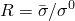。 **Eq 塑性应变率** 等效塑性应变率，（或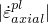，单轴压缩中轴向塑性应变率的绝对值，对于可压碎泡沫模型）。 **温度** 温度。 **字段 *n*** 预定义的字段变量。您可能需要展开对话框才能查看 **Data** 表中的所有列。有关如何输入数据的详细信息，请参阅["Entering tabular data," Section 3.2.7](pt01ch03s02s07.md)。
8. 如果您从 **Hardening** 选项列表中选择了 **Johnson-Cook**，请在 **Data** 表中输入以下数据： **C** 材料常数 *C*，它与温度和场变量无关。 **Epsilon 零点** 材料常数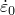，与温度和场变量无关。有关如何输入数据的详细信息，请参阅["Entering tabular data," Section 3.2.7](pt01ch03s02s07.md)。
9. 单击“**确定**”返回“**编辑材质**”对话框。

#### 定义各向异性屈服和蠕变

Abaqus 为在不同方向表现出不同屈服或蠕变行为的材料提供了各向异性屈服和蠕变模型。您可以通过指定应用于 Hill 势函数的应力比来定义各向异性屈服或蠕变。有关详细信息，请参阅["Anisotropic yield/creep," Section 23.2.6 of the Abaqus Analysis User's Guide](../usb/usb-link.md#usb-mat-canisoyield)。

**定义各向异性屈服或蠕变：**

1. 按照以下部分之一所述创建材料模型 -["Using an isotropic hardening model to define classical metal plasticity](pt03ch12s09s02.md#usi-prp-mechanical-plastic-plastic-isotropic)" -["Using a linear kinematic cyclic hardening model to define classical metal plasticity](pt03ch12s09s02.md#usi-prp-mechanical-plastic-plastic-kinematic)" -["Using a nonlinear isotropic/kinematic cyclic hardening model to define classical metal plasticity](pt03ch12s09s02.md#usi-prp-mechanical-plastic-plastic-combined)" -["Defining a creep law](pt03ch12s09s02.md#usi-prp-mechanical-plastic-creep)" -["Defining the viscous component of a two-layer viscoplasticity model](pt03ch12s09s02.md#usi-prp-mechanical-plastic-viscous)"
2. 从“编辑材质”对话框的“子选项”菜单中，选择“潜力”。出现 **子选项编辑器**。
3. 打开**使用与温度相关的数据**来定义与温度相关的数据。标有 **Temp** 的列出现在 **Data** 表中。
4. 单击**字段变量数量**字段右侧的箭头，以增加或减少数据所依赖的字段变量的数量。
5. 在 **数据** 表中输入以下数据： **R11、R22、R33、R12、R13 和 R23** 屈服或蠕变应力比。 **温度** 温度。 **字段 *n*** 预定义的字段变量。您可能需要展开对话框才能查看 **Data** 表中的所有列。有关如何输入数据的详细信息，请参阅["Entering tabular data," Section 3.2.7](pt01ch03s02s07.md)。
6. 单击“**确定**”返回“**编辑材质**”对话框。

#### 在塑性和蠕变计算中使用橡树岭国家实验室 (ORNL) 本构模型

Abaqus/Standard 中的 ORNL 本构模型适用于核标准[NE F9--5T(1981)](../stm/stm-link.md#stm-ref-nuclear)中指定的 304 和 316 型不锈钢。本构理论被分解为与速率无关的塑性响应和与速率相关的蠕变响应，每个响应都由单独的本构定律控制。有关更多信息，请参阅["ORNL -- Oak Ridge National Laboratory constitutive model," Section 23.2.12 of the Abaqus Analysis User's Guide](../usb/usb-link.md#usb-mat-cornl)和["ORNL constitutive theory," Section 4.3.8 of the Abaqus Theory Guide](../stm/stm-link.md#stm-mat-ornl)。

**指定橡树岭国家实验室开发的本构模型：**

1. 按照以下部分之一所述创建材料模型： -["Using a linear kinematic cyclic hardening model to define classical metal plasticity](pt03ch12s09s02.md#usi-prp-mechanical-plastic-plastic-kinematic)" -["Defining a creep law](pt03ch12s09s02.md#usi-prp-mechanical-plastic-creep)"
2. 从“编辑材质”对话框的“子选项”菜单中，选择“Ornl”。出现 **子选项编辑器**。
3. 在**运动位移饱和率**字段中，输入 A 值，该参数等于蠕变应变引起的运动位移饱和率。该参数由核标准第4.3.3--3节公式（15）定义。默认值为 0.3。设置 A=0.0 以使用该标准的 1986 年修订版。
4. 在**相对于蠕变应变的运动位移速率**字段中，输入 H 值，该参数等于相对于蠕变应变的运动位移速率。该参数由核标准第4.3.2--1节公式（7）定义。设置 H=0.0 以使用该标准的 1986 年修订版。如果省略此参数，Abaqus 将根据标准 1981 年修订版的第 4.3.3--3 节确定 H 的值。
5. 如果需要，打开**调用重置程序**以调用核标准第 4.3.5 节中描述的可选重置程序。
6. 单击“**确定**”返回“**编辑材质**”对话框。

#### 指定 ORNL 模型的循环屈服应力数据

您可以使用 **子选项** 编辑器指定 ORNL 本构模型的第十循环屈服应力和硬化值。仅当您也遵循["Using the Oak Ridge National Laboratory (ORNL) constitutive model in plasticity and creep calculations](pt03ch12s09s02.md#usi-prp-mechanical-plastic-plastic-ornl)中描述的过程时，此选项才相关。”

**要指定 ORNL 模型的循环屈服应力数据：**

1. 按照["Using a linear kinematic cyclic hardening model to define classical metal plasticity](pt03ch12s09s02.md#usi-prp-mechanical-plastic-plastic-kinematic)中的描述创建材料模型。”
2. 从“编辑材料”对话框的“子选项”菜单中，选择“循环塑料”。出现 **子选项编辑器**。
3. 打开**使用与温度相关的数据**来定义与温度相关的数据。标有 **Temp** 的列出现在 **Data** 表中。
4. 在**数据**表中，输入屈服应力、塑性应变以及温度（如果适用）的值。有关如何输入数据的详细信息，请参阅["Entering tabular data," Section 3.2.7](pt01ch03s02s07.md)。
5. 单击**确定**返回**编辑材质**对话框。

#### 指定弹塑性材料的退火温度

当材料点的温度超过其退火温度时，Abaqus 假定该材料点失去其硬化记忆。您可以指定退火温度，如果需要，还可以根据场变量进行定义。有关详细信息，请参阅["Annealing or melting," Section 23.2.5 of the Abaqus Analysis User's Guide](../usb/usb-link.md#usb-mat-cannealmelt)。

**指定退火温度：**

1. 按照以下部分之一所述创建材料模型 -["Using an isotropic hardening model to define classical metal plasticity](pt03ch12s09s02.md#usi-prp-mechanical-plastic-plastic-isotropic)" -["Using a linear kinematic cyclic hardening model to define classical metal plasticity](pt03ch12s09s02.md#usi-prp-mechanical-plastic-plastic-kinematic)" -["Using a nonlinear isotropic/kinematic cyclic hardening model to define classical metal plasticity](pt03ch12s09s02.md#usi-prp-mechanical-plastic-plastic-combined)" -["Using the Johnson-Cook hardening model to define classical metal plasticity](pt03ch12s09s02.md#usi-prp-mechanical-plastic-plastic-johnsoncook)"
2. 从“编辑材料”对话框的“子选项”菜单中，选择“退火温度”。出现 **子选项编辑器**。
3. 单击**场变量数量** 字段右侧的箭头，以增加或减少退火温度所依赖的场变量的数量。
4. 在**数据**表中输入以下数据： **退火温度** 退火温度值。 **字段 *n*** 预定义的字段变量。有关如何输入数据的详细信息，请参阅["Entering tabular data," Section 3.2.7](pt01ch03s02s07.md)。
5. 单击**确定**返回**编辑材质**对话框。

### 定义瓶盖塑性

Abaqus 允许您定义使用修改后的 Drucker-Prager\Cap 塑性模型的弹塑性材料的屈服面参数。有关详细信息，请参阅["Modified Drucker-Prager/Cap model," Section 23.3.2 of the Abaqus Analysis User's Guide](../usb/usb-link.md#usb-mat-ccapplastic)。

#### 指定盖塑性行为

您可以使用修改后的 Drucker-Prager/Cap 塑性模型来模拟表现出与压力相关的屈服的地质材料。添加盖屈服面有助于控制材料在剪切中屈服时的体积膨胀，并提供非弹性硬化机制来表示塑性压实。您还可以在 Abaqus/Standard 分析中定义非弹性时间相关（蠕变）行为以及塑性行为。

有关瓶盖塑性的更多信息，请参阅["Modified Drucker-Prager/Cap model," Section 23.3.2 of the Abaqus Analysis User's Guide](../usb/usb-link.md#usb-mat-ccapplastic)。

**定义瓶盖塑性：**

1. 从 **编辑材料** 对话框的菜单栏中，选择****机械****塑性****盖塑性****。 （有关显示 **编辑材质** 对话框的信息，请参阅["Creating or editing a material," Section 12.7.1](pt03ch12s07hlb01.md)。）
2. 打开**使用与温度相关的数据**来定义与温度相关的数据。标有 **Temp** 的列出现在 **Data** 表中。
3. 单击**字段变量数量**字段右侧的箭头，以增加或减少数据所依赖的字段变量的数量。
4. 在 **数据** 表中，输入以下数据： **材料内聚力** *p*--*t* 平面 (Abaqus/Standard) 或 *p*--*q* 平面 (Abaqus/Explicit) 中的材料内聚力 *d*。 （单位为[FL2](../popups/usb-int-iconventions-unitsym.md)。） **摩擦角** *p*--*t* 平面 (Abaqus/Standard) 或 *p*--*q* 平面 (Abaqus/Explicit) 中的材料摩擦角。输入以度为单位的值。 **盖子偏心度** 盖子偏心度参数，*R*。其值必须大于零（通常为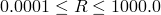）。 **初始 Yld Surf Pos** 初始上限屈服面位置，。 **过渡曲面半径** 过渡表面半径参数，。与统一相比，它的值应该是一个很小的数字。如果将此字段留空，则默认值为 0.0（即无过渡曲面）。如果在材料模型中包含蠕变属性，则必须将设置为零。 **流变应力比** 三轴拉伸中的流变应力与三轴压缩中的流变应力之比，*K*。 *K* 的值应为。如果将此字段留空或输入值 0.0，Abaqus 默认情况下将使用值 1.0。如果在材料模型中包含蠕变属性，则应将 *K* 设置为等于 1.0。该参数仅适用于 Abaqus/Standard 分析。 **温度** 温度。 **字段 *n*** 预定义的字段变量。
5. 要定义盖塑性模型的硬化部分，请从 **子选项** 菜单中选择 **盖硬化**。详细说明请参见“["Defining hardening parameters for a cap plasticity model](pt03ch12s09s02.md#usi-prp-mechanical-plastic-capplastic-hardening)”。
6. 如果要指定帽蠕变行为，请从 **子选项** 菜单中选择以下选项之一： - 选择 **帽蠕变内聚力** 以选择遵循剪切破坏塑性中活动塑性类型的内聚蠕变机制。 - 选择 **帽蠕变固结** 以选择遵循帽塑性区域中活动塑性类型的固结机制。有关详细说明，请参阅“["Defining creep parameters for a cap plasticity model](pt03ch12s09s02.md#usi-prp-mechanical-plastic-capplastic-creep)”。有关帽蠕变行为的更多信息，请参阅["Creep formulation" in "Modified Drucker-Prager/Cap model," Section 23.3.2 of the Abaqus Analysis User's Guide](../usb/usb-link.md#usb-mat-ccapplastic-creep)。
7. 单击“**确定**”创建材质并关闭“**编辑材质**”对话框。或者，您可以从 **编辑材质** 对话框中的菜单中选择要定义的另一种材质行为（有关详细信息，请参阅["Browsing and modifying material behaviors," Section 12.7.2](pt03ch12s07hlb02.md)）。

#### 定义盖塑性模型的硬化参数

为此模型指定的硬化曲线解释了静水压力意义上的屈服：静水压力屈服应力定义为体积非弹性应变的表格函数，并且如果需要，还可以定义为温度和其他预定义场变量的函数。您定义的值范围应足以包含材料在分析过程中将承受的所有有效压应力值。

有关详细信息，请参阅["Modified Drucker-Prager/Cap model," Section 23.3.2 of the Abaqus Analysis User's Guide](../usb/usb-link.md#usb-mat-ccapplastic)。

**定义封盖硬化：**

1. 按照["Specifying cap plasticity behavior](pt03ch12s09s02.md#usi-prp-mechanical-plastic-capplastic-capplastic)中的描述创建材料模型。”
2. 从“编辑材料”对话框的“子选项”菜单中，选择“帽盖硬化”。出现 **子选项编辑器**。
3. 打开**使用与温度相关的数据**来定义与温度相关的数据。标有 **Temp** 的列出现在 **Data** 表中。
4. 单击**字段变量数量**字段右侧的箭头，以增加或减少数据所依赖的字段变量的数量。
5. 在**数据**表中，输入以下数据：**屈服应力** 静水压力屈服应力。 （初始表格值必须大于零，并且值必须随着体积非弹性应变的增加而增加。） **Vol Plas Strain** 相应体积非弹性应变的绝对值。 **温度** 温度。 **字段 *n*** 预定义的字段变量。您可能需要展开对话框才能查看 **Data** 表中的所有列。有关如何输入数据的详细信息，请参阅["Entering tabular data," Section 3.2.7](pt01ch03s02s07.md)。
6. 单击“**确定**”返回“**编辑材质**”对话框。

#### 定义盖塑性模型的蠕变参数

盖层蠕变模型有两种可能的机制在不同的加载区域中活跃：一种是内聚机制，遵循剪切破坏塑性区域中活跃的塑性类型，另一种是固结机制，遵循盖塑性区域中活跃的塑性类型。

有关详细信息，请参阅["Creep formulation" in "Modified Drucker-Prager/Cap model," Section 23.3.2 of the Abaqus Analysis User's Guide](../usb/usb-link.md#usb-mat-ccapplastic-creep)。

**定义帽蠕变：**

1. 按照["Specifying cap plasticity behavior](pt03ch12s09s02.md#usi-prp-mechanical-plastic-capplastic-capplastic)中的描述创建材料模型。”
2. 从 **编辑材料** 对话框的 **子选项** 菜单中，选择 **帽蠕变凝聚力** 或 **帽蠕变固结**。 （有关两种蠕变机制的详细信息，请参阅["Creep formulation" in "Modified Drucker-Prager/Cap model," Section 23.3.2 of the Abaqus Analysis User's Guide](../usb/usb-link.md#usb-mat-ccapplastic-creep)。）出现 **子选项编辑器**。
3. 单击 **Law** 字段右侧的箭头，然后选择您选择的蠕变定律选项： - 选择 **Strain** 以选择应变硬化幂律。 - 选择 **Time** 以选择时间硬化幂律 - 选择 **SinghM** 以选择 Singh-Mitchell 类型定律。 - 选择**用户**，通过用户子程序[`CREEP`](../sub/sub-link.md#sub-xsl-creep)指定蠕变规律。有关详细信息，请参阅["Specifying creep laws" in "Modified Drucker-Prager/Cap model," Section 23.3.2 of the Abaqus Analysis User's Guide](../usb/usb-link.md#usb-mat-ccapplastic-creeplaws)。
4. 打开**使用与温度相关的数据**来定义与温度相关的数据。标有 **Temp** 的列出现在 **Data** 表中。
5. 单击**字段变量数量**字段右侧的箭头，以增加或减少数据所依赖的字段变量的数量。
6. 如果您选择了“**应变**”或“**时间**蠕变规律”选项，请在“**数据**”表中输入以下数据：**A、n 和 m** 蠕变材料参数。 **温度** 温度。 **字段 *n*** 预定义的字段变量。您可能需要展开对话框才能查看 **Data** 表中的所有列。有关如何输入数据的详细信息，请参阅["Entering tabular data," Section 3.2.7](pt01ch03s02s07.md)。
7. 如果选择 **SinghM** 蠕变定律选项，请在 **数据** 表中输入以下数据： **A、alpha、m 和 t1** 蠕变材料参数 *A*、、*m* 和。 **温度** 温度。 **字段 *n*** 预定义的字段变量。您可能需要展开对话框才能查看 **Data** 表中的所有列。有关如何输入数据的详细信息，请参阅["Entering tabular data," Section 3.2.7](pt01ch03s02s07.md)。
8. 单击“**确定**”返回“**编辑材质**”对话框。

### 定义铸铁塑性

铸铁塑性模型描述了灰铸铁的机械行为，灰铸铁是一种其微观结构由钢基体中的石墨片组成的材料。模型定义包括塑性泊松比以及压缩和拉伸下的硬化信息。有关详细信息，请参阅["Cast iron plasticity," Section 23.2.10 of the Abaqus Analysis User's Guide](../usb/usb-link.md#usb-mat-ccastironplasticity)。

**定义铸铁塑性**

1. 从 **编辑材料** 对话框的菜单栏中，选择****机械****塑性****铸铁塑性****。 （有关显示 **编辑材质** 对话框的信息，请参阅["Creating or editing a material," Section 12.7.1](pt03ch12s07hlb01.md)。）
2. 显示 **塑性** 选项卡页，然后执行以下操作： 1. 启用 **使用温度相关数据** 以定义依赖于温度的数据。标有 **Temp** 的列出现在 **Data** 表中。 2. 单击**字段变量数量**字段右侧的箭头，以增加或减少数据所依赖的字段变量的数量。 3. 在**数据**表中输入以下数据： **塑料泊松比** 塑料“泊松比”的值，其中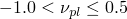。 （无量纲。）默认值为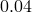。 **温度** 温度，。 **字段 *n*** 预定义的字段变量。有关如何输入数据的详细信息，请参阅["Entering tabular data," Section 3.2.7](pt01ch03s02s07.md)。
3. 显示 **压缩硬化** 选项卡页，然后执行以下操作： 1. 启用 **使用与温度相关的数据** 以定义与温度相关的数据。标有 **Temp** 的列出现在 **Data** 表中。 2. 单击**字段变量数量**字段右侧的箭头，以增加或减少数据所依赖的字段变量的数量。 3. 在**数据**表中输入以下数据：**Sigmac** 压缩屈服应力，。 **Epsilonc** 相应塑性应变的绝对值。 （输入的第一个表格值必须始终为零。） **温度** 温度。 **字段 *n*** 预定义的字段变量。您可能需要展开对话框才能查看 **Data** 表中的所有列。有关如何输入数据的详细信息，请参阅["Entering tabular data," Section 3.2.7](pt01ch03s02s07.md)。
4. 显示 **拉伸硬化** 选项卡页，然后执行以下操作： 1. 启用 **使用与温度相关的数据** 以定义与温度相关的数据。标有 **Temp** 的列出现在 **Data** 表中。 2. 单击**字段变量数量**字段右侧的箭头，以增加或减少数据所依赖的字段变量的数量。 3. 在**数据**表中输入以下数据：**Sigmat** 单轴拉伸时的屈服应力，。 **Epsilont** 相应的塑性应变。 （输入的第一个表格值必须始终为零。） **温度** 温度。 **字段 *n*** 预定义的字段变量。您可能需要展开对话框才能查看 **Data** 表中的所有列。有关如何输入数据的详细信息，请参阅["Entering tabular data," Section 3.2.7](pt01ch03s02s07.md)。
5. 单击“**确定**”创建材质并关闭“**编辑材质**”对话框。或者，您可以从 **编辑材质** 对话框中的菜单中选择要定义的另一种材质行为（有关详细信息，请参阅["Browsing and modifying material behaviors," Section 12.7.2](pt03ch12s07hlb02.md)）。

### 定义粘土塑性

粘土塑性模型允许您指定使用扩展 Cam-clay 塑性模型的弹塑性材料的材料行为的塑性部分。有关详细信息，请参阅["Critical state (clay) plasticity model," Section 23.3.4 of the Abaqus Analysis User's Guide](../usb/usb-link.md#usb-mat-cclayplastic)。

#### 指定粘土塑性行为

Abaqus/Standard 粘土塑性模型描述了无粘性土的非弹性响应。该模型与实验观察到的饱和粘土行为提供了合理的匹配。您可以通过取决于三个应力不变量的屈服函数、定义塑性应变率的关联流动假设以及根据非弹性体积应变改变屈服面尺寸的应变硬化理论来定义非弹性材料行为。

有关详细信息，请参阅["Critical state (clay) plasticity model," Section 23.3.4 of the Abaqus Analysis User's Guide](../usb/usb-link.md#usb-mat-cclayplastic)。

**定义粘土塑性**

1. 从 **编辑材料** 对话框的菜单栏中，选择****机械****塑性****粘土塑性****。 （有关显示 **编辑材质** 对话框的信息，请参阅["Creating or editing a material," Section 12.7.1](pt03ch12s07hlb01.md)。）
2. 单击 **Hardening** 字段右侧的箭头，然后选择您选择的硬化法则形式： - 选择 **Exponential** 以指定指数硬化/软化法则。 - 选择 **表格** 以指定分段线性硬化/软化关系。有关详细信息，请参阅["Hardening law" in "Critical state (clay) plasticity model," Section 23.3.4 of the Abaqus Analysis User's Guide](../usb/usb-link.md#usb-mat-cclayplastic-hardening)。
3. 如果您选择了硬化法则的 **指数** 形式，则可以选择输入 **截距** 值。该参数对应于，即空隙率与压力应力对数图中的原始固结线与空隙率轴的截距。如果为 **Intercept** 指定值，Abaqus 会忽略为 **Data** 表中的初始屈服面尺寸指定的任何值。
4. 打开**使用与温度相关的数据**来定义与温度相关的数据。标有 **Temp** 的列出现在 **Data** 表中。
5. 单击**字段变量数量**字段右侧的箭头，以增加或减少数据所依赖的字段变量的数量。
6. 如果您选择了硬化定律的 **指数** 形式，请在 **数据** 表中输入以下数据： **Log Plas Bulk Mod** 对数塑料体积模量，（无量纲）。 **应力比** 临界状态下的应力比，*M*。 **初始屈服面尺寸** 初始屈服面尺寸，（[FL2](../popups/usb-int-iconventions-unitsym.md)的单位）。如果您指定了 **Intercept** 的值，Abaqus 会忽略此数据项。 **湿 Yld 冲浪尺寸** 定义临界状态“湿”侧屈服面尺寸的参数，。如果该值被省略或设置为零，则假定值为 1.0。 **流变应力比** 三轴拉伸下的流变应力与三轴压缩下的流变应力之比，*K*。。如果该值留空或设置为零，则假定值为 1.0。 **温度** 温度。 **字段 *n*** 预定义的字段变量。您可能需要展开对话框才能查看 **Data** 表中的所有列。有关如何输入数据的详细信息，请参阅["Entering tabular data," Section 3.2.7](pt01ch03s02s07.md)。
7. 如果您选择了硬化定律的 **表格** 形式，请在 **数据** 表中输入以下数据： **应力比** 临界状态下的应力比，*M*。 **初始体积塑性应变** 初始体积塑性应变，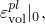对应于。 **湿 Yld 冲浪尺寸** 定义临界状态“湿”侧屈服面尺寸的参数，。如果该值被省略或设置为零，则假定值为 1.0。 **流变应力比** 三轴拉伸下的流变应力与三轴压缩下的流变应力之比，*K*。。如果该值留空或设置为零，则假定值为 1.0。 **温度** 温度。 **字段 *n*** 预定义的字段变量。您可能需要展开对话框才能查看 **Data** 表中的所有列。有关如何输入数据的详细信息，请参阅["Entering tabular data," Section 3.2.7](pt01ch03s02s07.md)。
8. 如果您选择了硬化定律的 **表格** 形式，请从 **子选项** 菜单中选择 **压缩粘土硬化** 以定义 Cam-clay 塑性屈服面的分段线性硬化/软化。详细说明请参见“["Defining compressive clay hardening for a clay plasticity model](pt03ch12s09s02.md#usi-prp-mechanical-plastic-clay-hardening)”。
9. 单击“**确定**”创建材质并关闭“**编辑材质**”对话框。或者，您可以从 **编辑材质** 对话框中的菜单中选择要定义的另一种材质行为（有关详细信息，请参阅["Browsing and modifying material behaviors," Section 12.7.2](pt03ch12s07hlb02.md)）。

#### 定义粘土塑性模型的压缩粘土硬化

**子选项编辑器**允许您定义 Cam-clay 塑性屈服面的分段线性硬化/软化。有关这种形式的强化法则的更多信息，请参阅["Piecewise linear form" in "Critical state (clay) plasticity model," Section 23.3.4 of the Abaqus Analysis User's Guide](../usb/usb-link.md#usb-mat-cclayplastic-piecewise)。

**定义粘土压缩硬化**

1. 按照["Specifying clay plasticity behavior](pt03ch12s09s02.md#usi-prp-mechanical-plastic-clay-clay)中的描述创建材料模型。”
2. 从“编辑材料”对话框的“子选项”菜单中，选择“压缩粘土硬化”。出现 **子选项编辑器**。
3. 打开**使用与温度相关的数据**来定义与温度相关的数据。标有 **Temp** 的列出现在 **Data** 表中。
4. 单击**字段变量数量**字段右侧的箭头，以增加或减少数据所依赖的字段变量的数量。
5. 在 **数据** 表中，输入以下数据： **屈服应力** 屈服时的静水压力值。 **体积塑性应变** 相应体积塑性应变的绝对值。 **温度** 温度。 **字段 *n*** 预定义的字段变量。您可能需要展开对话框才能查看 **Data** 表中的所有列。有关如何输入数据的详细信息，请参阅["Entering tabular data," Section 3.2.7](pt01ch03s02s07.md)。
6. 单击“**确定**”返回“**编辑材质**”对话框。

### 定义混凝土受损塑性

混凝土受损塑性模型提供了对所有类型结构中的混凝土和其他准脆性材料进行建模的通用功能。该模型使用各向同性损伤弹性的概念与各向同性拉伸和压缩塑性相结合来表示混凝土的非弹性行为。有关详细信息，请参阅["Concrete damaged plasticity," Section 23.6.3 of the Abaqus Analysis User's Guide](../usb/usb-link.md#usb-mat-cconcretedamaged)。

#### 定义混凝土损伤塑性模型

混凝土损伤塑性模型基于标量（各向同性）损伤的假设，专为混凝土承受任意载荷条件（包括循环载荷）的应用而设计。该模型考虑了拉伸和压缩塑性应变引起的弹性刚度的退化。它还考虑了循环载荷下的刚度恢复效应。

有关详细信息，请参阅["Concrete damaged plasticity," Section 23.6.3 of the Abaqus Analysis User's Guide](../usb/usb-link.md#usb-mat-cconcretedamaged)。

**定义混凝土受损塑性：**

1. 从 **编辑材料** 对话框的菜单栏中，选择****机械****塑性****混凝土损伤塑性****。 （有关显示 **编辑材质** 对话框的信息，请参阅["Creating or editing a material," Section 12.7.1](pt03ch12s07hlb01.md)。）
2. 如有必要，单击 **塑性** 选项卡以显示 **塑性** 选项卡页。
3. 打开**使用与温度相关的数据**来定义与温度相关的数据。标有 **Temp** 的列出现在 **Data** 表中。
4. 单击**字段变量数量**字段右侧的箭头，以增加或减少数据所依赖的字段变量的数量。
5. 在 **数据** 表中输入以下数据： **扩张角** *p*--*q* 平面中的扩张角。输入以度为单位的值。 **偏心率** 流量势偏心率，。偏心率是一个小的正数，定义双曲流势接近其渐近线的速率。默认为。 **fb0/fc0**，初始等双轴压缩屈服应力与初始单轴压缩屈服应力之比。默认值为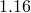**K**，即对于任何给定压力不变量 *p* 值（使得最大主应力为负值）的初始屈服点，拉伸子午线上的第二个应力不变量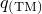与压缩子午线上的第二个应力不变量的比率，使得最大主应力为负值。它必须满足条件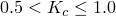。默认值为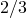。 **粘度参数** 粘度参数，用于 Abaqus/Standard 分析中混凝土本构方程的粘塑性正则化。该参数在 Abaqus/Explicit 中被忽略。默认值为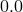。 （[的单位](../popups/usb-int-iconventions-unitsym.md)。） **温度** 温度。 **字段 *n*** 预定义的字段变量。
6. 单击“**压缩行为**”选项卡以显示“**压缩行为**”选项卡页。 （有关压缩硬化的信息，请参阅["Defining compressive behavior" in "Concrete damaged plasticity," Section 23.6.3 of the Abaqus Analysis User's Guide](../usb/usb-link.md#usb-mat-cconcretedamaged-compressivehardening)。）
7. 如果压应力数据是应变率的函数，则打开 **使用应变率相关数据**。
8. 打开**使用与温度相关的数据**来定义与温度相关的数据。标有 **Temp** 的列出现在 **Data** 表中。
9. 单击**字段变量数**字段右侧的箭头，以增加或减少数据所依赖的字段变量的数量。
10. 在 **数据** 表中输入以下数据： **屈服应力** 压缩屈服应力，。 （[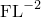的单位](../popups/usb-int-iconventions-unitsym.md)。） **非弹性应变** 非弹性（破碎）应变，。 **速率** 非弹性（压碎）应变率，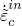。 （[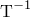的单位](../popups/usb-int-iconventions-unitsym.md)。） **温度** 温度。 **字段 *n*** 预定义的字段变量。
11. 如果需要，从 **子选项** 菜单中选择 **压缩损伤**，以表格形式指定损伤。 （如果省略损伤数据，则模型表现为塑性模型。）有关详细信息，请参阅“["Defining concrete compression damage](pt03ch12s09s02.md#usi-prp-mechanical-concretedamaged-compdamage)”。
12. 单击“**拉伸行为**”选项卡以显示“**拉伸行为**”选项卡页。 （有关拉伸刚化的信息，请参阅["Defining tension stiffening" in "Concrete damaged plasticity," Section 23.6.3 of the Abaqus Analysis User's Guide](../usb/usb-link.md#usb-mat-cconcretedamaged-tensionstiffening)。）
13. 单击 **Type** 字段右侧的箭头，然后选择定义后裂纹行为的方法： - 选择 **Strain** 以通过输入失效后应力/裂纹应变关系来指定后裂纹行为。 - 选择**位移**，通过输入失效后应力/裂纹-位移关系来定义后裂纹行为。 - 选择 **GFI** 通过输入失效应力和断裂能来定义后裂纹行为。
14. 如果裂纹后应力取决于应变率，则打开 **使用应变率相关数据**。
15. 打开**使用与温度相关的数据**来定义与温度相关的数据。标有 **Temp** 的列出现在 **Data** 表中。
16. 单击**字段变量数量**字段右侧的箭头，以增加或减少数据所依赖的字段变量的数量。
17. 在 **数据** 表中，输入与步骤 13 中您的 **类型** 选择相关的数据（并非所有以下内容都适用）： **屈服应力** 如果您从 **类型** 选项列表中选择了 **应变** 或 **位移**，请输入裂纹后剩余的直接应力。 （[的单位](../popups/usb-int-iconventions-unitsym.md)。）如果您从 **类型** 选项列表中选择 **GFI**，请输入失效应力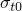。 （[的单位](../popups/usb-int-iconventions-unitsym.md).) **开裂应变** 直接开裂应变，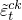。 **位移** 直接开裂位移，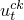。 （单位为[L](../popups/usb-int-iconventions-unitsym.md)。） **断裂能** 断裂能，。 （[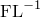的单位](../popups/usb-int-iconventions-unitsym.md)。） **速率** 如果您从 **类型** 选项列表中选择了 **应变**，请输入直接开裂应变率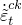。 （[的单位](../popups/usb-int-iconventions-unitsym.md)。）如果您从 **Type** 选项列表中选择 **Displacement** 或 **GFI**，请输入直接破裂位移速率。 （[的单位](../popups/usb-int-iconventions-unitsym.md)。） **温度** 温度。 **字段 *n*** 预定义的字段变量。您可能需要展开对话框才能查看 **Data** 表中的所有列。有关如何输入数据的详细信息，请参阅["Entering tabular data," Section 3.2.7](pt01ch03s02s07.md)。
18. 如果需要，从 **子选项** 菜单中选择 **张力损伤**，以表格形式指定损伤。 （如果省略损伤数据，则模型表现为塑性模型。）有关详细信息，请参阅“["Defining concrete tension damage](pt03ch12s09s02.md#usi-prp-mechanical-concretedamaged-tensiondamage)”。
19. 单击“**确定**”创建材质并关闭“**编辑材质**”对话框。或者，您可以从 **编辑材质** 对话框中的菜单中选择要定义的另一种材质行为（有关详细信息，请参阅["Browsing and modifying material behaviors," Section 12.7.2](pt03ch12s07hlb02.md)）。

#### 定义混凝土压缩损伤

您可以将单轴压缩损伤变量定义为非弹性（压碎）应变的表格函数。有关详细信息，请参阅["Defining damage and stiffness recovery" in "Concrete damaged plasticity," Section 23.6.3 of the Abaqus Analysis User's Guide](../usb/usb-link.md#usb-mat-cconcretedamaged-damage)。

**定义压缩损伤**

1. 按照["Defining a concrete damaged plasticity model](pt03ch12s09s02.md#usi-prp-mechanical-plastic-concretedamaged-model)中的描述创建材料模型。”
2. 从“**压缩行为**”选项卡页上的“**子选项**”菜单中，选择“**压缩损伤**”。出现 **子选项编辑器**。
3. 在 **张力恢复** 字段中，输入刚度恢复系数的值，该值确定当载荷从压缩变为拉伸时恢复的拉伸刚度量。若为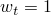，则材料完全恢复拉伸刚度；如果是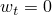，则没有刚度恢复。的中间值导致拉伸刚度部分恢复。默认值为 0.0。
4. 打开**使用与温度相关的数据**来定义与温度相关的数据。标有 **Temp** 的列出现在 **Data** 表中。
5. 单击**字段变量数量**字段右侧的箭头，以增加或减少数据所依赖的字段变量的数量。
6. 在**数据**表中输入以下数据：**损伤参数** 压缩损伤变量，。 **非弹性应变** 非弹性（破碎）应变，。 **温度** 温度。 **字段 *n*** 预定义的字段变量。
7. 单击“**确定**”返回“**编辑材质**”对话框。

#### 定义混凝土张力损伤

您可以将单轴拉伸损伤变量定义为裂纹应变或裂纹位移的表格函数。有关详细信息，请参阅["Defining damage and stiffness recovery" in "Concrete damaged plasticity," Section 23.6.3 of the Abaqus Analysis User's Guide](../usb/usb-link.md#usb-mat-cconcretedamaged-damage)。

**定义拉伸损伤**

1. 按照["Defining a concrete damaged plasticity model](pt03ch12s09s02.md#usi-prp-mechanical-plastic-concretedamaged-model)中的描述创建材料模型。”
2. 从“**拉伸行为**”选项卡页的“**子选项**”菜单中，选择“**张力损伤**”。出现 **子选项编辑器**。
3. 单击 **类型** 字段右侧的箭头，然后选择定义拉伸损伤变量的方法： - 选择 **应变** 将拉伸损伤变量指定为裂纹应变的函数。 - 选择 **位移** 将拉伸损伤变量指定为裂纹位移的函数。
4. 在 **压缩恢复** 字段中，输入刚度恢复系数的值，该值确定当载荷从拉伸变为压缩时恢复的压缩刚度量。若为，则材料完全恢复压缩刚度；如果是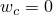，则没有刚度恢复。的中间值导致压缩刚度部分恢复。默认值是，它对应于这样的假设：当裂纹闭合时，压缩刚度不受拉伸损伤的影响。
5. 打开**使用与温度相关的数据**来定义与温度相关的数据。标有 **Temp** 的列出现在 **Data** 表中。
6. 单击**字段变量数量**字段右侧的箭头，以增加或减少数据所依赖的字段变量的数量。
7. 在 **数据** 表中，输入与步骤 3 中选择的 **类型** 相关的数据（并非所有以下内容都适用）： **损伤参数** 拉伸损伤变量，。 **开裂应变** 直接开裂应变，。 **位移** 直接开裂位移，。 （单位为[L](../popups/usb-int-iconventions-unitsym.md)。） **温度** 温度。 **字段 *n*** 预定义的字段变量。
8. 单击“**确定**”返回“**编辑材质**”对话框。

### 定义混凝土涂抹裂缝

您可以使用混凝土弥散开裂模型来定义 Abaqus/Standard 分析中弹性范围之外的普通混凝土的属性。有关详细信息，请参阅["Concrete smeared cracking," Section 23.6.1 of the Abaqus Analysis User's Guide](../usb/usb-link.md#usb-mat-cconcrete)。

#### 指定混凝土弥散开裂模型

混凝土弥散开裂模型允许您定义在相当低的围压下相对单调载荷的混凝土行为。 Abaqus 假设裂纹是行为的最重要方面，并且裂纹和裂纹后行为的表示在建模中占主导地位。有关详细信息，请参阅["Concrete smeared cracking," Section 23.6.1 of the Abaqus Analysis User's Guide](../usb/usb-link.md#usb-mat-cconcrete)。

**定义混凝土涂抹裂缝：**

1. 从 **编辑材料** 对话框的菜单栏中，选择****机械****塑性****混凝土涂抹裂纹****。 （有关显示 **编辑材质** 对话框的信息，请参阅["Creating or editing a material," Section 12.7.1](pt03ch12s07hlb01.md)。）
2. 打开**使用与温度相关的数据**来定义与温度相关的数据。标有 **Temp** 的列出现在 **Data** 表中。
3. 单击**字段变量数量**字段右侧的箭头，以增加或减少数据所依赖的字段变量的数量。
4. 在**数据**表中输入以下数据： **压缩应力** 压缩应力的绝对值。 （单位为[FL2](../popups/usb-int-iconventions-unitsym.md)。） **塑性应变** 塑性应变的绝对值。在每个温度和场变量值处给出的第一个应力应变点必须为零塑性应变，并将定义该温度和场变量的初始屈服点。 **温度** 温度。 **字段 *n*** 预定义的字段变量。您可能需要展开对话框才能查看 **Data** 表中的所有列。有关如何输入数据的详细信息，请参阅["Entering tabular data," Section 3.2.7](pt01ch03s02s07.md)。
5. 从 **子选项** 菜单中选择 **张力加固**，对裂纹间直接应变的失效后行为进行建模。详情请参见“["Defining tension stiffening for a concrete smeared cracking model](pt03ch12s09s02.md#usi-prp-mechanical-plastic-concretesmeared-tensionstiffening)”。
6. 如果需要，从 **子选项** 菜单中选择 **剪切保留** 以定义剪切刚度如何随着混凝土裂缝而减小。详细信息请参见“["Defining shear retention for a concrete smeared cracking model](pt03ch12s09s02.md#usi-prp-mechanical-plastic-concretesmeared-shearretention)”。
7. 如果需要，从 **子选项** 菜单中选择 **失效比率** 以定义失效表面的形状。详情请参见“["Defining the shape of the failure surface for a concrete smeared cracking model](pt03ch12s09s02.md#usi-prp-mechanical-plastic-concretesmeared-failureratios)”。
8. 单击“**确定**”创建材质并关闭“**编辑材质**”对话框。或者，您可以从 **编辑材质** 对话框中的菜单中选择要定义的另一种材质行为（有关详细信息，请参阅["Browsing and modifying material behaviors," Section 12.7.2](pt03ch12s07hlb02.md)）。

#### 定义混凝土弥散开裂模型的拉伸刚度

您可以通过拉伸刚化对裂缝上的直接应变的失效后行为进行建模，这使您可以定义开裂混凝土的应变软化行为。这种行为还允许以简单的方式模拟钢筋与混凝土相互作用的效果。

您可以通过失效后应力-应变关系或应用断裂能开裂准则来指定拉伸刚化。有关详细信息，请参阅["Tension stiffening" in "Concrete smeared cracking," Section 23.6.1 of the Abaqus Analysis User's Guide](../usb/usb-link.md#usb-mat-cconcrete-tensionstiffening)。

混凝土弥散开裂模型需要拉伸硬化信息。

**定义拉伸刚度：**

1. 按照["Specifying a concrete smeared cracking model](pt03ch12s09s02.md#usi-prp-mechanical-plastic-concretesmeared-model)中的描述创建材料模型。”
2. 从**子选项**菜单中，选择**张力加固**。出现 **子选项编辑器**。
3. 单击 **类型** 字段右侧的箭头，然后选择定义开裂后行为的方法： - 选择 **位移** 输入开裂后强度线性损失产生零应力时的位移。 - 选择**应变**直接输入失效后应力-应变关系。
4. 打开**使用与温度相关的数据**来定义与温度相关的数据。标有 **Temp** 的列出现在 **Data** 表中。
5. 单击**字段变量数量**字段右侧的箭头，以增加或减少数据所依赖的字段变量的数量。
6. 在 **数据** 表中，输入与步骤 3 中您选择的 **类型** 相关的数据（并非所有以下内容都适用）： **Disp** 位移，，此时裂纹后强度的线性损失给出零应力。 （单位为[L](../popups/usb-int-iconventions-unitsym.md)。） **sigma/sigma_c** 残余应力与裂纹时应力的分数。 **epsilon-epsilon_c** 直接应变减去裂纹时直接应变的绝对值。 **温度** 温度。 **字段 *n*** 预定义的字段变量。您可能需要展开对话框才能查看 **Data** 表中的所有列。有关如何输入数据的详细信息，请参阅["Entering tabular data," Section 3.2.7](pt01ch03s02s07.md)。
7. 单击“**确定**”返回“**编辑材质**”对话框。

#### 定义混凝土弥散开裂模型的剪切保持力

当混凝土出现裂缝时，其剪切刚度会降低。您可以通过将剪切模量的减少指定为裂纹张开应变的函数来定义此效应。您还可以为闭合裂纹指定减小的剪切模量。有关详细信息，请参阅["Cracked shear retention" in "Concrete smeared cracking," Section 23.6.1 of the Abaqus Analysis User's Guide](../usb/usb-link.md#usb-mat-cconcrete-shearretention)。

如果您没有为混凝土弥散开裂模型定义剪切保留，Abaqus/Standard 会自动假定剪切响应不受裂纹影响（完全剪切保留）。这种假设通常是合理的：在许多情况下，总体响应并不强烈依赖于剪切保留量。

**定义剪切保持力：**

1. 按照["Specifying a concrete smeared cracking model](pt03ch12s09s02.md#usi-prp-mechanical-plastic-concretesmeared-model)中的描述创建材料模型。”
2. 从**子选项**菜单中，选择**剪切保留**。出现 **子选项编辑器**。
3. 打开**使用与温度相关的数据**来定义与温度相关的数据。标有 **Temp** 的列出现在 **Data** 表中。
4. 单击**字段变量数量**字段右侧的箭头，以增加或减少数据所依赖的字段变量的数量。
5. 在 **数据** 表中输入以下数据： **Rho_close** 乘数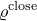，将闭合裂缝的剪切模量定义为未开裂混凝土的弹性剪切模量的一部分。默认值为 1.0。 **Eps_max** 裂纹上的最大直接应变。默认值是一个非常大的数字（完全剪切保留）。 **温度** 温度。 **字段 *n*** 预定义的字段变量。您可能需要展开对话框才能查看 **Data** 表中的所有列。有关如何输入数据的详细信息，请参阅["Entering tabular data," Section 3.2.7](pt01ch03s02s07.md)。
6. 单击“**确定**”返回“**编辑材质**”对话框。

#### 定义混凝土弥散开裂模型的破坏面形状

您可以指定失效比率来定义失效表面的形状。如果不定义破坏面的形状，Abaqus 将使用下面列出的默认值。

**指定故障率：**

1. 按照["Specifying a concrete smeared cracking model](pt03ch12s09s02.md#usi-prp-mechanical-plastic-concretesmeared-model)中的描述创建材料模型。”
2. 从**子选项**菜单中，选择**故障率**。出现 **子选项编辑器**。
3. 打开**使用与温度相关的数据**来定义与温度相关的数据。标有 **Temp** 的列出现在 **Data** 表中。
4. 单击**字段变量数量**字段右侧的箭头，以增加或减少数据所依赖的字段变量的数量。
5. 在**数据**表中输入以下数据： **比率 1** 极限双轴压应力与单轴极限压应力的比率。默认值为 1.16。 **比率 2** 失效时单轴拉应力与失效时单轴压应力之比的绝对值。默认值为 0.09。 **比率 3** 双轴压缩极限应力下塑性应变的主成分大小与单轴压缩极限应力下塑性应变的大小之比。默认值为 1.28。 **比率 4** 当其他非零主应力分量处于极限压应力值时，平面应力中开裂处的拉伸主应力值与单轴拉伸下的拉伸开裂应力之比。默认值为 1/3。 **温度** 温度。 **字段 *n*** 预定义的字段变量。您可能需要展开对话框才能查看 **Data** 表中的所有列。有关如何输入数据的详细信息，请参阅["Entering tabular data," Section 3.2.7](pt01ch03s02s07.md)。
6. 单击“**确定**”返回“**编辑材质**”对话框。

### 定义可压碎泡沫塑性

可压碎泡沫模型不仅允许您定义通常用作能量吸收结构的可压碎泡沫，还可以定义泡沫以外的其他可压碎材料。有关详细信息，请参阅["Crushable foam plasticity models," Section 23.3.5 of the Abaqus Analysis User's Guide](../usb/usb-link.md#usb-mat-ccrushfoam)。

#### 指定可压碎泡沫模型

您可以使用可压碎泡沫模型来模拟泡沫材料由于细胞壁屈曲过程而在压缩过程中变形的增强能力。该模型基于这样的假设：所产生的变形无法立即恢复，并且可以理想化为短期事件的塑性变形。有关详细信息，请参阅["Crushable foam plasticity models," Section 23.3.5 of the Abaqus Analysis User's Guide](../usb/usb-link.md#usb-mat-ccrushfoam)。

**定义可压碎泡沫模型：**

1. 从**编辑材料**对话框的菜单栏中，选择****机械****塑性****可压碎泡沫****。 （有关显示 **编辑材质** 对话框的信息，请参阅["Creating or editing a material," Section 12.7.1](pt03ch12s07hlb01.md)。）
2. 单击 **硬化** 字段右侧的箭头，然后选择硬化模型： - 选择 **体积** 指定一个模型，该模型假定屈服面由材料所经历的体积压实塑性应变控制。体积硬化是唯一可用于 Abaqus/Standard 分析的模型。 - 选择 **各向同性** 以指定使用屈服面的模型，该屈服面是一个以 *p*--*q* 应力平面中的原点为中心的椭圆。屈服面以自相似方式演化，且演化受等效塑性应变控制。该模型仅适用于 Abaqus/Explicit 分析。
3. 打开**使用与温度相关的数据**来定义与温度相关的数据。标有 **Temp** 的列出现在 **Data** 表中。
4. 单击**字段变量数量**字段右侧的箭头，以增加或减少数据所依赖的字段变量的数量。
5. 在**数据**表中，输入与步骤 2 中的**硬化**选择相关的数据（并非所有以下内容都适用）： **压缩屈服应力比** 压缩载荷的屈服应力比，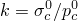；。输入单轴压缩中的初始屈服应力与静水压缩中的初始屈服应力之比。 **静水屈服应力比** 静水载荷屈服应力比，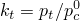；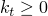。输入静水拉伸中的屈服应力与静水压缩中的初始屈服应力之比，以正值形式提供。默认值为 1.0。 **塑料泊松比** 塑料泊松比，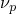；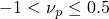。 **温度** 温度。 **字段 *n*** 预定义的字段变量。您可能需要展开对话框才能查看 **Data** 表中的所有列。有关如何输入数据的详细信息，请参阅["Entering tabular data," Section 3.2.7](pt01ch03s02s07.md)。
6. 从 **子选项** 菜单中选择 **泡沫硬化**，定义可压碎泡沫模型的硬化数据。详情请参见“["Defining crushable foam hardening](pt03ch12s09s02.md#usi-prp-mechanical-plastic-crushablefoam-hardening)”。
7. 如果需要，从 **子选项** 菜单中选择 **Rate Dependent** 以指定与应变率相关的材料行为。详情请参见“["Defining rate dependence for a crushable foam plasticity model](pt03ch12s09s02.md#usi-prp-mechanical-plastic-crushablefoam-rate)”。
8. 单击“**确定**”创建材质并关闭“**编辑材质**”对话框。或者，您可以从 **编辑材质** 对话框中的菜单中选择要定义的另一种材质行为（有关详细信息，请参阅["Browsing and modifying material behaviors," Section 12.7.2](pt03ch12s07hlb02.md)）。

#### 定义可压碎泡沫硬化

您必须提供可压碎泡沫硬化数据才能完成可压碎泡沫塑性定义。有关详细信息，请参阅["Crushable foam plasticity models," Section 23.3.5 of the Abaqus Analysis User's Guide](../usb/usb-link.md#usb-mat-ccrushfoam)。

**定义可压碎泡沫硬化：**

1. 按照["Specifying a crushable foam model](pt03ch12s09s02.md#usi-prp-mechanical-plastic-crushablefoam-model)中的描述创建材料模型。”
2. 从**子选项**菜单中，选择**可压碎泡沫硬化**。出现 **子选项编辑器**。
3. 打开**使用与温度相关的数据**来定义与温度相关的数据。标有 **Temp** 的列出现在 **Data** 表中。
4. 单击**字段变量数量**字段右侧的箭头，以增加或减少数据所依赖的字段变量的数量。
5. 在 **数据** 表中输入以下数据： **屈服应力** 单轴压缩时的屈服应力，以正值形式提供。 **体积塑性应变** 相应塑性应变的绝对值。 （输入的第一个表格值必须始终为零。） **温度** 温度。 **字段 *n*** 预定义的字段变量。您可能需要展开对话框才能查看 **Data** 表中的所有列。有关如何输入数据的详细信息，请参阅["Entering tabular data," Section 3.2.7](pt01ch03s02s07.md)。
6. 单击“**确定**”返回“**编辑材质**”对话框。

#### 定义可压碎泡沫塑性模型的速率依赖性

随着应变率的增加，许多材料的屈服应力增加。对于许多可压碎的泡沫材料，当应变率在每秒 0.1-1 的范围内时，屈服应力的增加变得很重要；如果应变率在每秒 10-100 的范围内（如高能动态事件中常见的情况），则屈服应力的增加可能非常重要。

有关应变率依赖性的更多信息，请参见["Crushable foam plasticity models," Section 23.3.5 of the Abaqus Analysis User's Guide](../usb/usb-link.md#usb-mat-ccrushfoam)和["Rate-dependent yield," Section 23.2.3 of the Abaqus Analysis User's Guide](../usb/usb-link.md#usb-mat-cratedependent)。

**定义速率相关收益率：**

1. 按照["Specifying a crushable foam model](pt03ch12s09s02.md#usi-prp-mechanical-plastic-crushablefoam-model)中的描述创建材料模型。”
2. 从“编辑材质”对话框的“子选项”菜单中，选择“速率相关”。出现 **子选项编辑器**。
3. 单击 **硬化** 字段右侧的箭头，然后选择定义硬化相关性的方法： - 选择 **幂律** 以使用 Cowper-Symonds 过应力定律定义屈服应力比。 - 选择 **表格** 以表格形式直接输入屈服应力比作为等效塑性应变率的函数。
4. 如果适用，请打开 **使用温度相关数据** 以定义依赖于温度的数据。标有 **Temp** 的列出现在 **Data** 表中。
5. 如果适用，请单击 **字段变量数** 字段右侧的箭头，以增加或减少数据所依赖的字段变量的数量。
6. 如果您从 **硬化** 选项列表中选择了 **幂律**，请在 **数据** 表中输入以下数据：**乘数** 材料参数，*D*。 **指数** 材料参数，*n*。 **温度** 温度。 **字段 *n*** 预定义的字段变量。您可能需要展开对话框才能查看 **Data** 表中的所有列。有关如何输入数据的详细信息，请参阅["Entering tabular data," Section 3.2.7](pt01ch03s02s07.md)。
7. 如果您从 **硬化** 选项列表中选择 **屈服比**，请在 **数据** 表中输入以下数据： **Yld 应力比** 屈服应力比，。 **Eq 塑性应变率** 等效塑性应变率，（或，单轴压缩中轴向塑性应变率的绝对值，对于可压碎泡沫模型）。 **温度** 温度。 **字段 *n*** 预定义的字段变量。您可能需要展开对话框才能查看 **Data** 表中的所有列。有关如何输入数据的详细信息，请参阅["Entering tabular data," Section 3.2.7](pt01ch03s02s07.md)。
8. 单击“**确定**”返回“**编辑材质**”对话框。

### 定义德鲁克-普拉格塑性

您可以定义 Drucker-Prager 模型来模拟摩擦材料，这些材料通常是粒状土壤和岩石，并表现出与压力相关的屈服强度。有关详细信息，请参阅["Extended Drucker-Prager models," Section 23.3.1 of the Abaqus Analysis User's Guide](../usb/usb-link.md#usb-mat-cdruckerprager)。

#### 定义 Drucker-Prager 模型

扩展的 Drucker-Prager 系列塑性模型描述了颗粒材料或聚合物的行为，其中屈服行为取决于等效压力应力。非弹性变形有时可能与摩擦机制有关，例如颗粒彼此滑动。有关详细信息，请参阅["Extended Drucker-Prager models," Section 23.3.1 of the Abaqus Analysis User's Guide](../usb/usb-link.md#usb-mat-cdruckerprager)。

**定义 Drucker-Prager 塑性模型：**

1. 从 **编辑材料** 对话框的菜单栏中，选择****机械****塑性****Drucker Prager****。 （有关显示 **编辑材质** 对话框的信息，请参阅["Creating or editing a material," Section 12.7.1](pt03ch12s07hlb01.md)。）
2. 单击**剪切准则**字段右侧的箭头，然后指定要定义的屈服准则。有关详细信息，请参阅以下部分： -["Linear Drucker-Prager model" in "Extended Drucker-Prager models," Section 23.3.1 of the Abaqus Analysis User's Guide](../usb/usb-link.md#usb-mat-cdruckerprager-linear)-["Hyperbolic and general exponent models" in "Extended Drucker-Prager models," Section 23.3.1 of the Abaqus Analysis User's Guide](../usb/usb-link.md#usb-mat-cdruckerprager-hyperbolic)3. 如果您正在执行 Abaqus/Standard 分析，请输入 **流势偏心率** 的值，。偏心率是一个小的正数，定义双曲流势接近其渐近线的速率。指数模型默认为，如果是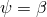，则双曲线模型设置为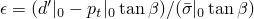，以保证关联流量。有关更多信息，请参阅["Extended Drucker-Prager models," Section 23.3.1 of the Abaqus Analysis User's Guide](../usb/usb-link.md#usb-mat-cdruckerprager)。
4. 如果您从 **剪切准则** 选项列表中选择了 **指数形式**，则可以打开 **使用子选项三轴测试数据** 来请求 Abaqus 根据不同围压水平下的三轴测试数据计算材料常数。有关详细信息，请参阅["General exponent model" in "Extended Drucker-Prager models," Section 23.3.1 of the Abaqus Analysis User's Guide](../usb/usb-link.md#usb-mat-cdruckerprager-triaxial)。
5. 打开**使用与温度相关的数据**来定义与温度相关的数据。标有 **Temp** 的列出现在 **Data** 表中。
6. 单击**字段变量数量**字段右侧的箭头，以增加或减少数据所依赖的字段变量的数量。
7. 在 **数据** 表中，输入与您的 **剪切准则** 选择相关的数据（并非以下所有内容都适用）： **摩擦角** 如果您从 **剪切准则** 选项列表中选择 **线性**，请输入 *p*--*t* 平面中的材料摩擦角。如果您从 **剪切准则** 选项列表中选择了 **双曲线**，请输入 *p*--*q* 平面中高围压下的材料摩擦角。输入以度为单位的值。 **流变应力比** 三轴拉伸中的流变应力与三轴压缩中的流变应力之比，*K*。。如果将此字段留空或输入值 0.0，Abaqus 将使用默认值 1.0。如果您计划定义蠕变行为，请将 *K* 设置为 1.0。 **膨胀角** 如果您从 **剪切准则** 选项列表中选择了 **线性**，请在 *p*--*t* 平面中输入膨胀角。如果您从 **剪切准则** 选项列表中选择了 **双曲** 或 **指数形式**，请在 *p*--*q* 平面中输入高围压下的膨胀角。输入以度为单位的值。 **初始张力** 初始静水张力强度，。 （单位为[FL2](../popups/usb-int-iconventions-unitsym.md)。） **a** 材料常数*a*。 **b** 指数 *b*。为确保凸屈服面，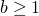。您可能需要展开对话框才能查看 **Data** 表中的所有列。有关如何输入数据的详细信息，请参阅["Entering tabular data," Section 3.2.7](pt01ch03s02s07.md)。
8. 从 **子选项** 菜单中选择 **Drucker Prager Hardening** 以指定 Drucker-Prager 模型的强化数据。详细信息请参见“["Defining Drucker-Prager hardening](pt03ch12s09s02.md#usi-prp-mechanical-plastic-druckerprager-hardening)”。
9. 如果需要，从 **子选项** 菜单中选择 **Drucker Prager Creep** 来指定 Drucker-Prager 模型的蠕变数据。仅当您从 **剪切准则** 选项列表中选择 **线性** 并执行 Abaqus/Standard 分析时，此选项才有效。详情请参见“["Defining Drucker-Prager creep](pt03ch12s09s02.md#usi-prp-mechanical-plastic-druckerprager-creep)”。
10. 如果您在步骤 4 中打开了 **使用子选项三轴测试数据**，请从 **子选项** 菜单中选择 **三轴测试数据** 以输入三轴测试数据。详细信息请参见“["Specifying triaxial test data for a Drucker-Prager material model](pt03ch12s09s02.md#usi-prp-mechanical-plastic-druckerprager-triaxial)”。
11. 单击“**确定**”创建材质并关闭“**编辑材质**”对话框。或者，您可以从 **编辑材质** 对话框中的菜单中选择要定义的另一种材质行为（有关详细信息，请参阅["Browsing and modifying material behaviors," Section 12.7.2](pt03ch12s07hlb02.md)）。

#### 定义 Drucker-Prager 强化

使用 **子选项编辑器** 指定 Drucker-Prager 模型的强化数据。有关 Drucker-Prager 强化的更多信息，请参阅["Hardening and rate dependence" in "Extended Drucker-Prager models," Section 23.3.1 of the Abaqus Analysis User's Guide](../usb/usb-link.md#usb-mat-cdruckerprager-hardening)。

**定义 Drucker-Prager 强化：**

1. 按照["Defining a Drucker-Prager model](pt03ch12s09s02.md#usi-prp-mechanical-plastic-druckerprager-model)中的描述创建材料模型。”
2. 从“编辑材料”对话框的“子选项”菜单中，选择“Drucker Prager 硬化”。出现 **子选项编辑器**。
3. 选择您选择的**强化行为类型**。屈服面随塑性变形的演变用等效应力来描述，您可以选择单轴**压缩**屈服应力、单轴**拉伸**屈服应力或**剪切**（内聚）屈服应力
4. 如果您想要输入显示不同等效塑性应变率下的屈服应力值与等效塑性应变的数据，请打开**使用应变率相关数据**。 **数据**表中显示**速率**列。或者，如果要使用屈服应力比定义应变率相关性，则必须从 **编辑材料** 对话框的 **子选项** 菜单中选择 **Rate Dependent**。详细信息请参见“["Defining rate-dependent yield with yield stress ratios](pt03ch12s09s02.md#usi-prp-mechanical-plastic-plastic-rate)”。有关速率依赖性的背景信息，请参阅["Rate-dependent yield," Section 23.2.3 of the Abaqus Analysis User's Guide](../usb/usb-link.md#usb-mat-cratedependent)。
5. 打开**使用与温度相关的数据**来定义与温度相关的数据。标有 **Temp** 的列出现在 **Data** 表中。
6. 单击**字段变量数量**字段右侧的箭头，以增加或减少数据所依赖的字段变量的数量。
7. 在 **数据** 表中输入以下数据： **屈服应力** 屈服应力。 **绝对塑性应变** 相应塑性应变的绝对值。 （输入的第一个表格值必须始终为零。） **速率** 等效塑性应变速率，适用该硬化曲线。 **温度** 温度。 **字段 *n*** 预定义的字段变量。您可能需要展开对话框才能查看 **Data** 表中的所有列。有关如何输入数据的详细信息，请参阅["Entering tabular data," Section 3.2.7](pt01ch03s02s07.md)。
8. 单击“**确定**”返回“**编辑材质**”对话框。

#### 定义 Drucker-Prager 蠕变

您可以根据 Abaqus/Standard 分析中的扩展 Drucker-Prager 模型定义具有塑性的材料的经典“蠕变”行为。此类材料中的蠕变行为与塑性行为密切相关（通过蠕变流动势的定义和测试数据的定义），因此您必须在材料定义中包含 Drucker-Prager 塑性和 Drucker-Prager 硬化数据。

您输入的蠕变数据必须与您在定义 Drucker-Prager 硬化时选择的**硬化行为类型**一致（有关详细信息，请参阅“["Defining Drucker-Prager hardening](pt03ch12s09s02.md#usi-prp-mechanical-plastic-druckerprager-hardening)”）。

有关详细信息，请参阅["Creep models for the linear Drucker-Prager model" in "Extended Drucker-Prager models," Section 23.3.1 of the Abaqus Analysis User's Guide](../usb/usb-link.md#usb-mat-cdruckerprager-creep)。

**定义 Drucker-Prager 蠕变：**

1. 按照["Defining a Drucker-Prager model](pt03ch12s09s02.md#usi-prp-mechanical-plastic-druckerprager-model)中的描述创建材料模型。”
2. 从“编辑材料”对话框的“子选项”菜单中，选择“Drucker Prager 蠕变”。出现 **子选项编辑器**。
3. 单击 **Law** 字段右侧的箭头，然后选择您选择的蠕变定律选项： - 选择 **Strain** 以选择应变硬化幂律。 - 选择 **Time** 以选择时间硬化幂律 - 选择 **SinghM** 以选择 Singh-Mitchell 类型定律。 - 选择**用户**，通过用户子程序[`CREEP`](../sub/sub-link.md#sub-xsl-creep)指定蠕变规律。有关更多信息，请参阅["Specifying a creep law" in "Extended Drucker-Prager models," Section 23.3.1 of the Abaqus Analysis User's Guide](../usb/usb-link.md#usb-mat-cdruckerprager-creeplaw)。
4. 打开**使用与温度相关的数据**来定义与温度相关的数据。标有 **Temp** 的列出现在 **Data** 表中。
5. 单击**字段变量数量**字段右侧的箭头，以增加或减少数据所依赖的字段变量的数量。
6. 如果您选择了“**应变**”或“**时间**蠕变规律”选项，请在“**数据**”表中输入以下数据：**A、n 和 m** 蠕变材料参数。 **温度** 温度。 **字段 *n*** 预定义的字段变量。您可能需要展开对话框才能查看 **Data** 表中的所有列。有关如何输入数据的详细信息，请参阅["Entering tabular data," Section 3.2.7](pt01ch03s02s07.md)。
7. 如果选择 **SinghM** 蠕变定律选项，请在 **数据** 表中输入以下数据：**A、alpha、m 和 t1** 蠕变材料参数 *A*、、和 *m*。 **温度** 温度。 **字段 *n*** 预定义的字段变量。您可能需要展开对话框才能查看 **Data** 表中的所有列。有关如何输入数据的详细信息，请参阅["Entering tabular data," Section 3.2.7](pt01ch03s02s07.md)。
8. 单击“**确定**”返回“**编辑材质**”对话框。

#### 指定 Drucker-Prager 材料模型的三轴测试数据

Abaqus 可以使用三轴测试数据来校准定义 Drucker-Prager 塑性的**指数形式**的材料参数。有关详细信息，请参阅["General exponent model" in "Extended Drucker-Prager models," Section 23.3.1 of the Abaqus Analysis User's Guide](../usb/usb-link.md#usb-mat-cdruckerprager-triaxial)。

**输入三轴测试数据：**

1. 按照["Defining a Drucker-Prager model](pt03ch12s09s02.md#usi-prp-mechanical-plastic-druckerprager-model)中的描述创建材料模型。”
2. 从“编辑材料”对话框的“子选项”菜单中，选择“三轴测试数据”。出现 **子选项编辑器**。
3. 输入 **材料常量 a**、**材料常量 b** 和 **材料常量 pt** 的值（如果这些值已知且固定为输入值）。或者，如果您希望 Abaqus 校准三轴测试数据中的值，则可以将一个或多个字段留空。
4. 在 **数据** 表中输入以下数据： **围压** 围压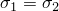的符号和大小。 **加载方向应力** 加载方向上的应力符号和大小，。有关如何输入数据的详细信息，请参阅["Entering tabular data," Section 3.2.7](pt01ch03s02s07.md)。
5. 单击**确定**返回**编辑材质**对话框。

### 定义莫尔-库仑塑性

您可以将 Mohr-Coulomb 塑性模型用于岩土工程设计应用。该模型使用经典的莫尔-哥伦布屈服准则：子午面中的直线和偏平面中的不规则六边形截面。然而，Abaqus Mohr-Coulomb 模型具有完全平滑的流势，而不是经典的六角金字塔：流势是子午平面上的双曲线，并且它使用 Mentrey 和 Willam 提出的平滑偏截面。有关详细信息，请参阅["Mohr-Coulomb plasticity," Section 23.3.3 of the Abaqus Analysis User's Guide](../usb/usb-link.md#usb-mat-cmohrcoulomb)。

**定义莫尔-库仑塑性**

1. 从 **编辑材料** 对话框的菜单栏中，选择****机械****塑性****莫尔库仑塑性****。 （有关显示 **编辑材质** 对话框的信息，请参阅["Creating or editing a material," Section 12.7.1](pt03ch12s07hlb01.md)。）
2. 如有必要，单击 **塑性** 选项卡以显示 **塑性** 选项卡页。
3. 选择如何定义 **偏偏心率**，*e*： - 选择 **计算默认** 以允许 Abaqus 将偏偏心率计算为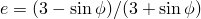，其中是您在 **数据** 表中指定的莫尔-库仑 **摩擦角**。 - 选择**指定**，然后在提供的字段中输入偏偏心率的值。 *e* 的值范围是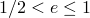。
4. 输入**经向偏心率**值，。子午偏心率是一个小的正数，定义了流势接近其渐近线的速率。
5. 打开**使用与温度相关的数据**来定义与温度相关的数据。标有 **Temp** 的列出现在 **Data** 表中。
6. 单击**字段变量数量**字段右侧的箭头，以增加或减少数据所依赖的字段变量的数量。
7. 在 **数据** 表中输入以下数据： **摩擦角** *p*--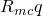平面中高围压下的摩擦角。输入以度为单位的值。 **膨胀角** *p*--平面中高围压下的膨胀角。输入以度为单位的值。 **温度** 温度。 **字段 *n*** 预定义的字段变量。您可能需要展开对话框才能查看 **Data** 表中的所有列。有关如何输入数据的详细信息，请参阅["Entering tabular data," Section 3.2.7](pt01ch03s02s07.md)。
8. 单击“**内聚**”选项卡以显示“**内聚**”选项卡页。
9. 打开**使用与温度相关的数据**来定义与温度相关的数据。标有 **Temp** 的列出现在 **Data** 表中。
10. 单击**字段变量数**字段右侧的箭头，以增加或减少数据所依赖的字段变量的数量。
11. 在 **数据** 表中输入以下数据： **内聚屈服应力** 内聚屈服应力。 **绝对塑性应变** 相应塑性应变的绝对值。 （输入的第一个表格值必须始终为零。） **温度** 温度。 **字段 *n*** 预定义的字段变量。您可能需要展开对话框才能查看 **Data** 表中的所有列。有关如何输入数据的详细信息，请参阅["Entering tabular data," Section 3.2.7](pt01ch03s02s07.md)。
12. 如果需要，打开 **指定张力截止** 并单击 **张力截止** 选项卡以指定张力截止应力数据，以限制拉伸区域附近材料模型的承载能力。
13. 打开**使用与温度相关的数据**来定义与温度相关的数据。标有 **Temp** 的列出现在 **Data** 表中。
14. 单击**字段变量数量**字段右侧的箭头，以增加或减少数据所依赖的字段变量的数量。
15. 在**数据**表中输入以下数据：**拉伸截止应力** 单轴拉伸时的屈服应力，。 **拉伸塑性应变** 相应的塑性应变。 （输入的第一个表格值必须始终为零。） **温度** 温度。 **字段 *n*** 预定义的字段变量。您可能需要展开对话框才能查看 **Data** 表中的所有列。有关如何输入数据的详细信息，请参阅["Entering tabular data," Section 3.2.7](pt01ch03s02s07.md)。
16. 单击“**确定**”创建材质并关闭“**编辑材质**”对话框。或者，您可以从 **编辑材质** 对话框中的菜单中选择要定义的另一种材质行为（有关详细信息，请参阅["Browsing and modifying material behaviors," Section 12.7.2](pt03ch12s07hlb02.md)）。

### 定义多孔金属塑性

您可以将多孔金属塑性模型用于具有稀浓度孔隙且相对密度大于 0.9 的材料。有关详细信息，请参阅["Porous metal plasticity," Section 23.2.9 of the Abaqus Analysis User's Guide](../usb/usb-link.md#usb-mat-cpormetalplas)。

#### 定义多孔金属塑性模型

多孔金属塑性模型描述了以空洞萌生和生长形式表现出损伤的材料。您还可以使用此模型进行一些高相对密度下的粉末金属工艺模拟（相对密度定义为固体材料的体积与材料总体积的比率）。该模型基于具有空核作用的 Gurson 多孔金属塑性理论，适用于相对密度大于 0.9 的材料。该模型足以满足相对单调的加载。

有关详细信息，请参阅["Porous metal plasticity," Section 23.2.9 of the Abaqus Analysis User's Guide](../usb/usb-link.md#usb-mat-cpormetalplas)。

**定义多孔金属塑性：**

1. 从**编辑材料**对话框的菜单栏中，选择****机械****塑性****多孔金属塑性****。 （有关显示 **编辑材质** 对话框的信息，请参阅["Creating or editing a material," Section 12.7.1](pt03ch12s07hlb01.md)。）
2. 输入材料的初始**相对密度**值。
3. 打开**使用与温度相关的数据**来定义与温度相关的数据。标有 **Temp** 的列出现在 **Data** 表中。
4. 单击**字段变量数量**字段右侧的箭头，以增加或减少数据所依赖的字段变量的数量。
5. 在**数据**表中输入以下数据：**q1、q2 和 q3** 材料参数、、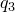。对于典型金属，文献中报道的参数范围为= 1.0 至 1.5、= 1.0 和=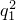= 1.0 至 2.25（参见["Necking of a round tensile bar," Section 1.1.9 of the Abaqus Benchmarks Guide](../bmk/bmk-link.md#bmk-anl-neckingtensilebar)）。当=== 1.0 时，恢复原始 Gurson 模型。 **温度** 温度。 **字段 *n*** 预定义的字段变量。您可能需要展开对话框才能查看 **Data** 表中的所有列。有关如何输入数据的详细信息，请参阅["Entering tabular data," Section 3.2.7](pt01ch03s02s07.md)。
6. 如果需要，从 **子选项** 菜单中选择 **多孔失效准则**，为 Abaqus/Explicit 分析指定材料失效准则。详细信息请参见“["Defining porous material failure criteria](pt03ch12s09s02.md#usi-prp-mechanical-plastic-porousmetal-failure)”。
7. 如果需要，从 **子选项** 菜单中选择 **Void Nucleation** 以定义多孔材料中的空穴成核。详情请参见“["Defining void nucleation in a porous material](pt03ch12s09s02.md#usi-prp-mechanical-plastic-porousmetal-void)”。
8. 单击“**确定**”创建材质并关闭“**编辑材质**”对话框。或者，您可以从 **编辑材质** 对话框中的菜单中选择要定义的另一种材质行为（有关详细信息，请参阅["Browsing and modifying material behaviors," Section 12.7.2](pt03ch12s07hlb02.md)）。

#### 定义多孔材料失效标准

您可以使用 **子选项编辑器** 定义多孔金属塑性模型中的失效。有关详细信息，请参阅["Failure criteria in Abaqus/Explicit" in "Porous metal plasticity," Section 23.2.9 of the Abaqus Analysis User's Guide](../usb/usb-link.md#usb-mat-cpormetalplas-failure)。

**指定多孔金属失效标准：**

1. 按照["Defining a porous metal plasticity model](pt03ch12s09s02.md#usi-prp-mechanical-plastic-porousmetal-model)中的描述创建材料模型。”
2. 从“编辑材料”对话框的“子选项”菜单中，选择“多孔失效准则”。出现 **子选项编辑器**。
3. 输入**完全失效时的总体积空隙率**值，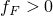。默认值为 1。
4. 输入 **临界空隙体积分数**（应力承载能力快速损失的阈值）的值。默认为。
5. 单击**确定**返回**编辑材质**对话框。

#### 定义多孔材料中的空隙成核

您可以使用 **子选项编辑器** 定义多孔金属塑性模型中空洞的成核。有关详细信息，请参阅["Void growth and nucleation" in "Porous metal plasticity," Section 23.2.9 of the Abaqus Analysis User's Guide](../usb/usb-link.md#usb-mat-cpormetalplas-void)。

**定义空洞成核：**

1. 按照["Defining a porous metal plasticity model](pt03ch12s09s02.md#usi-prp-mechanical-plastic-porousmetal-model)中的描述创建材料模型。”
2. 从“编辑材料”对话框的“子选项”菜单中，选择“空成核”。出现 **子选项编辑器**。
3. 打开**使用与温度相关的数据**来定义与温度相关的数据。标有 **Temp** 的列出现在 **Data** 表中。
4. 单击**字段变量数量**字段右侧的箭头，以增加或减少数据所依赖的字段变量的数量。
5. 在 **数据** 表中输入以下数据： **平均值** 成核应变正态分布的平均值。 **标准偏差** 成核应变正态分布的标准偏差，。 **体积分数** 成核空隙的体积分数，。 **温度** 温度。 **字段 *n*** 预定义的字段变量。您可能需要展开对话框才能查看 **Data** 表中的所有列。有关如何输入数据的详细信息，请参阅["Entering tabular data," Section 3.2.7](pt01ch03s02s07.md)。
6. 单击“**确定**”返回“**编辑材质**”对话框。

### 定义蠕变定律

如果您正在执行 Abaqus/Standard 分析，则可以通过指定用户子例程[`CREEP`](../sub/sub-link.md#sub-xsl-creep)或为一些简单的蠕变定律提供参数来定义经典的偏金属蠕变行为。有关详细信息，请参阅["Rate-dependent plasticity: creep and swelling," Section 23.2.4 of the Abaqus Analysis User's Guide](../usb/usb-link.md#usb-mat-cratedepcreep)。

**定义蠕变：**

1. 从**编辑材质**对话框的菜单栏中，选择****机械****塑性****蠕变****。 （有关显示 **编辑材质** 对话框的信息，请参阅["Creating or editing a material," Section 12.7.1](pt03ch12s07hlb01.md)。）
2. 单击 **Law** 字段右侧的箭头，然后选择您选择的蠕变规则。有关详细信息，请参阅["Creep behavior" in "Rate-dependent plasticity: creep and swelling," Section 23.2.4 of the Abaqus Analysis User's Guide](../usb/usb-link.md#usb-mat-cratedepcreep-creepbehavior)。
3. 打开**使用与温度相关的数据**来定义与温度相关的数据。标有 **Temp** 的列出现在 **Data** 表中。
4. 单击**字段变量数量**字段右侧的箭头，以增加或减少数据所依赖的字段变量的数量。
5. 如果您选择了**应变硬化**或**时间硬化**蠕变定律，请在**数据**表中输入以下数据：**幂律乘数** 幂律乘数，*A*。 （[F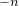LT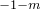的单位](../popups/usb-int-iconventions-unitsym.md)。） **Eq 应力阶** 等效偏应力阶，*n*。 **时间顺序** 总时间顺序 *m*，适用于 **时间硬化** 蠕变定律，或应变顺序 *m*，适用于 **应变硬化** 蠕变定律。 **温度** 温度。 **字段 *n*** 预定义的字段变量。您可能需要展开对话框才能查看 **Data** 表中的所有列。有关如何输入数据的详细信息，请参阅["Entering tabular data," Section 3.2.7](pt01ch03s02s07.md)。
6. 如果您选择了 **双曲正弦** 蠕变定律，请在 **数据** 表中输入以下数据： **幂律乘数** 幂律乘数 *A*。 （单位为[T1](../popups/usb-int-iconventions-unitsym.md)。） **双曲正弦定律乘数** 双曲正弦定律乘数，*B*。 （单位为[F1L2](../popups/usb-int-iconventions-unitsym.md)。） **Eq 应力阶** 等效应力阶，*n* **活化能** 活化能，。 （[JM1](../popups/usb-int-iconventions-unitsym.md)的单位 **通用气体常数** 通用气体常数，*R*。（[JM11 的单位](../popups/usb-int-iconventions-unitsym.md)。）**温度** 温度。**字段 *n*** 预定义字段变量。您可能需要展开对话框才能查看 **数据** 表中的所有列。有关如何输入数据的详细信息，请参阅["Entering tabular data," Section 3.2.7](pt01ch03s02s07.md)。
7. 如果需要，从 **Suboptions** 菜单中选择 **Ornl** 以实施橡树岭国家实验室本构模型指定的蠕变规则。有关详细信息，请参阅“["Using the Oak Ridge National Laboratory (ORNL) constitutive model in plasticity and creep calculations](pt03ch12s09s02.md#usi-prp-mechanical-plastic-plastic-ornl)”。
8. 如果需要，从 **子选项** 菜单中选择 **潜在** 以指定各向异性蠕变行为。有关详细信息，请参阅“["Defining anisotropic yield and creep](pt03ch12s09s02.md#usi-prp-mechanical-plastic-plastic-potential)”。
9. 单击“**确定**”创建材质并关闭“**编辑材质**”对话框。或者，您可以从 **编辑材质** 对话框中的菜单中选择要定义的另一种材质行为（有关详细信息，请参阅["Browsing and modifying material behaviors," Section 12.7.2](pt03ch12s07hlb02.md)）。

### 定义肿胀

用户子程序[`CREEP`](../sub/sub-link.md#sub-xsl-creep)(["CREEP," Section 1.1.1 of the Abaqus User Subroutines Reference Guide](../sub/sub-link.md#sub-rtn-ucreep)) 提供了实现粘塑性模型（例如蠕变和膨胀模型）的非常通用的功能。但是，您也可以以表格形式输入膨胀数据。有关详细信息，请参阅["Volumetric swelling behavior" in "Rate-dependent plasticity: creep and swelling," Section 23.2.4 of the Abaqus Analysis User's Guide](../usb/usb-link.md#usb-mat-cratedepcreep-swelling)。

#### 定义体积膨胀模型

与蠕变定律一样，体积膨胀定律通常很复杂，并且最方便地在用户子程序[`CREEP`](../sub/sub-link.md#sub-xsl-creep)中指定。但是，您也可以在 **编辑材料 ** 对话框中输入表格膨胀数据。有关详细信息，请参阅["Volumetric swelling behavior" in "Rate-dependent plasticity: creep and swelling," Section 23.2.4 of the Abaqus Analysis User's Guide](../usb/usb-link.md#usb-mat-cratedepcreep-swelling)。

**定义肿胀：**

1. 从**编辑材料**对话框的菜单栏中，选择****机械****塑性****膨胀****。 （有关显示 **编辑材质** 对话框的信息，请参阅["Creating or editing a material," Section 12.7.1](pt03ch12s07hlb01.md)。）
2. 单击 **Law** 字段右侧的箭头，然后选择用于指定膨胀数据的选项： - 选择 **Input** 在 **Edit Material** 对话框中输入表格数据。 - 选择**用户定义**来定义用户子程序[`CREEP`](../sub/sub-link.md#sub-xsl-creep)中的膨胀行为
3. 如果您在步骤 2 中选择了 **输入**，请打开 **使用与温度相关的数据** 以定义与温度相关的数据。标有 **Temp** 的列出现在 **Data** 表中。
4. 如果您在步骤 2 中选择了“**输入**”，请单击“**字段变量数**”字段右侧的箭头，以增加或减少数据所依赖的字段变量的数量。
5. 如果您在步骤 2 中选择了 **输入**，请在 **数据** 表中输入以下数据： **应变率** 体积膨胀应变率。 **温度** 温度。 **字段 *n*** 预定义的字段变量。
6. 如果需要，从 **子选项** 菜单中选择 **比率** 以定义各向异性膨胀。详细信息请参见“["Defining anisotropic swelling](pt03ch12s09s02.md#usi-prp-mechanical-plastic-swelling-ratios)”。
7. 单击“**确定**”创建材质并关闭“**编辑材质**”对话框。或者，您可以从 **编辑材质** 对话框中的菜单中选择要定义的另一种材质行为（有关详细信息，请参阅["Browsing and modifying material behaviors," Section 12.7.2](pt03ch12s07hlb02.md)）。

#### 定义各向异性膨胀

您可以在**子选项编辑器**中指定比率来定义每个材料方向的膨胀率。有关详细信息，请参阅["Volumetric swelling behavior" in "Rate-dependent plasticity: creep and swelling," Section 23.2.4 of the Abaqus Analysis User's Guide](../usb/usb-link.md#usb-mat-cratedepcreep-swelling)。

**定义各向异性膨胀**

1. 按照["Defining a volumetric swelling model](pt03ch12s09s02.md#usi-prp-mechanical-plastic-swelling-model)中的描述创建材料模型。”
2. 从“编辑材质”对话框的“子选项”菜单中，选择“比率”。出现 **子选项编辑器**。
3. 打开**使用与温度相关的数据**来定义与温度相关的数据。标有 **Temp** 的列出现在 **Data** 表中。
4. 单击**字段变量数量**字段右侧的箭头，以增加或减少数据所依赖的字段变量的数量。
5. 在**数据**表中输入以下数据：**r11、r22 和 r33** 各向异性膨胀比、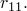、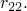和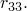。 **温度** 温度。 **字段 *n*** 预定义的字段变量。您可能需要展开对话框才能查看 **Data** 表中的所有列。有关如何输入数据的详细信息，请参阅["Entering tabular data," Section 3.2.7](pt01ch03s02s07.md)。
6. 单击“**确定**”返回“**编辑材质**”对话框。

### 定义两层粘塑性模型的粘性分量

Abaqus/Standard 中的两层粘塑性模型对于对观察到显着的时间依赖性行为和塑性的材料进行建模非常有用。对于金属来说，这通常发生在高温下。该模型由三部分组成：弹性、塑性和粘性。您可以通过选择蠕变定律并输入粘度参数来定义材料的粘性行为。有关详细信息，请参阅["Two-layer viscoplasticity," Section 23.2.11 of the Abaqus Analysis User's Guide](../usb/usb-link.md#usb-mat-cviscous)。

**定义两层粘塑性模型的粘度：**

1. 从 **编辑材质** 对话框的菜单栏中，选择****机械****塑性****粘性****。 （有关显示 **编辑材质** 对话框的信息，请参阅["Creating or editing a material," Section 12.7.1](pt03ch12s07hlb01.md)。）
2. 单击 **Law** 字段右侧的箭头，然后选择您选择的蠕变定律： - 选择 **Strain** 以选择应变硬化幂律。 - 选择**时间**以选择时间强化幂律。 - 选择**用户**，使用用户子程序[`CREEP`](../sub/sub-link.md#sub-xsl-creep)定义蠕变定律。有关详细信息，请参阅["Creep behavior" in "Rate-dependent plasticity: creep and swelling," Section 23.2.4 of the Abaqus Analysis User's Guide](../usb/usb-link.md#usb-mat-cratedepcreep-creepbehavior)。
3. 打开**使用与温度相关的数据**来定义与温度相关的数据。标有 **Temp** 的列出现在 **Data** 表中。
4. 单击**字段变量数量**字段右侧的箭头，以增加或减少数据所依赖的字段变量的数量。
5. 如果您选择了 **应变硬化** 或 **时间硬化** 蠕变定律，请在 **数据** 表中输入以下数据： **A** 幂律乘数，*A*。 （[FLT的单位](../popups/usb-int-iconventions-unitsym.md)。） **n** 等效偏应力阶数，*n*。 **m** 总时间或等效蠕变应变阶数，*m*。 **f** 分数 *f*，定义弹性粘性网络的弹性模量与总（瞬时）模量的比率。 **温度** 温度。 **字段 *n*** 预定义的字段变量。您可能需要展开对话框才能查看 **Data** 表中的所有列。有关如何输入数据的详细信息，请参阅["Entering tabular data," Section 3.2.7](pt01ch03s02s07.md)。
6. 如果使用用户子程序[`CREEP`](../sub/sub-link.md#sub-xsl-creep)定义蠕变定律，请在 **数据** 表中输入以下内容： **f** 分数 *f*，定义弹性粘性网络的弹性模量与总（瞬时）模量的比率。 **温度** 温度。 **字段 *n*** 预定义的字段变量。有关如何输入数据的详细信息，请参阅["Entering tabular data," Section 3.2.7](pt01ch03s02s07.md)。
7. 如果需要，从 **子选项** 菜单中选择 **潜在** 以定义各向异性粘度。详情请参见“["Defining anisotropic yield and creep](pt03ch12s09s02.md#usi-prp-mechanical-plastic-plastic-potential)”。
8. 单击“**确定**”创建材质并关闭“**编辑材质**”对话框。或者，您可以从 **编辑材质** 对话框中的菜单中选择要定义的另一种材质行为（有关详细信息，请参阅["Browsing and modifying material behaviors," Section 12.7.2](pt03ch12s07hlb02.md)）。

