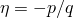
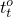
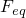
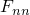
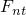
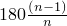
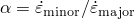
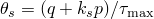
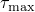

# 12.9.3 定义伤害

您可以使用 **编辑材料** 对话框来指定材料损伤引发标准和相关的损伤演变。一旦满足启动标准，Abaqus 就会应用相关的损伤演化定律来确定材料退化。您可以在 Abaqus/CAE 中指定以下类型的损伤：
- **延展性**；见["Ductile damage](pt03ch12s09s03.md#usi-prp-mechanical-damage-ductile)”
- **FLD**；见["Forming limit diagram (FLD) damage](pt03ch12s09s03.md#usi-prp-mechanical-damage-fld)”
- **FLSD**；见["Forming limit stress diagram (FLSD) damage](pt03ch12s09s03.md#usi-prp-mechanical-damage-flsd)”
- **约翰逊-库克**；见["Johnson-Cook damage](pt03ch12s09s03.md#usi-prp-mechanical-damage-jc)”
- **Maxe** 或 **Quade**；见["Maximum or quadratic nominal strain damage](pt03ch12s09s03.md#usi-prp-mechanical-damage-maxquade)”
- **最大**或**四边形**；参见["Maximum or quadratic nominal stress damage](pt03ch12s09s03.md#usi-prp-mechanical-damage-maxquads)”
- **Maxps** 或 **Maxpe**；见["Maximum principal stress or strain damage](pt03ch12s09s03.md#usi-prp-mechanical-damage-maxpsmaxpe)”
- **M-K**；见["Marciniak-Kuczynski (M-K) damage](pt03ch12s09s03.md#usi-prp-mechanical-damage-mk)”
- **MSFLD**；见["Mschenborn-Sonne forming limit diagram (MSFLD) damage](pt03ch12s09s03.md#usi-prp-mechanical-damage-msfld)”
- **剪切**；见["Shear damage](pt03ch12s09s03.md#usi-prp-mechanical-damage-shear)”
- **哈辛**；参见["Hashin damage](pt03ch12s09s03.md#usi-prp-mechanical-damage-hashin)”
- **马林斯效应**；参见["Mullins effect](pt03ch12s09s03.md#usi-prp-mechanical-damage-mullins)”

您可以定义多个损伤引发标准和损伤演化模型，以准确表示材料的行为。当满足损伤开始标准时，材料损伤就开始了。 Abaqus 使用与引发准则相关的损伤演化定义来评估损伤的程度。["Damage evolution](pt03ch12s09s03.md#usi-prp-mechanical-damage-evolution)中描述了损伤演变。”如果您不定义损伤演化，Abaqus 会继续评估损伤起始标准，以指示分析超出起始点的程度。

除了损伤萌生和演化之外，Abaqus/Standard 还使用粘性正则化方案来改善纤维增强复合材料（Hashin 损伤模型）损伤时的收敛性。["Damage stabilization](pt03ch12s09s03.md#usi-prp-mechanical-damage-stabilization)”列出了该方案所需的粘性系数。

有关材料损伤的更多信息，请参阅[Chapter 24, "Progressive Damage and Failure," of the Abaqus Analysis User's Guide](../usb/usb-link.md#usbdamage)。

### 延展性损伤

**延性**损伤起始准则是一个模型，用于预测由于延性金属中空洞的成核、生长和合并而引起的损伤的发生。该模型假设损伤开始时的等效塑性应变是应力三轴性和应变率的函数。延性准则可与 Mises、Johnson-Cook、Hill 和 Drucker-Prager 塑性模型（包括状态方程）结合使用。

有关详细信息，请参阅["Damage initiation for ductile metals," Section 24.2.2 of the Abaqus Analysis User's Guide](../usb/usb-link.md#usb-mat-cdamageinitductile)。

**定义延性损伤：**

1. 从 **编辑材料** 对话框的菜单栏中，选择****机械****延性金属损伤****延性损伤****。 （有关显示 **编辑材质** 对话框的信息，请参阅["Creating or editing a material," Section 12.7.1](pt03ch12s07hlb01.md)。）
2. 要定义取决于温度的材料损伤数据，请打开 **使用与温度相关的数据**。标有 **Temp** 的列出现在 **Data** 表中。
3. 要定义依赖于字段变量的行为数据，请单击 **字段变量数量** 字段右侧的箭头以增加或减少字段变量的数量。 **字段**变量列出现在**数据**表中。
4. 在 **数据** 表中输入损伤参数： **断裂应变** 损伤开始时的等效断裂应变。 **应力三轴度** 应力三轴度定义为，其中 *p* 是压应力，*q* 是米塞斯等效应力。 **应变率** 等效塑性应变率，。 **温度** 温度，。 **字段 *n*** 预定义的字段变量。您可能需要展开对话框才能查看 **Data** 表中的所有列。有关如何输入数据的详细信息，请参阅["Entering tabular data," Section 3.2.7](pt01ch03s02s07.md)。
5. 选择****子选项****损伤演化****来定义损伤开始后发生的材料退化。欲了解更多信息，请参阅["Damage evolution](pt03ch12s09s03.md#usi-prp-mechanical-damage-evolution)。”
6. 单击**确定**退出材质编辑器。

### 成形极限图（FLD）损伤

成形极限图 (FLD) 是主（面内）对数应变空间中的成形极限应变图。 **FLD** 损伤起始准则旨在预测金属板材成形中颈缩不稳定的发生。板材在颈缩开始之前可以承受的最大应变称为成形极限应变。

无法使用此模型评估弯曲变形造成的损伤。有关详细信息，请参阅["Damage initiation for ductile metals," Section 24.2.2 of the Abaqus Analysis User's Guide](../usb/usb-link.md#usb-mat-cdamageinitductile)。

**定义 FLD 损伤：**

1. 从 **编辑材料** 对话框的菜单栏中，选择****机械****延性金属损伤****FLD 损伤****。 （有关显示 **编辑材质** 对话框的信息，请参阅["Creating or editing a material," Section 12.7.1](pt03ch12s07hlb01.md)。）
2. 要定义取决于温度的材料损伤数据，请打开 **使用与温度相关的数据**。标有 **Temp** 的列出现在 **Data** 表中。
3. 要定义依赖于字段变量的行为数据，请单击 **字段变量数量** 字段右侧的箭头以增加或减少字段变量的数量。 **字段**变量列出现在**数据**表中。
4. 在**数据**表中输入损伤参数： **主主应变** 面内主极限应变的最大值。 **次要主应变** 面内主极限应变的最小值。 **温度** 温度，。 **字段 *n*** 预定义的字段变量。您可能需要展开对话框才能查看 **Data** 表中的所有列。有关如何输入数据的详细信息，请参阅["Entering tabular data," Section 3.2.7](pt01ch03s02s07.md)。
5. 选择****子选项****损伤演化****来定义损伤开始后发生的材料退化。欲了解更多信息，请参阅["Damage evolution](pt03ch12s09s03.md#usi-prp-mechanical-damage-evolution)。”
6. 单击**确定**退出材质编辑器。

### 成形极限应力图（FLSD）损伤

**FLSD** 损伤起始准则旨在预测金属板材成形中颈缩不稳定的发生。基于应变的成形极限曲线（如[FLD criterion](pt03ch12s09s03.md#usi-prp-mechanical-damage-fld)中使用的）被转换为基于应力的曲线，以减少对应变路径的依赖性。这提高了 FLSD 损伤模型在任意载荷条件下的性能。

与 FLD 准则类似，无法使用该模型评估弯曲变形造成的损伤。有关详细信息，请参阅["Damage initiation for ductile metals," Section 24.2.2 of the Abaqus Analysis User's Guide](../usb/usb-link.md#usb-mat-cdamageinitductile)。

**定义 FLSD 损伤：**

1. 从 **编辑材料** 对话框的菜单栏中，选择****机械****延性金属损伤****FLSD 损伤****。 （有关显示 **编辑材质** 对话框的信息，请参阅["Creating or editing a material," Section 12.7.1](pt03ch12s07hlb01.md)。）
2. 要定义取决于温度的材料损伤数据，请打开 **使用与温度相关的数据**。标有 **Temp** 的列出现在 **Data** 表中。
3. 要定义依赖于字段变量的行为数据，请单击 **字段变量数量** 字段右侧的箭头以增加或减少字段变量的数量。 **字段**变量列出现在**数据**表中。
4. 在**数据**表中输入损伤参数： **主主应力** 面内主极限应力的最大值。 **次主应力** 面内主极限应力的最小值。 **温度** 温度，。 **字段 *n*** 预定义的字段变量。您可能需要展开对话框才能查看 **Data** 表中的所有列。有关如何输入数据的详细信息，请参阅["Entering tabular data," Section 3.2.7](pt01ch03s02s07.md)。
5. 选择****子选项****损伤演化****来定义损伤开始后发生的材料退化。欲了解更多信息，请参阅["Damage evolution](pt03ch12s09s03.md#usi-prp-mechanical-damage-evolution)。”
6. 单击**确定**退出材质编辑器。

### 约翰逊-库克伤害

**Johnson-Cook** 损伤起始准则是[ductile damage](pt03ch12s09s03.md#usi-prp-mechanical-damage-ductile)准则模型的一个特例，用于预测由于延展性金属中空洞的成核、生长和聚结而引起的损伤的起始。该模型假设损伤开始时的等效塑性应变是应力三轴性和应变率的函数。 Johnson-Cook 准则可与 Mises、Johnson-Cook、Hill 和 Drucker-Prager 塑性模型（包括状态方程）结合使用。

有关详细信息，请参阅["Damage initiation for ductile metals," Section 24.2.2 of the Abaqus Analysis User's Guide](../usb/usb-link.md#usb-mat-cdamageinitductile)。

**定义 Johnson-Cook 损伤：**

1. 从 **编辑材料** 对话框的菜单栏中，选择****机械****延性金属损伤****Johnson-Cook 损伤****。 （有关显示 **编辑材质** 对话框的信息，请参阅["Creating or editing a material," Section 12.7.1](pt03ch12s07hlb01.md)。）
2. 在**数据**表中输入损伤参数：**--** 故障参数。 **熔化温度**。 **转变温度**。 **参考应变率**您可能需要展开对话框才能查看 **数据** 表中的所有列。有关如何输入数据的详细信息，请参阅["Entering tabular data," Section 3.2.7](pt01ch03s02s07.md)。
3. 选择****子选项****损伤演化****来定义损伤开始后发生的材料退化。欲了解更多信息，请参阅["Damage evolution](pt03ch12s09s03.md#usi-prp-mechanical-damage-evolution)。”
4. 单击**确定**退出材质编辑器。

### 最大或二次标称应变损伤

**Maxe** 和 **Quade** 损伤起始标准用于预测粘性单元中的损伤起始，其中粘性层根据牵引分离来定义。两种形式都评估三个方向上给定应变值与峰值标称应变值之间的应变比。、和分别表示变形纯粹垂直于界面或纯粹沿第一或第二剪切方向时的标称应变峰值。 **Maxe** 准则基于三个比率的最大值，而 **Quade** 准则基于所有三个比率的二次组合。

有关详细信息，请参阅["Defining the constitutive response of cohesive elements using a traction-separation description," Section 32.5.6 of the Abaqus Analysis User's Guide](../usb/usb-link.md#usb-elm-ecohesivebehavior)。

**定义 **Maxe** 或 **Quade** 伤害：**

1. 从“编辑材质”对话框的菜单栏中，选择“机械”“牵引分离定律的损伤”“最大损伤”或“四元损伤”。 （有关显示 **编辑材质** 对话框的信息，请参阅["Creating or editing a material," Section 12.7.1](pt03ch12s07hlb01.md)。）
2. 如果您使用扩展有限元法 (XFEM) 来模拟断裂，则可以在满足损伤萌生准则时指定裂纹扩展方向。裂纹可以沿局部 1 方向（默认）的 **法线** 方向或局部 1 方向的 **平行** 方向延伸。
3. 输入**公差**。该值应等于必须满足损伤引发标准的公差。
4. 选择 **Position** 字段右侧的箭头，然后选择计算裂纹尖端之前的应力/应变场的方法，以确定是否满足损伤萌生准则并确定裂纹扩展方向（如果需要）： - 选择 **Centroid** 以使用单元质心处的应力/应变。 - 选择 **裂纹尖端** 以使用外推到裂纹尖端的应力/应变。 - 选择 **组合 ** 使用外推到裂纹尖端的应力/应变来确定是否满足损伤萌生准则，并使用单元质心处的应力/应变来确定裂纹扩展方向（如果需要）。
5. 要定义取决于温度的材料损伤数据，请打开 **使用与温度相关的数据**。标有 **Temp** 的列出现在 **Data** 表中。
6. 要定义依赖于字段变量的行为数据，请单击 **字段变量数量** 字段右侧的箭头以增加或减少字段变量的数量。 **字段**变量列出现在**数据**表中。
7. 在 **数据** 表中输入损伤参数： **标称应变仅正常模式** 仅正常模式下损伤开始时的标称应变。 **标称应变仅剪切模式第一方向** 仅剪切模式下损伤开始时的标称应变，仅涉及沿第一剪切方向的分离。 **仅剪切模式第二方向的标称应变** 仅剪切模式下损伤开始时的标称应变，仅涉及沿第二剪切方向的分离。 **温度** 温度，。 **字段 *n*** 预定义的字段变量。您可能需要展开对话框才能查看 **Data** 表中的所有列。有关如何输入数据的详细信息，请参阅["Entering tabular data," Section 3.2.7](pt01ch03s02s07.md)。
8. 选择****子选项****损伤演化****来定义损伤开始后发生的材料退化。有关详细信息，请参阅["Damage evolution](pt03ch12s09s03.md#usi-prp-mechanical-damage-evolution)。”
9. 选择****子选项****损伤稳定内聚****来输入粘性系数并提高模型收敛性。欲了解更多信息，请参阅["Damage stabilization](pt03ch12s09s03.md#usi-prp-mechanical-damage-stabilization)。”
10. 单击**确定**退出材质编辑器。

### 最大或二次标称应力损伤

**Maxs** 和 **Quads** 损伤起始标准用于预测粘性单元中的损伤起始，其中粘性层根据牵引分离来定义。两种形式均评估三个方向上给定应力值与峰值标称应力值之间的应力比。、和分别表示变形纯粹垂直于界面或纯粹沿第一或第二剪切方向时的标称应力峰值。 **Maxs** 标准基于三个比率的最大值，而 **Quads** 标准基于所有三个比率的二次组合。

有关详细信息，请参阅["Defining the constitutive response of cohesive elements using a traction-separation description," Section 32.5.6 of the Abaqus Analysis User's Guide](../usb/usb-link.md#usb-elm-ecohesivebehavior)。

**定义**最大**或**四边形**伤害：**

1. 从“编辑材质”对话框的菜单栏中，选择“机械”“牵引分离定律的损伤”“最大损伤”或“四边形损伤”。 （有关显示 **编辑材质** 对话框的信息，请参阅["Creating or editing a material," Section 12.7.1](pt03ch12s07hlb01.md)。）
2. 如果使用扩展有限元法 (XFEM) 来模拟断裂，则可以在满足损伤萌生准则时选择裂纹扩展方向。裂纹可以在垂直于单元局部 1 方向（默认）的方向或平行于单元局部 1 方向延伸。
3. 输入**公差**。该值应等于必须满足损伤引发标准的公差。
4. 选择 **Position** 字段右侧的箭头，然后选择计算裂纹尖端之前的应力/应变场的方法，以确定是否满足损伤萌生准则并确定裂纹扩展方向（如果需要）： - 选择 **Centroid** 以使用单元质心处的应力/应变。 - 选择 **裂纹尖端** 以使用外推到裂纹尖端的应力/应变。 - 选择 **组合 ** 使用外推到裂纹尖端的应力/应变来确定是否满足损伤萌生准则，并使用单元质心处的应力/应变来确定裂纹扩展方向（如果需要）。
5. 要定义取决于温度的材料损伤数据，请打开 **使用与温度相关的数据**。标有 **Temp** 的列出现在 **Data** 表中。
6. 要定义依赖于字段变量的行为数据，请单击 **字段变量数量** 字段右侧的箭头以增加或减少字段变量的数量。 **字段**变量列出现在**数据**表中。
7. 在 **数据** 表中输入损伤参数： **仅正常模式下的最大标称应力** 仅正常模式下损伤开始时的标称应力。 **仅剪切模式第一方向的最大标称应力** 仅剪切模式下损伤萌生时的标称应力，仅涉及沿第一剪切方向的分离。 **仅剪切模式第二方向的最大标称应力** 仅剪切模式下损伤萌生时的标称应力，仅涉及沿第二剪切方向的分离。 **温度** 温度，。 **字段 *n*** 预定义的字段变量。您可能需要展开对话框才能查看 **Data** 表中的所有列。有关如何输入数据的详细信息，请参阅["Entering tabular data," Section 3.2.7](pt01ch03s02s07.md)。
8. 选择****子选项****损伤演化****来定义损伤开始后发生的材料退化。有关详细信息，请参阅["Damage evolution](pt03ch12s09s03.md#usi-prp-mechanical-damage-evolution)。”
9. 选择****子选项****损伤稳定内聚****来输入粘性系数并提高模型收敛性。欲了解更多信息，请参阅["Damage stabilization](pt03ch12s09s03.md#usi-prp-mechanical-damage-stabilization)。”
10. 单击**确定**退出材质编辑器。

### 最大主应力或应变损伤

**Maxps** 和 **Maxpe** 损伤起始标准用于预测 XFEM 富集区域中的损伤起始。

有关详细信息，请参阅["Modeling discontinuities as an enriched feature using the extended finite element method," Section 10.7.1 of the Abaqus Analysis User's Guide](../usb/usb-link.md#usb-anl-aenrichment)。

**定义 **Maxps** 或 **Maxpe** 伤害：**

1. 从 **编辑材质** 对话框的菜单栏中，选择 **机械****牵引分离定律的损伤****Maxps Damage**** 或 **Maxpe Damage**。 （有关显示 **编辑材质** 对话框的信息，请参阅["Creating or editing a material," Section 12.7.1](pt03ch12s07hlb01.md)。）
2. 输入**公差**。该值应等于必须满足损伤引发标准的公差。
3. 选择 **Position** 字段右侧的箭头，然后选择计算裂纹尖端之前的应力/应变场的方法，以确定是否满足损伤萌生准则并确定裂纹扩展方向（如果需要）： - 选择 **Centroid** 以使用单元质心处的应力/应变。 - 选择 **裂纹尖端** 以使用外推到裂纹尖端的应力/应变。 - 选择 **组合 ** 使用外推到裂纹尖端的应力/应变来确定是否满足损伤萌生准则，并使用单元质心处的应力/应变来确定裂纹扩展方向（如果需要）。
4. 要定义取决于温度的材料损伤数据，请打开 **使用与温度相关的数据**。标有 **Temp** 的列出现在 **Data** 表中。
5. 要定义依赖于字段变量的行为数据，请单击 **字段变量数量** 字段右侧的箭头以增加或减少字段变量的数量。 **字段**变量列出现在**数据**表中。
6. 在**数据**表中输入损伤参数： **最大主应力或最大主应变** 损伤开始时的最大主应力或应变。 **温度** 温度，。 **字段 *n*** 预定义的字段变量。您可能需要展开对话框才能查看 **Data** 表中的所有列。有关如何输入数据的详细信息，请参阅["Entering tabular data," Section 3.2.7](pt01ch03s02s07.md)。
7. 选择****子选项****损伤演化****来定义损伤开始后发生的材料退化。有关详细信息，请参阅["Damage evolution](pt03ch12s09s03.md#usi-prp-mechanical-damage-evolution)。”
8. 选择****子选项****损伤稳定内聚****，输入粘性系数，提高模型收敛性。欲了解更多信息，请参阅["Damage stabilization](pt03ch12s09s03.md#usi-prp-mechanical-damage-stabilization)。”
9. 单击**确定**退出材质编辑器。

### Marciniak-Kuczynski (M-K) 伤害

**M-K** 损伤起始准则用于预测任意加载路径的钣金成形极限。该模型在板材中引入了凹槽形式的厚度缺陷来模拟缺陷。当凹槽中的变形相对于原始板材厚度的变形的比率超过临界值时，就会发生损伤。默认情况下，Abaqus 在每次增量时以相对于材料局部 1 方向的等距角度 0、45、90 和 135 度评估四个凹槽，并使用最差结果来确定损伤起始。 M-K 准则可以与 Mises 和 Johnson-Cook 塑性模型结合使用，包括运动硬化。

有关详细信息，请参阅["Damage initiation for ductile metals," Section 24.2.2 of the Abaqus Analysis User's Guide](../usb/usb-link.md#usb-mat-cdamageinitductile)。

**定义 M-K 伤害：**

1. 从 **编辑材料** 对话框的菜单栏中，选择****机械****延性金属损伤****M-K 损伤****。 （有关显示 **编辑材质** 对话框的信息，请参阅["Creating or editing a material," Section 12.7.1](pt03ch12s07hlb01.md)。）
2. 要定义取决于温度的材料损伤数据，请打开 **使用与温度相关的数据**。标有 **Temp** 的列出现在 **Data** 表中。
3. 要定义依赖于字段变量的行为数据，请单击 **字段变量数量** 字段右侧的箭头以增加或减少字段变量的数量。 **字段**变量列出现在**数据**表中。
4. 如果需要，可修改临界变形严重性因子、和。每个严重性因子的默认值为 10，并且与凹槽区域中的等效塑性应变、法向应变和切向应变与标称厚度区域的比率相关。 Abaqus/Explicit 将忽略设置为 0 的严重性因子。如果所有这些参数设置为零，则 M-K 准则仅基于平衡和相容方程的不收敛。
5. 选择**频率**——计算 M-K 标准之间的增量数。使用默认频率 1 可能会很昂贵，因为 Abaqus 会在每个增量处评估每个凹槽。
6. 选择**缺陷数**——要评估的角槽位置的数量。凹槽位置相对于材料的局部 1 方向等距分布，从 0 开始，到结束。
7. 在**数据**表中输入损伤参数： **凹槽尺寸** 凹槽处的厚度与标称材料厚度的比率。 **角度** 相对于局部材料取向 1 方向的起始角度（以度为单位）。 **温度** 温度，。 **字段 *n*** 预定义的字段变量。您可能需要展开对话框才能查看 **Data** 表中的所有列。有关如何输入数据的详细信息，请参阅["Entering tabular data," Section 3.2.7](pt01ch03s02s07.md)。
8. 选择****子选项****损伤演化****来定义损伤开始后发生的材料退化。有关详细信息，请参阅["Damage evolution](pt03ch12s09s03.md#usi-prp-mechanical-damage-evolution)。”
9. 单击**确定**退出材质编辑器。

### Mschenborn-Sonne 成形极限图 (MSFLD) 损伤

**MSFLD** 损伤起始准则用于预测任意加载路径的钣金成形极限。该模型基于等效塑性应变，并假设成形极限曲线代表可达到的最高等效塑性应变之和。该方法需要将原始成形极限曲线（无预变形效应）从主应变与次应变空间转换为等效塑性应变与主应变率之比的空间。

无法使用此模型评估弯曲变形造成的损伤。有关详细信息，请参阅["Damage initiation for ductile metals," Section 24.2.2 of the Abaqus Analysis User's Guide](../usb/usb-link.md#usb-mat-cdamageinitductile)。

**定义 MSFLD 损害：**

1. 从 **编辑材料** 对话框的菜单栏中，选择****机械****延性金属损伤****MSFLD 损伤****。 （有关显示 **编辑材质** 对话框的信息，请参阅["Creating or editing a material," Section 12.7.1](pt03ch12s07hlb01.md)。）
2. 选择以下 **定义** 之一： - 选择 **MSFLD** 以等效塑性应变和小应变率与大应变率之比的形式输入数据。 - 选择 **FLD** 以主要和次要主应变以及等效塑性应变的形式输入数据，并使 Abaqus 将数据转换为 Mschenborn-Sonne 形式。
3. 如果需要，您可以更改() 的值。 Omega用于对主应变率比值进行过滤，防止因应变方向（变形路径）突然变化而导致比值跳变到较高值；默认值为。
4. 要定义取决于温度的材料损伤数据，请打开 **使用与温度相关的数据**。标有 **Temp** 的列出现在 **Data** 表中。
5. 要定义依赖于字段变量的行为数据，请单击 **字段变量数量** 字段右侧的箭头以增加或减少字段变量的数量。 **字段**变量列出现在**数据**表中。
6. 在 **数据** 区域中输入损伤参数（后面跟有 **MSFLD** 或 **FLD** 的参数仅用于该定义类型）： **起始塑性应变 (MSFLD)** 局部颈缩起始时的等效塑性应变。 **主应变之比 (MSFLD)** 次要主应变与主要主应变之比，。 **主要主应变 (FLD)** 损伤开始时的主要主应变。 **次要主应变 (FLD)** 损伤开始时的次要主应变。 **塑性应变率** 等效塑性应变率。 **温度** 温度，。 **字段 *n*** 预定义的字段变量。您可能需要展开对话框才能查看 **Data** 表中的所有列。有关如何输入数据的详细信息，请参阅["Entering tabular data," Section 3.2.7](pt01ch03s02s07.md)。
7. 选择****子选项****损伤演化****来定义损伤开始后发生的材料退化。有关详细信息，请参阅["Damage evolution](pt03ch12s09s03.md#usi-prp-mechanical-damage-evolution)。”
8. 单击**确定**退出材质编辑器。

### 剪切损伤

**剪切**损伤起始准则是用于预测由于剪切带局部化而引起的损伤起始的模型。该模型假设损伤开始时的等效塑性应变是剪应力比和应变率的函数。剪切准则可与 Mises、Johnson-Cook、Hill 和 Drucker-Prager 塑性模型（包括状态方程）结合使用。

有关详细信息，请参阅["Damage initiation for ductile metals," Section 24.2.2 of the Abaqus Analysis User's Guide](../usb/usb-link.md#usb-mat-cdamageinitductile)。

**定义剪切损伤：**

1. 从 **编辑材料** 对话框的菜单栏中，选择****机械****延性金属损伤****剪切损伤****。 （有关显示 **编辑材质** 对话框的信息，请参阅["Creating or editing a material," Section 12.7.1](pt03ch12s07hlb01.md)。）
2. 输入材料参数。
3. 要定义取决于温度的材料损伤数据，请打开 **使用与温度相关的数据**。标有 **Temp** 的列出现在 **Data** 表中。
4. 要定义依赖于字段变量的行为数据，请单击 **字段变量数量** 字段右侧的箭头以增加或减少字段变量的数量。 **字段**变量列出现在**数据**表中。
5. 在 **数据** 表中输入损伤参数： **断裂应变** 损伤开始时的等效断裂应变。 **剪切应力比** 剪切应力比定义为，其中 *q* 是米塞斯等效应力，*p* 是压应力，是最大剪切应力。 **应变率** 等效塑性应变率，。 **温度** 温度，。 **字段 *n*** 预定义的字段变量。您可能需要展开对话框才能查看 **Data** 表中的所有列。有关如何输入数据的详细信息，请参阅["Entering tabular data," Section 3.2.7](pt01ch03s02s07.md)。
6. 选择****子选项****损伤演化****来定义损伤开始后发生的材料退化。有关详细信息，请参阅["Damage evolution](pt03ch12s09s03.md#usi-prp-mechanical-damage-evolution)。”
7. 单击**确定**退出材质编辑器。

### 哈希伤害

**Hashin** 损伤模型可预测弹脆材料中的各向异性损伤。它主要用于纤维增强复合材料，并考虑四种不同的失效模式：纤维拉伸、纤维压缩、基体拉伸和基体压缩。

有关详细信息，请参阅["Damage initiation for fiber-reinforced composites," Section 24.3.2 of the Abaqus Analysis User's Guide](../usb/usb-link.md#usb-mat-cdamageinitfibercomposite)。

**定义 Hashin 损害：**

1. 从 **编辑材料** 对话框的菜单栏中，选择****机械****纤维增强复合材料的损伤****Hashin 损伤****。 （有关显示 **编辑材质** 对话框的信息，请参阅["Creating or editing a material," Section 12.7.1](pt03ch12s07hlb01.md)。）
2. 选择使用1973 年提出的模型，选择使用1980 年模型。 （有关详细信息，请参阅["Damage initiation for fiber-reinforced composites," Section 24.3.2 of the Abaqus Analysis User's Guide](../usb/usb-link.md#usb-mat-cdamageinitfibercomposite)。）
3. 要定义取决于温度的材料损伤数据，请打开 **使用与温度相关的数据**。标有 **Temp** 的列出现在 **Data** 表中。
4. 要定义依赖于字段变量的行为数据，请单击 **字段变量数量** 字段右侧的箭头以增加或减少字段变量的数量。 **字段**变量列出现在**数据**表中。
5. 在**数据**表中输入损伤参数：**纤维拉伸强度** 纤维拉伸强度。 **纤维抗压强度** 纤维抗压强度。 **基体拉伸强度** 基体拉伸强度。 **基质抗压强度** 基质抗压强度。 **纵向剪切强度** 纵向剪切强度。 **横向剪切强度** 横向剪切强度。 **温度** 温度，。 **字段 *n*** 预定义的字段变量。您可能需要展开对话框才能查看 **Data** 表中的所有列。有关如何输入数据的详细信息，请参阅["Entering tabular data," Section 3.2.7](pt01ch03s02s07.md)。
6. 选择****子选项****损伤演化****来定义损伤开始后发生的材料退化。有关详细信息，请参阅["Damage evolution](pt03ch12s09s03.md#usi-prp-mechanical-damage-evolution)。”
7. 选择****子选项****损伤稳定****输入粘性系数并提高模型收敛性。有关详细信息，请参阅["Damage stabilization](pt03ch12s09s03.md#usi-prp-mechanical-damage-stabilization)。”
8. 单击**确定**退出材质编辑器。

### 马林斯效应

马林斯效应材料行为模拟了填充橡胶弹性体在准静态循环载荷下的应力软化。 Abaqus 提供了三种方法来定义材质中的 Mullins 效应：
- 直接将 Mullins 效应参数指定为温度和/或场变量的函数。
- 使用实验卸载-重载测试数据来校准马林斯效应参数。
- 在 Abaqus/Standard 中使用用户子程序[`UMULLINS`](../sub/sub-link.md#sub-xsl-umullins)，在 Abaqus/Explicit 中使用[`VUMULLINS`](../sub/sub-link.md#sub-xsl-vumullins)。

有关 Mullins 效应的详细信息，包括 Mullins 系数、和的含义，请参阅["Stress softening in elastomers," Section 22.6 of the Abaqus Analysis User's Guide](../usb/usb-link.md#usbmullins)。

**定义 Mullins 效应模型：**

1. 从 **编辑材质** 对话框的菜单栏中，选择****机械****弹性体损伤****Mullins 效应****。 （有关显示 **编辑材质** 对话框的信息，请参阅["Creating or editing a material," Section 12.7.1](pt03ch12s07hlb01.md)。）
2. 要仅使用材料常数定义 Mullins 数据，请执行以下步骤： 1. 从 **定义** 字段中，选择 **常数**。 2. 要定义取决于温度的材料损伤数据，请打开 **使用与温度相关的数据**。标有 **Temp** 的列出现在 **Data** 表中。 3. 要定义依赖于字段变量的行为数据，请单击 **字段变量数量** 字段右侧的箭头以增加或减少字段变量的数量。 **字段**变量列出现在**数据**表中。 4. 在 **数据** 表中输入损伤参数： **r** Mullins 效应模型中系数的值。必须大于 1。 **m** Mullins 效应模型中系数的值。必须大于或等于 0，并且和的值不能同时为零。 **beta** Mullins 效应模型中系数的值。必须大于或等于 0，且和的值不能同时为零。 **温度** 温度，。 **字段***n***** 预定义的字段变量。如果数据中包含温度值，则可以指定多行材料数据。您可能需要展开对话框才能查看 **Data** 表中的所有列。有关如何输入数据的详细信息，请参阅["Entering tabular data," Section 3.2.7](pt01ch03s02s07.md)。
3. 要指定实验性上传-重新加载测试数据来校准 Mullins 效应的参数，请执行以下步骤： 1. 从 **定义** 字段中，选择 **测试数据输入**。 2. 如果需要，从 **定义参数** 选项输入一个或两个损伤参数、和的值。对于这种类型的 Mullins 效应定义，Abaqus/CAE 使用您提供的测试数据来计算剩余的损伤参数。要提供损伤参数的值，请将其打开并在相应字段中指定其值： **r** Mullins 效应模型中系数的值。必须大于 1。 **m** Mullins 效应模型中系数的值。必须大于或等于 0，且和的值不能同时为零。 **beta** Mullins 效应模型中系数的值。必须大于或等于 0，且和的值不能同时为零。 3. 从“编辑材料”对话框中的“添加测试”菜单中，选择“双轴测试”、“平面测试”或“单轴测试”，将所选类型的卸载-重载曲线添加到材料模型中。您可以将每种类型的测试的多个版本添加到材料模型中。 Abaqus/CAE 根据其类型和创建顺序来命名您创建的每个测试，因此您定义的前两个单轴材料测试将被命名为 **单轴测试 1** 和 **单轴测试 2**。 4. 在**测试数据**表中，输入所选测试的测试数据：**标称应力** 标称应力，。 **标称应变** 标称应变，。有关如何输入表格数据的详细信息，请参阅["Entering tabular data," Section 3.2.7](pt01ch03s02s07.md)。 5. 重复前两个步骤以指定其他数据校准测试。 6. 如果要删除校准测试，请在 **测试** 列表中突出显示其名称，然后单击 **删除测试**。当您删除测试时，Abaqus/CAE 将从列表中删除该测试并重命名现有测试，以便测试编号保持连续。例如，如果您创建三个双轴测试并删除第一个（**双轴测试 1**），则 **双轴测试 2** 将重命名为 **双轴测试 1**，而 **双轴测试 3** 将重命名为 **双轴测试 2**。
4. 要通过在 Abaqus/Standard 中的用户子程序[`UMULLINS`](../sub/sub-link.md#sub-xsl-umullins)和 Abaqus/Explicit 中的[`VUMULLINS`](../sub/sub-link.md#sub-xsl-vumullins)中指定损伤变量来定义 Mullins 效应，请执行以下步骤： 1. 从 **Definition** 字段中，选择 **User Defined**。 2. 在 **Mullins Properties** 字段中，输入值以指定此用户定义的超弹性材料的材料属性数组。 Abaqus/CAE 使用此数组来填充传递给用户子例程[`UMULLINS`](../sub/sub-link.md#sub-xsl-umullins)和[`VUMULLINS`](../sub/sub-link.md#sub-xsl-vumullins)的变量`PROPS`。请参阅以下部分了解更多信息： -["Specifying general job settings," Section 19.8.6](pt03ch19s08hlb06.md)-["UMULLINS," Section 1.1.45 of the Abaqus User Subroutines Reference Guide](../sub/sub-link.md#sub-rtn-uumullins)-["VUMULLINS," Section 1.2.21 of the Abaqus User Subroutines Reference Guide](../sub/sub-link.md#sub-rtn-uexpumullins)5. 单击**确定**退出材质编辑器。

### 伤害演变

损伤演变定义定义了材料在满足一个或多个损伤引发标准后如何降解。多种形式的损伤演化可能同时作用于材料——针对定义的每个损伤引发标准。

有关属性模块中可用的损伤演化类型的更多信息，请参阅["Damage evolution and element removal for ductile metals," Section 24.2.3 of the Abaqus Analysis User's Guide](../usb/usb-link.md#usb-mat-cdamageevolductile)；["Damage evolution and element removal for fiber-reinforced composites," Section 24.3.3 of the Abaqus Analysis User's Guide](../usb/usb-link.md#usb-mat-cdamageevolfibercomposite)；和["Connector damage behavior," Section 31.2.7 of the Abaqus Analysis User's Guide](../usb/usb-link.md#usb-elm-econndamagebehav)。

以下过程包括属性模块中可用的每种损伤演变类型的数据条目。选择随当前损伤引发形式的不同而变化。

**定义损伤演变：**

1. 当您在 **编辑材质** 对话框中创建损伤起始标准时，选择 **子选项****损伤演化**** 以指定关联的损伤演化参数。 （有关输入损伤引发标准的信息，请参阅[Defining damage, Section 12.9.3](pt03ch12s09s03.md)。）
2. 选择损伤演化的 **类型**： **位移** 位移损伤演化将损伤定义为损伤开始后总位移（对于粘性单元中的弹性材料）或塑性位移（对于块状弹塑性材料）的函数。此类型对应于 **数据** 表中的 **失效时位移** 字段。 **能量** 能量损伤演化根据损伤开始后失效所需的能量（断裂能）来定义损伤。此类型对应于 **数据** 表中的 **断裂能量** 字段。
3. 选择 **软化** 方法： **线性** 线性软化指定线性弹性材料的线性软化应力-应变响应或弹塑性材料的损伤变量随变形的线性演化。线性软化是默认方法。 **指数** 指数软化指定线弹性材料的指数软化应力应变响应或弹塑性材料的损伤变量随变形的指数演化。 **表格** 表格软化以表格形式指定损伤变量随变形的演变，并且仅当您为类型选择 **位移** 时才可用。 **数据** 表中的 **失效时位移** 字段替换为 **损伤变量** 字段和 **位移** 字段，并且您可以添加其他行来定义位移。
4. 选择 **混合模式行为**（仅适用于与内聚元素相关的材料）： **模式独立** 模式独立是默认选择。 **表格** 表格混合模式行为将断裂能或位移（总位移或塑性位移）直接指定为粘性单元的剪切法向模式混合的函数。当您选择具有粘性元素的 **位移** 类型时，必须使用此方法。 **幂律** 幂律混合模式行为通过幂律混合模式断裂准则将断裂能指定为模式混合的函数；仅当您选择具有内聚元素的 **能量** 类型时，它才可用。 **数据**表中的**断裂能**字段被法向模式以及第一方向和第二方向剪切模式分量中的断裂能替换。 **BK** BK 混合模式行为通过 Benzeggagh-Kenane 混合模式断裂准则将断裂能指定为模式混合的函数。 **数据**表条目与**幂律**的条目相同。
5. 选择 **Degradation** 来确定当多种形式处于活动状态时，Abaqus 如何结合损伤演化： **最大** 最大退化形式表示当前损伤演化机制将与其他损伤演化机制在最大意义上相互作用，以确定多种机制的总损伤。最大值是默认选择。 **乘性** 乘性退化形式表示当前损伤演化机制将以乘法方式与使用此形式定义的其他损伤演化机制相互作用，以确定多种机制的总损伤。使用最大退化定义的其他损伤演化机制将与使用乘法形式的损伤演化机制的组合相互作用。
6. 选择 **模式混合比率** 以与 **混合模式行为** 定义结合使用（对于粘性元素）： **能量** 能量混合模式比率根据不同模式中断裂能的比率定义模式混合。此定义是默认定义，当您为 **混合模式行为** 选择 **Power Law** 或 **BK** 时必须使用它。 **牵引** 牵引混合模式比率根据牵引分量的比率来定义模式混合。
7. 当您为粘性单元的 **混合模式行为** 选择 **幂律** 或 **BK** 时，打开 **幂** 并输入幂律或 Benzeggagh-Kenane 准则中的指数，定义粘性单元的断裂能随模式混合的变化。
8. 对于 Hashin 损伤演化模型，**数据**表包含以下字段： - **纤维拉伸断裂能** - **纤维压缩断裂能** - **基体拉伸断裂能** - **基体压缩断裂能** 有关详细信息，请参阅["Damage evolution and element removal for fiber-reinforced composites," Section 24.3.3 of the Abaqus Analysis User's Guide](../usb/usb-link.md#usb-mat-cdamageevolfibercomposite)。
9. 要定义依赖于温度的损伤演化数据，请打开 **使用依赖于温度的数据**。标有 **Temp** 的列出现在 **Data** 表中。
10. 要定义取决于场变量的损伤演化数据，请单击 **场变量数** 字段右侧的箭头以增加或减少场变量的数量。 **字段**变量列出现在**数据**表中。
11. 在**数据**表中输入损伤演化参数。您可能需要展开对话框才能查看 **Data** 表中的所有列。有关如何输入数据的详细信息，请参阅["Entering tabular data," Section 3.2.7](pt01ch03s02s07.md)。
12. 单击**确定**保存损伤演化数据并返回到材质编辑器。

### 伤害稳定

此选项用于指定牵引分离定律和纤维增强材料的损伤模型的粘性正则化方案中使用的粘性系数。粘性正则化旨在改善材料失效时的收敛性。

#### 定义牵引分离定律的损伤稳定

损伤稳定可与牵引分离定律的以下损伤模型一起使用：
- Maxe 和 Quade 损伤模型。 （有关在 Abaqus/CAE 中输入 Maxe 和 Quade 损伤起始准则的信息，请参阅["Maximum or quadratic nominal strain damage](pt03ch12s09s03.md#usi-prp-mechanical-damage-maxquade)。”）
- 最大和四边形损伤模型。 （有关在 Abaqus/CAE 中输入 Maxs 和 Quads 损伤起始标准的信息，请参阅["Maximum or quadratic nominal stress damage](pt03ch12s09s03.md#usi-prp-mechanical-damage-maxquads)。”）
- Maxps 和 Maxpe 损伤模型。 （有关在 Abaqus/CAE 中输入 Maxps 和 Maxpe 损伤起始准则的信息，请参阅["Maximum principal stress or strain damage](pt03ch12s09s03.md#usi-prp-mechanical-damage-maxpsmaxpe)。”）

您可以通过输入粘度系数来定义牵引分离定律的损伤稳定性。

#### 定义纤维增强材料的损伤稳定性

损伤稳定可与纤维增强材料的以下损伤模型一起使用：
- Hashin 损伤模型。 （有关在 Abaqus/CAE 中输入 Hashin 损伤起始准则的信息，请参阅["Hashin damage](pt03ch12s09s03.md#usi-prp-mechanical-damage-hashin)。”）

有关详细信息，请参阅["Viscous regularization" in "Damage evolution and element removal for fiber-reinforced composites," Section 24.3.3 of the Abaqus Analysis User's Guide](../usb/usb-link.md#usb-mat-cdamagefibercomposite-regularize)。

您可以通过输入每种潜在失效模式的粘度系数来定义纤维增强材料的损伤稳定性： 
- 纤维拉伸失效
- 纤维压缩失效
- 基体拉伸破坏
- 基体压缩破坏

与增量大小相比，每个粘性系数都应该很小。

