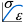

# 12.17.4 定义校准行为

本节介绍如何从校准数据集中提取材料行为常数。您可以为以下材料模型定义校准行为：
- 各向同性弹性
- 各向同性弹塑性
- 具有永久变形的超弹性

您还可以添加对自定义校准行为的支持，这些行为在“**校准行为**”对话框中显示为新选项。有关更多信息，请参阅达索系统知识库[www.3ds.com/support/knowledge-base](http://www.3ds.com/support/knowledge-base)中的“在 Abaqus/CAE 中创建自定义材料校准插件”。

Abaqus/CAE 在计算材料属性并根据体积测试以外的测试数据绘制材料响应曲线时，假设材料完全不可压缩。

### 各向同性弹性材料行为的校准数据

各向同性弹性校准行为使您能够从校准数据集导出各向同性弹性数据（杨氏模量和泊松比），并将这些材料常数应用于模型中材料定义的弹性材料属性。

**要校准各向同性弹性材料行为的数据：**

1. 在模型树中，展开 **Calibrations** 容器并双击 **Behaviors**。将出现 **创建校准行为** 对话框。
2. 输入材料校准行为的名称，选择**弹性各向同性**，然后单击**继续**。将出现 **编辑行为** 对话框。
3. 从 **参数集 1** 选项中，执行以下操作来计算杨氏模量的值： 1. 从 **数据集** 列表中，选择要计算杨氏模量的数据。 2. 单击“”。 Abaqus/CAE 计算杨氏模量并将其值显示在 **杨氏模量** 标签的右侧。
4. 从 **参数集 2** 选项中，执行以下操作来计算泊松比的值： 1. 从 **数据集** 列表中，选择要计算泊松比的数据。 2. 单击“”。 Abaqus/CAE 计算泊松比并将其值显示在 **泊松比** 标签的右侧。
5. 从 **材料** 列表中，选择要应用此校准行为的材料定义；或单击为此校准行为创建新的材料定义。有关定义新材料模型的更多信息，请参阅["Creating or editing a material," Section 12.7.1](pt03ch12s07hlb01.md)。
6. 单击 **确定** 将各向同性弹性行为保存到所选材料模型。 Abaqus/CAE 将新行为添加到模型树中，并将指定的杨氏模量和泊松比添加到指定材料的**弹性**材料属性中。

有关相关主题的信息，请单击以下项目： -["Creating a linear elastic material model" in "Defining elasticity," Section 12.9.1](pt03ch12s09s01.md#usi-prp-mechanical-elastic-elastic)

### 各向同性弹塑性材料行为的校准数据

各向同性弹塑性校准行为使您能够导出各向同性弹性和塑性材料行为。

**要校准各向同性弹塑性材料行为的数据：**

1. 在模型树中，展开 **Calibrations** 容器并双击 **Behaviors**。将出现 **创建校准行为** 对话框。
2. 输入材料校准行为的名称，选择**弹塑性各向同性**，然后单击**继续**。将出现 **编辑行为** 对话框。
3. 从 **弹塑性数据** 选项中，执行以下操作： 1. 展开 **数据集** 列表，然后选择要计算第一组校准值的数据。 2. 从 **最终点** 选项中，单击自动计算最终点，或者单击并从视口中选择最终点。 Abaqus/CAE 在视口中绘制最终点并在对话框中显示其坐标。 3. 从 **屈服点** 选项中，单击并从视口中选择屈服点。 Abaqus/CAE 在视口中绘制原点和屈服点之间的线，在对话框中显示屈服点的坐标，并计算杨氏模量并将其值显示在 **杨氏模量** 标签的右侧。 4. 通过执行以下任一操作，选择用于此材料校准的塑料点： - 将 **塑料点** 滑块拖动到右侧以计算更多数量的塑料点，或将滑块拖动到左侧以计算更少的塑料点。 - 单击从视口中选取塑料点。 Abaqus/CAE 将塑料数据点添加到对话框中的表中。如果您想进一步自定义塑料数据，您可以编辑任何这些数据。
4. 从 **泊松比数据** 选项中，执行以下操作： 1. 从 **数据集** 列表中，选择要计算泊松比的数据。 2. 单击“”。 Abaqus/CAE 计算泊松比，在 **泊松比** 字段中显示其值，并将其绘制在视口中。如果需要，您可以通过更改字段中的值来调整泊松比的计算值。
5. 从 **材料** 列表中，选择要应用此校准行为的材料定义；或单击为此校准行为创建新的材料定义。有关定义新材料模型的更多信息，请参阅["Creating or editing a material," Section 12.7.1](pt03ch12s07hlb01.md)。
6. 单击“**确定**”。 Abaqus/CAE 更新了新的校准行为。如果指定了材料定义，Abaqus/CAE 会将各向同性弹塑性校准行为参数映射到该材料定义的 **弹性** 和 **塑性** 材料行为。 **注意：**当您将数据从校准行为映射到材料定义时，所选材料中的任何弹性或塑性材料行为都会被覆盖。

有关相关主题的信息，请单击以下任意项目：-["Creating a linear elastic material model" in "Defining elasticity," Section 12.9.1](pt03ch12s09s01.md#usi-prp-mechanical-elastic-elastic)-["Defining classical metal plasticity" in "Defining plasticity," Section 12.9.2](pt03ch12s09s02.md#usi-prp-mechanical-plastic-plastic)

### 使用永久变形校准超弹性数据

具有永久变形校准行为的超弹性使您能够从弹性体和热塑性塑料的加载、卸载和重新加载的单轴和双轴数据集中提取塑性和超弹性材料行为以及马林斯效应。您可以从单轴测试、双轴测试或两种类型的测试中提取数据。校准过程包括以下步骤：

1. 将单轴和/或双轴测试数据文件作为新数据集上传到 Abaqus/CAE 中。
2. 从您提供的数据文件中提取加载、卸载和重新加载周期以及永久集数据，并为每个周期的加载、卸载和重新加载阶段创建单独的数据集。
3. 如果需要，选择要从材料行为计算中排除的任何数据周期。
4. 从视口中选择屈服点，并根据需要编辑主载荷数据集上的各个点以创建更平滑的曲线。永久变形曲线基于当前屈服点，因此当您选择新屈服点时，这些曲线也会发生变化。
5. 一旦确定了要用于导出材料行为的测试数据集并指定了主曲线选项，您就可以从所选数据导出材料行为。 Abaqus/CAE 将塑性、超弹性和 Mullins 效应材料行为映射到您选择的材料。

**用永久变形校准超弹性数据：**

1. 在模型树中，展开 **Calibrations** 容器并双击 **Behaviors**。将出现 **创建校准行为** 对话框。
2. 输入材料校准行为的名称，选择 **Hyperelasticity with permanent set**，然后单击 **Continue**。将出现 **编辑行为** 对话框。
3. 从 **单轴** 或 **双轴** 选项卡页执行以下步骤： 1. 展开 **数据集** 列表，然后选择要计算单轴或双轴数据测试校准值的数据。 2. 单击“”。 Abaqus/CAE 提取主加载曲线、每个循环应变级别的卸载和重新加载曲线以及永久变形曲线，然后为每个循环应变级别的每个组件创建新的校准数据集。每个新数据集都可在 **单轴测试数据集** 或 **双轴测试数据集** 选项中使用，并在视口中绘制。 3. 切换您想要包含在材料校准计算中的各个加载、卸载或重新加载数据集。当您切换数据集时，Abaqus/CAE 在视口中显示其相应的 *X--Y* 曲线。您可以选择以下任意选项： - 选择“**全部**”以包含在所选测试数据文件中找到的所有原始数据。 - 选择 **Primary** 以包含主负载曲线中的数据。 - 选择 **卸载** 以包含每个循环应变级别的卸载曲线中的数据，或展开此容器以选择单独的卸载曲线。 - 选择 **重新加载** 以包含每个循环应变级别的重新加载曲线中的数据，或展开此容器以选择单独的重新加载曲线。 - 选择 **永久变形** 以包含来自两条永久变形曲线的数据，或展开此容器以选择永久变形的与应力或应变相关的组件。 4. 从 **主曲线** 选项中，执行以下操作： - 单击，然后从视口中选择主曲线上的屈服点。如果需要，单击并从出现的对话框中编辑主曲线。
4. 如果需要，从 **单轴** 或 **双轴** 选项卡页面中提取第二个数据集。
5. 如果您同时提取了单轴和双轴测试数据，Abaqus/CAE 默认情况下会同等地应用这些数据来计算材料行为。如果您希望一个数据集在这些计算中具有更大的权重，请从 **选项** 选项卡页面执行以下步骤： 1. 在 **材料属性** 选项中，将 **权重** 滑块拖向您想要在材料行为计算中分配更大权重的数据类型（单轴或双轴）。 2. 指定相对权重的选择是基于线性插值还是对数插值。
6. 从 **材料** 列表中，选择要应用此校准行为的材料定义；或单击为此校准行为创建新的材料定义。有关定义新材料模型的更多信息，请参阅["Creating or editing a material," Section 12.7.1](pt03ch12s07hlb01.md)。
7. 单击“**确定**”。 Abaqus/CAE 更新了新的校准行为，并将具有永久设置校准行为参数的超弹性映射到该材料定义的 **超弹性**、**塑料** 和 **穆林斯效应** 材料行为。 **注意：**当您将数据从校准行为映射到材料定义时，所选材料中的任何超弹性、塑性或 Mullins 效应材料行为都会被覆盖。

有关相关主题的信息，请单击以下任意项目：-["Defining classical metal plasticity" in "Defining plasticity," Section 12.9.2](pt03ch12s09s02.md#usi-prp-mechanical-plastic-plastic)-["Hyperelastic behavior of rubberlike materials," Section 22.5.1 of the Abaqus Analysis User's Guide](../usb/usb-link.md#usb-mat-chyperelastic)-["Mullins effect," Section 22.6.1 of the Abaqus Analysis User's Guide](../usb/usb-link.md#usb-mat-cmullins)

