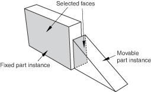
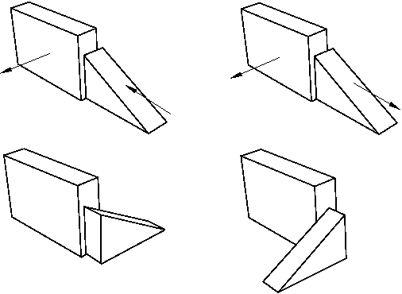
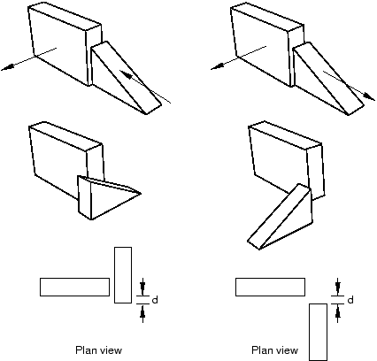
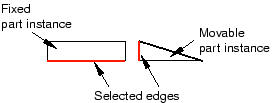
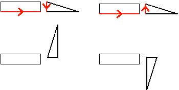
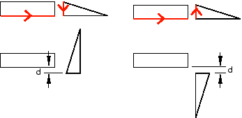
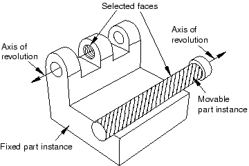
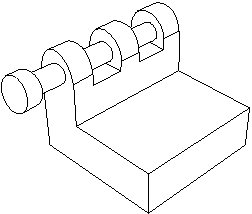
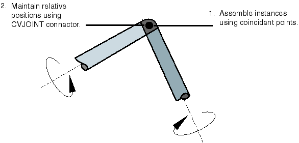
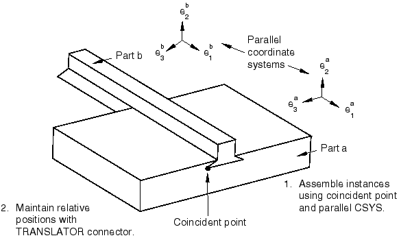

# 13.5.2 位置约束方法有何不同

位置约束定义两个零件或模型实例之间的关系 - 一个将移动（可移动实例），一个将保持静止（固定实例）。当您应用位置约束时，Abaqus/CAE 会计算满足此关系的可移动实例的位置；您不直接指定位置。您可以将以下位置约束应用于装配模块中的实例：
- 平行面（仅限三维实例）
- 面对面（仅限三维实例）
- 平行边
- 边到边
- 同轴（仅限三维实例）
- 重合点
- 平行坐标系

一般来说，应用单个位置约束不足以定义可移动实例的精确位置。您必须应用多个位置约束（对于三维装配体通常为三个，对于二维装配体通常为两个）才能将实例定位在所需位置。由于应用位置约束，零件和模型实例可能会重叠； Abaqus/CAE 不能防止边、面或单元之间的过度闭合。同样，Abaqus/CAE 不会阻止您过度约束实例或重复约束。

约束特征的定义包括您最初选择的所有面和边。如果您随后修改零件或移动零件或模型实例，Abaqus/CAE 会根据您最初选择的面和边自动重新计算约束。因此，在重新生成程序集后，一个或多个实例可能会移动。例如，不同的边缘可能变得平行。有关功能的更多信息，请参阅["Manipulating features in the Assembly module," Section 13.8.2](pt03ch13s08s02.md)和[Chapter 65, "The Feature Manipulation toolset](pt06ch65.md)。”

Assembly 模块提供以下位置约束：

**平行面**

平行面位置约束导致可移动实例的选定面变得与固定实例的选定面平行。然而，位置约束没有指定可移动实例的精确位置，并且平行面之间的距离是任意的。要在两个实例之间应用平行面位置约束，请执行以下操作：
- 从可移动实例和固定实例中选择要约束为平行的面，如[Figure 13--4](pt03ch13s05s02.md#asm-conc-parallelface-select)所示。 **图13--4** 选择要变得平行的面。- Abaqus/CAE 显示垂直于所选面的箭头。您可以通过选择垂直于其选定面的箭头方向来指定可移动实例的方向。[Figure 13--5](pt03ch13s05s02.md#asm-conc-parallelface)说明了应用位置约束的结果以及反转箭头方向对可移动实例的影响。 **图 13--5** 应用平行面位置约束的结果以及更改垂直于可移动实例的选定面的箭头方向的效果。Abaqus/CAE 旋转可移动实例，直到两个选定的面平行且箭头指向同一方向。

您从可移动实例和固定实例中选择的面必须是平面。平行面位置约束只能应用于三维实例。

**面对面**

面对面位置约束与平行面位置约束类似，不同之处在于您定义平行面之间的间隙。间隙是在两个选定面之间测量的，沿固定实例的法线为正值。除了该间隙之外，可移动实例的精确位置不受限制。假设您选择了[Figure 13--4](pt03ch13s05s02.md#asm-conc-parallelface-select)中显示的相同两个面，则应用面对面约束的效果将显示在[Figure 13--6](pt03ch13s05s02.md#asm-conc-facetoface)中。[Figure 13--6](pt03ch13s05s02.md#asm-conc-facetoface)还说明了反转垂直于其所选面的箭头方向对可移动实例的影响。

**图 13-6** 应用面对面约束的结果以及更改垂直于可移动实例的选定面的箭头方向的效果。

Abaqus/CAE 旋转可移动实例，直到两个选定的面平行且箭头指向同一方向。此外，可移动实例会平移以满足指定的间隙。您从可移动实例和固定实例中选择的面必须是平面。面对面位置约束只能应用于三维实例。

**平行边**

平行边缘位置约束导致可移动实例的选定边缘变得与固定实例的选定边缘平行。然而，位置约束没有指定可移动实例的精确位置，并且平行边之间的距离是任意的。要在两个实例之间应用平行边位置约束，请执行以下操作：
- 从可移动实例和固定实例中选择要约束为平行的边，如[Figure 13--7](pt03ch13s05s02.md#asm-conc-paralleledge-select)中所示。 **图13--7** 选择要平行的边。- Abaqus/CAE 显示沿选定边缘的箭头。您可以通过选择沿其选定边缘的箭头方向来指定可移动实例的方向。[Figure 13--8](pt03ch13s05s02.md#asm-conc-paralleledge)说明了应用位置约束的结果以及反转箭头方向对可移动实例的影响。 **图13--8** 应用平行边约束的结果以及沿着可移动实例的选定边更改箭头方向的效果。Abaqus/CAE 旋转可移动实例，直到两个选定的边平行并且箭头指向相同方向。

您从可移动实例和固定实例中选择的边必须是直的。您可以从实例中选择一条边，也可以选择基准轴或基准坐标系的轴之一。平行边缘位置约束只能应用于二维和三维实例。它对轴对称实例没有影响。

**边到边**

边到边位置约束类似于平行边位置约束，不同之处在于平行边之间的间隙由约束定义。假设您选择了[Figure 13--7](pt03ch13s05s02.md#asm-conc-paralleledge-select)中所示的相同两条边，则将边到边位置约束应用于二维装配的效果如[Figure 13--9](pt03ch13s05s02.md#asm-conc-edgetoedge)中所示。[Figure 13--9](pt03ch13s05s02.md#asm-conc-edgetoedge)还说明了沿其选定边缘反转箭头方向对可移动实例的影响。

**图 13-9** 应用边到边约束的结果以及沿着可移动实例的选定边更改箭头方向的效果。

应用边到边位置约束后，装配体的建模空间决定了 Abaqus/CAE 的行为。 - 如果装配体是三维的，Abaqus/CAE 会定位可移动实例，以便边线重合。
- 如果装配体是二维的，您可以指定选定边线之间的间隙。间隙是在两个选定边之间测量的，沿固定实例的法线为正值。

除了这种行为之外，可移动实例的精确位置不受限制。边到边位置约束可以应用于二维、三维和轴对称实例；然而，轴对称实例只能平行于旋转轴移动。

**同轴**

同轴位置约束导致可移动实例的选定圆柱面或圆锥面变得与固定实例的选定圆柱面或圆锥面同轴。然而，同轴位置约束并不约束可移动实例的精确位置。要在两个实例之间应用同轴位置约束，请执行以下操作：
- 从可移动实例和固定实例中选择要约束为同轴的圆柱面或圆锥面，如[Figure 13--10](pt03ch13s05s02.md#asm-conc-coaxial-select)中所示。 **图 13--10** 选择要同轴的面。- Abaqus/CAE 显示沿所选实例的旋转轴的箭头。您可以通过选择沿其旋转轴的箭头方向来指定可移动实例的方向。[Figure 13--11](pt03ch13s05s02.md#asm-conc-coaxial)说明了应用同轴位置约束的结果。 **图13--11** 应用同轴约束的效果。

Abaqus/CAE 旋转并平移可移动实例，直到两个选定的面同轴且箭头指向同一方向。同轴位置约束只能应用于三维实例。

**重合点**

重合点约束使可移动实例上的选定点与固定实例上的选定点重合。然而，重合点约束不约束可移动实例的方向。应用约束后，可移动实例的方向不会改变，如[Figure 13--12](pt03ch13s05s02.md#asm-help-coincident)中所示。详细说明请参见["Constraining two instances with coincident points," Section 13.11.7](pt03ch13s11hlb07.md)。

**图 13–12** 应用重合点约束的效果。

**并行坐标系**

平行坐标系约束导致可移动实例上的基准坐标系的轴与固定实例上的基准坐标系的轴平行。然而，平行坐标系约束并未指定可移动实例的精确位置。[Figure 13--13](pt03ch13s05s02.md#asm-help-parallelcsys)说明了将平行坐标系约束和重合点约束应用于两个实例的效果。

**图 13–13** 应用平行坐标系和重合点约束的效果。

坐标系可以是矩形（*X*-、*Y*- 和 *Z*- 轴）、圆柱（*R*-、- 和 *Z*- 轴）或球形（*R*-、- 和- 轴）。详细说明请参见["Constraining two instances with parallel coordinate systems," Section 13.11.8](pt03ch13s11hlb08.md)。

您可以使用基准来定位零件和模型实例。当系统提示您选择面时，您还可以选择基准平面。当系统提示您选择一条边时，您还可以选择基准轴或基准坐标系的轴之一。您可以选择在部件模块中创建的基准，因为该基准与零件的实例关联并随零件实例移动。但是，如果位置约束使用您通过从零件实例（例如零件实例的面）中选择而在装配模块中创建的基准，则 Abaqus/CAE 会更改其重新生成行为，并按照您创建特征的顺序重新生成特征。有关详细信息，请参阅["How are position constraints regenerated?," Section 65.3.5](pt06ch65s03s05.md)。如果您在装配模块中创建了基准并且该基准依赖于多个零件实例，则您无法选择该基准作为可移动零件实例；例如，穿过两个零件实例的顶点的基准轴。

