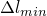
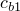
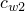
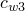
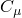
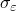

# 14.11.1 配置一般分析程序

您可以配置一般分析程序来分析线性或非线性响应。您可以在 Abaqus/Standard、Abaqus/Explicit 或 Abaqus/CFD 分析中包含一般分析过程。有关详细信息，请参阅["General and linear perturbation procedures," Section 6.1.3 of the Abaqus Analysis User's Guide](../usb/usb-link.md#usb-anl-alinearnonlinear)。

本节提供有关使用步骤编辑器配置不同类型的一般分析过程的说明。涵盖以下主题：
-["Configuring a static, general procedure](pt03ch14s11s01.md#usi-sim-configure-static)”
-["Configuring a static, Riks procedure](pt03ch14s11s01.md#usi-sim-configure-riks)”
-["Configuring a dynamic, explicit procedure](pt03ch14s11s01.md#usi-sim-configure-dynamicexplicit)”
-["Configuring a heat transfer procedure](pt03ch14s11s01.md#usi-sim-configure-heattransfer)”
-["Configuring a dynamic, implicit procedure](pt03ch14s11s01.md#usi-sim-configure-dynamicimplicit)”
-["Configuring a fully coupled, simultaneous heat transfer and stress procedure](pt03ch14s11s01.md#usi-sim-configure-coupledheatstress)”
-["Configuring a fully coupled, simultaneous heat transfer and electrical procedure](pt03ch14s11s01.md#usi-sim-configure-coupledheatelectric)”
-["Configuring a fully coupled, simultaneous heat transfer, electrical, and structural procedure](pt03ch14s11s01.md#usi-sim-configure-coupledheatelectricstruct)”
-["Configuring a direct cyclic procedure](pt03ch14s11s01.md#usi-sim-configure-directcyclic)”
-["Configuring a dynamic fully coupled thermal-stress procedure using explicit integration](pt03ch14s11s01.md#usi-sim-configure-coupledheatstressexplicit)”
-["Configuring a geostatic stress field procedure](pt03ch14s11s01.md#usi-sim-configure-geostatic)”
-["Configuring a mass diffusion procedure](pt03ch14s11s01.md#usi-sim-configure-massdiffusion)”
-["Configuring an effective stress analysis for fluid-filled porous media](pt03ch14s11s01.md#usi-sim-configure-soils)”
-["Configuring a transient, static, stress/displacement analysis with time-dependent material response](pt03ch14s11s01.md#usi-sim-configure-visco)”
-["Configuring an annealing procedure](pt03ch14s11s01.md#usi-sim-configure-anneal)”
-["Configuring a flow procedure](pt03ch14s11s01.md#usi-sim-configure-flow)”

### 配置静态的通用过程

静态应力程序是一种忽略惯性效应的程序。分析可以是线性或非线性的，并忽略与时间相关的材料效应。有关详细信息，请参阅["Static stress analysis," Section 6.2.2 of the Abaqus Analysis User's Guide](../usb/usb-link.md#usb-anl-astatic)。

**要创建或编辑静态的常规过程：**

1. 按照["Creating a step," Section 14.9.2](pt03ch14s09hlb02.md)（**过程类型：**`General; Static, General`）或["Editing a step," Section 14.9.3](pt03ch14s09hlb03.md)中概述的过程显示 **编辑步骤** 对话框。
2. 在**基本**、**增量**和**其他**选项卡页面上，配置设置，例如步骤的时间段、最大增量数、增量大小、默认荷载随时间的变化以及是否考虑几何非线性，如以下过程所述。

**要在**基本**选项卡页面上配置设置：**

1. 在“**编辑步骤**”对话框中，显示“**基本**”标签页。
2. 在 **描述** 字段中，输入分析步骤的简短描述。 Abaqus 将您输入的文本存储在输出数据库中，并且该文本由可视化模块显示在状态块中。
3. 在**时间段**字段中，输入步骤的时间段。有关详细信息，请参阅["Time period" in "Static stress analysis," Section 6.2.2 of the Abaqus Analysis User's Guide](../usb/usb-link.md#usb-anl-astatic-time)。
4. 选择 **Nlgeom** 选项： - 切换 **Nlgeom** **关闭** 以在当前步骤中执行几何线性分析。 - 切换 **Nlgeom** **On** 以指示 Abaqus/Standard 应在该步骤中考虑几何非线性。一旦您打开 **Nlgeom**，它将在分析的所有后续步骤中处于活动状态。有关详细信息，请参阅["Linear and nonlinear procedures," Section 14.3.2](pt03ch14s03s02.md)。
5. 如果您预计问题存在局部不稳定性（例如表面起皱、材料不稳定或局部屈曲），请选择自动稳定方法。 Abaqus/Standard 可以通过在整个模型中应用阻尼来稳定此类问题。有关更多信息，请参见["Unstable problems" in "Static stress analysis," Section 6.2.2 of the Abaqus Analysis User's Guide](../usb/usb-link.md#usb-anl-astatic-unstable)和["Automatic stabilization of static problems with a constant damping factor" in "Solving nonlinear problems," Section 7.1.1 of the Abaqus Analysis User's Guide](../usb/usb-link.md#usb-anl-anonlineareqns-stabilize)单击 **自动稳定** 右侧的箭头，然后选择定义阻尼系数的方法： - 选择 **指定耗散能量分数** 以允许 Abaqus/Standard 根据您提供的耗散能量分数计算阻尼系数。在相邻字段中输入耗散能量分数的值（默认值为 2.0 104）。有关更多信息，请参阅["Calculating the damping factor based on the dissipated energy fraction" in "Solving nonlinear problems," Section 7.1.1 of the Abaqus Analysis User's Guide](../usb/usb-link.md#usb-anl-anonlineareqns-dissipated)。 - 选择**指定阻尼系数**直接输入阻尼系数。在相邻字段中输入阻尼系数的值。有关详细信息，请参阅["Directly specifying the damping factor" in "Solving nonlinear problems," Section 7.1.1 of the Abaqus Analysis User's Guide](../usb/usb-link.md#usb-anl-anonlineareqns-damping)。 - 选择 **使用之前常规步骤中的阻尼因子** 以使用上一步结束时的阻尼因子作为当前步骤的可变阻尼方案中的初始因子。这些因子会覆盖在当前步骤中直接计算或指定的任何初始阻尼因子。如果没有与前一通用步骤相关的阻尼因子（例如，如果前一步骤未使用任何稳定化或当前步骤是分析的第一步），Abaqus 将使用自适应稳定化来确定所需的阻尼因子。
6. 使用自动稳定时，Abaqus 可以在一个步骤过程中使用相同的阻尼因子，也可以根据收敛历史以及阻尼耗散的能量与总应变能的比率，在步骤期间在空间和时间上改变阻尼因子。有关详细信息，请参阅["Adaptive automatic stabilization scheme" in "Solving nonlinear problems," Section 7.1.1 of the Abaqus Analysis User's Guide](../usb/usb-link.md#usb-anl-anonlineareqns-stabilize-adaptive)。如果您选择了**指定耗散能量分数**，则自适应稳定是可选的并且默认情况下处于打开状态。如果您选择了**指定阻尼系数**，则自适应稳定是可选的，并且默认情况下处于关闭状态。如果您选择了**使用之前常规步骤中的阻尼系数**，则需要自适应稳定。要使用自适应稳定，请打开 **使用自适应稳定最大。稳定性与应变能的比率**（如有必要），并在相邻字段中输入每个增量中阻尼耗散能量与总应变能之比的允许精度公差值。默认值 0.05 在大多数情况下应该是合适的。
7. 如果您正在执行绝热应力分析，请打开 **包括绝热加热效应**。此选项仅与具有米塞斯屈服面的各向同性金属塑性材料相关。有关详细信息，请参阅["Adiabatic analysis," Section 6.5.4 of the Abaqus Analysis User's Guide](../usb/usb-link.md#usb-anl-aadiabaticanal)。
8. 完成静态常规步骤的设置配置后，单击 **确定** 关闭 **编辑步骤** 对话框。

**要在 **增量** 选项卡页面上配置设置：**

1. 在**编辑步骤**对话框中，显示**增量**标签页。 （有关显示 **编辑步骤** 对话框的信息，请参阅["Creating a step," Section 14.9.2](pt03ch14s09hlb02.md)或["Editing a step," Section 14.9.3](pt03ch14s09hlb03.md)。）
2. 选择 **类型** 选项： - 选择 **自动** 以允许 Abaqus/Standard 根据计算效率选择时间增量的大小。 - 选择 **固定** 以指定增量的直接用户控制。 Abaqus/Standard 使用您指定为整个步骤中的恒定增量大小的增量大小。
3. 在**最大增量数**字段中，输入步骤中增量数的上限。如果在 Abaqus/Standard 得出该步骤的完整解决方案之前超过此最大值，则分析将停止。
4. 如果您在步骤 2 中选择了“**自动**”，请输入“**增量大小**”的值： 1. 在“**初始**”字段中，输入初始时间增量。 Abaqus/Standard 在整个步骤中根据需要修改该值。 2. 在**最小**字段中，输入允许的最小时间增量。如果 Abaqus/Standard 需要比该值更小的时间增量，则会终止分析。 3. 在**最大值**字段中，输入允许的最大时间增量。
5. 如果您在步骤 2 中选择了“**固定**”，请在“**增量大小**”字段中输入恒定时间增量的值。
6. 完成静态常规步骤的设置配置后，单击 **确定** 关闭 **编辑步骤** 对话框。

**要在 **其他** 选项卡页面上配置设置：**

1. 在“**编辑步骤**”对话框中，显示“**其他**”标签页。 （有关显示 **编辑步骤** 对话框的信息，请参阅["Creating a step," Section 14.9.2](pt03ch14s09hlb02.md)或["Editing a step," Section 14.9.3](pt03ch14s09hlb03.md)。）
2. 选择 **方程求解器方法** 选项： - 选择 **直接** 以使用默认的直接稀疏求解器。 - 选择 **迭代** 以使用迭代线性方程求解器。迭代求解器通常对于具有数百万自由度的块状结构最有用。有关更多信息，请参阅["Iterative linear equation solver," Section 6.1.6 of the Abaqus Analysis User's Guide](../usb/usb-link.md#usb-anl-aitrsolveroverview)。
3. 选择 **矩阵存储** 选项： - 选择 **使用求解器默认值** 以允许 Abaqus/Standard 决定是否需要对称或非对称矩阵存储和求解方案。 - 选择 **不对称** 将 Abaqus/Standard 限制为不对称存储和求解方案。 - 选择 **Symmetric** 将 Abaqus/Standard 限制为对称存储和求解方案。有关矩阵存储的更多信息，请参阅["Matrix storage and solution scheme in Abaqus/Standard" in "Defining an analysis," Section 6.1.2 of the Abaqus Analysis User's Guide](../usb/usb-link.md#usb-anl-unsymm)。
4. 选择 **求解技术**： - 选择 **完整牛顿** 以使用牛顿法作为求解非线性平衡方程的数值技术。有关详细信息，请参阅["Nonlinear solution methods in Abaqus/Standard," Section 2.2.1 of the Abaqus Theory Guide](../stm/stm-link.md#stm-anl-nonlinearsol)。 - 选择**拟牛顿**以使用拟牛顿技术求解非线性平衡方程。在某些情况下，该技术可以节省大量的计算成本。一般来说，当系统很大并且迭代之间刚度矩阵变化不大时，它是最成功的。此技术只能用于对称方程组。如果选择此技术，请输入 **重组核矩阵之前允许的迭代次数** 的值。允许的最大迭代次数为 25。默认迭代次数为 8。有关详细信息，请参阅["Quasi-Newton solution technique," Section 2.2.2 of the Abaqus Theory Guide](../stm/stm-link.md#stm-anl-quasinewtsol)。
5. 单击 **转换严重不连续性迭代** 字段右侧的箭头，然后选择用于在非线性分析期间处理严重不连续性的选项： - 如果迭代期间出现严重不连续性，则选择 **关闭** 强制进行新迭代，无论穿透和力误差的大小如何。此选项还更改一些时间增量参数，并使用不同的标准来确定是否进行另一次迭代或以较小的增量大小进行新的尝试。 - 选择**开**以使用局部收敛标准来确定是否需要新的迭代。 Abaqus/Standard 将确定与严重不连续性相关的最大穿透力和估计力误差，并检查这些误差是否在公差范围内。因此，如果严重的不连续性很小，则解可能会收敛。 - 选择 **从上一步传播** 以使用在上一个一般分析步骤中指定的值。该值显示在字段右侧的括号中。有关严重不连续性的更多信息，请参阅["Severe discontinuities in Abaqus/Standard" in "Defining an analysis," Section 6.1.2 of the Abaqus Analysis User's Guide](../usb/usb-link.md#usb-anl-aover-sdiconvert)。
6. 选择 **默认负载随时间变化** 的选项： - 如果您希望在步骤开始时立即应用负载并在整个步骤中保持恒定，请选择 **瞬时**。 - 如果负载大小要在步骤中从上一步结束时的值到负载的完整大小线性变化，请选择 **在步骤上线性斜坡**。
7. 单击 **Extrapolation of previous state at start of every Increment** 字段右侧的箭头，然后选择一种方法来确定增量解的第一个猜测： - 选择 **Linear** 表示该过程本质上是单调的，并且 Abaqus/Standard 应及时使用先前增量解的 100% 线性外推来开始当前增量的非线性方程解。 - 选择 **抛物线** 表示该过程应及时使用前两个增量解的二次外推来开始当前增量的非线性方程解。 - 选择**无**以抑制任何外推。有关详细信息，请参阅["Extrapolation of the solution" in "Defining an analysis," Section 6.1.2 of the Abaqus Analysis User's Guide](../usb/usb-link.md#usb-anl-aover-extrapolation)。
8. 如果变形理论塑性需要“全塑性”分析，则打开**当区域*区域名称*完全塑性时停止**。如果打开此选项，请输入正在监视全塑性行为的区域的名称。当单元集中所有本构计算点处的解完全塑性（由等效应变定义为偏移屈服应变的 10 倍）时，该步骤结束。但是，如果超出了您在 **增量** 选项卡页面上指定的最大增量数或您在 **基本** 选项卡页面上指定的时间段，则该步骤可能会在此点之前结束。
9. 如果您在“增量”选项卡页面上选择了“固定”时间增量，则可以打开“达到最大迭代次数后接受解决方案”。此选项指示 Abaqus/Standard 在完成允许的最大迭代次数后接受增量解，即使不满足平衡公差也是如此。如果使用此选项，通常需要非常小的增量和至少两次迭代。 **警告：**不推荐这种方法；仅当您彻底了解如何解释以这种方式获得的结果时，才应在特殊情况下使用它。
10. 启用**获得具有时域材料属性的长期解**，以获得具有时域粘弹性的完全松弛长期弹性解或两层粘塑性的长期弹塑性解。该参数仅与时域粘弹性和两层粘塑性材料相关。
11. 完成静态常规步骤的设置配置后，单击 **确定** 关闭 **编辑步骤** 对话框。

### 配置静态 Riks 过程

几何非线性静态问题有时涉及屈曲或塌陷行为，其中载荷位移响应显示负刚度，并且结构必须释放应变能以保持平衡。修改后的 Riks 方法允许您在响应的不稳定阶段找到静态平衡状态。

对于载荷大小由单个标量参数控制的情况，您可以使用此方法。它对于解决病态问题也很有用，例如极限载荷问题或表现出软化的几乎不稳定的问题。有关详细信息，请参阅["Unstable collapse and postbuckling analysis," Section 6.2.4 of the Abaqus Analysis User's Guide](../usb/usb-link.md#usb-anl-apostbuckling)。

**要创建或编辑静态 Riks 过程：**

1. 按照["Creating a step," Section 14.9.2](pt03ch14s09hlb02.md)（**过程类型：**`General; Static, Riks`）或["Editing a step," Section 14.9.3](pt03ch14s09hlb03.md)中概述的过程显示 **编辑步骤** 对话框。
2. 在**基本**、**增量**和**其他**选项卡页面上，配置停止条件、最大增量数、圆弧增量长度以及是否考虑几何非线性等设置，如以下过程所述。

**要在**基本**选项卡页面上配置设置：**

1. 在“**编辑步骤**”对话框中，显示“**基本**”标签页。
2. 在 **描述** 字段中，输入分析步骤的简短描述。 Abaqus 将您输入的文本存储在输出数据库中，并且该文本由可视化模块显示在状态块中。
3. 选择 **Nlgeom** 选项： - 切换 **Nlgeom** **关闭** 以在当前步骤中执行几何线性分析。 - 切换 **Nlgeom** **On** 以指示 Abaqus/Standard 应在该步骤中考虑几何非线性。一旦您打开 **Nlgeom**，它将在分析的所有后续步骤中处于活动状态。有关详细信息，请参阅["Linear and nonlinear procedures," Section 14.3.2](pt03ch14s03s02.md)。
4. 如果您正在执行绝热应力分析，请打开 **包括绝热加热效应**。此选项仅与具有米塞斯屈服面的各向同性金属塑性材料相关。有关详细信息，请参阅["Adiabatic analysis," Section 6.5.4 of the Abaqus Analysis User's Guide](../usb/usb-link.md#usb-anl-aadiabaticanal)。
5. 由于载荷大小是解决方案的一部分，因此您需要一种方法来指定该步骤何时完成。选择以下选项之一或两个： - 切换**最大负载比例系数**以输入负载比例系数的最大值。当载荷超过一定大小时，Abaqus/Standard 使用该值终止该步骤。有关更多信息，请参阅["Proportional loading" in "Unstable collapse and postbuckling analysis," Section 6.2.4 of the Abaqus Analysis User's Guide](../usb/usb-link.md#usb-anl-apostbuckling-proportional)- 切换**最大位移**以输入特定自由度 (**DOF**) 下的最大位移值。您还必须指定 Abaqus/Standard 将监视完成位移的 **节点区域**。如果超过此最大位移，Abaqus/Standard 将终止该步骤。如果您未指定这两个完成条件，则分析将继续您在 **增量** 选项卡页上指定的增量数。

**要在 **增量** 选项卡页面上配置设置：**

1. 在**编辑步骤**对话框中，显示**增量**标签页。 （有关显示 **编辑步骤** 对话框的信息，请参阅["Creating a step," Section 14.9.2](pt03ch14s09hlb02.md)或["Editing a step," Section 14.9.3](pt03ch14s09hlb03.md)。）
2. 选择 **类型** 选项： - 选择 **自动** 以允许 Abaqus/Standard 根据计算效率选择弧长增量的大小。 - 选择 **固定** 以指定增量的直接用户控制。 Abaqus/Standard 使用弧长增量，您将其指定为整个步骤中的恒定增量大小。不建议将此方法用于 Riks 分析，因为它会阻止 Abaqus/Standard 在遇到严重非线性时减小弧长。有关更多信息，请参阅["Incrementation" in "Unstable collapse and postbuckling analysis," Section 6.2.4 of the Abaqus Analysis User's Guide](../usb/usb-link.md#usb-anl-apostbuckling-incrementation)。
3. 在**最大增量数**字段中，输入步骤中增量数的上限。如果在 Abaqus/Standard 得出该步骤的完整解决方案之前超过此最大值，则分析将停止。
4. 如果您在步骤 2 中选择了“自动”，请输入“弧长增量”的值： 1. 在“初始”字段中，输入沿比例载荷位移空间中的静态平衡路径的弧长初始增量。 2. 在 **最小** 字段中，输入最小弧长增量。如果输入零，Abaqus 假定默认值是建议的初始弧长或总弧长的 105 倍中较小的一个。 3. 在**最大值**字段中，输入最大弧长增量。如果未指定该值，则不施加上限。 4. 在 **估计总弧长** 字段中，输入与此步骤关联的总弧长比例因子。如果此条目为零或未指定，Abaqus/Standard 假定默认值为。
5. 如果您在步骤 2 中选择了“**固定**”，请在“**弧长增量**”字段中输入恒定弧长增量的值。

**要在 **其他** 选项卡页面上配置设置：**

1. 在“**编辑步骤**”对话框中，显示“**其他**”标签页。 （有关显示 **编辑步骤** 对话框的信息，请参阅["Creating a step," Section 14.9.2](pt03ch14s09hlb02.md)或["Editing a step," Section 14.9.3](pt03ch14s09hlb03.md)。）
2. 选择 **矩阵存储** 选项： - 选择 **使用求解器默认值** 以允许 Abaqus/Standard 决定是否需要对称或非对称矩阵存储和求解方案。 - 选择 **不对称** 将 Abaqus/Standard 限制为不对称存储和求解方案。 - 选择 **Symmetric** 将 Abaqus/Standard 限制为对称存储和求解方案。有关矩阵存储的更多信息，请参阅["Matrix storage and solution scheme in Abaqus/Standard" in "Defining an analysis," Section 6.1.2 of the Abaqus Analysis User's Guide](../usb/usb-link.md#usb-anl-unsymm)。
3. 单击 **转换严重不连续性迭代** 字段右侧的箭头，然后选择用于在非线性分析期间处理严重不连续性的选项： - 如果迭代期间出现严重不连续性，则选择 **关闭** 强制进行新迭代，无论穿透和力误差的大小如何。此选项还更改一些时间增量参数，并使用不同的标准来确定是否进行另一次迭代或以较小的增量大小进行新的尝试。 - 选择**开**以使用局部收敛标准来确定是否需要新的迭代。 Abaqus/Standard 将确定与严重不连续性相关的最大穿透力和估计力误差，并检查这些误差是否在公差范围内。因此，如果严重的不连续性很小，则解可能会收敛。 - 选择 **从上一步传播** 以使用在上一个一般分析步骤中指定的值。该值显示在字段右侧的括号中。有关严重不连续性的更多信息，请参阅["Severe discontinuities in Abaqus/Standard" in "Defining an analysis," Section 6.1.2 of the Abaqus Analysis User's Guide](../usb/usb-link.md#usb-anl-aover-sdiconvert)。
4. 单击 **Extrapolation of previous state at start of every Increment** 字段右侧的箭头，然后选择确定增量解的第一个猜测的方法： - 选择 **Linear** 表示该过程本质上是单调的，Abaqus/Standard 应使用先前增量解的 1% 线性外推来开始当前增量的非线性方程解。 - 选择**无**以抑制任何外推。 （**抛物线** 选项与 Riks 分析无关。）有关详细信息，请参阅["Extrapolation of the solution" in "Defining an analysis," Section 6.1.2 of the Abaqus Analysis User's Guide](../usb/usb-link.md#usb-anl-aover-extrapolation)。
5. 如果变形理论塑性需要“全塑性”分析，则打开**当区域*区域名称*完全塑性时停止**。如果打开此选项，请输入正在监视全塑性行为的区域的名称。当单元集中所有本构计算点处的解完全塑性（由等效应变定义为偏移屈服应变的 10 倍）时，该步骤结束。但是，如果超出了您在 **增量** 选项卡页面上指定的最大增量数，则该步骤可能会在此之前结束。
6. 如果您在“增量”选项卡页面上选择了“固定”时间增量，则可以打开“达到最大迭代次数后接受解决方案”。此选项指示 Abaqus/Standard 在完成允许的最大迭代次数后接受增量解，即使不满足平衡公差也是如此。如果使用此选项，通常需要非常小的增量和至少两次迭代。 **警告：**不推荐这种方法；仅当您彻底了解如何解释以这种方式获得的结果时，才应在特殊情况下使用它。
7. 启用**获得具有时域材料属性的长期解**，以获得具有时域粘弹性的完全松弛长期弹性解或两层粘塑性的长期弹塑性解。该参数仅与时域粘弹性和两层粘塑性材料相关。

完成静态 Riks 步骤的设置配置后，单击 **确定** 关闭 **编辑步骤** 对话框。

### 配置动态、显式过程

显式动态分析对于分析动态响应时间相对较短的大型模型以及分析极其不连续的事件或过程而言，计算效率较高。这种类型的分析允许定义非常一般的接触条件，并使用一致的大变形理论。有关详细信息，请参阅["Explicit dynamic analysis," Section 6.3.3 of the Abaqus Analysis User's Guide](../usb/usb-link.md#usb-anl-aexpdynamic)。

**要创建或编辑动态、显式过程：**

1. 按照["Creating a step," Section 14.9.2](pt03ch14s09hlb02.md)（**过程类型：**`General; Dynamic, Explicit`）或["Editing a step," Section 14.9.3](pt03ch14s09hlb03.md)中概述的过程显示 **编辑步骤** 对话框。
2. 在**基本**、**增量**、**质量缩放**和**其他**选项卡页面上，配置设置，例如步骤的时间段、最大时间增量、增量大小、质量缩放定义和体积粘度参数，如以下过程中所述。

**要在**基本**选项卡页面上配置设置：**

1. 在“**编辑步骤**”对话框中，显示“**基本**”标签页。
2. 在 **描述** 字段中，输入分析步骤的简短描述。 Abaqus 将您输入的文本存储在输出数据库中，并且该文本由可视化模块显示在状态块中。
3. 在**时间段**字段中，输入步骤的时间段。
4. 选择 **Nlgeom** 选项： - 切换 **Nlgeom** **关闭** 以在当前步骤中执行几何线性分析。 - 切换 **Nlgeom** **On** 以指示 Abaqus/Explicit 应在该步骤中考虑几何非线性。一旦您打开 **Nlgeom**，它将在分析的所有后续步骤中处于活动状态。有关详细信息，请参阅["Linear and nonlinear procedures," Section 14.3.2](pt03ch14s03s02.md)。
5. 如果您正在执行绝热应力分析，请打开 **包括绝热加热效应**。此选项仅与金属塑性相关。有关详细信息，请参阅["Adiabatic analysis," Section 6.5.4 of the Abaqus Analysis User's Guide](../usb/usb-link.md#usb-anl-aadiabaticanal)。

**要在 **增量** 选项卡页面上配置设置：**

1. 在**编辑步骤**对话框中，显示**增量**标签页。 （有关显示 **编辑步骤** 对话框的信息，请参阅["Creating a step," Section 14.9.2](pt03ch14s09hlb02.md)或["Editing a step," Section 14.9.3](pt03ch14s09hlb03.md)。）
2. 选择 **类型** 选项： - 选择 **自动** 以允许 Abaqus/Explicit 自动确定时间增量。有关更多信息，请参阅["Automatic time incrementation" in "Explicit dynamic analysis," Section 6.3.3 of the Abaqus Analysis User's Guide](../usb/usb-link.md#usb-anl-aexpdynamic-automatic)。 - 选择**固定**以使用固定时间增量方案。固定时间增量大小由步骤的初始单元稳定性估计或用户指定的时间增量确定。有关详细信息，请参阅["Fixed time incrementation" in "Explicit dynamic analysis," Section 6.3.3 of the Abaqus Analysis User's Guide](../usb/usb-link.md#usb-anl-aexpdynamic-fixed)。
3. 如果您选择了 **自动** 时间增量，请执行以下步骤： 1. 选择 **稳定增量估计器** 选项： - 选择 **全局** 以允许全局估计器在步骤进行时确定稳定性限制。自适应全局估计算法使用当前膨胀波速度确定整个模型的最大频率。该算法不断更新最大频率的估计。全局估计器通常允许时间增量超过逐单元的值。 - 选择 **逐单元** 以允许 Abaqus/Explicit 使用每个单元中当前的膨胀波速度确定逐单元估计。逐单元的估计是保守的；它将给出比基于整个模型的最大频率的真实稳定极限更小的稳定时间增量。一般来说，边界条件和运动接触等约束具有压缩特征值谱的作用，而逐单元估计不会考虑这一点。 2. 选择 ** 最大。时间增量**选项： - 如果您不想对时间增量施加上限，请选择**无限制**。 - 选择 **值** 输入允许的最大时间增量值。在提供的字段中输入值。有关详细信息，请参阅["Automatic time incrementation" in "Explicit dynamic analysis," Section 6.3.3 of the Abaqus Analysis User's Guide](../usb/usb-link.md#usb-anl-aexpdynamic-automatic)。
4. 如果选择 **固定** 时间增量，请选择一个选项来确定增量大小： - 选择 **用户定义的时间增量** 以直接指定时间增量大小。在提供的字段中输入时间增量大小。 - 选择 **使用逐单元时间增量估计器** 以在整个步骤中使用时间增量初始逐单元稳定性限制的大小。步骤开始时每个单元中的膨胀波速用于计算固定时间增量大小。有关详细信息，请参阅["Fixed time incrementation" in "Explicit dynamic analysis," Section 6.3.3 of the Abaqus Analysis User's Guide](../usb/usb-link.md#usb-anl-aexpdynamic-fixed)。
5. 如果需要，输入 **时间缩放因子** 以调整 Abaqus/Explicit 计算的稳定时间增量。 （如果您为 **固定** 时间增量方案指定了 **用户定义的时间增量**，则此选项不可用。）有关详细信息，请参阅["Scaling the time increment" in "Explicit dynamic analysis," Section 6.3.3 of the Abaqus Analysis User's Guide](../usb/usb-link.md#usb-anl-aexpdynamic-scale)。

**要在 **质量缩放** 选项卡页面上配置设置：**

1. 在 **编辑步骤** 对话框中，显示 **质量缩放** 选项卡页。有关质量缩放的背景信息，请参阅["Mass scaling," Section 11.6.1 of the Abaqus Analysis User's Guide](../usb/usb-link.md#usb-anl-amassscaling)。 （有关显示 **编辑步骤** 对话框的信息，请参阅["Creating a step," Section 14.9.2](pt03ch14s09hlb02.md)或["Editing a step," Section 14.9.3](pt03ch14s09hlb03.md)。）
2. 选择以下选项之一来指定质量缩放： - 如果您希望上一步中的质量缩放定义传播到当前步骤，请选择 **使用上一步中的缩放质量和“整个步骤”定义**。如果选择此选项，则可以跳过此过程中的其余步骤。 - 选择 **使用下面的缩放定义** 为此步骤创建一个或多个新的质量缩放定义。如果您选择此选项，请完成此过程中的其余步骤。
3. 在**数据**表底部，单击**创建**。将出现 **编辑质量缩放** 对话框。
4. 指定要创建哪种类型的质量缩放定义： - 选择 **半自动质量缩放** 为除块体金属轧制之外的任何类型的分析定义质量缩放。 - 选择**自动质量缩放**来定义块状金属轧制分析的质量缩放。有关详细信息，请参阅["Automatic mass scaling for analysis of bulk metal rolling" in "Mass scaling," Section 11.6.1 of the Abaqus Analysis User's Guide](../usb/usb-link.md#usb-anl-amassscaling-automatic)。 - 选择 **重新初始化质量** 将单元质量重新初始化为其原始值。此选项允许您防止在当前步骤中使用上一步中的缩放质量。有关详细信息，请参阅["Reverting the mass matrix to the original state" in "Mass scaling," Section 11.6.1 of the Abaqus Analysis User's Guide](../usb/usb-link.md#usb-anl-amassscaling-reinitialize)。 - 选择 **在整个步骤中禁用质量缩放** 以在此步骤中禁用先前步骤中的所有可变质量缩放定义。有关更多信息，请参阅["Continuous mass matrix with no further scaling" in "Mass scaling," Section 11.6.1 of the Abaqus Analysis User's Guide](../usb/usb-link.md#usb-anl-amassscaling-remove)。
5. 如果选择 **半自动质量缩放**、**自动质量缩放** 或 **重新初始化质量**，请指示要应用质量缩放定义的区域： - 选择 **整个模型** 将质量缩放定义应用到模型中的所有单元。 - 选择**设置**将质量缩放定义应用到特定的单元集。在提供的字段中输入集名称。
6. 如果选择 **半自动质量缩放**，请指明在步骤期间您希望 Abaqus/Explicit 缩放单元质量的时间： - 选择 **在步骤开始** 仅在步骤开始时执行固定质量缩放。有关详细信息，请参阅["Fixed mass scaling" in "Mass scaling," Section 11.6.1 of the Abaqus Analysis User's Guide](../usb/usb-link.md#usb-anl-amassscaling-fixed)。 - 选择**贯穿步骤**以在该步骤期间定期缩放元素的质量。有关详细信息，请参阅["Variable mass scaling" in "Mass scaling," Section 11.6.1 of the Abaqus Analysis User's Guide](../usb/usb-link.md#usb-anl-amassscaling-variable)。
7. 如果您选择了 **半自动质量缩放**，请指示您希望 Abaqus/Explicit 如何缩放单元质量： - 切换 **按因子缩放** 以在步骤开始时按您在提供的字段中输入的值缩放元素一次。有关详细信息，请参阅["Defining a scale factor directly" in "Mass scaling," Section 11.6.1 of the Abaqus Analysis User's Guide](../usb/usb-link.md#usb-anl-amassscaling-factor)。 - 打开 **缩放到 *n*** 的目标时间增量，在提供的字段中输入所需的单元稳定时间增量。单击 **缩放单元质量** 字段右侧的箭头，然后选择 Abaqus/Explicit 如何应用目标时间增量： - 选择 **均匀地满足目标** 以均匀缩放单元质量，以便缩放元素的最小单元稳定时间增量等于目标值。 - 选择 **如果低于最小目标** 仅缩放单元稳定时间增量小于目标值的元素的质量。 - 选择**非均匀地等于目标**来缩放所有单元的质量，以便它们都具有等于目标值的相同单元稳定时间增量。有关详细信息，请参阅["Defining a desired element-by-element stable time increment" in "Mass scaling," Section 11.6.1 of the Abaqus Analysis User's Guide](../usb/usb-link.md#usb-anl-amassscaling-target)。如果您同时打开 **按因子缩放** 和 **缩放到目标时间增量**，Abaqus/Explicit 首先按您输入的因子值缩放质量，然后可能再次缩放它们，具体取决于您为目标时间增量输入的值以及您为应用该目标而选择的选项。
8. 如果选择了**自动质量缩放**，请输入以下值： - 在**进给速率**字段中，输入稳态条件下工件在滚动方向上的估计平均速度。 - 在 **挤压单元长度** 字段中，输入滚动方向上的平均单元长度。 - 在**横截面中的节点**字段中，输入工件横截面中的节点数。增加该值会减少质量缩放量。有关详细信息，请参阅["Automatic mass scaling for analysis of bulk metal rolling" in "Mass scaling," Section 11.6.1 of the Abaqus Analysis User's Guide](../usb/usb-link.md#usb-anl-amassscaling-automatic)。
9. 如果您在整个步骤中选择了 **半自动质量缩放** 或 **自动质量缩放**，请指定在步骤期间您希望 Abaqus/Explicit 执行质量缩放计算的时间： - 选择 **每 *n* 增量** 以增量指定 Abaqus/Explicit 执行质量缩放计算的频率。在提供的字段中输入所需的频率。例如，如果输入值 5，Abaqus/Explicit 将在步骤开始时以 5、10、15 等增量缩放质量。 - 选择 **At *n* equalinterval** 以指定步骤期间 Abaqus/Explicit 执行质量缩放计算的间隔数。在提供的字段中输入所需的值。例如，如果输入值 2，Abaqus/Explicit 会缩放步骤开始处的质量、紧随步骤中点之后的增量以及步骤中的最终增量。
10. 单击 **确定** 关闭 **编辑质量缩放** 对话框并返回到 **编辑步骤** 对话框的 **质量缩放** 选项卡页。您刚刚创建的质量缩放定义将显示在 **数据** 表中。
11. 如果需要，请重复步骤 3 至 10 以创建其他质量缩放定义。
12. 创建一个或多个质量缩放定义后，您可以根据需要编辑或删除它们。在**数据**表中选择特定的质量缩放定义，然后单击**数据**表底部的**编辑**或**删除**。

**要在 **其他** 选项卡页面上配置设置：**

1. 在“**编辑步骤**”对话框中，显示“**其他**”标签页。 （有关显示 **编辑步骤** 对话框的信息，请参阅["Creating a step," Section 14.9.2](pt03ch14s09hlb02.md)或["Editing a step," Section 14.9.3](pt03ch14s09hlb03.md)。）
2. 输入**线性体积粘度参数**的值。 Abaqus/Explicit 中默认包含线性体积粘度。
3. 输入**二次体积粘度参数**的值。这种形式的体积粘度压力仅存在于固体连续体单元中，并且仅在体积应变率是压缩的情况下才应用。有关更多信息，请参阅["Bulk viscosity" in "Explicit dynamic analysis," Section 6.3.3 of the Abaqus Analysis User's Guide](../usb/usb-link.md#usb-anl-aexpdynamic-bulkviscosity)。

完成动态显式步骤的设置配置后，单击 **确定** 关闭 **编辑步骤** 对话框。

### 配置传热程序

您可以执行非耦合传热分析，以利用一般的、与温度相关的传导率、内能（包括潜热效应）以及一般的对流和辐射边界条件（包括腔辐射）来模拟固体热传导。有关详细信息，请参阅["Uncoupled heat transfer analysis," Section 6.5.2 of the Abaqus Analysis User's Guide](../usb/usb-link.md#usb-anl-aheattransfer)。

**要创建或编辑传热程序：**

1. 按照["Creating a step," Section 14.9.2](pt03ch14s09hlb02.md)（**过程类型：**`General; Heat transfer`）或["Editing a step," Section 14.9.3](pt03ch14s09hlb03.md)中概述的过程显示 **编辑步骤** 对话框。
2. 在**基本**、**增量**和**其他**选项卡页面上，配置设置，例如步骤的时间段、每次增量的最大允许温度变化以及方程求解器首选项，如以下过程中所述。

**要在**基本**选项卡页面上配置设置：**

1. 在“**编辑步骤**”对话框中，显示“**基本**”标签页。
2. 在 **描述** 字段中，输入分析步骤的简短描述。 Abaqus 将您输入的文本存储在输出数据库中，并且该文本由可视化模块显示在状态块中。
3. 选择 **响应** 选项： - 选择 **稳态** 以忽略控制传热方程中的内能项（比热项）。有关详细信息，请参阅["Steady-state analysis" in "Uncoupled heat transfer analysis," Section 6.5.2 of the Abaqus Analysis User's Guide](../usb/usb-link.md#usb-anl-aheattransfer-steadystate)。 - 选择**瞬态**，在纯传导单元中使用后向欧拉法进行时间积分。该方法对于线性问题无条件稳定。有关详细信息，请参阅["Transient analysis" in "Uncoupled heat transfer analysis," Section 6.5.2 of the Abaqus Analysis User's Guide](../usb/usb-link.md#usb-anl-aheattransfer-transient)。 **注意：**选择 **响应** 选项后，会出现一条消息，通知您 Abaqus/Standard 已选择与您的 **响应** 选择相对应的 **默认载荷随时间变化** 选项（位于 **其他** 选项卡页面上）。单击“**关闭**”关闭消息对话框。
4. 在**时间段**字段中，输入步骤的时间段。

**要在 **增量** 选项卡页面上配置设置：**

1. 在**编辑步骤**对话框中，显示**增量**标签页。 （有关显示 **编辑步骤** 对话框的信息，请参阅["Creating a step," Section 14.9.2](pt03ch14s09hlb02.md)或["Editing a step," Section 14.9.3](pt03ch14s09hlb03.md)。）
2. 选择 **类型** 选项： - 如果您希望 Abaqus/Standard 确定合适的时间增量大小，请选择 **自动**。 - 选择 **固定** 以指定增量的直接用户控制。 Abaqus/Standard 使用您指定为整个步骤中的恒定增量大小的增量大小。
3. 在**最大增量数**字段中，输入步骤中增量数的上限。如果在 Abaqus/Standard 得出该步骤的完整解决方案之前超过此最大值，则分析将停止。
4. 如果您在步骤 2 中选择了“**自动**”，请输入“**增量大小**”的值： 1. 在“**初始**”字段中，输入初始时间增量。 Abaqus/Standard 在整个步骤中根据需要修改该值。 2. 在**最小**字段中，输入允许的最小时间增量。如果 Abaqus/Standard 需要比该值更小的时间增量，则会终止分析。 3. 在**最大值**字段中，输入允许的最大时间增量。
5. 如果您在步骤 2 中选择了“**固定**”，请在“**增量大小**”字段中输入恒定时间增量的值。
6. 如果您在 **Basic** 选项卡页上选择了 **Transient** 分析，请执行以下操作： 1. 如果您希望在每个温度自由度的温度变化率小于您指定的速率时结束分析，请切换到 **End step when temperature change is less than *n***。如果您打开此选项，请在提供的字段中输入所需的温度变化率。 2. 如果您在步骤 2 中选择了“**自动**”，请输入“**最大”值。每次增量允许的温度变化**。 Abaqus/Standard 限制时间步长，以确保在步长的任何增量期间，任何节点（温度自由度受边界条件、MPC 等约束的节点除外）都不会超过该值。
7. 如果您在步骤 2 中选择了“**自动**”并且要执行空腔辐射分析，请输入“**最大”值。每个增量允许的发射率变化**或接受默认值 0.1。如果超过该值，Abaqus/Standard 会减少增量，直到发射率的最大变化小于指定值。有关详细信息，请参阅["Cavity radiation," Section 41.1.1 of the Abaqus Analysis User's Guide](../usb/usb-link.md#usb-cni-acavityradiation)。

**要在 **其他** 选项卡页面上配置设置：**

1. 在“**编辑步骤**”对话框中，显示“**其他**”标签页。 （有关显示 **编辑步骤** 对话框的信息，请参阅["Creating a step," Section 14.9.2](pt03ch14s09hlb02.md)或["Editing a step," Section 14.9.3](pt03ch14s09hlb03.md)。）
2. 选择 **方程求解器方法** 选项： - 选择 **直接** 以使用默认的直接稀疏求解器。 - 选择 **迭代** 以使用迭代线性方程求解器。迭代求解器通常对于具有数百万自由度的块状结构最有用。有关更多信息，请参阅["Iterative linear equation solver," Section 6.1.6 of the Abaqus Analysis User's Guide](../usb/usb-link.md#usb-anl-aitrsolveroverview)。
3. 选择 **矩阵存储** 选项： - 选择 **使用求解器默认值** 以允许 Abaqus/Standard 决定是否需要对称或非对称矩阵存储和求解方案。 - 选择 **不对称** 将 Abaqus/Standard 限制为不对称存储和求解方案。 - 选择 **Symmetric** 将 Abaqus/Standard 限制为对称存储和求解方案。有关矩阵存储的更多信息，请参阅["Matrix storage and solution scheme in Abaqus/Standard" in "Defining an analysis," Section 6.1.2 of the Abaqus Analysis User's Guide](../usb/usb-link.md#usb-anl-unsymm)。
4. 选择 **求解技术** 选项： - 选择 **完整牛顿** 以使用牛顿法作为求解非线性平衡方程的数值技术。有关详细信息，请参阅["Nonlinear solution methods in Abaqus/Standard," Section 2.2.1 of the Abaqus Theory Guide](../stm/stm-link.md#stm-anl-nonlinearsol)。 - 选择**拟牛顿**以使用拟牛顿技术求解非线性平衡方程。在某些情况下，该技术可以节省大量的计算成本。一般来说，当系统很大并且迭代之间刚度矩阵变化不大时，它是最成功的。此技术只能用于对称方程组。如果选择此技术，请输入 **重组核矩阵之前允许的迭代次数** 的值。允许的最大迭代次数为 25。默认迭代次数为 8。有关详细信息，请参阅["Quasi-Newton solution technique," Section 2.2.2 of the Abaqus Theory Guide](../stm/stm-link.md#stm-anl-quasinewtsol)。
5. 单击 **转换严重不连续性迭代** 字段右侧的箭头，然后选择用于在非线性分析期间处理严重不连续性的选项： - 如果迭代期间出现严重不连续性，则选择 **关闭** 强制进行新迭代，无论穿透和力误差的大小如何。此选项还更改一些时间增量参数，并使用不同的标准来确定是否进行另一次迭代或以较小的增量大小进行新的尝试。 - 选择**开**以使用局部收敛标准来确定是否需要新的迭代。 Abaqus/Standard 将确定与严重不连续性相关的最大穿透力和估计力误差，并检查这些误差是否在公差范围内。因此，如果严重的不连续性很小，则解可能会收敛。 - 选择 **从上一步传播** 以使用在上一个一般分析步骤中指定的值。该值显示在字段右侧的括号中。有关严重不连续性的更多信息，请参阅["Severe discontinuities in Abaqus/Standard" in "Defining an analysis," Section 6.1.2 of the Abaqus Analysis User's Guide](../usb/usb-link.md#usb-anl-aover-sdiconvert)。
6. Abaqus/Standard 自动选择 **默认载荷随时间变化** 选项，该选项对应于您在 **Basic** 选项卡页面上的 **Response** 选择。建议您保持 **默认负载随时间变化** 选择不变。
7. 单击 **Extrapolation of previous state at start of every Increment** 字段右侧的箭头，然后选择一种方法来确定增量解的第一个猜测： - 选择 **Linear** 表示该过程本质上是单调的，并且 Abaqus/Standard 应及时使用先前增量解的 100% 线性外推来开始当前增量的非线性方程解。 - 选择 **抛物线** 表示该过程应及时使用前两个增量解的二次外推来开始当前增量的非线性方程解。 - 选择**无**以抑制任何外推。有关详细信息，请参阅["Extrapolation of the solution" in "Defining an analysis," Section 6.1.2 of the Abaqus Analysis User's Guide](../usb/usb-link.md#usb-anl-aover-extrapolation)。

完成传热步骤设置的配置后，单击 **确定** 关闭 **编辑步骤** 对话框。

### 配置动态、隐式过程

Abaqus/Standard 中的一般线性或非线性动态分析使用隐式时间积分来计算系统的瞬态动态响应。有关隐式动态分析的详细信息，请参阅["Implicit dynamic analysis using direct integration," Section 6.3.2 of the Abaqus Analysis User's Guide](../usb/usb-link.md#usb-anl-adynamic)或["Implicit dynamic analysis," Section 2.4.1 of the Abaqus Theory Guide](../stm/stm-link.md#stm-anl-dynamics)。

**要创建或编辑动态隐式过程：**

1. 按照["Creating a step," Section 14.9.2](pt03ch14s09hlb02.md)（**过程类型：**`General; Dynamic, Implicit`）或["Editing a step," Section 14.9.3](pt03ch14s09hlb03.md)中概述的过程显示 **编辑步骤** 对话框。
2. 在 **基本**、**增量** 和 **其他** 选项卡页面上，配置步骤的时间段、增量大小和方程求解器首选项等设置，如以下过程中所述。

**要在**基本**选项卡页面上配置设置：**

1. 在“**编辑步骤**”对话框中，显示“**基本**”标签页。
2. 在 **描述** 字段中，输入分析步骤的简短描述。 Abaqus 将您输入的文本存储在输出数据库中，并且该文本由可视化模块显示在状态块中。
3. 在**时间段**字段中，输入步骤的时间段。
4. 选择 **Nlgeom** 选项： - 切换 **Nlgeom** **关闭** 以在当前步骤中执行几何线性分析。 - 切换 **Nlgeom** **On** 以指示 Abaqus/Standard 应在该步骤中考虑几何非线性。一旦您打开 **Nlgeom**，它将在分析的所有后续步骤中处于活动状态。有关详细信息，请参阅["Linear and nonlinear procedures," Section 14.3.2](pt03ch14s03s02.md)。
5. 选择**应用程序** 选项。应用程序设置可调整各种数值设置（例如阻尼和时间增量），以最有效、最准确地捕获分析的预期行为。 - **瞬态保真度**应用——例如卫星系统的分析——使用小的时间增量来精确解析结构的振动响应，并将数值能量耗散保持在最低限度。 - **中等耗散**应用——包括各种插入、冲击和成形分析——使用一些能量耗散（通过塑性、粘性阻尼或数值效应）来减少求解噪声并改善收敛行为，而不会显着降低求解精度。 - **准静态**应用程序引入惯性效应，主要是为了规范分析中的不稳定行为，其主要关注点是最终静态响应。在可能的情况下采用较大的时间增量以最小化计算成本，并且可以使用相当大的数值耗散来在加载历史的某些阶段期间获得收敛。 - **分析产品默认值**取决于模型中是否存在接触：涉及接触的分析被视为中等耗散应用；非接触式分析被视为瞬态保真度应用。
6. 如果您正在执行绝热应力分析，请打开 **包括绝热加热效应**。此选项仅与具有米塞斯屈服面的各向同性金属塑性材料相关。有关详细信息，请参阅["Adiabatic analysis," Section 6.5.4 of the Abaqus Analysis User's Guide](../usb/usb-link.md#usb-anl-aadiabaticanal)。

**要在 **增量** 选项卡页面上配置设置：**

1. 在**编辑步骤**对话框中，显示**增量**标签页。 （有关显示 **编辑步骤** 对话框的信息，请参阅["Creating a step," Section 14.9.2](pt03ch14s09hlb02.md)或["Editing a step," Section 14.9.3](pt03ch14s09hlb03.md)。）
2. 选择 **类型** 选项： - 选择 **自动** 以允许 Abaqus/Standard 根据计算效率选择增量的大小。 - 选择 **固定** 以指定增量的直接用户控制。 Abaqus/Standard 使用您指定为整个步骤中的恒定增量大小的增量大小。 **警告：**一般不建议使用固定增量；仅当您彻底了解如何解释以这种方式获得的结果时，才应在特殊情况下使用它。使用固定时间增量来解决影响事件特别困难。
3. 在**最大增量数**字段中，输入步骤中增量数的上限。如果在 Abaqus/Standard 得出该步骤的完整解决方案之前超过此最大值，则分析将停止。
4. 如果您在步骤 2 中选择了“**自动**”，请执行以下操作： 1. 输入“**增量大小**”的值： - 在“**初始**”字段中，输入初始时间增量。 Abaqus/Standard 在整个步骤中根据需要修改该值。 - 在 **最小** 字段中，输入允许的最小时间增量。如果 Abaqus/Standard 需要比该值更小的时间增量，则会终止分析。 2. 指定**最大增量大小**： - 选择**指定** 直接输入最大增量大小。 - 选择**分析应用默认**，根据应用设置自动设置最大增量大小： - 对于瞬态保真度应用，默认最大增量是步骤的时间周期除以 100。 - 对于中等耗散应用，默认最大增量是步骤的时间周期除以 10。 - 对于准静态应用，默认最大增量是步骤的时间周期。 3. 半增量残余公差表示时间增量中间的平衡残余误差（不平衡力）。如果半增量残差较小，说明求解精度较高，可以安全地增加时间步长；反之，如果半增量残差较大，则应减小求解中使用的时间步。有关详细信息，请参阅["Numerical details" in "Implicit dynamic analysis using direct integration," Section 6.3.2 of the Abaqus Analysis User's Guide](../usb/usb-link.md#usb-anl-adynamic-automatic)。您必须指定适当的 **半增量残差**： - 切换到 **抑制计算** 以通过跳过半增量残差检查来降低求解成本。 - 选择 **分析产品默认值** 以根据应用程序设置自动设置半增量残余公差： - 对于涉及接触的瞬态保真度应用，默认半增量残余公差是时间平均力和力矩值的 10,000 倍。 - 对于无接触的瞬态保真度应用，默认的半增量残余公差是时间平均力和力矩值的 1000 倍。 - 对于中等耗散和准静态应用，半增量残余公差检查被抑制。 - 选择 **指定比例因子** 以输入半增量残余公差作为应用于时间平均力和力矩值的比例因子。 - 选择**指定值**直接输入半增量剩余公差值。
5. 如果您在步骤 2 中选择了“**固定**”，请执行以下操作： 1. 在“**增量大小**”字段中输入恒定时间增量的值。 2. 如果需要，打开**抑制计算**以跳过半增量残余公差检查并降低求解成本。

**要在 **其他** 选项卡页面上配置设置：**

1. 在“**编辑步骤**”对话框中，显示“**其他**”标签页。 （有关显示 **编辑步骤** 对话框的信息，请参阅["Creating a step," Section 14.9.2](pt03ch14s09hlb02.md)或["Editing a step," Section 14.9.3](pt03ch14s09hlb03.md)。）
2. 选择 **矩阵存储** 选项： - 选择 **使用求解器默认值** 以允许 Abaqus/Standard 决定是否需要对称或非对称矩阵存储和求解方案。 - 选择 **不对称** 将 Abaqus/Standard 限制为不对称存储和求解方案。 - 选择 **Symmetric** 将 Abaqus/Standard 限制为对称存储和求解方案。有关矩阵存储的更多信息，请参阅["Matrix storage and solution scheme in Abaqus/Standard" in "Defining an analysis," Section 6.1.2 of the Abaqus Analysis User's Guide](../usb/usb-link.md#usb-anl-unsymm)。
3. 选择 **求解技术**： - 选择 **完整牛顿** 以使用牛顿法作为求解非线性平衡方程的数值技术。有关详细信息，请参阅["Nonlinear solution methods in Abaqus/Standard," Section 2.2.1 of the Abaqus Theory Guide](../stm/stm-link.md#stm-anl-nonlinearsol)。 - 选择**拟牛顿**以使用拟牛顿技术求解非线性平衡方程。在某些情况下，该技术可以节省大量的计算成本。一般来说，当系统很大并且迭代之间刚度矩阵变化不大时，它是最成功的。此技术只能用于对称方程组。如果选择此技术，请输入 **重组核矩阵之前允许的迭代次数** 的值。允许的最大迭代次数为 25。默认迭代次数为 8。有关详细信息，请参阅["Quasi-Newton solution technique," Section 2.2.2 of the Abaqus Theory Guide](../stm/stm-link.md#stm-anl-quasinewtsol)。
4. 单击 **转换严重不连续性迭代** 字段右侧的箭头，然后选择用于在非线性分析期间处理严重不连续性的选项： - 如果迭代期间出现严重不连续性，则选择 **关闭** 强制进行新迭代，无论穿透和力误差的大小如何。此选项还更改一些时间增量参数，并使用不同的标准来确定是否进行另一次迭代或以较小的增量大小进行新的尝试。 - 选择**开**以使用局部收敛标准来确定是否需要新的迭代。 Abaqus/Standard 将确定与严重不连续性相关的最大穿透力和估计力误差，并检查这些误差是否在公差范围内。因此，如果严重的不连续性很小，则解可能会收敛。 - 选择 **从上一步传播** 以使用在上一个一般分析步骤中指定的值。该值显示在字段右侧的括号中。有关严重不连续性的更多信息，请参阅["Severe discontinuities in Abaqus/Standard" in "Defining an analysis," Section 6.1.2 of the Abaqus Analysis User's Guide](../usb/usb-link.md#usb-anl-aover-sdiconvert)。
5. 选择 **默认负载随时间变化** 的选项： - 如果您希望在步骤开始时立即应用负载并在整个步骤中保持恒定，请选择 **瞬时**。 - 如果负载大小要在步骤中从上一步结束时的值到负载的完整大小线性变化，请选择 **在步骤上线性斜坡**。
6. 单击 **每次增量开始时先前状态的外推** 字段右侧的箭头，然后选择确定增量解的第一个猜测的方法： - 选择 **无** 以抑制任何外推。 - 选择 **线性** 表示该过程本质上是单调的，并且 Abaqus/Standard 应及时使用先前增量解的 100% 线性外推法来开始当前增量的非线性方程解。 - 选择 **抛物线** 指示该过程应及时使用前两个增量解的基于二次位移的外推法来开始当前增量的非线性方程解。 - 选择 **速度抛物线** 指示该过程应及时使用先前增量解的基于二次速度的外推法来开始当前增量的非线性方程解。 - 选择 **分析产品默认** 以根据应用程序设置自动选择外推方法： - 对于瞬态保真度应用，Abaqus/Standard 使用基于速度的抛物线外推方法。 - 对于中等耗散和准静态应用，Abaqus/Standard 使用线性外推法。有关详细信息，请参阅["Extrapolation of the solution" in "Defining an analysis," Section 6.1.2 of the Abaqus Analysis User's Guide](../usb/usb-link.md#usb-anl-aover-extrapolation)。
7. 对于瞬态保真度应用，请在隐式运算符中指示 **Alpha**，数值（人工）阻尼控制参数： - 选择 **分析产品默认值** 将= 0.05 设置为轻微的数值阻尼。 - 选择 **指定** 为输入非默认值。允许的值为 0（无阻尼）到 0.5（= 0.333 提供最大阻尼）。对于中等耗散应用，无法修改默认值 0.41421。参数不用于准静态应用。
8. 指示 Abaqus/Standard 应如何处理 **步骤开始时的初始加速度计算**： - 选择 **允许** 在动态步骤开始时计算模型中的实际加速度。 - 选择 **Bypass** 以根据以下条件设置初始加速度： - 如果当前步骤是第一个动态步骤，Abaqus/Standard 假定当前步骤的初始加速度为零。 - 如果前一个步骤也是动态步骤，则 Abaqus/Standard 使用上一个步骤结束时的加速度来继续新步骤。仅当负载在新步骤开始时不会突然变化时，此方法才适用。有关详细信息，请参阅["Controlling calculation of accelerations at the beginning of a dynamic step" in "Implicit dynamic analysis using direct integration," Section 6.3.2 of the Abaqus Analysis User's Guide](../usb/usb-link.md#usb-anl-adynamic-bypass)。 - 选择 **分析产品默认值** 以根据该步骤所使用的应用程序设置确定初始加速度（仅当 **基本** 选项卡页面上的 **应用程序** 选项也设置为 **分析产品默认值**时，此选项才可用）： - 对于瞬态保真度应用程序，将计算实际初始加速度。 - 对于中等耗散应用，实际初始加速度根据上述**旁路**选项的标准进行设置。
9. 如果您在“增量”选项卡页面上选择了“固定”时间增量，则可以打开“达到最大迭代次数后接受解决方案”。此选项指示 Abaqus/Standard 在完成允许的最大迭代次数后接受增量解，即使不满足平衡公差也是如此。如果使用此选项，通常需要非常小的增量和至少两次迭代。 **警告：**不推荐这种方法；仅当您彻底了解如何解释以这种方式获得的结果时，才应在特殊情况下使用它。

完成步骤设置的配置后，单击 **确定** 关闭 **编辑步骤** 对话框。

### 配置完全耦合的同步传热和应力程序

当应力分析取决于温度分布并且温度分布取决于应力解时，您必须配置完全耦合的温度-位移分析。例如，金属加工问题可能包括由于材料的非弹性变形而导致的显着发热，这反过来又改变了材料特性。对于这种情况，必须同时而不是依次获得热和机械解决方案。有关详细信息，请参阅["Fully coupled thermal-stress analysis," Section 6.5.3 of the Abaqus Analysis User's Guide](../usb/usb-link.md#usb-anl-acouptempdisp)。

**要创建或编辑耦合温度-位移程序：**

1. 按照["Creating a step," Section 14.9.2](pt03ch14s09hlb02.md)（**过程类型：**`General; Coupled temp-displacement`）或["Editing a step," Section 14.9.3](pt03ch14s09hlb03.md)中概述的过程显示 **编辑步骤** 对话框。
2. 在**基本**、**增量**和**其他**选项卡页面上，配置设置，例如步骤的时间段、增量大小和解决方案技术首选项，如以下过程中所述。

**要在**基本**选项卡页面上配置设置：**

1. 在“**编辑步骤**”对话框中，显示“**基本**”标签页。
2. 在 **描述** 字段中，输入分析步骤的简短描述。 Abaqus 将您输入的文本存储在输出数据库中，并且该文本由可视化模块显示在状态块中。
3. 指出您需要**稳态**还是**瞬态**响应。有关详细信息，请参阅以下部分： -["Steady-state analysis" in "Fully coupled thermal-stress analysis," Section 6.5.3 of the Abaqus Analysis User's Guide](../usb/usb-link.md#usb-anl-acouptempdisp-steadystate)-["Transient analysis" in "Fully coupled thermal-stress analysis," Section 6.5.3 of the Abaqus Analysis User's Guide](../usb/usb-link.md#usb-anl-acouptempdisp-transient)**注意：**选择 **响应** 选项后，会出现一条消息，通知您 Abaqus/Standard 已选择与您的 **响应** 选择相对应的 **默认载荷随时间变化** 选项（位于 **其他** 选项卡页面上）。单击“**关闭**”关闭消息对话框。
4. 在**时间段**字段中，输入步骤的时间段。
5. 选择 **Nlgeom** 选项： - 切换 **Nlgeom** **关闭** 以在当前步骤中执行几何线性分析。 - 切换 **Nlgeom** **On** 以指示 Abaqus/Standard 应在该步骤中考虑几何非线性。一旦您打开 **Nlgeom**，它将在分析的所有后续步骤中处于活动状态。有关更多信息，请参阅["Linear and nonlinear procedures," Section 14.3.2](pt03ch14s03s02.md)。
6. 如果您预计问题存在局部不稳定性（例如表面起皱、材料不稳定或局部屈曲），请选择自动稳定方法。 Abaqus/Standard 可以通过在整个模型中应用阻尼来稳定此类问题。有关更多信息，请参阅["Unstable problems" in "Static stress analysis," Section 6.2.2 of the Abaqus Analysis User's Guide](../usb/usb-link.md#usb-anl-astatic-unstable)和["Automatic stabilization of static problems with a constant damping factor" in "Solving nonlinear problems," Section 7.1.1 of the Abaqus Analysis User's Guide](../usb/usb-link.md#usb-anl-anonlineareqns-stabilize)。单击 **自动稳定** 右侧的箭头，然后选择定义阻尼因子的方法： - 选择 **指定耗散能量分数** 以允许 Abaqus/Standard 根据您提供的耗散能量分数计算阻尼因子。在相邻字段中输入耗散能量分数的值（默认值为 2.0 104）。有关更多信息，请参阅["Calculating the damping factor based on the dissipated energy fraction" in "Solving nonlinear problems," Section 7.1.1 of the Abaqus Analysis User's Guide](../usb/usb-link.md#usb-anl-anonlineareqns-dissipated)。 - 选择**指定阻尼系数**直接输入阻尼系数。在相邻字段中输入阻尼系数的值。有关详细信息，请参阅["Directly specifying the damping factor" in "Solving nonlinear problems," Section 7.1.1 of the Abaqus Analysis User's Guide](../usb/usb-link.md#usb-anl-anonlineareqns-damping)。 - 选择 **使用之前常规步骤中的阻尼因子** 以使用上一步结束时的阻尼因子作为当前步骤的可变阻尼方案中的初始因子。这些因子会覆盖在当前步骤中直接计算或指定的任何初始阻尼因子。如果没有与前一通用步骤相关的阻尼因子（例如，如果前一步骤未使用任何稳定化或当前步骤是分析的第一步），Abaqus 将使用自适应稳定化来确定所需的阻尼因子。
7. 使用自动稳定时，Abaqus 可以在一个步骤过程中使用相同的阻尼因子，也可以根据收敛历史以及阻尼耗散的能量与总应变能的比率，在一个步骤期间在空间和时间上改变阻尼因子。有关详细信息，请参阅["Adaptive automatic stabilization scheme" in "Solving nonlinear problems," Section 7.1.1 of the Abaqus Analysis User's Guide](../usb/usb-link.md#usb-anl-anonlineareqns-stabilize-adaptive)。如果您选择了**指定耗散能量分数**，则自适应稳定是可选的并且默认情况下处于打开状态。如果您选择了**指定阻尼系数**，则自适应稳定是可选的，并且默认情况下处于关闭状态。如果您选择了**使用之前常规步骤中的阻尼系数**，则需要自适应稳定。要使用自适应稳定，请打开 **使用自适应稳定最大。稳定性与应变能的比率**（如有必要），并在相邻字段中输入每个增量中阻尼耗散能量与总应变能之比的允许精度公差值。默认值 0.05 在大多数情况下应该是合适的。
8. 如果需要，打开 **包括蠕变/膨胀/粘弹性行为**。如果将此选项保持关闭状态，则表明即使已定义蠕变或粘弹性材料属性，此步骤中也不会发生蠕变或粘弹性响应。

**要在 **增量** 选项卡页面上配置设置：**

1. 在**编辑步骤**对话框中，显示**增量**标签页。 （有关显示 **编辑步骤** 对话框的信息，请参阅["Creating a step," Section 14.9.2](pt03ch14s09hlb02.md)或["Editing a step," Section 14.9.3](pt03ch14s09hlb03.md)。）
2. 选择 **类型** 选项： - 如果您希望 Abaqus/Standard 确定合适的时间增量大小，请选择 **自动**。 - 选择 **固定** 以指定增量的直接用户控制。 Abaqus/Standard 使用您指定为整个步骤中的恒定增量大小的增量大小。
3. 在**最大增量数**字段中，输入步骤中增量数的上限。如果在 Abaqus/Standard 得出该步骤的完整解决方案之前超过此最大值，则分析将停止。
4. 如果您在步骤 2 中选择了“**自动**”，请输入“**增量大小**”的值： 1. 在“**初始**”字段中，输入初始时间增量。 Abaqus/Standard 在整个步骤中根据需要修改该值。 2. 在**最小**字段中，输入允许的最小时间增量。如果 Abaqus/Standard 需要比该值更小的时间增量，则会终止分析。 3. 在**最大值**字段中，输入允许的最大时间增量。
5. 如果您在步骤 2 中选择了“**固定**”，请在“**增量大小**”字段中输入恒定时间增量的值。
6. 如果您在步骤 2 中选择了 **自动**，并且在 **基本** 选项卡页上选择了 **瞬态** 响应，请执行以下操作： 1. 输入 **最大** 值。每次增量允许的温度变化**。 Abaqus/Standard 限制时间步长，以确保在步长的任何增量期间任何节点上都不会超过该值。 2. 如果您在 **基本** 选项卡页面上打开 **包括蠕变/膨胀/粘弹性行为**，请打开 **蠕变/膨胀/粘弹性应变误差容限**，输入根据增量开始和结束时的蠕变应变率计算得出的蠕变应变增量的最大差值。该值控制蠕变积分的精度。有关详细信息，请参阅["Automatic incrementation controlled by the creep response" in "Fully coupled thermal-stress analysis," Section 6.5.3 of the Abaqus Analysis User's Guide](../usb/usb-link.md#usb-anl-acouptempdisp-creeptolerance)。
7. 如果您在 **Basic** 选项卡页面上打开 **Ininclude Creep/Swelling/viscoelastic behavior**，请选择 **Creep/swelling/viscoelasticintegration** 选项： - 如果您希望允许 Abaqus/Standard 调用隐式积分方案，请选择 **Explicit/Implicit**。对于大多数耦合热应力分析，向后差分算子（隐式方法）的无条件稳定性是可取的。 - 如果您想限制 Abaqus/Standard 使用显式积分，请选择 **Explicit**。显式积分可以降低计算成本，并简化用户子例程[`CREEP`](../sub/sub-link.md#sub-xsl-creep)中用户定义的蠕变定律的实现。有关详细信息，请参阅["Automatic incrementation controlled by the creep response" in "Fully coupled thermal-stress analysis," Section 6.5.3 of the Abaqus Analysis User's Guide](../usb/usb-link.md#usb-anl-acouptempdisp-creeptolerance)。

**要在 **其他** 选项卡页面上配置设置：**

1. 在“**编辑步骤**”对话框中，显示“**其他**”标签页。 （有关显示 **编辑步骤** 对话框的信息，请参阅["Creating a step," Section 14.9.2](pt03ch14s09hlb02.md)或["Editing a step," Section 14.9.3](pt03ch14s09hlb03.md)。）
2. 选择 **矩阵存储** 选项： - 选择 **使用求解器默认值** 以允许 Abaqus/Standard 决定是否需要对称或非对称矩阵存储和求解方案。 - 选择 **不对称** 将 Abaqus/Standard 限制为不对称存储和求解方案。 （如果您选择 **完整牛顿** 求解技术，这是唯一可用的矩阵存储选项。） - 选择 **对称** 将 Abaqus/Standard 限制为对称存储和求解方案。有关矩阵存储的更多信息，请参阅["Matrix storage and solution scheme in Abaqus/Standard" in "Defining an analysis," Section 6.1.2 of the Abaqus Analysis User's Guide](../usb/usb-link.md#usb-anl-unsymm)。
3. 选择 **求解技术**： - 选择 **完整牛顿** 以使用牛顿法作为求解非线性平衡方程的数值技术。有关详细信息，请参阅["Nonlinear solution methods in Abaqus/Standard," Section 2.2.1 of the Abaqus Theory Guide](../stm/stm-link.md#stm-anl-nonlinearsol)。 - 选择 **Separated** 以指定完全耦合过程中各个场的线性化方程将针对每个场进行解耦和单独求解。此选项为完全耦合的分析提供了一种成本较低的解决方案，即机械和热解决方案同时发展，但两个解决方案之间的耦合较弱。有关详细信息，请参阅["Approximate implementation" in "Fully coupled thermal-stress analysis," Section 6.5.3 of the Abaqus Analysis User's Guide](../usb/usb-link.md#usb-anl-acouptempdisp-approximp)。
4. 单击 **转换严重不连续性迭代** 字段右侧的箭头，然后选择用于在非线性分析期间处理严重不连续性的选项： - 如果迭代期间出现严重不连续性，则选择 **关闭** 强制进行新迭代，无论穿透和力误差的大小如何。此选项还更改一些时间增量参数，并使用不同的标准来确定是否进行另一次迭代或以较小的增量大小进行新的尝试。 - 选择**开**以使用局部收敛标准来确定是否需要新的迭代。 Abaqus/Standard 将确定与严重不连续性相关的最大穿透力和估计力误差，并检查这些误差是否在公差范围内。因此，如果严重的不连续性很小，则解可能会收敛。 - 选择 **从上一步传播** 以使用在上一个一般分析步骤中指定的值。该值显示在字段右侧的括号中。有关严重不连续性的更多信息，请参阅["Severe discontinuities in Abaqus/Standard" in "Defining an analysis," Section 6.1.2 of the Abaqus Analysis User's Guide](../usb/usb-link.md#usb-anl-aover-sdiconvert)。
5. Abaqus/Standard 自动选择 **默认载荷随时间变化** 选项，该选项对应于您在 **Basic** 选项卡页面上的 **Response** 选择。建议您保持 **默认负载随时间变化** 选择不变。
6. 单击 **Extrapolation of previous state at start of every Increment** 字段右侧的箭头，然后选择一种方法来确定增量解的第一个猜测： - 选择 **Linear** 表示该过程本质上是单调的，并且 Abaqus/Standard 应及时使用先前增量解的 100% 线性外推来开始当前增量的非线性方程求解。 - 选择 **抛物线** 表示该过程应及时使用前两个增量解的二次外推来开始当前增量的非线性方程解。 - 选择**无**以抑制任何外推。有关详细信息，请参阅["Extrapolation of the solution" in "Defining an analysis," Section 6.1.2 of the Abaqus Analysis User's Guide](../usb/usb-link.md#usb-anl-aover-extrapolation)。

完成步骤设置的配置后，单击 **确定** 关闭 **编辑步骤** 对话框。

### 配置完全耦合的同步传热和电气程序

当流经导体的电流消耗的能量转化为热能时，就会产生焦耳热。 Abaqus/Standard 提供了一个完全耦合的热电程序来分析此类问题；耦合热电方程同时求解节点处的温度和电势。有关详细信息，请参阅["Coupled thermal-electrical analysis," Section 6.7.3 of the Abaqus Analysis User's Guide](../usb/usb-link.md#usb-anl-ajouleheating)。

**创建或编辑热电耦合程序：**

1. 按照["Creating a step," Section 14.9.2](pt03ch14s09hlb02.md)（**过程类型：**`General; Coupled thermal-electric`）或["Editing a step," Section 14.9.3](pt03ch14s09hlb03.md)中概述的过程显示 **编辑步骤** 对话框。
2. 在**基本**、**增量**和**其他**选项卡页面上，配置设置，例如步骤的时间段、增量大小和解决方案技术首选项，如以下过程中所述。

**要在**基本**选项卡页面上配置设置：**

1. 在“**编辑步骤**”对话框中，显示“**基本**”标签页。
2. 在 **描述** 字段中，输入分析步骤的简短描述。 Abaqus 将您输入的文本存储在输出数据库中，并且该文本由可视化模块显示在状态块中。
3. 选择 **响应** 选项： - 选择 **稳态** 以忽略控制传热方程中的内能项（比热项）。电气问题仅考虑直流电，并假设系统的电容可以忽略不计。 （电气瞬态效应非常快，可以忽略不计。）有关详细信息，请参阅["Steady-state analysis" in "Coupled thermal-electrical analysis," Section 6.7.3 of the Abaqus Analysis User's Guide](../usb/usb-link.md#usb-anl-ajouleheating-steadystate)。 - 选择“瞬态”以使用非耦合传热分析中使用的相同向后欧拉方法执行时间积分。该方法对于线性问题无条件稳定。有关详细信息，请参阅["Transient analysis" in "Coupled thermal-electrical analysis," Section 6.7.3 of the Abaqus Analysis User's Guide](../usb/usb-link.md#usb-anl-ajouleheating-transient)。 **注意：**选择 **响应** 选项后，会出现一条消息，通知您 Abaqus/Standard 已选择与您的 **响应** 选择相对应的 **默认载荷随时间变化** 选项（位于 **其他** 选项卡页面上）。单击“**关闭**”关闭消息对话框。
4. 在**时间段**字段中，输入步骤的时间段。

**要在 **增量** 选项卡页面上配置设置：**

1. 在**编辑步骤**对话框中，显示**增量**标签页。 （有关显示 **编辑步骤** 对话框的信息，请参阅["Creating a step," Section 14.9.2](pt03ch14s09hlb02.md)或["Editing a step," Section 14.9.3](pt03ch14s09hlb03.md)。）
2. 选择 **类型** 选项： - 如果您希望 Abaqus/Standard 确定合适的时间增量大小，请选择 **自动**。 - 选择 **固定** 以指定增量的直接用户控制。 Abaqus/Standard 使用您指定为整个步骤中的恒定增量大小的增量大小。
3. 在**最大增量数**字段中，输入步骤中增量数的上限。如果在 Abaqus/Standard 得出该步骤的完整解决方案之前超过此最大值，则分析将停止。
4. 如果您在步骤 2 中选择了“**自动**”，请输入“**增量大小**”的值： 1. 在“**初始**”字段中，输入初始时间增量。 Abaqus/Standard 在整个步骤中根据需要修改该值。 2. 在**最小**字段中，输入允许的最小时间增量。如果 Abaqus/Standard 需要比该值更小的时间增量，则会终止分析。 3. 在**最大值**字段中，输入允许的最大时间增量。
5. 如果您在步骤 2 中选择了“**固定**”，请在“**增量大小**”字段中输入恒定时间增量的值。
6. 如果您在 **Basic** 选项卡页上选择了 **Transient** 分析，请执行以下操作： - 如果您希望在每个温度自由度的温度变化速率小于您指定的速率时结束分析，请切换到 **End step when temperature change is less than *n***。如果您打开此选项，请在提供的字段中输入所需的温度变化率。 - 如果您在步骤 2 中选择了 **自动**，请输入 **最大值。每次增量允许的温度变化**。 Abaqus/Standard 限制时间步长，以确保在步长的任何增量期间，任何节点（具有边界条件的节点除外）都不会超过该值。
7. 如果您在步骤 2 中选择了“**自动**”并且要执行空腔辐射分析，请输入“**最大”值。每个增量允许的发射率变化**，或接受默认值 0.1。如果超过该值，Abaqus/Standard 会减少增量，直到发射率的最大变化小于指定值。有关详细信息，请参阅["Cavity radiation," Section 41.1.1 of the Abaqus Analysis User's Guide](../usb/usb-link.md#usb-cni-acavityradiation)。

**要在 **其他** 选项卡页面上配置设置：**

1. 在“**编辑步骤**”对话框中，显示“**其他**”标签页。 （有关显示 **编辑步骤** 对话框的信息，请参阅["Creating a step," Section 14.9.2](pt03ch14s09hlb02.md)或["Editing a step," Section 14.9.3](pt03ch14s09hlb03.md)。）
2. 选择 **矩阵存储** 选项： - 选择 **使用求解器默认值** 以允许 Abaqus/Standard 决定是否需要对称或非对称矩阵存储和求解方案。 - 选择 **不对称** 将 Abaqus/Standard 限制为不对称存储和求解方案。 （如果您选择 **完整牛顿** 求解技术，这是唯一可用的矩阵存储选项。） - 选择 **对称** 将 Abaqus/Standard 限制为对称存储和求解方案。有关矩阵存储的更多信息，请参阅["Matrix storage and solution scheme in Abaqus/Standard" in "Defining an analysis," Section 6.1.2 of the Abaqus Analysis User's Guide](../usb/usb-link.md#usb-anl-unsymm)。
3. 选择 **求解技术**： - 选择 **完整牛顿** 以使用牛顿法作为求解非线性平衡方程的数值技术。有关详细信息，请参阅["Nonlinear solution methods in Abaqus/Standard," Section 2.2.1 of the Abaqus Theory Guide](../stm/stm-link.md#stm-anl-nonlinearsol)。 - 选择 **Separated** 以指定完全耦合过程中各个场的线性化方程将针对每个场进行解耦和单独求解。此选项为完全耦合的分析提供了一种成本较低的解决方案，即电气和热解决方案同时发展，但两个解决方案之间的耦合较弱。有关详细信息，请参阅["Approximate implementation" in "Coupled thermal-electrical analysis," Section 6.7.3 of the Abaqus Analysis User's Guide](../usb/usb-link.md#usb-anl-ajouleheating-approximp)。
4. 单击 **转换严重不连续性迭代** 字段右侧的箭头，然后选择用于在非线性分析期间处理严重不连续性的选项： - 如果迭代期间出现严重不连续性，则选择 **关闭** 强制进行新迭代，无论穿透和力误差的大小如何。此选项还更改一些时间增量参数，并使用不同的标准来确定是否进行另一次迭代或以较小的增量大小进行新的尝试。 - 选择**开**以使用局部收敛标准来确定是否需要新的迭代。 Abaqus/Standard 将确定与严重不连续性相关的最大穿透力和估计力误差，并检查这些误差是否在公差范围内。因此，如果严重的不连续性很小，则解可能会收敛。 - 选择 **从上一步传播** 以使用在上一个一般分析步骤中指定的值。该值显示在字段右侧的括号中。有关严重不连续性的更多信息，请参阅["Severe discontinuities in Abaqus/Standard" in "Defining an analysis," Section 6.1.2 of the Abaqus Analysis User's Guide](../usb/usb-link.md#usb-anl-aover-sdiconvert)。
5. Abaqus/Standard 自动选择 **默认载荷随时间变化** 选项，该选项对应于您在 **Basic** 选项卡页面上的 **Response** 选择。建议您保持 **默认负载随时间变化** 选择不变。
6. 单击 **Extrapolation of previous state at start of every Increment** 字段右侧的箭头，然后选择一种方法来确定增量解的第一个猜测： - 选择 **Linear** 表示该过程本质上是单调的，并且 Abaqus/Standard 应及时使用先前增量解的 100% 线性外推来开始当前增量的非线性方程求解。 - 选择 **抛物线** 表示该过程应及时使用前两个增量解的二次外推来开始当前增量的非线性方程解。 - 选择**无**以抑制任何外推。有关详细信息，请参阅["Extrapolation of the solution" in "Defining an analysis," Section 6.1.2 of the Abaqus Analysis User's Guide](../usb/usb-link.md#usb-anl-aover-extrapolation)。

完成步骤设置的配置后，单击 **确定** 关闭 **编辑步骤** 对话框。

### 配置完全耦合、同步传热、电气和结构程序

完全耦合的热电结构分析是耦合热位移分析和耦合热电分析的结合。温度和电自由度之间的耦合源于温度相关的电导率和内部热量产生（焦耳热），这是电流密度的函数。温度和位移自由度之间的耦合源于与温度相关的材料特性、热膨胀和内部发热，这是材料非弹性变形的函数。当电流在接触表面之间流动时，会出现电气自由度和位移自由度之间的耦合。

有关详细信息，请参阅["Fully coupled thermal-electrical-structural analysis," Section 6.7.4 of the Abaqus Analysis User's Guide](../usb/usb-link.md#usb-anl-acoupthermalelecstruct)。

**创建或编辑耦合热电结构程序：**

1. 按照["Creating a step," Section 14.9.2](pt03ch14s09hlb02.md)（**过程类型：**`General; Coupled thermal-electric-structural`）或["Editing a step," Section 14.9.3](pt03ch14s09hlb03.md)中概述的过程显示 **编辑步骤** 对话框。
2. 在**基本**、**增量**和**其他**选项卡页面上，配置设置，例如步骤的时间段、增量类型和解决方案技术首选项，如以下过程中所述。

**要在**基本**选项卡页面上配置设置：**

1. 在“**编辑步骤**”对话框中，显示“**基本**”标签页。
2. 在 **描述** 字段中，输入分析步骤的简短描述。 Abaqus 将您输入的文本存储在输出数据库中，并且该文本由可视化模块显示在状态块中。
3. 选择 **响应** 选项： - 选择 **稳态** 以忽略控制传热方程中的内能项（比热项）。假设采用静态位移解。电气问题仅考虑直流电，并假设系统的电容可以忽略不计。 （电气瞬态效应非常快，可以忽略不计。）有关详细信息，请参阅["Steady-state analysis" in "Fully coupled thermal-electrical-structural analysis," Section 6.7.4 of the Abaqus Analysis User's Guide](../usb/usb-link.md#usb-anl-acoupthermalelecstruct-steadystate)。 - 选择**瞬态**来执行瞬态分析。与稳态响应一样，忽略电瞬态效应并假设静态位移解。您可以直接控制瞬态分析中的时间增量，或者 Abaqus/Standard 可以自动控制它。自动时间增量通常是优选的。有关详细信息，请参阅["Transient analysis" in "Fully coupled thermal-electrical-structural analysis," Section 6.7.4 of the Abaqus Analysis User's Guide](../usb/usb-link.md#usb-anl-acoupthermalelecstruct-transient)。
4. 在**时间段**字段中，输入步骤的时间段。
5. 选择 **Nlgeom** 选项： - 切换 **Nlgeom** **关闭** 以在当前步骤中执行几何线性分析。 - 切换 **Nlgeom** **On** 以指示 Abaqus/Standard 应在该步骤中考虑几何非线性。一旦您打开 **Nlgeom**，它将在分析的所有后续步骤中处于活动状态。有关详细信息，请参阅["Linear and nonlinear procedures," Section 14.3.2](pt03ch14s03s02.md)。
6. 如果您预计问题存在局部不稳定性（例如表面起皱、材料不稳定或局部屈曲），请选择自动稳定方法。 Abaqus/Standard 可以通过在整个模型中应用阻尼来稳定此类问题。有关更多信息，请参阅["Unstable problems" in "Static stress analysis," Section 6.2.2 of the Abaqus Analysis User's Guide](../usb/usb-link.md#usb-anl-astatic-unstable)和["Automatic stabilization of static problems with a constant damping factor" in "Solving nonlinear problems," Section 7.1.1 of the Abaqus Analysis User's Guide](../usb/usb-link.md#usb-anl-anonlineareqns-stabilize)。单击 **自动稳定** 右侧的箭头，然后选择定义阻尼因子的方法： - 选择 **指定耗散能量分数** 以允许 Abaqus/Standard 根据您提供的耗散能量分数计算阻尼因子。在相邻字段中输入耗散能量分数的值（默认值为 2.0 104）。有关更多信息，请参阅["Calculating the damping factor based on the dissipated energy fraction" in "Solving nonlinear problems," Section 7.1.1 of the Abaqus Analysis User's Guide](../usb/usb-link.md#usb-anl-anonlineareqns-dissipated)。 - 选择**指定阻尼系数**直接输入阻尼系数。在相邻字段中输入阻尼系数的值。有关详细信息，请参阅["Directly specifying the damping factor" in "Solving nonlinear problems," Section 7.1.1 of the Abaqus Analysis User's Guide](../usb/usb-link.md#usb-anl-anonlineareqns-damping)。 - 选择 **使用之前常规步骤中的阻尼因子** 以使用上一步结束时的阻尼因子作为当前步骤的可变阻尼方案中的初始因子。这些因子会覆盖在当前步骤中直接计算或指定的任何初始阻尼因子。如果没有与前一通用步骤相关的阻尼因子（例如，如果前一步骤未使用任何稳定化或当前步骤是分析的第一步），Abaqus 将使用自适应稳定化来确定所需的阻尼因子。
7. 使用自动稳定时，Abaqus 可以在一个步骤过程中使用相同的阻尼因子，也可以根据收敛历史以及阻尼耗散的能量与总应变能的比率，在一个步骤期间在空间和时间上改变阻尼因子。有关详细信息，请参阅["Adaptive automatic stabilization scheme" in "Solving nonlinear problems," Section 7.1.1 of the Abaqus Analysis User's Guide](../usb/usb-link.md#usb-anl-anonlineareqns-stabilize-adaptive)。如果您选择了**指定耗散能量分数**，则自适应稳定是可选的并且默认情况下处于打开状态。如果您选择了**指定阻尼系数**，则自适应稳定是可选的，并且默认情况下处于关闭状态。如果您选择了**使用之前常规步骤中的阻尼系数**，则需要自适应稳定。要使用自适应稳定，请打开 **使用自适应稳定最大。稳定性与应变能的比率**（如有必要），并在相邻字段中输入每个增量中阻尼耗散能量与总应变能之比的允许精度公差值。默认值 0.05 在大多数情况下应该是合适的。
8. 如果需要，打开 **包括蠕变/膨胀/粘弹性行为**。如果将此选项保持关闭状态，则表明即使已定义蠕变或粘弹性材料属性，此步骤中也不会发生蠕变或粘弹性响应。

**要在 **增量** 选项卡页面上配置设置：**

1. 在**编辑步骤**对话框中，显示**增量**标签页。 （有关显示 **编辑步骤** 对话框的信息，请参阅["Creating a step," Section 14.9.2](pt03ch14s09hlb02.md)或["Editing a step," Section 14.9.3](pt03ch14s09hlb03.md)。）
2. 选择 **类型** 选项： - 如果您希望 Abaqus/Standard 确定合适的时间增量大小，请选择 **自动**。 - 选择 **固定** 以指定增量的直接用户控制。 Abaqus/Standard 使用您指定为整个步骤中的恒定增量大小的增量大小。
3. 在**最大增量数**字段中，输入步骤中增量数的上限。如果在 Abaqus/Standard 得出该步骤的完整解决方案之前超过此最大值，则分析将停止。
4. 如果您在步骤 2 中选择了“**自动**”，请输入“**增量大小**”的值： 1. 在“**初始**”字段中，输入初始时间增量。 Abaqus/Standard 在整个步骤中根据需要修改该值。 2. 在**最小**字段中，输入允许的最小时间增量。如果 Abaqus/Standard 需要比该值更小的时间增量，则会终止分析。 3. 在**最大值**字段中，输入允许的最大时间增量。
5. 如果您在步骤 2 中选择了“**固定**”，请在“**增量大小**”字段中输入恒定时间增量的值。
6. 如果您在步骤 2 中选择了 **自动**，并且在 **基本** 选项卡页上选择了 **瞬态** 响应，请执行以下操作： 1. 输入 **最大** 值。每次增量允许的温度变化**。 Abaqus/Standard 限制时间步长，以确保在步长的任何增量期间，任何节点（具有边界条件的节点除外）都不会超过该值。 2. 如果您在 **基本** 选项卡页面上打开 **包括蠕变/膨胀/粘弹性行为**，请打开 **蠕变/膨胀/粘弹性应变误差容限**，输入根据增量开始和结束时的蠕变应变率计算得出的蠕变应变增量的最大差值。该值控制蠕变积分的精度。有关详细信息，请参阅["Automatic incrementation controlled by the creep response" in "Fully coupled thermal-stress analysis," Section 6.5.3 of the Abaqus Analysis User's Guide](../usb/usb-link.md#usb-anl-acouptempdisp-creeptolerance)。
7. 如果您在 **Basic** 选项卡页面上打开 **Ininclude Creep/Swelling/viscoelastic behavior**，请选择 **Creep/swelling/viscoelasticintegration** 选项： - 如果您希望允许 Abaqus/Standard 调用隐式积分方案，请选择 **Explicit/Implicit**。对于大多数耦合热应力分析，向后差分算子（隐式方法）的无条件稳定性是可取的。 - 如果您想限制 Abaqus/Standard 使用显式积分，请选择 **Explicit**。显式积分可以降低计算成本，并简化用户子例程[`CREEP`](../sub/sub-link.md#sub-xsl-creep)中用户定义的蠕变定律的实现。有关详细信息，请参阅["Automatic incrementation controlled by the creep response" in "Fully coupled thermal-stress analysis," Section 6.5.3 of the Abaqus Analysis User's Guide](../usb/usb-link.md#usb-anl-acouptempdisp-creeptolerance)。

**要在 **其他** 选项卡页面上配置设置：**

1. 在“**编辑步骤**”对话框中，显示“**其他**”标签页。 （有关显示 **编辑步骤** 对话框的信息，请参阅["Creating a step," Section 14.9.2](pt03ch14s09hlb02.md)或["Editing a step," Section 14.9.3](pt03ch14s09hlb03.md)。）
2. 选择 **矩阵存储** 选项： - 选择 **使用求解器默认值** 以允许 Abaqus/Standard 决定是否需要对称或非对称矩阵存储和求解方案。 - 选择 **不对称** 将 Abaqus/Standard 限制为不对称存储和求解方案。 - 选择 **Symmetric** 将 Abaqus/Standard 限制为对称存储和求解方案。有关矩阵存储的更多信息，请参阅["Matrix storage and solution scheme in Abaqus/Standard" in "Defining an analysis," Section 6.1.2 of the Abaqus Analysis User's Guide](../usb/usb-link.md#usb-anl-unsymm)。
3. 单击 **转换严重不连续性迭代** 字段右侧的箭头，然后选择用于在非线性分析期间处理严重不连续性的选项： - 如果迭代期间出现严重不连续性，则选择 **关闭** 强制进行新迭代，无论穿透和力误差的大小如何。此选项还更改一些时间增量参数，并使用不同的标准来确定是否进行另一次迭代或以较小的增量大小进行新的尝试。 - 选择**开**以使用局部收敛标准来确定是否需要新的迭代。 Abaqus/Standard 将确定与严重不连续性相关的最大穿透力和估计力误差，并检查这些误差是否在公差范围内。因此，如果严重的不连续性很小，则解可能会收敛。 - 选择 **从上一步传播** 以使用在上一个一般分析步骤中指定的值。该值显示在字段右侧的括号中。有关严重不连续性的更多信息，请参阅["Severe discontinuities in Abaqus/Standard" in "Defining an analysis," Section 6.1.2 of the Abaqus Analysis User's Guide](../usb/usb-link.md#usb-anl-aover-sdiconvert)。
4. Abaqus/Standard 自动选择 **默认载荷随时间变化** 选项，该选项对应于您在 **Basic** 选项卡页面上的 **Response** 选择。建议您保持 **默认负载随时间变化** 选择不变。
5. 单击 **Extrapolation of previous state at start of every Increment** 字段右侧的箭头，然后选择一种方法来确定增量解的第一个猜测： - 选择 **Linear** 表示该过程本质上是单调的，并且 Abaqus/Standard 应及时使用先前增量解的 100% 线性外推来开始当前增量的非线性方程解。 - 选择 **抛物线** 表示该过程应及时使用前两个增量解的二次外推来开始当前增量的非线性方程解。 - 选择**无**以抑制任何外推。有关详细信息，请参阅["Extrapolation of the solution" in "Defining an analysis," Section 6.1.2 of the Abaqus Analysis User's Guide](../usb/usb-link.md#usb-anl-aover-extrapolation)。

完成步骤设置的配置后，单击 **确定** 关闭 **编辑步骤** 对话框。

### 配置直接循环过程

直接循环过程是一种准静态分析，它结合使用傅里叶级数和非线性材料行为的时间积分，以迭代方式获得结构的稳定循环响应。为了避免与瞬态分析相关的大量数值费用，可以使用直接循环程序直接计算结构的循环响应。该方法的基础是构造一个位移函数，该函数描述在周期 *T* 的载荷循环期间，结构在所有时间 *t* 的响应。有关详细信息，请参阅["Direct cyclic analysis," Section 6.2.6 of the Abaqus Analysis User's Guide](../usb/usb-link.md#usb-anl-adirectcyclic)。

Abaqus/Standard 假设直接循环过程的几何线性行为。有关详细信息，请参阅["Linear and nonlinear procedures," Section 14.3.2](pt03ch14s03s02.md)。

**创建或编辑直接循环程序：**

1. 按照["Creating a step," Section 14.9.2](pt03ch14s09hlb02.md)（**过程类型：**`General; Direct cyclic`）或["Editing a step," Section 14.9.3](pt03ch14s09hlb03.md)中概述的过程显示 **编辑步骤** 对话框。
2. 在 **基本**、**增量**、**疲劳** 和 **其他** 选项卡页面上，配置循环时间段、最大增量数、增量大小、低循环疲劳选项和方程求解器首选项等设置，如以下过程所述。

**要在**基本**选项卡页面上配置设置：**

1. 在“**编辑步骤**”对话框中，显示“**基本**”标签页。
2. 在 **描述** 字段中，输入分析步骤的简短描述。 Abaqus 将您输入的文本存储在输出数据库中，并且该文本由可视化模块显示在状态块中。
3. 在**周期时间**字段中，输入单个加载周期的时间。
4. 开启**使用来自先前直接循环步骤的位移傅立叶系数**以指示当前步骤是先前直接循环步骤的延续。有关详细信息，请参阅["Direct cyclic analysis" in "Direct cyclic analysis," Section 6.2.6 of the Abaqus Analysis User's Guide](../usb/usb-link.md#usb-anl-adirectcyclic-direct)。

**要在 **增量** 选项卡页面上配置设置：**

1. 在**编辑步骤**对话框中，显示**增量**标签页。 （有关显示 **编辑步骤** 对话框的信息，请参阅["Creating a step," Section 14.9.2](pt03ch14s09hlb02.md)或["Editing a step," Section 14.9.3](pt03ch14s09hlb03.md)。）
2. 选择 **类型** 选项： - 选择 **自动** 以允许 Abaqus/Standard 根据计算效率选择时间增量的大小。 - 选择 **固定** 以指定增量的直接用户控制。 Abaqus/Standard 使用您指定为整个步骤中的恒定增量大小的增量大小。
3. 在**最大增量数**字段中，输入单个加载周期中增量数的上限。如果在 Abaqus/Standard 得出该步骤的完整解决方案之前超过此最大值，则分析将停止。有关更多详细信息，请参阅["Controlling the incrementation during the cyclic time period" in "Direct cyclic analysis," Section 6.2.6 of the Abaqus Analysis User's Guide](../usb/usb-link.md#usb-anl-adirectcyclic-incrementation)。
4. 如果您在步骤 2 中选择了“**自动**”，请输入“**增量大小**”的值： 1. 在“**初始**”字段中，输入初始时间增量。 Abaqus/Standard 在整个步骤中根据需要修改该值。 2. 在**最小**字段中，输入允许的最小时间增量。如果 Abaqus/Standard 需要比该值更小的时间增量，则会终止分析。 3. 在**最大值**字段中，输入允许的最大时间增量。
5. 如果您在步骤 2 中选择了“**固定**”，请在“**增量大小**”字段中输入恒定时间增量的值。
6. 在**最大迭代次数**字段中，输入循环迭代次数的上限。有关详细信息，请参阅["Controlling the iterations in the modified Newton method" in "Direct cyclic analysis," Section 6.2.6 of the Abaqus Analysis User's Guide](../usb/usb-link.md#usb-anl-adirectcyclic-iterations)。
7. 在**傅立叶项数**字段中，输入傅立叶项数的**初始**和**最大**数以及项数中的**增量**。获得准确解所需的傅立叶项数量取决于载荷的变化以及一段时间内结构响应的变化。更多的傅里叶项通常提供更准确的解决方案，但代价是额外的数据存储和计算时间。其中每个值都必须大于 0 且小于 100。有关详细信息，请参阅["Controlling the Fourier representations" in "Direct cyclic analysis," Section 6.2.6 of the Abaqus Analysis User's Guide](../usb/usb-link.md#usb-anl-adirectcyclic-fourier)。
8. 如果您在步骤 2 中选择了“**自动**”，请选择以下选项之一或全部： - 切换“**最大”。每个增量允许的温度变化** 输入增量中允许的最大温度变化。 Abaqus/Standard 将限制时间增量，以确保在步骤的任何增量期间任何节点上都不会超过该值。 - 切换**蠕变/膨胀/粘弹性应变误差容限**，输入根据增量开始和结束时的条件从蠕变应变率计算出的蠕变应变增量的最大差值，从而控制蠕变积分的时间积分精度。有关这些选项的更多详细信息，请参阅["Automatic incrementation" in "Direct cyclic analysis," Section 6.2.6 of the Abaqus Analysis User's Guide](../usb/usb-link.md#usb-anl-adirectcyclic-autoincrementation)。
9. 开启**在时间点评估结构响应**以定义应评估响应的特定时间。单击该字段右侧的箭头，然后从显示的列表中选择一组时间点。否则，单击定义一组新的时间点。有关更多详细信息，请参阅["Defining time points," Section 14.13.5](pt03ch14s13hlb05.md)和["Defining the time points at which the response must be evaluated" in "Direct cyclic analysis," Section 6.2.6 of the Abaqus Analysis User's Guide](../usb/usb-link.md#usb-anl-adirectcyclic-timepoints)。

**要在 **疲劳** 选项卡页面上配置设置：**

1. 在 **编辑步骤** 对话框中，显示 **疲劳** 标签页。 （有关显示 **编辑步骤** 对话框的信息，请参阅["Creating a step," Section 14.9.2](pt03ch14s09hlb02.md)或["Editing a step," Section 14.9.3](pt03ch14s09hlb03.md)。）
2. 启用**包括低周疲劳分析**，使用直接循环方法获得承受周期性载荷的结构的稳定响应。多个循环可以包含在单个直接循环分析中。该分析基于连续损伤方法对散装材料本构点上的渐进损伤和失效进行建模。它还可用于模拟层压复合材料界面处的分层/脱粘增长。有关更多详细信息，请参阅["Low-cycle fatigue analysis using the direct cyclic approach," Section 6.2.7 of the Abaqus Analysis User's Guide](../usb/usb-link.md#usb-anl-adirectcyclicfatigue)。
3. 在 **循环增量大小** 字段中，输入向前推断损伤的循环数的 **最小** 和 **最大** 增量值。每个值必须大于 0。有关更多详细信息，请参阅["Damage extrapolation technique in the bulk material" in "Low-cycle fatigue analysis using the direct cyclic approach," Section 6.2.7 of the Abaqus Analysis User's Guide](../usb/usb-link.md#usb-anl-adirectcyclicfatigue-bulkextrap)。
4. 在 **最大循环数** 字段中，选择以下选项之一来指定步骤中允许的循环总数： - 选择 **默认** 以使用等于外推损伤的最大循环数增量的一加一半的值。 - 选择**值**，然后输入一个数字。有关详细信息，请参阅["Low-cycle fatigue analysis in Abaqus/Standard" in "Low-cycle fatigue analysis using the direct cyclic approach," Section 6.2.7 of the Abaqus Analysis User's Guide](../usb/usb-link.md#usb-anl-adirectcyclicfatigue-lowcycle)。
5. 在 **损伤外推容差** 字段中，输入一个值或接受默认值 1.0。最大推断伤害增量将受此值限制。有关详细信息，请参阅["Controlling the accuracy of damage extrapolation in the bulk material when using continuum damage mechanics approach" in "Low-cycle fatigue analysis using the direct cyclic approach," Section 6.2.7 of the Abaqus Analysis User's Guide](../usb/usb-link.md#usb-anl-adirectcyclicfatigue-extraptol)。

**要在 **其他** 选项卡页面上配置设置：**

1. 在“**编辑步骤**”对话框中，显示“**其他**”标签页。 （有关显示 **编辑步骤** 对话框的信息，请参阅["Creating a step," Section 14.9.2](pt03ch14s09hlb02.md)或["Editing a step," Section 14.9.3](pt03ch14s09hlb03.md)。）
2. 为方程求解器选择 **矩阵存储** 选项： - 选择 **使用求解器默认值** 以允许 Abaqus/Standard 决定是否需要对称或非对称矩阵存储和求解方案。 - 选择 **不对称** 将 Abaqus/Standard 限制为不对称存储和求解方案。 - 选择 **Symmetric** 将 Abaqus/Standard 限制为对称存储和求解方案。有关矩阵存储的更多信息，请参阅["Matrix storage and solution scheme in Abaqus/Standard" in "Defining an analysis," Section 6.1.2 of the Abaqus Analysis User's Guide](../usb/usb-link.md#usb-anl-unsymm)。
3. 单击 **转换严重不连续性迭代** 字段右侧的箭头，然后选择用于在非线性分析期间处理严重不连续性的选项： - 如果迭代期间出现严重不连续性，则选择 **关闭** 强制进行新迭代，无论穿透和力误差的大小如何。此选项还更改一些时间增量参数，并使用不同的标准来确定是否进行另一次迭代或以较小的增量大小进行新的尝试。 - 选择**开**以使用局部收敛标准来确定是否需要新的迭代。 Abaqus/Standard 将确定与严重不连续性相关的最大穿透力和估计力误差，并检查这些误差是否在公差范围内。因此，如果严重的不连续性很小，则解可能会收敛。 - 选择 **从上一步传播** 以使用在上一个一般分析步骤中指定的值。该值显示在字段右侧的括号中。有关严重不连续性的更多信息，请参阅["Severe discontinuities in Abaqus/Standard" in "Defining an analysis," Section 6.1.2 of the Abaqus Analysis User's Guide](../usb/usb-link.md#usb-anl-aover-sdiconvert)。
4. 单击 **Extrapolation of previous state at start of every Increment** 字段右侧的箭头，然后选择一种方法来确定增量解的第一个猜测： - 选择 **Linear** 表示该过程本质上是单调的，并且 Abaqus/Standard 应及时使用先前增量解的 100% 线性外推来开始当前增量的非线性方程解。 - 选择 **抛物线** 表示该过程应及时使用前两个增量解的二次外推来开始当前增量的非线性方程解。 - 选择**无**以抑制任何外推。有关详细信息，请参阅["Extrapolation of the solution" in "Defining an analysis," Section 6.1.2 of the Abaqus Analysis User's Guide](../usb/usb-link.md#usb-anl-aover-extrapolation)。

完成直接循环步骤的设置配置后，单击 **确定** 关闭 **编辑步骤** 对话框。

### 使用显式积分配置动态全耦合热应力过程

当应力分析取决于温度分布并且温度分布取决于应力解时，您必须配置完全耦合的温度-位移分析。对于这种情况，必须同时而不是依次获得热和机械解决方案。在 Abaqus/Explicit 中，完全耦合的热应力分析包括惯性效应并模拟瞬态热响应。有关详细信息，请参阅["Fully coupled thermal-stress analysis in Abaqus/Explicit" in "Fully coupled thermal-stress analysis," Section 6.5.3 of the Abaqus Analysis User's Guide](../usb/usb-link.md#usb-anl-acouptempdisp-explicit)。

**要使用显式积分创建或编辑耦合温度位移程序：**

1. 按照["Creating a step," Section 14.9.2](pt03ch14s09hlb02.md)（**过程类型：**`General; Dynamic, Temp-disp, Explicit`）或["Editing a step," Section 14.9.3](pt03ch14s09hlb03.md)中概述的过程显示 **编辑步骤** 对话框。
2. 在 **基本**、**增量**、**质量缩放** 和 **其他** 选项卡页面上，配置设置，例如步骤的时间段、增量大小、质量缩放定义和体积粘度参数，如以下过程中所述。

**要在**基本**选项卡页面上配置设置：**

1. 在“**编辑步骤**”对话框中，显示“**基本**”标签页。
2. 在 **描述** 字段中，输入分析步骤的简短描述。 Abaqus 将您输入的文本存储在输出数据库中，并且该文本由可视化模块显示在状态块中。
3. 在**时间段**字段中，输入步骤的时间段。
4. 选择 **Nlgeom** 选项： - 切换 **Nlgeom** **关闭** 以在当前步骤中执行几何线性分析。 - 切换 **Nlgeom** **On** 以指示 Abaqus/Explicit 应在该步骤中考虑几何非线性。一旦您打开 **Nlgeom**，它将在分析的所有后续步骤中处于活动状态。有关详细信息，请参阅["Linear and nonlinear procedures," Section 14.3.2](pt03ch14s03s02.md)。

**要在 **增量** 选项卡页面上配置设置：**

1. 在**编辑步骤**对话框中，显示**增量**标签页。 （有关显示 **编辑步骤** 对话框的信息，请参阅["Creating a step," Section 14.9.2](pt03ch14s09hlb02.md)或["Editing a step," Section 14.9.3](pt03ch14s09hlb03.md)。）
2. 选择 **类型** 选项： - 选择 **自动** 以允许 Abaqus/Explicit 自动确定时间增量。有关更多信息，请参阅["Automatic time incrementation" in "Fully coupled thermal-stress analysis," Section 6.5.3 of the Abaqus Analysis User's Guide](../usb/usb-link.md#usb-anl-acouptempdisp-explicit-automatic)。 - 选择**固定**以使用固定时间增量方案。固定时间增量大小由步骤的初始单元稳定性估计或用户指定的时间增量确定。有关详细信息，请参阅["Fixed time incrementation" in "Fully coupled thermal-stress analysis," Section 6.5.3 of the Abaqus Analysis User's Guide](../usb/usb-link.md#usb-anl-acouptempdisp-explicit-fixed)。
3. 如果您选择了“自动”时间增量，请执行以下步骤： - 选择“稳定增量估计器”选项： - 选择“全局”以允许全局估计器在步骤进行时确定稳定性限制。自适应全局估计算法使用当前膨胀波速度确定整个模型的最大频率。该算法不断更新最大频率的估计。全局估计器通常允许时间增量超过逐单元的值。 - 选择 **逐单元** 以允许 Abaqus/Explicit 使用每个单元中当前的膨胀波速度确定逐单元估计。逐单元的估计是保守的；它将给出比基于整个模型的最大频率的真实稳定极限更小的稳定时间增量。一般来说，边界条件和运动接触等约束具有压缩特征值谱的作用，而逐单元估计不会考虑这一点。 - 选择**最大。时间增量**选项： - 如果您不想对时间增量施加上限，请选择**无限制**。 - 选择 **值** 输入允许的最大时间增量值。在提供的字段中输入值。有关详细信息，请参阅["Automatic time incrementation" in "Fully coupled thermal-stress analysis," Section 6.5.3 of the Abaqus Analysis User's Guide](../usb/usb-link.md#usb-anl-acouptempdisp-explicit-automatic)。
4. 如果选择 **固定** 时间增量，请选择一个选项来确定增量大小： - 选择 **用户定义的时间增量** 以直接指定时间增量大小。在提供的字段中输入时间增量大小。 - 选择 **使用逐单元时间增量估计器** 以在整个步骤中使用时间增量初始逐单元稳定性限制的大小。步骤开始时每个单元中的膨胀波速用于计算固定时间增量大小。有关详细信息，请参阅["Fixed time incrementation" in "Fully coupled thermal-stress analysis," Section 6.5.3 of the Abaqus Analysis User's Guide](../usb/usb-link.md#usb-anl-acouptempdisp-explicit-fixed)。
5. 如果需要，输入 **时间缩放因子** 以调整 Abaqus/Explicit 计算的稳定时间增量。 （如果您为 **固定** 时间增量方案指定了 **用户定义的时间增量**，则此选项不可用。）有关详细信息，请参阅["Scaling the time increment" in "Fully coupled thermal-stress analysis," Section 6.5.3 of the Abaqus Analysis User's Guide](../usb/usb-link.md#usb-anl-acouptempdisp-expscaleinc)。

**要在 **质量缩放** 选项卡页面上配置设置：**

1. 在 **编辑步骤** 对话框中，显示 **质量缩放** 选项卡页。有关质量缩放的背景信息，请参阅["Mass scaling," Section 11.6.1 of the Abaqus Analysis User's Guide](../usb/usb-link.md#usb-anl-amassscaling)。 （有关显示 **编辑步骤** 对话框的信息，请参阅["Creating a step," Section 14.9.2](pt03ch14s09hlb02.md)或["Editing a step," Section 14.9.3](pt03ch14s09hlb03.md)。）
2. 选择以下选项之一来指定质量缩放： - 如果您希望上一步中的质量缩放定义传播到当前步骤，请选择 **使用上一步中的缩放质量和“整个步骤”定义**。如果选择此选项，则可以跳过此过程中的其余步骤。 - 选择 **使用下面的缩放定义** 为此步骤创建一个或多个新的质量缩放定义。如果您选择此选项，请完成此过程中的其余步骤。
3. 在**数据**表底部，单击**创建**。将出现 **编辑质量缩放** 对话框。
4. 指定要创建哪种类型的质量缩放定义： - 选择 **半自动质量缩放** 为除块体金属轧制之外的任何类型的分析定义质量缩放。 - 选择**自动质量缩放**来定义块状金属轧制分析的质量缩放。有关详细信息，请参阅["Automatic mass scaling for analysis of bulk metal rolling" in "Mass scaling," Section 11.6.1 of the Abaqus Analysis User's Guide](../usb/usb-link.md#usb-anl-amassscaling-automatic)。 - 选择 **重新初始化质量** 将单元质量重新初始化为其原始值。此选项允许您防止在当前步骤中使用上一步中的缩放质量。有关详细信息，请参阅["Reverting the mass matrix to the original state" in "Mass scaling," Section 11.6.1 of the Abaqus Analysis User's Guide](../usb/usb-link.md#usb-anl-amassscaling-reinitialize)。 - 选择 **在整个步骤中禁用质量缩放** 以在此步骤中禁用先前步骤中的所有可变质量缩放定义。有关更多信息，请参阅["Continuous mass matrix with no further scaling" in "Mass scaling," Section 11.6.1 of the Abaqus Analysis User's Guide](../usb/usb-link.md#usb-anl-amassscaling-remove)。
5. 如果选择 **半自动质量缩放**、**自动质量缩放** 或 **重新初始化质量**，请指示要应用质量缩放定义的区域： - 选择 **整个模型** 将质量缩放定义应用到模型中的所有单元。 - 选择**设置**将质量缩放定义应用到特定的单元集。单击 **Set** 字段右侧的箭头，然后选择感兴趣的集名称。
6. 如果选择 **半自动质量缩放**，请指明在步骤期间您希望 Abaqus/Explicit 缩放单元质量的时间： - 选择 **在步骤开始** 仅在步骤开始时执行固定质量缩放。有关详细信息，请参阅["Fixed mass scaling" in "Mass scaling," Section 11.6.1 of the Abaqus Analysis User's Guide](../usb/usb-link.md#usb-anl-amassscaling-fixed)。 - 选择**贯穿步骤**以在该步骤期间定期缩放元素的质量。有关详细信息，请参阅["Variable mass scaling" in "Mass scaling," Section 11.6.1 of the Abaqus Analysis User's Guide](../usb/usb-link.md#usb-anl-amassscaling-variable)。
7. 如果您选择了 **半自动质量缩放**，请指示您希望 Abaqus/Explicit 如何缩放单元质量： - 切换 **按因子缩放** 以在步骤开始时按您在提供的字段中输入的值缩放元素一次。有关详细信息，请参阅["Defining a scale factor directly" in "Mass scaling," Section 11.6.1 of the Abaqus Analysis User's Guide](../usb/usb-link.md#usb-anl-amassscaling-factor)。 - 打开 **缩放到 *n*** 的目标时间增量，在提供的字段中输入所需的单元稳定时间增量。单击 **缩放单元质量** 字段右侧的箭头，然后选择 Abaqus/Explicit 如何应用目标时间增量： - 选择 **均匀地满足目标** 以均匀缩放单元质量，以便缩放元素的最小单元稳定时间增量等于目标值。 - 选择 **如果低于最小目标** 仅缩放单元稳定时间增量小于目标值的元素的质量。 - 选择**非均匀地等于目标**来缩放所有单元的质量，以便它们都具有等于目标值的相同单元稳定时间增量。有关详细信息，请参阅["Defining a desired element-by-element stable time increment" in "Mass scaling," Section 11.6.1 of the Abaqus Analysis User's Guide](../usb/usb-link.md#usb-anl-amassscaling-target)。如果您同时打开 **按因子缩放** 和 **缩放到目标时间增量**，Abaqus/Explicit 首先按您输入的因子值缩放质量，然后可能再次缩放它们，具体取决于您为目标时间增量输入的值以及您为应用该目标而选择的选项。
8. 如果选择 **自动质量缩放**，请输入以下值： 1. 在 **进给速率** 字段中，输入稳态条件下工件在滚动方向上的估计平均速度。 2. 在 **挤压单元长度** 字段中，输入滚动方向上的平均单元长度。 3. 在**横截面中的节点**字段中，输入工件横截面中的节点数。增加该值会减少质量缩放量。有关详细信息，请参阅["Automatic mass scaling for analysis of bulk metal rolling" in "Mass scaling," Section 11.6.1 of the Abaqus Analysis User's Guide](../usb/usb-link.md#usb-anl-amassscaling-automatic)。
9. 如果您在整个步骤中选择了 **半自动质量缩放** 或 **自动质量缩放**，请指定在步骤期间您希望 Abaqus/Explicit 执行质量缩放计算的时间： - 选择 **每 *n* 增量** 以增量指定 Abaqus/Explicit 执行质量缩放计算的频率。在提供的字段中输入所需的频率。例如，如果输入值 5，Abaqus/Explicit 将在步骤开始时以 5、10、15 等增量缩放质量。 - 选择 **At *n* equalinterval** 以指定步骤期间 Abaqus/Explicit 执行质量缩放计算的间隔数。在提供的字段中输入所需的值。例如，如果输入值 2，Abaqus/Explicit 会缩放步骤开始处的质量、紧随步骤中点之后的增量以及步骤中的最终增量。
10. 单击 **确定** 关闭 **编辑质量缩放** 对话框并返回到 **编辑步骤** 对话框的 **质量缩放** 选项卡页。您刚刚创建的质量缩放定义将显示在 **数据** 表中。
11. 如果需要，请重复步骤 3 至 10 以创建其他质量缩放定义。
12. 创建一个或多个质量缩放定义后，您可以根据需要编辑或删除它们。在**数据**表中选择特定的质量缩放定义，然后单击**数据**表底部的**编辑**或**删除**。

**要在 **其他** 选项卡页面上配置设置：**

1. 在“**编辑步骤**”对话框中，显示“**其他**”标签页。 （有关显示 **编辑步骤** 对话框的信息，请参阅["Creating a step," Section 14.9.2](pt03ch14s09hlb02.md)或["Editing a step," Section 14.9.3](pt03ch14s09hlb03.md)。）
2. 输入**线性体积粘度参数**的值。 Abaqus/Explicit 中默认包含线性体积粘度。
3. 输入**二次体积粘度参数**的值。这种形式的体积粘度压力仅存在于固体连续体单元中，并且仅在体积应变率是压缩的情况下才应用。有关更多信息，请参阅["Bulk viscosity" in "Explicit dynamic analysis," Section 6.3.3 of the Abaqus Analysis User's Guide](../usb/usb-link.md#usb-anl-aexpdynamic-bulkviscosity)。

完成步骤设置的配置后，单击 **确定** 关闭 **编辑步骤** 对话框。

### 配置地静应力场程序

地静应力场程序可让您验证初始地静应力场是否与所施加的载荷和边界条件保持平衡。如有必要，它还允许您进行迭代以获得平衡；或者您可以允许 Abaqus 在初始状态未知的情况下自动计算平衡。此类程序通常是岩土分析的第一步，然后是耦合孔隙流体扩散/应力或静态分析程序。有关详细信息，请参阅["Geostatic stress state," Section 6.8.2 of the Abaqus Analysis User's Guide](../usb/usb-link.md#usb-anl-ageostatstress)。

**创建或编辑地静应力场程序：**

1. 按照["Creating a step," Section 14.9.2](pt03ch14s09hlb02.md)（**过程类型：**`General; Geostatic`）或["Editing a step," Section 14.9.3](pt03ch14s09hlb03.md)中概述的过程显示 **编辑步骤** 对话框。
2. 在 **基本** 和 **其他** 选项卡页面上，配置诸如控件之类的设置，以包括大位移的非线性效应和方程求解器首选项，如以下过程中所述。

**要在**基本**选项卡页面上配置设置：**

1. 在“**编辑步骤**”对话框中，显示“**基本**”标签页。
2. 在 **描述** 字段中，输入分析步骤的简短描述。 Abaqus 将您输入的文本存储在输出数据库中，并且该文本由可视化模块显示在状态块中。
3. 选择 **Nlgeom** 选项： - 切换 **Nlgeom** **关闭** 以在当前步骤中执行几何线性分析。 - 切换 **Nlgeom** **On** 以指示 Abaqus/Standard 应在该步骤中考虑几何非线性。一旦您打开 **Nlgeom**，它将在分析的所有后续步骤中处于活动状态。有关详细信息，请参阅["Linear and nonlinear procedures," Section 14.3.2](pt03ch14s03s02.md)。

**要在 **增量** 选项卡页面上配置设置：**

1. 在**编辑步骤**对话框中，显示**增量**标签页。 （有关显示 **编辑步骤** 对话框的信息，请参阅["Creating a step," Section 14.9.2](pt03ch14s09hlb02.md)或["Editing a step," Section 14.9.3](pt03ch14s09hlb03.md)。）
2. 选择 **类型** 选项： - 如果您希望 Abaqus/Standard 确定合适的时间增量大小，请选择 **自动**。 - 选择 **固定** 以使用固定增量大小。如果您选择 **固定**，则 **增量** 选项卡页面上将不再提供任何条目。
3. 如果您在步骤 2 中选择了“**自动**增量”，请输入“**增量大小**”和“**最大”的值。位移变化**： 1. 在**初始**字段中，输入初始时间增量。 Abaqus/Standard 在整个步骤中根据需要修改该值。 2. 在**最小**字段中，输入允许的最小时间增量。如果 Abaqus/Standard 需要比该值更小的时间增量，则会终止分析。 3. 在**最大值**字段中，输入允许的最大时间增量。 4. 在**最大。位移变化**字段，输入 Abaqus/Standard 计算初始应力状态未知或近似值的模型的平衡状态时可接受的最大位移量。

**要在 **其他** 选项卡页面上配置设置：**

1. 在“**编辑步骤**”对话框中，显示“**其他**”标签页。 （有关显示 **编辑步骤** 对话框的信息，请参阅["Creating a step," Section 14.9.2](pt03ch14s09hlb02.md)或["Editing a step," Section 14.9.3](pt03ch14s09hlb03.md)。）
2. 选择 **方程求解器方法** 选项： - 选择 **直接** 以使用默认的直接稀疏求解器。 - 选择 **迭代** 以使用迭代线性方程求解器。迭代求解器通常对于具有数百万自由度的块状结构最有用。有关更多信息，请参阅["Iterative linear equation solver," Section 6.1.6 of the Abaqus Analysis User's Guide](../usb/usb-link.md#usb-anl-aitrsolveroverview)。
3. 选择 **矩阵存储** 选项： - 选择 **使用求解器默认值** 以允许 Abaqus/Standard 决定是否需要对称或非对称矩阵存储和求解方案。 - 选择 **不对称** 将 Abaqus/Standard 限制为不对称存储和求解方案。 - 选择 **Symmetric** 将 Abaqus/Standard 限制为对称存储和求解方案。有关矩阵存储的更多信息，请参阅["Matrix storage and solution scheme in Abaqus/Standard" in "Defining an analysis," Section 6.1.2 of the Abaqus Analysis User's Guide](../usb/usb-link.md#usb-anl-unsymm)。
4. 选择 **求解技术**： - 选择 **完整牛顿** 以使用牛顿法作为求解非线性平衡方程的数值技术。有关详细信息，请参阅["Nonlinear solution methods in Abaqus/Standard," Section 2.2.1 of the Abaqus Theory Guide](../stm/stm-link.md#stm-anl-nonlinearsol)。 - 选择**拟牛顿**以使用拟牛顿技术求解非线性平衡方程。在某些情况下，该技术可以节省大量的计算成本。一般来说，当系统很大并且迭代之间刚度矩阵变化不大时，它是最成功的。此技术只能用于对称方程组。如果选择此技术，请输入 **重组核矩阵之前允许的迭代次数** 的值。允许的最大迭代次数为 25。默认迭代次数为 8。有关详细信息，请参阅["Quasi-Newton solution technique," Section 2.2.2 of the Abaqus Theory Guide](../stm/stm-link.md#stm-anl-quasinewtsol)。
5. 单击 **转换严重不连续性迭代** 字段右侧的箭头，然后选择用于在非线性分析期间处理严重不连续性的选项： - 如果迭代期间出现严重不连续性，则选择 **关闭** 强制进行新迭代，无论穿透和力误差的大小如何。此选项还更改一些时间增量参数，并使用不同的标准来确定是否进行另一次迭代或以较小的增量大小进行新的尝试。 - 选择**开**以使用局部收敛标准来确定是否需要新的迭代。 Abaqus/Standard 将确定与严重不连续性相关的最大穿透力和估计力误差，并检查这些误差是否在公差范围内。因此，如果严重的不连续性很小，则解可能会收敛。 - 选择 **从上一步传播** 以使用在上一个一般分析步骤中指定的值。该值显示在字段右侧的括号中。有关严重不连续性的更多信息，请参阅["Severe discontinuities in Abaqus/Standard" in "Defining an analysis," Section 6.1.2 of the Abaqus Analysis User's Guide](../usb/usb-link.md#usb-anl-aover-sdiconvert)。

完成步骤设置的配置后，单击 **确定** 关闭 **编辑步骤** 对话框。

### 配置质量扩散程序

质量扩散分析模拟一种材料通过另一种材料的瞬态或稳态扩散，例如氢通过金属的扩散。质量扩散的控制方程是菲克方程的扩展：它们允许扩散物质在基础材料中的不均匀溶解度以及由温度和压力梯度驱动的质量扩散。有关详细信息，请参阅["Mass diffusion analysis," Section 6.9.1 of the Abaqus Analysis User's Guide](../usb/usb-link.md#usb-anl-amassdiffusion)。

**要创建或编辑质量扩散程序：**

1. 按照["Creating a step," Section 14.9.2](pt03ch14s09hlb02.md)（**过程类型：**`General; Mass diffusion`）或["Editing a step," Section 14.9.3](pt03ch14s09hlb03.md)中概述的过程显示 **编辑步骤** 对话框。
2. 在**基本**、**增量**和**其他**选项卡页面上，按照以下过程所述配置稳态或瞬态响应以及自动或固定增量等设置。

**要在**基本**选项卡页面上配置设置：**

1. 在“**编辑步骤**”对话框中，显示“**基本**”标签页。
2. 在 **描述** 字段中，输入分析步骤的简短描述。 Abaqus 将您输入的文本存储在输出数据库中，并且该文本由可视化模块显示在状态块中。
3. 选择 **响应** 选项： - 选择 **稳态** 以指定分析直接提供稳态解。在稳态分析中，控制扩散方程中省略了浓度随时间的变化率。有关详细信息，请参阅["Steady-state analysis" in "Mass diffusion analysis," Section 6.9.1 of the Abaqus Analysis User's Guide](../usb/usb-link.md#usb-anl-amassdiffusion-steadystate)。 - 选择**瞬态**，使用后向欧拉方法执行时间积分。该方法对于线性问题无条件稳定。有关详细信息，请参阅["Transient analysis" in "Mass diffusion analysis," Section 6.9.1 of the Abaqus Analysis User's Guide](../usb/usb-link.md#usb-anl-amassdiffusion-transient)。 **注意：**选择 **响应** 选项后，会出现一条消息，通知您 Abaqus/Standard 已选择与您的 **响应** 选择相对应的 **默认载荷随时间变化** 选项（位于 **其他** 选项卡页面上）。单击“**关闭**”关闭消息对话框。
4. 在**时间段**字段中，输入步骤的时间段。

**要在 **增量** 选项卡页面上配置设置：**

1. 在**编辑步骤**对话框中，显示**增量**标签页。 （有关显示 **编辑步骤** 对话框的信息，请参阅["Creating a step," Section 14.9.2](pt03ch14s09hlb02.md)或["Editing a step," Section 14.9.3](pt03ch14s09hlb03.md)。）
2. 选择 **类型** 选项： - 如果您希望 Abaqus/Standard 确定合适的时间增量大小，请选择 **自动**。 - 选择 **固定** 以指定增量的直接用户控制。 Abaqus/Standard 使用您指定为整个步骤中的恒定增量大小的增量大小。
3. 在**最大增量数**字段中，输入步骤中增量数的上限。如果在 Abaqus/Standard 得出该步骤的完整解决方案之前超过此最大值，则分析将停止。
4. 如果您在步骤 2 中选择了“**自动**增量”，请输入“**增量大小**”的值： 1. 在“**初始**”字段中，输入初始时间增量。 Abaqus/Standard 在整个步骤中根据需要修改该值。 2. 在**最小**字段中，输入允许的最小时间增量。如果 Abaqus/Standard 需要比该值更小的时间增量，则会终止分析。 3. 在**最大值**字段中，输入允许的最大时间增量。
5. 如果您在步骤 2 中选择了“**固定**增量”，请在“**增量大小**”字段中输入恒定时间增量的值。
6. 如果您在步骤 2 中选择了“自动”增量，并在“基本”选项卡页上选择了“瞬态”分析，请执行以下操作： 1. 在“归一化浓度变化小于 *n*** 时结束步骤”字段中输入一个值。当所有节点归一化浓度以小于您输入的速率变化的速率时，分析将结束。 2. 在 **Max 中输入一个值。允许的标准化浓度变化**字段。 Abaqus/Standard 限制时间步长，以确保在步长的任何增量期间，任何节点（具有边界条件的节点除外）都不会超过该值。 **要在 **其他** 选项卡页面上配置设置：** 1. 在 **编辑步骤** 对话框中，显示 **其他** 选项卡页面。 （有关显示 **编辑步骤** 对话框的信息，请参阅["Creating a step," Section 14.9.2](pt03ch14s09hlb02.md)或["Editing a step," Section 14.9.3](pt03ch14s09hlb03.md)。） 2. 接受选择的 **不对称** 矩阵存储和求解方案。该方案是唯一对质量扩散分析有效的**矩阵存储**选项。有关矩阵存储的更多信息，请参阅["Matrix storage and solution scheme in Abaqus/Standard" in "Defining an analysis," Section 6.1.2 of the Abaqus Analysis User's Guide](../usb/usb-link.md#usb-anl-unsymm)。 3. 单击 **转换严重不连续性迭代** 字段右侧的箭头，然后选择用于在非线性分析期间处理严重不连续性的选项： - 如果迭代期间出现严重不连续性，则选择 **关闭** 强制进行新迭代，无论穿透和力误差的大小如何。此选项还更改一些时间增量参数，并使用不同的标准来确定是否进行另一次迭代或以较小的增量大小进行新的尝试。 - 选择**开**以使用局部收敛标准来确定是否需要新的迭代。 Abaqus/Standard 将确定与严重不连续性相关的最大穿透力和估计力误差，并检查这些误差是否在公差范围内。因此，如果严重的不连续性很小，则解可能会收敛。 - 选择 **从上一步传播** 以使用在上一个一般分析步骤中指定的值。该值显示在字段右侧的括号中。有关严重不连续性的更多信息，请参阅["Severe discontinuities in Abaqus/Standard" in "Defining an analysis," Section 6.1.2 of the Abaqus Analysis User's Guide](../usb/usb-link.md#usb-anl-aover-sdiconvert)。 4. Abaqus/Standard 自动选择 **默认载荷随时间变化** 选项，该选项对应于您在 **Basic** 选项卡页面上的 **Response** 选择。建议您保持 **默认负载随时间变化** 选择不变。 5. 单击 **Extrapolation of previous state at start of every Increment** 字段右侧的箭头，然后选择一种方法来确定增量解的第一个猜测： - 选择 **Linear** 表示该过程本质上是单调的，并且 Abaqus/Standard 应及时使用先前增量解的 100% 线性外推来开始当前增量的非线性方程解。 - 选择 **抛物线** 表示该过程应及时使用前两个增量解的二次外推来开始当前增量的非线性方程解。 - 选择**无**以抑制任何外推。有关更多信息，请参阅["Extrapolation of the solution" in "Defining an analysis," Section 6.1.2 of the Abaqus Analysis User's Guide](../usb/usb-link.md#usb-anl-aover-extrapolation)。

完成步骤设置的配置后，单击 **确定** 关闭 **编辑步骤** 对话框。

### 配置填充流体的多孔介质的有效应力分析

耦合孔隙流体扩散/应力分析允许您对流经多孔介质的单相、部分或完全饱和流体进行建模。有关详细信息，请参阅["Coupled pore fluid diffusion and stress analysis," Section 6.8.1 of the Abaqus Analysis User's Guide](../usb/usb-link.md#usb-anl-acoupdiffstress)。

**要创建或编辑耦合孔隙流体扩散/应力程序：**

1. 按照["Creating a step," Section 14.9.2](pt03ch14s09hlb02.md)（**过程类型：**`General; Soils`）或["Editing a step," Section 14.9.3](pt03ch14s09hlb03.md)中概述的过程显示 **编辑步骤** 对话框。
2. 在**基本**、**增量**和**其他**选项卡页面上，配置稳态或瞬态孔隙流体响应以及自动或固定增量等设置，如以下过程所述。

**要在**基本**选项卡页面上配置设置：**

1. 在“**编辑步骤**”对话框中，显示“**基本**”标签页。
2. 在 **描述** 字段中，输入分析步骤的简短描述。 Abaqus 将您输入的文本存储在输出数据库中，并且该文本由可视化模块显示在状态块中。
3. 选择 **孔隙流体响应** 选项： - 选择 **稳态** 以指定润湿液体连续性方程中不存在瞬态效应。稳态解对应于连续体中恒定的润湿液体速度和每单位体积的恒定的润湿液体体积​​。有关详细信息，请参阅["Steady-state analysis" in "Coupled pore fluid diffusion and stress analysis," Section 6.8.1 of the Abaqus Analysis User's Guide](../usb/usb-link.md#usb-anl-acoupdiffstress-steadystate)。 - 选择**瞬态合并**以使用后向差分算子对连续性方程进行积分。该运算符提供了无条件的稳定性，因此与时间积分相关的唯一问题是准确性。有关详细信息，请参阅["Transient analysis" in "Coupled pore fluid diffusion and stress analysis," Section 6.8.1 of the Abaqus Analysis User's Guide](../usb/usb-link.md#usb-anl-acoupdiffstress-transient)。 **注意：**选择 **孔隙流体响应** 选项后，会出现一条消息，通知您 Abaqus/Standard 已选择与您的 **孔隙流体响应** 选择相对应的 **默认载荷随时间变化** 选项和 **矩阵存储** 选项（均位于 **其他** 选项卡页面上）。单击“**关闭**”关闭消息对话框。
4. 在**时间段**字段中，输入步骤的时间段。
5. 选择 **Nlgeom** 选项： - 切换 **Nlgeom** **关闭** 以在当前步骤中执行几何线性分析。 - 切换 **Nlgeom** **On** 以指示 Abaqus/Standard 应在该步骤中考虑几何非线性。一旦您打开 **Nlgeom**，它将在分析的所有后续步骤中处于活动状态。有关详细信息，请参阅["Linear and nonlinear procedures," Section 14.3.2](pt03ch14s03s02.md)。
6. 如果您预计问题存在局部不稳定性（例如表面起皱、材料不稳定或局部屈曲），请选择自动稳定方法。 Abaqus/Standard 可以通过在整个模型中应用阻尼来稳定此类问题。有关更多信息，请参见["Unstable problems" in "Static stress analysis," Section 6.2.2 of the Abaqus Analysis User's Guide](../usb/usb-link.md#usb-anl-astatic-unstable)和["Automatic stabilization of static problems with a constant damping factor" in "Solving nonlinear problems," Section 7.1.1 of the Abaqus Analysis User's Guide](../usb/usb-link.md#usb-anl-anonlineareqns-stabilize)单击 **自动稳定** 右侧的箭头，然后选择定义阻尼系数的方法： - 选择 **指定耗散能量分数** 以允许 Abaqus/Standard 根据您提供的耗散能量分数计算阻尼系数。在相邻字段中输入耗散能量分数的值（默认值为 2.0 104）。有关更多信息，请参阅["Calculating the damping factor based on the dissipated energy fraction" in "Solving nonlinear problems," Section 7.1.1 of the Abaqus Analysis User's Guide](../usb/usb-link.md#usb-anl-anonlineareqns-dissipated)。 - 选择**指定阻尼系数**直接输入阻尼系数。在相邻字段中输入阻尼系数的值。有关详细信息，请参阅["Directly specifying the damping factor" in "Solving nonlinear problems," Section 7.1.1 of the Abaqus Analysis User's Guide](../usb/usb-link.md#usb-anl-anonlineareqns-damping)。 - 选择 **使用之前常规步骤中的阻尼因子** 以使用上一步结束时的阻尼因子作为当前步骤的可变阻尼方案中的初始因子。这些因子会覆盖在当前步骤中直接计算或指定的任何初始阻尼因子。如果没有与前一通用步骤相关的阻尼因子（例如，如果前一步骤未使用任何稳定化或当前步骤是分析的第一步），Abaqus 将使用自适应稳定化来确定所需的阻尼因子。
7. 使用自动稳定时，Abaqus 可以在一个步骤过程中使用相同的阻尼因子，也可以根据收敛历史以及阻尼耗散的能量与总应变能的比率，在一个步骤期间在空间和时间上改变阻尼因子。有关详细信息，请参阅["Adaptive automatic stabilization scheme" in "Solving nonlinear problems," Section 7.1.1 of the Abaqus Analysis User's Guide](../usb/usb-link.md#usb-anl-anonlineareqns-stabilize-adaptive)。如果您选择了**指定耗散能量分数**，则自适应稳定是可选的并且默认情况下处于打开状态。如果您选择了**指定阻尼系数**，则自适应稳定是可选的，并且默认情况下处于关闭状态。如果您选择了**使用之前常规步骤中的阻尼系数**，则需要自适应稳定。要使用自适应稳定，请打开 **使用自适应稳定最大。稳定性与应变能的比率**（如有必要），并在相邻字段中输入每个增量中阻尼耗散能量与总应变能之比的允许精度公差值。默认值 0.05 在大多数情况下应该是合适的。
8. 如果需要，打开 **包括蠕变/膨胀/粘弹性行为**。如果将此选项保持关闭状态，则表明即使已定义蠕变或粘弹性材料属性，此步骤中也不会发生蠕变或粘弹性响应。

**要在 **增量** 选项卡页面上配置设置：**

1. 在**编辑步骤**对话框中，显示**增量**标签页。 （有关显示 **编辑步骤** 对话框的信息，请参阅["Creating a step," Section 14.9.2](pt03ch14s09hlb02.md)或["Editing a step," Section 14.9.3](pt03ch14s09hlb03.md)。）
2. 选择 **类型** 选项： - 如果您希望 Abaqus/Standard 确定合适的时间增量大小，请选择 **自动**。 - 选择 **固定** 以指定增量的直接用户控制。 Abaqus/Standard 使用您指定为整个步骤中的恒定增量大小的增量大小。 **注意：**在这种情况下通常不建议使用固定增量，因为典型扩散分析中的时间增量在模拟过程中可能会增加几个数量级；自动增量通常是更好的选择。
3. 在**最大增量数**字段中，输入步骤中增量数的上限。如果在 Abaqus/Standard 得出该步骤的完整解决方案之前超过此最大值，则分析将停止。
4. 如果您在步骤 2 中选择了“**自动**”，请输入“**增量大小**”的值： 1. 在“**初始**”字段中，输入初始时间增量。 Abaqus/Standard 在整个步骤中根据需要修改该值。 2. 在**最小**字段中，输入允许的最小时间增量。如果 Abaqus/Standard 需要比该值更小的时间增量，则会终止分析。 3. 在**最大值**字段中，输入允许的最大时间增量。
5. 如果您在步骤 2 中选择了“**固定**”，请在“**增量大小**”字段中输入恒定时间增量的值。
6. 如果您在 **基本** 选项卡页上选择了 **瞬态固结** 响应，请打开 **当孔隙压力变化率小于 *n*** 时结束步骤，以输入孔隙压力变化率的最小值。如果所有孔隙压力的变化速率小于您输入的速率，则分析将结束。
7. 如果您在步骤 2 中选择了“**自动**”，请执行以下操作： 1. 如果您在“**基本**”选项卡页面上选择了“**瞬时合并**”响应，请输入“**最大”值。每次增量的孔隙压力变化**。 Abaqus/Standard 限制时间步长，以确保在步长的任何增量期间，任何节点（具有边界条件的节点除外）都不会超过该值。 2. 如果您在 **基本** 选项卡页面上打开 **包括蠕变/膨胀/粘弹性行为**，请打开 **蠕变/膨胀/粘弹性应变误差容限**，输入根据增量开始和结束时的蠕变应变率计算得出的蠕变应变增量的最大差值。该值控制蠕变积分的精度。有关详细信息，请参阅["Specifying the tolerance for automatic incrementation" in "Rate-dependent plasticity: creep and swelling," Section 23.2.4 of the Abaqus Analysis User's Guide](../usb/usb-link.md#usb-mat-cratedepcreep-tolerance)。

**要在 **其他** 选项卡页面上配置设置：**

1. 在“**编辑步骤**”对话框中，显示“**其他**”标签页。 （有关显示 **编辑步骤** 对话框的信息，请参阅["Creating a step," Section 14.9.2](pt03ch14s09hlb02.md)或["Editing a step," Section 14.9.3](pt03ch14s09hlb03.md)。）
2. 选择 **方程求解器方法** 选项： - 选择 **直接** 以使用默认的直接稀疏求解器。 - 选择 **迭代** 以使用迭代线性方程求解器。迭代求解器通常对于具有数百万自由度的块状结构最有用。有关更多信息，请参阅["Iterative linear equation solver," Section 6.1.6 of the Abaqus Analysis User's Guide](../usb/usb-link.md#usb-anl-aitrsolveroverview)。
3. 选择 **矩阵存储** 选项： - 选择 **使用求解器默认值** 以允许 Abaqus/Standard 决定是否需要对称或非对称矩阵存储和求解方案。 - 选择 **不对称** 将 Abaqus/Standard 限制为不对称存储和求解方案。 **注：**稳态耦合方程是强不对称的；因此，稳态分析步骤会自动选择非对称矩阵解和存储方案（请参阅["Defining an analysis," Section 6.1.2 of the Abaqus Analysis User's Guide](../usb/usb-link.md#usb-anl-aover)）。 - 选择 **Symmetric** 将 Abaqus/Standard 限制为对称存储和求解方案。有关矩阵存储的更多信息，请参阅["Matrix storage and solution scheme in Abaqus/Standard" in "Defining an analysis," Section 6.1.2 of the Abaqus Analysis User's Guide](../usb/usb-link.md#usb-anl-unsymm)。
4. 选择 **求解技术**： - 选择 **完整牛顿** 以使用牛顿法作为求解非线性平衡方程的数值技术。有关详细信息，请参阅["Nonlinear solution methods in Abaqus/Standard," Section 2.2.1 of the Abaqus Theory Guide](../stm/stm-link.md#stm-anl-nonlinearsol)。 - 选择**拟牛顿**以使用拟牛顿技术求解非线性平衡方程。在某些情况下，该技术可以节省大量的计算成本。一般来说，当系统很大并且迭代之间刚度矩阵变化不大时，它是最成功的。此技术只能用于对称方程组。如果选择此技术，请输入 **重组核矩阵之前允许的迭代次数** 的值。允许的最大迭代次数为 25。默认迭代次数为 8。有关详细信息，请参阅["Quasi-Newton solution technique," Section 2.2.2 of the Abaqus Theory Guide](../stm/stm-link.md#stm-anl-quasinewtsol)。
5. 单击 **转换严重不连续性迭代** 字段右侧的箭头，然后选择用于在非线性分析期间处理严重不连续性的选项： - 如果迭代期间出现严重不连续性，则选择 **关闭** 强制进行新迭代，无论穿透和力误差的大小如何。此选项还更改一些时间增量参数，并使用不同的标准来确定是否进行另一次迭代或以较小的增量大小进行新的尝试。 - 选择**开**以使用局部收敛标准来确定是否需要新的迭代。 Abaqus/Standard 将确定与严重不连续性相关的最大穿透力和估计力误差，并检查这些误差是否在公差范围内。因此，如果严重的不连续性很小，则解可能会收敛。 - 选择 **从上一步传播** 以使用在上一个一般分析步骤中指定的值。该值显示在字段右侧的括号中。有关严重不连续性的更多信息，请参阅["Severe discontinuities in Abaqus/Standard" in "Defining an analysis," Section 6.1.2 of the Abaqus Analysis User's Guide](../usb/usb-link.md#usb-anl-aover-sdiconvert)。
6. Abaqus/Standard 自动选择 **默认载荷随时间变化** 选项，该选项对应于 **基本** 选项卡页面上的 **孔隙流体响应** 选择。建议您保持 **默认负载随时间变化** 选择不变。
7. 单击 **Extrapolation of previous state at start of every Increment** 字段右侧的箭头，然后选择一种方法来确定增量解的第一个猜测： - 选择 **Linear** 表示该过程本质上是单调的，并且 Abaqus/Standard 应及时使用先前增量解的 100% 线性外推来开始当前增量的非线性方程解。 - 选择 **抛物线** 表示该过程应及时使用前两个增量解的二次外推来开始当前增量的非线性方程解。 - 选择**无**以抑制任何外推。有关详细信息，请参阅["Extrapolation of the solution" in "Defining an analysis," Section 6.1.2 of the Abaqus Analysis User's Guide](../usb/usb-link.md#usb-anl-aover-extrapolation)。

完成步骤设置的配置后，单击 **确定** 关闭 **编辑步骤** 对话框。

### 配置具有随时间变化的材料响应的瞬态、静态、应力/位移分析

您可以使用准静态应力分析来分析随时间变化的材料响应（蠕变、膨胀、粘弹性和两层粘塑性）问题。当惯性效应可以忽略不计时，这种类型的分析是有效的。它可以是线性的或非线性的。有关详细信息，请参阅["Quasi-static analysis," Section 6.2.5 of the Abaqus Analysis User's Guide](../usb/usb-link.md#usb-anl-avisco)。

**创建或编辑准静态应力分析程序：**

1. 按照["Creating a step," Section 14.9.2](pt03ch14s09hlb02.md)（**过程类型：**`General; Visco`）或["Editing a step," Section 14.9.3](pt03ch14s09hlb03.md)中概述的过程显示 **编辑步骤** 对话框。
2. 在**基本**、**增量**和**其他**选项卡页面上，配置设置，例如时间段、自动或固定增量以及方程求解器首选项，如以下过程中所述。

**要在**基本**选项卡页面上配置设置：**

1. 在“**编辑步骤**”对话框中，显示“**基本**”标签页。
2. 在 **描述** 字段中，输入分析步骤的简短描述。 Abaqus 将您输入的文本存储在输出数据库中，并且该文本由可视化模块显示在状态块中。
3. 在**时间段**字段中，输入步骤的时间段。
4. 选择 **Nlgeom** 选项： - 切换 **Nlgeom** **关闭** 以在当前步骤中执行几何线性分析。 - 切换 **Nlgeom** **On** 以指示 Abaqus/Standard 应在该步骤中考虑几何非线性。一旦您打开 **Nlgeom**，它将在分析的所有后续步骤中处于活动状态。有关详细信息，请参阅["Linear and nonlinear procedures," Section 14.3.2](pt03ch14s03s02.md)。
5. 如果您预计问题存在局部不稳定性（例如表面起皱、材料不稳定或局部屈曲），请选择自动稳定方法。 Abaqus/Standard 可以通过在整个模型中应用阻尼来稳定此类问题。有关更多信息，请参见["Unstable problems" in "Static stress analysis," Section 6.2.2 of the Abaqus Analysis User's Guide](../usb/usb-link.md#usb-anl-astatic-unstable)和["Automatic stabilization of static problems with a constant damping factor" in "Solving nonlinear problems," Section 7.1.1 of the Abaqus Analysis User's Guide](../usb/usb-link.md#usb-anl-anonlineareqns-stabilize)单击 **自动稳定** 右侧的箭头，然后选择定义阻尼系数的方法： - 选择 **指定耗散能量分数** 以允许 Abaqus/Standard 根据您提供的耗散能量分数计算阻尼系数。在相邻字段中输入耗散能量分数的值（默认值为 2.0 104）。有关更多信息，请参阅["Calculating the damping factor based on the dissipated energy fraction" in "Solving nonlinear problems," Section 7.1.1 of the Abaqus Analysis User's Guide](../usb/usb-link.md#usb-anl-anonlineareqns-dissipated)。 - 选择**指定阻尼系数**直接输入阻尼系数。在相邻字段中输入阻尼系数的值。有关详细信息，请参阅["Directly specifying the damping factor" in "Solving nonlinear problems," Section 7.1.1 of the Abaqus Analysis User's Guide](../usb/usb-link.md#usb-anl-anonlineareqns-damping)。 - 选择 **使用之前常规步骤中的阻尼因子** 以使用上一步结束时的阻尼因子作为当前步骤的可变阻尼方案中的初始因子。这些因子会覆盖在当前步骤中直接计算或指定的任何初始阻尼因子。如果没有与前一通用步骤相关的阻尼因子（例如，如果前一步骤未使用任何稳定化或当前步骤是分析的第一步），Abaqus 将使用自适应稳定化来确定所需的阻尼因子。
6. 使用自动稳定时，Abaqus 可以在一个步骤过程中使用相同的阻尼因子，也可以根据收敛历史以及阻尼耗散的能量与总应变能的比率，在步骤期间在空间和时间上改变阻尼因子。有关详细信息，请参阅["Adaptive automatic stabilization scheme" in "Solving nonlinear problems," Section 7.1.1 of the Abaqus Analysis User's Guide](../usb/usb-link.md#usb-anl-anonlineareqns-stabilize-adaptive)。如果您选择了**指定耗散能量分数**，则自适应稳定是可选的并且默认情况下处于打开状态。如果您选择了**指定阻尼系数**，则自适应稳定是可选的，并且默认情况下处于关闭状态。如果您选择了**使用之前常规步骤中的阻尼系数**，则需要自适应稳定。要使用自适应稳定，请打开 **使用自适应稳定最大。稳定性与应变能的比率**（如有必要），并在相邻字段中输入每个增量中阻尼耗散能量与总应变能之比的允许精度公差值。默认值 0.05 在大多数情况下应该是合适的。

**要在 **增量** 选项卡页面上配置设置：**

1. 在**编辑步骤**对话框中，显示**增量**标签页。 （有关显示 **编辑步骤** 对话框的信息，请参阅["Creating a step," Section 14.9.2](pt03ch14s09hlb02.md)或["Editing a step," Section 14.9.3](pt03ch14s09hlb03.md)。）
2. 选择 **类型** 选项： - 如果您希望 Abaqus/Standard 根据积分精度自动选择时间增量，请选择 **自动**。您指定的 **蠕变/膨胀/粘弹性应变误差容限** 参数限制增量内允许的最大非弹性应变率变化。几乎所有情况都建议使用**自动**增量。 - 选择 **固定** 以指定增量的直接用户控制。 Abaqus/Standard 使用您指定为整个步骤中的恒定增量大小的增量大小。
3. 在**最大增量数**字段中，输入步骤中增量数的上限。如果在 Abaqus/Standard 得出该步骤的完整解决方案之前超过此最大值，则分析将停止。
4. 如果您在步骤 2 中选择了“**自动**”，请执行以下操作： 1. 输入“**增量大小**”的值： - 在“**初始**”字段中，输入初始时间增量。 Abaqus/Standard 在整个步骤中根据需要修改该值。 - 在 **最小** 字段中，输入允许的最小时间增量。如果 Abaqus/Standard 需要比该值更小的时间增量，则会终止分析。 - 在**最大值**字段中，输入允许的最大时间增量。 2. 在**蠕变/膨胀/粘弹性应变误差容差**字段中，输入根据增量开始和结束时的蠕变应变率计算得出的蠕变应变增量的最大差值。该值控制蠕变积分的精度。有关详细信息，请参阅["Automatic incrementation" in "Quasi-static analysis," Section 6.2.5 of the Abaqus Analysis User's Guide](../usb/usb-link.md#usb-anl-avisco-automatic)。
5. 如果您在步骤 2 中选择了“**固定**”，请在“**增量大小**”字段中输入恒定时间增量的值。
6. 选择 **蠕变/膨胀/粘弹性积分** 选项： - 如果要允许 Abaqus/Standard 调用隐式积分方案，请选择 **显式/隐式**。对于非常低应力水平下的蠕变，需要向后差分算子（隐式方法）的无条件稳定性。 - 如果您想限制 Abaqus/Standard 使用显式积分，请选择 **Explicit**。显式积分可以降低计算成本，并简化用户子例程[`CREEP`](../sub/sub-link.md#sub-xsl-creep)中用户定义的蠕变定律的实现。有关详细信息，请参见["Selecting explicit creep integration" in "Quasi-static analysis," Section 6.2.5 of the Abaqus Analysis User's Guide](../usb/usb-link.md#usb-anl-avisco-explicit)。

**要在 **其他** 选项卡页面上配置设置：**

1. 在“**编辑步骤**”对话框中，显示“**其他**”标签页。 （有关显示 **编辑步骤** 对话框的信息，请参阅["Creating a step," Section 14.9.2](pt03ch14s09hlb02.md)或["Editing a step," Section 14.9.3](pt03ch14s09hlb03.md)。）
2. 选择 **方程求解器方法** 选项： - 选择 **直接** 以使用默认的直接稀疏求解器。 - 选择 **迭代** 以使用迭代线性方程求解器。迭代求解器通常对于具有数百万自由度的块状结构最有用。有关更多信息，请参阅["Iterative linear equation solver," Section 6.1.6 of the Abaqus Analysis User's Guide](../usb/usb-link.md#usb-anl-aitrsolveroverview)。
3. 选择 **矩阵存储** 选项： - 选择 **使用求解器默认值** 以允许 Abaqus/Standard 决定是否需要对称或非对称矩阵存储和求解方案。 - 选择 **不对称** 将 Abaqus/Standard 限制为不对称存储和求解方案。 - 选择 **Symmetric** 将 Abaqus/Standard 限制为对称存储和求解方案。有关矩阵存储的更多信息，请参阅["Matrix storage and solution scheme in Abaqus/Standard" in "Defining an analysis," Section 6.1.2 of the Abaqus Analysis User's Guide](../usb/usb-link.md#usb-anl-unsymm)。
4. 选择 **求解技术**： - 选择 **完整牛顿** 以使用牛顿法作为求解非线性平衡方程的数值技术。有关详细信息，请参阅["Nonlinear solution methods in Abaqus/Standard," Section 2.2.1 of the Abaqus Theory Guide](../stm/stm-link.md#stm-anl-nonlinearsol)。 - 选择**拟牛顿**以使用拟牛顿技术求解非线性平衡方程。在某些情况下，该技术可以节省大量的计算成本。一般来说，当系统很大并且迭代之间刚度矩阵变化不大时，它是最成功的。此技术只能用于对称方程组。如果选择此技术，请输入 **重组核矩阵之前允许的迭代次数** 的值。允许的最大迭代次数为 25。默认迭代次数为 8。有关详细信息，请参阅["Quasi-Newton solution technique," Section 2.2.2 of the Abaqus Theory Guide](../stm/stm-link.md#stm-anl-quasinewtsol)。
5. 单击 **转换严重不连续性迭代** 字段右侧的箭头，然后选择用于在非线性分析期间处理严重不连续性的选项： - 如果迭代期间出现严重不连续性，则选择 **关闭** 强制进行新迭代，无论穿透和力误差的大小如何。此选项还更改一些时间增量参数，并使用不同的标准来确定是否进行另一次迭代或以较小的增量大小进行新的尝试。 - 选择**开**以使用局部收敛标准来确定是否需要新的迭代。 Abaqus/Standard 将确定与严重不连续性相关的最大穿透力和估计力误差，并检查这些误差是否在公差范围内。因此，如果严重的不连续性很小，则解可能会收敛。 - 选择 **从上一步传播** 以使用在上一个一般分析步骤中指定的值。该值显示在字段右侧的括号中。有关严重不连续性的更多信息，请参阅["Severe discontinuities in Abaqus/Standard" in "Defining an analysis," Section 6.1.2 of the Abaqus Analysis User's Guide](../usb/usb-link.md#usb-anl-aover-sdiconvert)。
6. 选择 **默认负载随时间变化** 的选项： - 如果您希望在步骤开始时立即应用负载并在整个步骤中保持恒定，请选择 **瞬时**。 - 如果负载大小要在步骤中从上一步结束时的值到负载的完整大小线性变化，请选择 **在步骤上线性斜坡**。
7. 单击 **Extrapolation of previous state at start of every Increment** 字段右侧的箭头，然后选择一种方法来确定增量解的第一个猜测： - 选择 **Linear** 表示该过程本质上是单调的，并且 Abaqus/Standard 应及时使用先前增量解的 100% 线性外推来开始当前增量的非线性方程解。 - 选择 **抛物线** 表示该过程应及时使用前两个增量解的二次外推来开始当前增量的非线性方程解。 - 选择**无**以抑制任何外推。有关详细信息，请参阅["Extrapolation of the solution" in "Defining an analysis," Section 6.1.2 of the Abaqus Analysis User's Guide](../usb/usb-link.md#usb-anl-aover-extrapolation)。

完成步骤设置的配置后，单击 **确定** 关闭 **编辑步骤** 对话框。

### 配置退火过程

退火过程旨在模拟金属加热到高温时发生的应力和塑性应变的松弛。从物理上讲，退火是将金属零件加热到高温以使微观结构再结晶，消除材料冷加工引起的位错的过程。在退火过程中，Abaqus/Explicit 将所有适当的状态变量设置为零。这些变量包括应力、背应力、塑性应变和速度。在金属多孔塑性的情况下，空隙体积分数也设置为零，使得材料变得完全致密。

退火步骤没有时间尺度；因此，时间不会前进。退火过程瞬间发生。退火过程不需要数据。

有关详细信息，请参阅["Annealing procedure," Section 6.12.1 of the Abaqus Analysis User's Guide](../usb/usb-link.md#usb-anl-aanneal)。

**配置退火程序：**

1. 按照["Creating a step," Section 14.9.2](pt03ch14s09hlb02.md)（**过程类型：**`General; Anneal`）或["Editing a step," Section 14.9.3](pt03ch14s09hlb03.md)中概述的过程显示 **编辑步骤** 对话框。
2. 在 **描述** 字段中，输入分析步骤的简短描述。 Abaqus 将您输入的文本存储在输出数据库中，并且该文本由可视化模块显示在状态块中。
3. 选择 **后退火参考温度** 选项： - 选择 **维持当前** 以在退火完成后维持模型中所有节点的当前温度。 - 选择**值**来指定退火完成后模型中所有节点将设置的最终温度。在提供的字段中输入值。
4. 单击“**确定**”关闭“**编辑步骤**”对话框。

### 配置流程

本节提供配置流程过程的详细说明。

#### 流程定义概述

流动程序用于在 Abaqus/CFD 中对流体动力学分析进行建模。流动步骤只能用于模拟不可压缩流动。

有关详细信息，请参阅[Chapter 30, "Fluid dynamic analyses](pt04ch30.md)和["Incompressible fluid dynamic analysis," Section 6.6.2 of the Abaqus Analysis User's Guide](../usb/usb-link.md#usb-anl-aifluiddyn)。

**配置流程：**

1. 按照["Creating a step," Section 14.9.2](pt03ch14s09hlb02.md)（**过程类型：**`Flow`）或["Editing a step," Section 14.9.3](pt03ch14s09hlb03.md)中概述的过程显示 **编辑步骤** 对话框。
2. 在 **Basic**、**Incrementation**、**Solvers** 和 **Turbulence** 选项卡页面上，配置设置，例如步骤的时间段、最大增量数、增量大小、求解器方程的设置以及湍流建模选项，如以下过程所述： -["Configuring basic flow procedure settings](pt03ch14s11s01.md#usi-sim-configure-flow-basic)" -["Configuring time incrementation settings](pt03ch14s11s01.md#usi-sim-configure-flow-incrementation)" -["Configuring solver options](pt03ch14s11s01.md#usi-sim-configure-flow-solvers)" -["Configuring turbulence options](pt03ch14s11s01.md#usi-sim-configure-flow-turbulence)"

#### 配置基本流程设置

基本流程设置使您能够描述步骤的一般属性，例如描述、时间段以及步骤是否应使用基于温度的能量方程。

**要在**基本**选项卡页面上配置设置：**

1. 在“**编辑步骤**”对话框中，显示“**基本**”标签页。
2. 在 **描述** 字段中，输入分析步骤的简短描述。 Abaqus 将您输入的文本存储在输出数据库中，并且该文本由可视化模块显示在状态块中。
3. 在**时间段**字段中，输入步骤的时间段。
4. 从 **能量方程** 选项中，执行以下操作之一： - 选择 **无** 以从该分析步骤中排除能量传输方程。 - 选择 **温度** 以在此分析步骤中包含基于温度的能量方程。有关详细信息，请参阅["Energy equation" in "Incompressible fluid dynamic analysis," Section 6.6.2 of the Abaqus Analysis User's Guide](../usb/usb-link.md#usb-anl-aifluiddyn-energy)。
5. 完成流程步骤的基本设置配置后，继续进行时间增量设置。有关详细信息，请参阅["Configuring time incrementation settings" in "Configuring general analysis procedures," Section 14.11.1](pt03ch14s11s01.md#usi-sim-configure-flow-incrementation)。

#### 配置时间增量设置

增量选项使您能够为流程步骤指定和配置固定时间增量或 Courant-Friedrichs-Lewy 时间增量。有关 Abaqus/CFD 分析的时间增量的更多信息，请参阅["Time incrementation" in "Incompressible fluid dynamic analysis," Section 6.6.2 of the Abaqus Analysis User's Guide](../usb/usb-link.md#usb-anl-aifluiddyn-incrementation)

**要在 **增量** 选项卡页面上配置设置：**

1. 在**编辑步骤**对话框中，显示**增量**标签页。 （有关显示 **编辑步骤** 对话框的信息，请参阅["Creating a step," Section 14.9.2](pt03ch14s09hlb02.md)或["Editing a step," Section 14.9.3](pt03ch14s09hlb03.md)。）
2. 从 **类型** 选项中，选择以下选项之一： - 选择 **自动（固定 CFL）** 以使用 Courant-Friedrichs-Lewy (CFL) 时间增量。 - 选择**固定**以使用固定时间增量。
3. 如果您选择 **自动（固定 CFL）** 增量，请执行以下操作： 1. 在 **初始时间增量** 字段中，输入此步骤的初始时间增量。 2. 在**最大 CFL 数**字段中，输入最大 Courant-Friedrichs-Lewy 增量。 3. 在**增量调整频率**字段中，以增量形式输入增量调整频率。 4. 在 **时间步增长比例因子** 字段中，输入时间步增长比例因子。 5. 在**发散容差**字段中，输入发散容差。
4. 如果您选择 **固定** 增量，请执行以下操作： 1. 在 **时间增量** 字段中，输入时间增量的长度。 2. 在**发散容差**字段中，输入发散容差。
5. 指定**时间积分参数**选项。 1. 从 **粘性** 选项中，选择 **梯形 (1/2)**、**伽辽金 (2/3)** 或 **后欧拉 (1)** 以指定粘性时间积分参数。 2. 从 **载荷/边界条件** 选项中，选择 **梯形 (1/2)**、**伽辽金 (2/3)** 或 **后欧拉 (1)** 以指定载荷和边界时间积分参数。 3. 从 **Advection** 选项中，选择 **Trapezoid (1/2)**、**Galerkin (2/3)** 或 **Backward-Euler (1)** 以指定平流时间积分参数。
6. 完成流程步骤设置的配置后，继续进行求解器设置。有关详细信息，请参阅["Configuring solver options" in "Configuring general analysis procedures," Section 14.11.1](pt03ch14s11s01.md#usi-sim-configure-flow-solvers)。

#### 配置求解器选项

求解器选项使您能够在流动步骤中配置动量方程、压力方程和传输方程的选项。有关这些方程和自定义选项的默认设置的更多信息，请参阅["Linear equation solvers" in "Incompressible fluid dynamic analysis," Section 6.6.2 of the Abaqus Analysis User's Guide](../usb/usb-link.md#usb-anl-aifluiddyn-eqn)。

**要在 **Solvers** 选项卡页面上配置设置：**

1. 在 **编辑步骤** 对话框中，显示 **求解器** 选项卡页。 （有关显示 **编辑步骤** 对话框的信息，请参阅["Creating a step," Section 14.9.2](pt03ch14s09hlb02.md)或["Editing a step," Section 14.9.3](pt03ch14s09hlb03.md)。）
2. 单击 **动量方程** 选项卡指定用于求解动量方程的自定义选项，然后执行以下操作： 1. 切换到 **包括诊断输出** 以从求解器输出诊断数据。 2. 开启**包括收敛输出**以从求解器输出收敛数据。 3. 在 **迭代限制** 字段中，输入求解器的迭代限制。 4. 在 **收敛检查频率** 字段中，以增量形式输入解算器检查频率的正整数值。 5. 在 **线性收敛极限** 字段中，输入求解器的线性收敛极限。
3. 单击 **压力方程** 选项卡指定流量步骤中压力计算的选项，然后执行以下操作： 1. 切换到 **包括诊断输出** 以从求解器输出诊断数据。 2. 开启**包括收敛输出**以从求解器输出收敛数据。 3. 在 **迭代限制** 字段中，输入求解器的迭代限制。 4. 在 **收敛检查频率** 字段中，以增量形式输入解算器检查频率的正整数值。 5. 在 **线性收敛极限** 字段中，输入求解器的线性收敛极限。
4. 在 **压力方程** 选项卡页上的 **解算器选项** 中，执行以下操作之一： - 选择 **使用分析默认值** 接受默认压力方程解算器选项。 - 选择**指定**来自定义压力方程求解器的预处理器类型、复杂性级别、求解器类型或残差平滑器。
5. 要指定压力方程的自定义设置，请执行以下操作： 1. 从 **Preconditioner Type** 选项中，执行以下任一操作： - 选择 **Algebraic multi-grid** 以使用代数多重网格 (AMG) 方法计算预调节器矩阵。选择此选项时，您还可以为 **复杂级别**、**解算器类型** 和 **残差平滑器** 选项指定自定义设置。 - 选择 **对称连续过松弛** 以使用对称连续过松弛 (SSOR) 方法来计算预处理器矩阵。 2. 如果您选择 **代数多重网格** 作为 **预处理器类型**，请选择 **复杂度** 选项来确定您对求解器类型和残差平滑的选择。您可以选择“**用户定义**”来指定这些选项的自定义设置，也可以选择“**预设**”并选择三个预设选项之一进行残余平滑设置。提供以下三个预设选项： - 选择`1`以使用 **共轭梯度** 解算器和 **多项式** 算法通过两次预扫描和两次后扫描进行残差平滑。 - 选择`2`以使用 **共轭梯度** 解算器和 **不完全分解** 算法，通过一次预扫描和一次后扫描进行残差平滑。 - 选择`3`以使用 **双共轭梯度、稳定**解算器和 **不完全分解** 算法，通过一次预扫描和一次后扫描进行残差平滑。 3. 如果您从 **复杂级别** 选项中选择 **代数多重网格** 作为 **预处理器类型** 和 **用户定义**，请从 **解算器类型** 选项中选择以下稳定方法之一： - 切换到 **共轭梯度** 以使用共轭梯度平方 (CGS) 方法稳定解。 - 打开**双共轭梯度稳定**，使用双共轭梯度稳定 (BCGSTAB) 方法稳定溶液。 - 打开**灵活广义最小残差**，使用灵活广义最小残差 (FGMRES) 方法稳定解。 4. 如果您从 **复杂级别** 选项中选择 **代数多重网格** 作为 **预条件子类型** 和 **用户定义**，请从 **残差平滑器** 选项执行以下操作： - 选择残差平滑方法： - 选择 **不完全因式分解** 使用不完全因式分解预处理器求解系统。 - 选择 **多项式** 使用多项式预处理器求解系统。 - 从“平滑扫描”选项中，调整固定多重网格周期的预松弛和后松弛数量。 **预扫描**选项控制预松弛的数量。 **后扫描**选项控制后松弛的数量。
6. 单击 **传输方程** 选项卡指定流程步骤中传输计算的选项，然后执行以下操作： 1. 切换到 **包括诊断输出** 以从求解器输出诊断数据。 2. 开启**包括收敛输出**以从求解器输出收敛数据。 3. 在 **迭代限制** 字段中，输入求解器的迭代限制。 4. 在 **收敛检查频率** 字段中，以增量形式输入解算器检查频率的正整数值。 5. 在 **线性收敛极限** 字段中，输入求解器的线性收敛极限。
7. 完成流动步骤的设置配置后，继续进行湍流设置。有关详细信息，请参阅["Configuring turbulence options" in "Configuring general analysis procedures," Section 14.11.1](pt03ch14s11s01.md#usi-sim-configure-flow-turbulence)。

#### 配置湍流选项

湍流选项使您能够为流动步骤选择湍流模型并配置其常数。有关湍流模型的更多信息，请参阅["Turbulence models" in "Incompressible fluid dynamic analysis," Section 6.6.2 of the Abaqus Analysis User's Guide](../usb/usb-link.md#usb-anl-aifluiddyn-turbulence)。

**要在 **Turbulence** 选项卡页面上配置设置：**

1. 在 **编辑步骤** 对话框中，显示 **湍流** 选项卡页。 （有关显示 **编辑步骤** 对话框的信息，请参阅["Creating a step," Section 14.9.2](pt03ch14s09hlb02.md)或["Editing a step," Section 14.9.3](pt03ch14s09hlb03.md)。）
2. 选择湍流模型。 - 选择 **无** 以使用默认行为（请参阅["Implicit Large-Eddy Simulation (ILES) (for transient analysis only)" in "Incompressible fluid dynamic analysis," Section 6.6.2 of the Abaqus Analysis User's Guide](../usb/usb-link.md#usb-anl-aifluiddyn-iles)）。 - 选择 **Spalart-Allmaras** 以使用 Spalart-Allmaras 湍流模型，并根据需要自定义以下设置的默认值： 1. 在 **湍流普朗特数** 字段中，指定湍流普朗特数的值。仅当**基本**选项卡页面上的**能量方程**选项设置为**温度**时，此选项才可用。 2. 在相应的字段中，输入 Spalart-Allmaras 湍流模型系数的以下任何常数的值：、、、、、、、和。 - 选择 **k-epsilon 重整化群 (RNG)** 以使用 *k*--RNG 湍流模型，并根据需要自定义以下设置的默认值： 1. 在 **湍流普朗特数** 字段中，指定湍流普朗特数的值。仅当**基本**选项卡页面上的**能量方程**选项设置为**温度**时，此选项才可用。 2. 在相应字段中，输入 *k*--RNG 湍流模型系数的以下任何常数的值：、、、、、和。
3. 完成流程步骤设置的配置后，单击 **确定** 关闭 **编辑步骤** 对话框。

