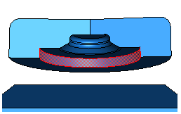
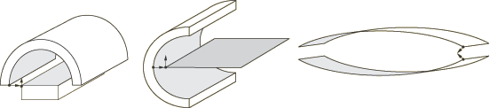

# 15.6.4 使用接触检测工具的提示

接触检测工具可用于任何需要创建接触交互和连接约束的三维模型。它根据最低规格快速、彻底地识别并创建交互和联系。该工具极大地简化了一般接触定义不适用的模型中的接触定义过程。

以下各节概述的一些基本准则可确保最有效和高效地使用该工具：
-["Choosing a separation tolerance and extension angle](pt03ch15s06s04.md#usi-itn-auto-detection-tolerance)”
-["Reviewing contact pair candidates](pt03ch15s06s04.md#usi-itn-auto-detection-review)”
-["Saving the search parameters](pt03ch15s06s04.md#usi-itn-auto-detection-savecurrent)”
-["Features that may cause difficulties for the contact detection tool](pt03ch15s06s04.md#usi-itn-auto-detection-models)”
-["Limitations of the contact detection tool](pt03ch15s06s04.md#usi-itn-auto-detection-limitations)”

### 选择分离公差和延伸角度

指定的分离容差是接触对搜索算法的主要驱动力。 Abaqus/CAE 根据模型中面的相对大小提供默认的分离公差。您可能需要根据分析期间模型的预期响应修改此值。为了有效地捕获所有重要的接触对，指定的分离公差应与模型中的预期位移或偏转处于同一数量级或更大。

指定非常大的分离公差通常会捕获比分析中所需的更多的接触对。虽然额外的接触对不一定会降低模型的质量，但无关的定义难以管理并且会降低性能。

当选择控制表面延伸的角度时，应考虑可能接触的区域的拓扑和表面特征。表面应稍微延伸超出潜在接触区域，因此设置延伸角度以捕获沿面边缘的任何倒角或软角。凹痕、凹槽或浮雕有时会破坏表面的定义；这些特征与主面形成的角度应决定延伸角度。

对于网格模型，您可以在搜索接触对之前通过仅显示模型上的特征边来预览曲面的延伸（请参阅["Defining mesh feature edges," Section 76.5](pt07ch76hla04.md)）。如果延伸角等于特征角，则特定区域中的曲面定义将延伸至最近的可见特征边缘。调整特征角度，直到可见边缘包围要捕获的区域，然后相应地设置扩展角度。

### 审查接触对候选人

在创建交互和约束之前，您应该始终检查接触对候选者。寻找表面定义中的任何不连续性。不连续性通常是由小连接面引起的，这些连接面在直观上与接触对中的逻辑接触面并不相对（参见[Figure 15--10](pt03ch15s06s04.md#itn-detection-excluded-faces)）。

**图 15–10** 自动接触检测工具将无法识别突出显示的垂直面。

您可能需要使用修改后的扩展和合并选项重新运行搜索，以将不连续性合并到更大的曲面中。如有必要，请使用 **添加** 选项手动添加接触对。您还可以使用 **合并** 选项组合不连续的曲面。

您应该调查任何相交曲面以验证它们是否符合您的建模意图。仅具有单个超闭合节点的接触对将被报告为相交，因此轻微的差异可能会导致超闭合。如果没有适当的调整或过盈配合选项，过度闭合的接触对可能会导致分析中出现收敛困难。您还应该检查与过度闭合接触对相邻的任何面或曲面，以确保它们不是封闭的面。有关详细信息，请参阅["Detection of overclosed surfaces" in "The contact detection algorithm," Section 15.6.2](pt03ch15s06s02.md#usi-itn-auto-detection-overclosed)。

### 保存搜索参数

默认情况下，您在“查找接触对”对话框中指定的搜索参数仅在该对话框打开时才会保留；如果关闭该对话框，下次访问接触检测工具时将提供默认搜索参数。

如果单击 **高级** 选项卡页面上的，Abaqus/CAE 会将当前指定的搜索参数设置为默认搜索参数。这些参数在 Abaqus/CAE 的所有未来会话中作为默认值提供。唯一未保存的参数是搜索域，它始终使用默认值**整个模型**。

当您保存当前搜索参数时，Abaqus/CAE 会询问您是否要将当前分离公差保存为默认值。通常Abaqus/CAE会根据当前模型重新计算默认的分离公差；如果您选择保存分离容差，则会跳过此计算，并且始终提供相同的值作为默认分离容差。

接触检测工具的默认搜索参数保存在`abaqus_v6.14.gpr`文件中；请参阅["Understanding Abaqus/CAE GUI settings," Section 3.6](pt01ch03s06.md)，了解更多信息。要将默认搜索参数恢复为其原始设置，请单击 **高级** 选项卡页面上的。

### 可能给接触检测工具带来困难的功能

使用具有某些模型功能和设计的接触检测工具时，您可能会遇到困难。这些情况不会导致性能或稳定性问题，但搜索结果通常与您的建模意图不匹配。

**堆叠的贝壳和薄层**

具有紧密平行堆叠的多层壳或薄板的模型可以导致定义无关的接触对。自动接触检测工具可以找到涉及由中间层分隔的表面的接触对，只要这些表面直观上相对并且在分隔公差范围内。此外，如果启用同一实例内的搜索并且禁用重叠表面检查，则接触检测工具可以检测连续薄板的顶侧和底侧之间的潜在接触。 Abaqus/CAE 为所有这些表面创建候选接触对，即使它们永远不会接触。当层或板是模型的局部特征时，此问题最常见，因为需要更大的分离公差来捕获模型其他区域中的表面。要解决此问题，请将搜索域限制为模型的特定区域，并使用适合该区域的分离容差。您还可以使用接触检测对话框的**实体**选项卡页面从搜索域中消除某些几何图形或单元类型（例如，壳）。否则，您应该在创建交互之前删除无关的接触对候选者。

**凹面**

虽然接触搜索算法有效地考虑了最合适的表面，但它可能会误解凹面和平坦表面之间的关系。凹面会产生困难，因为它们的表面法线方向在单个表面的跨度上可能变化很大，并且表面之间最接近的点有时是一个很差的参考。例如，考虑[Figure 15--11](pt03ch15s06s04.md#itn-detection-rounds-bad)中的情况。

**图 15-11** 阴影表面的法线在最接近点处并不直观地相反。

即使这些模型中最接近的点在分离公差范围内，这些点处的表面法线也不会通过方向测试。接触检测工具不会将这些表面报告为候选接触对，并且调整分离容差对此行为没有影响。有时您可以修改延伸角度以捕获另一个曲面定义中的凹曲面。否则，您必须使用 **添加** 选项手动定义接触对。

**涉及大旋转的机制**

当对经历大幅旋转的机构进行建模时，接触检测工具通常无法有效捕获您的建模意图。在这种机构中，预期的接触表面最初可能被定位成彼此远离，而附近的表面实际上从未接触。[Figure 15--12](pt03ch15s06s04.md#usi-itn-auto-detection-geneva)中描绘的日内瓦机制就是一个典型的例子。

**图 15-12** 日内瓦机构的运动。

该模型中重要的接触表面是右侧主体上的销和左侧主体上的槽。在初始配置中，销钉距离任何插槽都相对较远。另一方面，相邻曲面对于模型的接触条件并不重要。此类模型的接触最好使用交互编辑器手动定义（请参阅["Defining surface-to-surface contact," Section 15.13.7](pt03ch15s13s01.md)）。

### 接触检测工具的局限性

接触检测无法创建涉及以下功能的接触对：
- 二维模型
- 轴对称模型
- 横梁和桁架
- 面对面接触
- 边对边接触
- 孤立网格单元和分析刚性表面之间的接触
- 包含孤立网格和未网格几何体的混合模型

最小允许分离公差为 1 105。最大允许分离公差为 1 105。Abaqus/CAE 无法准确计算此范围之外的分离。如果您的模型需要使用不满足这些要求的分离公差，则应缩放整个模型的尺寸，使其落入功能范围内。

