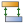
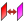

# 15.13.7 定义面对面接触

表面到表面接触定义可用作一般接触的替代方法，以对模型中特定表面之间的接触相互作用进行建模。某些交互行为只能通过使用表面到表面的接触来定义。有关 Abaqus 中可用的表面到表面接触和其他类型交互的简要概述，请参阅["Understanding interactions," Section 15.3](pt03ch15s03.md)和["Contact interaction analysis: overview," Section 36.1.1 of the Abaqus Analysis User's Guide](../usb/usb-link.md#usb-cni-acontactoverview)。

您可以在任何步骤中定义表面到表面的接触，包括初始步骤。从主菜单栏中选择****交互****创建****，然后选择主曲面和从曲面。您可以定义线边之间或实体或壳的面之间的接触。根据接触配方的类型，某些连接限制适用于接触表面。您可以在一个步骤中停用表面到表面接触交互，并且如果需要，可以在后续步骤中重新激活此交互。如果分析中不再需要交互，您可以在步骤中停用交互。

如果您要创建多个表面到表面的接触交互，您可能需要使用接触检测工具。该工具可自动执行选择曲面的过程，并允许您同时创建多个交互。有关详细信息，请参阅["Using contact and constraint detection," Section 15.16](pt03ch15s16.md)。

您可以使用分析步模块中的字段和历史输出请求编辑器来获取特定面对面接触交互的接触数据。在编辑器的 **Domain** 部分中，选择 **Interaction** 并从出现的菜单中选择表面到表面接触交互的名称。有关详细信息，请参阅["Creating an output request," Section 14.12.1](pt03ch14s12hlb01.md)。

定义面到面接触的过程取决于您是使用 Abaqus/Standard 还是 Abaqus/Explicit 执行分析。本节提供有关使用交互编辑器定义不同的表面到表面接触选项的说明。涵盖以下主题：
-["Defining surface-to-surface contact in an Abaqus/Standard analysis](pt03ch15s13s01.md#usi-itn-help-surftosurf-std)”
-["Defining surface-to-surface contact in an Abaqus/Explicit analysis](pt03ch15s13s01.md#usi-itn-help-surftosurf-exp)”
-["Specifying interference fit options](pt03ch15s13s01.md#usi-itn-help-interferencefit)”

### 在 Abaqus/Standard 分析中定义面对面接触

在 Abaqus/Standard 中只能通过使用面对面接触来定义某些交互行为；请参阅["Contact simulation capabilities in Abaqus/Standard" in "Contact interaction analysis: overview," Section 36.1.1 of the Abaqus Analysis User's Guide](../usb/usb-link.md#usb-cni-acontactover-standard)，了解更多信息。

**要在 Abaqus/Standard 分析中定义面对面接触：**

1. 从主菜单栏中，选择****交互****创建****。 **提示：**您还可以使用相互作用模块工具箱中的工具创建表面到表面的接触交互。
2. 在出现的 **创建交互** 对话框中，执行以下操作： - 为交互命名。有关命名对象的更多信息，请参阅["Using basic dialog box components," Section 3.2.1](pt01ch03s02s01.md)。 - 选择将创建交互的步骤。 - 选择 **表面对表面接触（标准）** 交互类型。
3. 单击“**继续**”关闭“**创建交互**”对话框。
4. 使用以下方法之一选择主曲面： - 使用现有曲面定义区域。在提示区域右侧，单击“**曲面**”。从出现的 **区域选择** 对话框中选择现有曲面，然后单击 **继续**。 **注意：**默认选择方法基于您最近使用的选择方法。要恢复到其他方法，请单击提示区域右侧的 **在视口中选择** 或 **曲面**。 - 使用鼠标在视口中选择一个区域。 （有关详细信息，请参阅["Selecting objects within the current viewport," Section 6.2](pt01ch06s02.md)。）单击鼠标按钮 2 表示您已完成选择。根据接触配方的类型，某些连接限制适用于接触表面。详细信息请参见["Defining contact pairs in Abaqus/Standard," Section 36.3.1 of the Abaqus Analysis User's Guide](../usb/usb-link.md#usb-cni-acontactpair)。如果模型包含网格和几何体的组合，请从提示区域单击以下选项之一： - 如果要从几何区域选择曲面，请单击“**几何体**”。 - 如果您想从原生或孤立网格选择中选择曲面，请单击 **网格**。您可以使用角度方法从几何体中选择一组面或边，或者从网格中选择一组单元面。有关更多信息，请参阅["Using the angle and feature edge method to select multiple objects," Section 6.2.3](pt01ch06s02hlb03.md)。您选择的主曲面在视口中以红色突出显示。
5. 选择从属表面。 1. 在提示区域中，选择以下选项之一： - 如果要选择曲面，请选择 **曲面**。 - 如果要选择从中创建接触节点集的区域，请选择 **节点区域**。 2. 使用前面描述的相同方法之一选择从属曲面或区域。您选择的从属曲面或区域在视口中以洋红色突出显示。将出现 **编辑交互** 对话框。
6. **切换表面**选项允许您交换主表面和从表面选择，而无需重新开始。仅当您在上一步中选择了 **表面** 时，**切换表面**图标才可用。
7. 选择滑动配方。 - 选择 **有限滑动** 以使用有限滑动公式，这是最通用的并且允许曲面的任意运动。 - 选择 **小滑动** 以使用小滑动公式，该公式假设虽然两个物体可能会经历较大的运动，但一个表面沿另一个表面的滑动相对较小。有关详细信息，请参阅["Contact formulations in Abaqus/Standard," Section 38.1.1 of the Abaqus Analysis User's Guide](../usb/usb-link.md#usb-cni-acontactpairform)。
8. 选择离散化方法。 - 选择**节点到表面**以使用节点到表面离散化方法。 - 选择**表面到表面**以使用表面到表面离散化方法。有关更多信息，请参阅["Discretization of contact pair surfaces" in "Contact formulations in Abaqus/Standard," Section 38.1.1 of the Abaqus Analysis User's Guide](../usb/usb-link.md#usb-cni-acontactpair-masterslave)。
9. 根据滑动公式和离散化方法选择的组合，可以使用不同的字段。 - 默认情况下，壳和膜厚度包含在以下组合的接触计算中：**小滑动**和**节点到表面**、**小滑动**和**表面到表面**以及**有限滑动**和**表面到表面**。您可以打开 **排除壳/膜单元厚度** 以忽略任何这些组合的壳和膜厚度。使用**有限滑动**和**节点到表面**的接触交互不考虑表面厚度。有关详细信息，请参阅["Accounting for shell and membrane thickness" in "Assigning surface properties for contact pairs in Abaqus/Standard," Section 36.3.2 of the Abaqus Analysis User's Guide](../usb/usb-link.md#usb-cni-acontactpair-thickness)。 - 对于使用 **节点到曲面** 离散化方法的接触交互，您可以在 **主曲面平滑度** 字段中指定平滑因子。有关详细信息，请参阅["Smoothing master surfaces for the finite-sliding, node-to-surface formulation" in "Contact formulations in Abaqus/Standard," Section 38.1.1 of the Abaqus Analysis User's Guide](../usb/usb-link.md#usb-cni-acontactpairform-smoothing)。 - 默认情况下，补充接触约束的选择性方案用于以下组合：**有限滑动**和**节点到表面**、**小滑动**和**节点到表面**以及**小滑动**和**表面到表面**。对于这些组合，您可以指定何时**使用补充接触点**，如下所示： - 选择**选择性**以使用补充接触约束的选择性方案。 - 选择**从不**放弃使用补充接触约束。 - 选择**始终**以在适用时添加补充联系约束。有关更多信息，请参阅["Supplementary contact constraints" in "Adjusting contact controls in Abaqus/Standard," Section 36.3.6 of the Abaqus Analysis User's Guide](../usb/usb-link.md#usb-cni-acontacttrouble-supplementary-constraints)。 - 对于使用**有限滑动**和**表面到表面**的接触交互，您可以选择**接触跟踪**方法。 - 选择 **单一配置（状态）** 以使用基于状态的跟踪算法。 - 选择 **两种配置（路径）** 以使用基于路径的跟踪算法。有关详细信息，请参阅["Path-based versus state-based tracking algorithms" in "Contact formulations in Abaqus/Standard," Section 38.1.1 of the Abaqus Analysis User's Guide](../usb/usb-link.md#usb-cni-acontactpairform-tracking)。 **注意：**如果您的接触交互使用面对面离散化方法，并且接触交互中的一个或多个表面是解析刚性表面，则应选择基于状态的跟踪算法。
10.指定从节点调整选项。有关更多信息，请参阅["Adjusting initial surface positions and specifying initial clearances in Abaqus/Standard contact pairs," Section 36.3.5 of the Abaqus Analysis User's Guide](../usb/usb-link.md#usb-cni-aadjustsurfaces)和["Defining tied contact in Abaqus/Standard," Section 36.3.7 of the Abaqus Analysis User's Guide](../usb/usb-link.md#usb-cni-atiedcontact)。
11. 对于使用 **表面到表面** 离散化方法的接触交互，您可以对接触表面应用平滑，以减少由于弯曲几何图形上的网格离散化而导致的接触压力不准确。单击“**表面平滑**”选项卡，然后选择以下选项之一： - 选择“**不平滑**”以防止应用平滑。 - 选择 **适用时自动平滑 3D 几何表面**，将平滑应用于由 Abaqus/CAE 自动识别的轴对称或球面（或表面的一部分）。自动平滑对网格零件或二维模型没有影响。有关接触平滑技术的更多信息，请参阅["Smoothing contact surfaces in Abaqus/Standard," Section 38.1.3 of the Abaqus Analysis User's Guide](../usb/usb-link.md#usb-cni-asmoothsurfaces)。
12. 对于使用 **小滑动** 公式的接触交互，您可以指定从属表面和主表面上的节点之间的初始间隙。单击“**间隙**”选项卡，从“**初始间隙**”字段中选择间隙类型，然后输入定义间隙和接触方向所需的所有数据。有关详细信息，请参阅["Defining a precise initial clearance or overclosure for small-sliding contact" in "Adjusting initial surface positions and specifying initial clearances in Abaqus/Standard contact pairs," Section 36.3.5 of the Abaqus Analysis User's Guide](../usb/usb-link.md#usb-cni-aadjustsurfaces-clearance)。
13. 如果为接触交互指定节点到表面的离散化，则还可以限制与特定子集中的从属节点的绑定。单击“**绑定**”选项卡，打开“**限制绑定到子集中的从属节点**”，然后从列表中选择一个节点集。您可以限制以下任一情况的绑定： - 当您想要指定应经历内聚力的初始从属节点的子集时。将对那些最初不接触但在节点集中指定的节点进行无应变调整。该组之外的所有从节点（包括最初接触主表面的节点）在分析过程中将仅经历压缩接触力。有关详细信息，请参阅["Specifying cohesive behavior properties for mechanical contact property options" in "Defining a contact interaction property," Section 15.14.1](pt03ch15s14s01.md#usi-itn-help-prop-contact-mech-cohesive)。 - 当您想要识别 VCCT 裂纹中从属表面的初始粘合区域时。从属表面的未粘合部分表现为常规接触表面。假定预定的裂纹表面最初部分粘合，以便在分析过程中可以明确识别裂纹尖端。有关详细信息，请参阅["Defining initially bonded crack surfaces in Abaqus/Standard" in "Crack propagation analysis," Section 11.4.3 of the Abaqus Analysis User's Guide](../usb/usb-link.md#usb-anl-acrackpropagation-initcond)。
14. 选择联系人交互属性。如果需要，单击创建交互属性。有关更多信息，请参阅["Defining a contact interaction property," Section 15.14.1](pt03ch15s14s01.md)和["Contact constraint enforcement methods in Abaqus/Standard," Section 38.1.2 of the Abaqus Analysis User's Guide](../usb/usb-link.md#usb-cni-acontactconstraints)。
15. 要指定过盈配合选项，请单击 **过盈配合**。无法在初始步骤中指定过盈配合选项。有关输入过盈配合选项的更多详细说明，请参阅下面的“["Specifying interference fit options](pt03ch15s13s01.md#usi-itn-help-interferencefit)”。
16. 如果需要，请单击“**联系人控件**”字段旁边的箭头，然后选择用于此交互的自定义联系人控件。列表中仅显示先前创建的 Abaqus/Standard 接触控制。有关详细信息，请参阅["Specifying contact controls in an Abaqus/Standard analysis," Section 15.13.9](pt03ch15s13hlb07.md)。
17. 要停用并重新激活某个步骤中的联系交互，请切换**在此步骤中激活**。接触交互在创建它的步骤中处于活动状态。有关更多信息，请参阅["Removing and reactivating contact pairs" in "Defining contact pairs in Abaqus/Standard," Section 36.3.1 of the Abaqus Analysis User's Guide](../usb/usb-link.md#usb-cni-acontactmodelchange)。
18. 单击 **确定** 创建交互并关闭编辑器。

有关相关主题的信息，请单击以下任意项目：-["Defining contact pairs in Abaqus/Standard," Section 36.3.1 of the Abaqus Analysis User's Guide](../usb/usb-link.md#usb-cni-acontactpair)-["Interaction editors," Section 15.9.2](pt03ch15s09s02.md)-["Customizing contact controls," Section 15.12.3](pt03ch15s12hlb03.md)

### 在 Abaqus/Explicit 分析中定义面对面接触

在 Abaqus/Explicit 中只能通过使用面对面接触来定义某些交互行为；请参阅["Contact simulation capabilities in Abaqus/Explicit" in "Contact interaction analysis: overview," Section 36.1.1 of the Abaqus Analysis User's Guide](../usb/usb-link.md#usb-cni-acontactover-explicit)，了解更多信息。

**要在 Abaqus/Explicit 分析中定义面对面接触：**

1. 从主菜单栏中，选择****交互****创建****。 **提示：**您还可以使用相互作用模块工具箱中的工具创建表面到表面的接触交互。
2. 在出现的 **创建交互** 对话框中，执行以下操作： - 为交互命名。有关命名对象的更多信息，请参阅["Using basic dialog box components," Section 3.2.1](pt01ch03s02s01.md)。 - 选择将创建交互的步骤。 - 选择**表面对表面接触（显式）**交互类型。
3. 单击“**继续**”关闭“**创建交互**”对话框。
4. 使用以下方法之一选择主曲面： - 使用现有曲面定义区域。在提示区域右侧，单击“**曲面**”。从出现的 **区域选择** 对话框中选择现有曲面，然后单击 **继续**。 **注意：**默认选择方法基于您最近使用的选择方法。要恢复到其他方法，请单击提示区域右侧的 **在视口中选择** 或 **曲面**。 - 使用鼠标在视口中选择一个区域。 （有关详细信息，请参阅["Selecting objects within the current viewport," Section 6.2](pt01ch06s02.md)。）单击鼠标按钮 2 表示您已完成选择。根据接触配方的类型，某些连接限制适用于接触表面。详细信息请参见["Defining contact pairs in Abaqus/Explicit," Section 36.5.1 of the Abaqus Analysis User's Guide](../usb/usb-link.md#usb-cni-aexpcontactpair)。如果模型包含网格和几何体的组合，请从提示区域单击以下选项之一： - 如果要从几何区域选择曲面，请单击“**几何体**”。 - 如果您想从原生或孤立网格选择中选择曲面，请单击 **网格**。您可以使用角度方法从几何体中选择一组面或边，或者从网格中选择一组单元面。有关更多信息，请参阅["Using the angle and feature edge method to select multiple objects," Section 6.2.3](pt01ch06s02hlb03.md)。您选择的主曲面在视口中以红色突出显示。
5. 选择从属表面。 1. 在提示区域中，选择以下选项之一： - 如果要选择曲面，请选择 **曲面**。 - 如果要选择从中创建接触节点集的区域，请选择 **节点区域**。 2. 使用前面描述的相同方法之一选择从属曲面或区域。您选择的从属曲面或区域在视口中以洋红色突出显示。将出现 **编辑交互** 对话框。
6. **切换表面**选项允许您交换主表面和从表面选择，而无需重新开始。仅当您在上一步中选择了 **表面** 时，**切换表面**图标才可用。
7. 选择机械约束公式。 - 选择**运动学接触方法**以使用运动学预测器/校正器接触算法。 - 选择**惩罚接触方法**以使用惩罚接触算法。有关详细信息，请参阅["Contact constraint enforcement methods in Abaqus/Explicit," Section 38.2.3 of the Abaqus Analysis User's Guide](../usb/usb-link.md#usb-cni-aexpcontactconstraints)。
8. 选择滑动配方。 - 选择 **有限滑动** 以使用有限滑动公式，这是最通用的并且允许曲面的任意运动。 - 选择 **小滑动** 以使用小滑动公式，该公式假设虽然两个物体可能会经历较大的运动，但一个表面沿另一个表面的滑动相对较小。可以为仅在初始步骤或第一个一般分析步骤中创建的相互作用指定小滑动公式。默认情况下，后续步骤中创建的交互始终使用有限滑动公式。有关更多信息，请参阅["Contact formulations for contact pairs in Abaqus/Explicit," Section 38.2.2 of the Abaqus Analysis User's Guide](../usb/usb-link.md#usb-cni-aexpcontactpairform)。
9. 对于使用 **小滑动** 公式的接触交互，您可以指定从属曲面和主曲面上的节点之间的初始间隙。间隙选项仅在第一个一般分析步骤中可用。从 **初始间隙** 字段中选择间隙类型，然后输入定义间隙和接触方向所需的所有数据。有关详细信息，请参阅["Specifying initial clearance values precisely" in "Adjusting initial surface positions and specifying initial clearances for contact pairs in Abaqus/Explicit," Section 36.5.4 of the Abaqus Analysis User's Guide](../usb/usb-link.md#usb-cni-aexpadjustsurfaces-clearance)。
10. 选择联系人交互属性。如果需要，单击创建交互属性；请参阅["Defining a contact interaction property," Section 15.14.1](pt03ch15s14s01.md)，了解更多信息。
11. 选择权重因子。有关更多信息，请参阅["Contact formulations for contact pairs in Abaqus/Explicit," Section 38.2.2 of the Abaqus Analysis User's Guide](../usb/usb-link.md#usb-cni-aexpcontactpairform)。
12. 如果需要，请单击“**联系人控件**”字段旁边的箭头，然后选择用于此交互的自定义​​联系人控件。列表中仅显示先前创建的 Abaqus/Explicit 接触控件。有关详细信息，请参阅["Specifying contact controls in an Abaqus/Explicit analysis," Section 15.13.10](pt03ch15s13hlb08.md)。
13. 要停用并重新激活某个步骤中的联系交互，请切换**在此步骤中激活**。接触交互在创建它的步骤中处于活动状态。
14. 单击 **确定** 创建交互并关闭编辑器。

有关相关主题的信息，请单击以下任意项目：-["Defining contact pairs in Abaqus/Explicit," Section 36.5.1 of the Abaqus Analysis User's Guide](../usb/usb-link.md#usb-cni-aexpcontactpair)-["Interaction editors," Section 15.9.2](pt03ch15s09s02.md)-["Customizing contact controls," Section 15.12.3](pt03ch15s12hlb03.md)

### 指定过盈配合选项

当您为 Abaqus/Standard 定义面到面接触时，可以指定过盈配合选项，帮助 Abaqus/Standard 解决模型初始配置中曲面之间过度闭合的问题。有关详细信息，请参阅["Modeling contact interference fits in Abaqus/Standard," Section 36.3.4 of the Abaqus Analysis User's Guide](../usb/usb-link.md#usb-cni-acontactinterference)。

要打开 **过盈配合选项** 对话框，请在 Abaqus/Standard 交互编辑器中单击 **过盈配合**（有关详细信息，请参阅上面的“["Defining surface-to-surface contact in an Abaqus/Standard analysis](pt03ch15s13s01.md#usi-itn-help-surftosurf-std)”）。

**要指定过盈配合选项：**

1. 在 **过盈配合选项** 对话框中，选择 **在步骤期间逐渐移除从节点过度封闭** 以规定允许的相互参照。
2. 选择以下选项之一： - 如果您希望 Abaqus/Standard 为每个从节点分配不同的允许干扰（等于该节点的初始穿透度），请选择 **自动收缩配合（仅限第一个一般分析步骤）**。如果选择此选项，请跳至步骤 6。 - 选择**统一允许干扰**以指定将应用于每个从节点的单个允许干扰。
3. 单击 **振幅** 字段右侧的箭头，选择振幅曲线的名称，该曲线定义了步骤期间指定干扰的幅度。或者，您可以选择 **（斜坡）** 在步骤开始时立即应用规定的干扰，并在步骤中将其线性斜坡降至零。如果需要，您可以单击“”来定义新的幅度曲线。有关详细信息，请参阅["Selecting an amplitude type to define," Section 57.3](pt06ch57s03.md)。
4. 在**步骤开始时的幅度**字段中，输入步骤开始时允许的干扰幅度。
5. 如果需要，选择 **Interference Direction** 选项 **Along Direction** 以指定平移方向矢量。在 Abaqus/Standard 确定接触条件之前，相对位移会应用于从节点。如果选择此选项，请输入以下内容： - 在 **X** 字段中，输入平移方向向量的 *X* 方向余弦。 - 在 **Y** 字段中，输入移位方向向量的 *Y* 方向余弦。 - 在 **Z** 字段中，输入移位方向向量的 *Z* 方向余弦。
6. 单击 **确定** 保存您指定的过盈配合选项并返回到 **编辑交互** 对话框。

