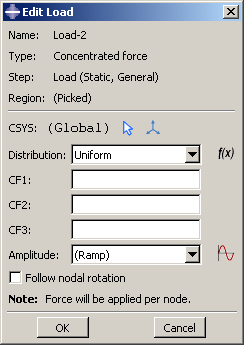
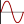

# 16.4 创建和修改规定条件

要创建载荷、边界条件或预定义场，请从主菜单栏的相应菜单中选择“**创建**”。将出现一个**创建**对话框，您可以在其中提供规定条件的名称并选择要创建的规定条件的类型。

当您在 **创建** 对话框中单击 **继续** 时，系统会提示您选择要应用规定条件的区域，除非规定条件应用于整个模型。您只能将连接器载荷和连接器边界条件（位移、速度和加速度）应用于与连接器截面分配关联的电线。如果选择多条导线，则分配给连接器截面分配中的导线的连接器截面必须具有您为其定义载荷和边界条件的相对运动的可用分量。您只能将连接器材料流边界条件应用到与连接器截面分配关联的电线端点。选择区域后，会出现一个编辑器，您可以在其中指定有关规定条件的附加信息，例如其大小。

每个规定条件编辑器的顶部面板显示规定条件的名称和类型、当前所处的分析步骤以及将应用规定条件的模型区域。如果您在首次创建指定条件的步骤中编辑规定条件，则**区域**字段旁边会出现**编辑区域** () 按钮；该按钮允许您编辑应用规定条件的区域。如果编辑区域需要​​完全重新定义规定条件（例如，如果规定条件应用于整个模型或引用原始选定区域内的子区域），则不会出现 **编辑区域** 按钮。有关详细信息，请参阅["Editing the region to which a prescribed condition is applied," Section 16.8.4](pt03ch16s08hlb04.md)。

编辑器其余部分的格式取决于您定义的规定条件的类型以及编辑器顶部指定的步骤。例如，集中力量的编辑器显示在[Figure 16--2](pt03ch16s04.md#lbi-forceeditor)中。

**图 16-2** 集中力量的编辑器。

该编辑器包含特殊的文本字段，您可以在其中指定 1、2 和 3 方向上的力分量。编辑器还包含一个 **Amplitude** 文本字段，允许您根据时间改变规定条件的大小。您可以接受默认幅度，选择使用幅度工具集定义的幅度，或单击定义新幅度。 （有关更多信息，请参阅[Chapter 57, "The Amplitude toolset](pt06ch57.md)。”）

您可以指定将在其中应用以下载荷或边界条件的坐标系：

**负载**

- 集中力量
- 时刻
- 一般和剪切表面牵引力
- 一般壳边缘载荷
- 惯性缓解
- 电流密度

**边界条件**

- 对称/反对称/恩卡斯特
- 位移/旋转
- 速度/角速度
- 加速度/旋转加速度
- 欧拉网格运动
- 磁矢量势

所有其他指定条件均使用全局坐标系，但压力除外，压力垂直应用于所选表面。

如果载荷或边界条件允许您指定坐标系，则可以选择现有基准坐标系，也可以接受全局坐标系。如果所需的基准坐标系不存在，您可以使用基准工具集创建它。 （有关详细信息，请参阅["Creating datum coordinate systems," Section 62.9](pt06ch62s09.md)。）或者，您可以参考定义坐标系的 Abaqus/Standard 用户子例程（请参阅["ORIENT," Section 1.1.15 of the Abaqus User Subroutines Reference Guide](../sub/sub-link.md#sub-rtn-uorient)）。

**注意：**如果删除或抑制基准坐标系，载荷或边界条件的方向将恢​​复为全局坐标系。

创建和修改预定义字段的规则根据预定义字段类型的不同而有所不同：
- 某些预定义字段要求您仅指定初始条件。您只能在初始步骤中创建和编辑此类预定义字段。随着分析的进行，Abaqus 计算预定义字段的后续值。这种类型的预定义字段是初始速度规范、硬化规范和材料分配（用于欧拉分析）。有关详细信息，请参阅["Initial conditions in Abaqus/Standard and Abaqus/Explicit," Section 34.2.1 of the Abaqus Analysis User's Guide](../usb/usb-link.md#usb-prc-pinitialcond)。
- 您可以为分析中的任何步骤创建预定义的温度场。您可以通过输入所需步骤的值或读取 Abaqus 在之前的热组件分析中计算出的温度值来定义当前模型的温度。有关详细信息，请参阅["Predefined fields," Section 34.6.1 of the Abaqus Analysis User's Guide](../usb/usb-link.md#usb-prc-pfields)中的“温度”。

**注意：**如果您没有为预定义字段定义初始值，则假定该字段在分析开始时的值为零。

创建规定条件后，您可以通过以下方式修改规定条件：
- 您可以修改创建规定条件时在编辑器中输入的部分或全部数据。
- 您可以使用管理器修改规定条件的逐步历史记录。 （有关详细信息，请参阅["What are step-dependent managers?," Section 3.4.2](pt01ch03s04s02.md)。）

要显示特定管理器或编辑器功能的帮助，请从主菜单栏中选择****帮助****上下文****，然后单击感兴趣的功能。有关相关主题的信息，请单击以下任意项目：-["What are step-dependent managers?," Section 3.4.2](pt01ch03s04s02.md)-["Using the load editors," Section 16.9](pt03ch16s09.md)-["Using the boundary condition editors," Section 16.10](pt03ch16s10.md)-["Using the predefined field editors," Section 16.11](pt03ch16s11.md)-[Chapter 62, "The Datum toolset](pt06ch62.md)”
-[Chapter 57, "The Amplitude toolset](pt06ch57.md)”

