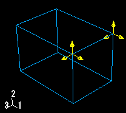
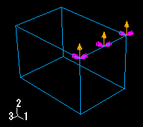
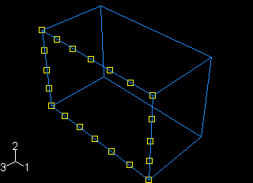
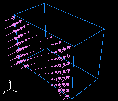
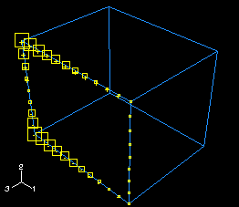

# 16.5.1 了解规定的条件符号类型、颜色和大小

代表规定条件的符号的类型、颜色和大小可以随情况而变化。
- 符号代表的规定条件的类型，
- 您应用规定条件的自由度，以及
- 规定条件的空间变化（对于分析场分布）。

请参阅["Symbols used to represent prescribed conditions," Section C.1](ap03s01.md)，了解符号类型和颜色的重要性的摘要。

例如，[Figure 16--3](pt03ch16s05hlb01.md#lbi-gforce)显示施加到顶点的集中力。代表集中力的不同分量的所有箭头都是黄色的。

**图 16-3** 集中力量。

另一方面，[Figure 16--4](pt03ch16s05hlb01.md#lbi-gcolorbc)显示了应用于平移和旋转自由度的 **速度/角速度** 边界条件。沙棕色箭头表示应用于平动自由度的边界条件的组成部分。洋红色箭头表示应用于旋转自由度的边界条件分量。

**图 16–4** 应用于边缘的边界条件。

**注意：**当边界条件固定适当的自由度时，表示该组件的箭头缺少主干。

[Figure 16--5](pt03ch16s05hlb01.md#lbi-gfield)显示应用于面的均匀温度场。

**图 16–5** 均匀的温度场。

一般来说，符号的大小是统一的，与规定条件的大小无关。对于使用分析场分布的规定条件，符号根据分析场值进行缩放。[Figure 16--6](pt03ch16s05hlb01.md#lbi-gpressure-dist)显示使用分析场指定空间变化幅度的压力载荷。

**图 16-6** 面部压力负载的变化。

另外，对于除箭头之外的符号，在每个符号内部显示加号(+)或减号()以指示在该位置规定条件的大小是正还是负。[Figure 16--7](pt03ch16s05hlb01.md#lbi-gtempbc)表示温度边界条件。为了清楚起见，增加了符号大小。

**图 16–7** 使用分析场分布的温度边界条件。

有关控制符号大小和缩放比例的信息，请参阅["Controlling the display of attributes," Section 76.15](pt07ch76hla14.md)。

在某些情况下，Abaqus/CAE 会针对规定条件显示按比例缩小的符号，例如，当指定的规定条件对分析没有影响时，或者当分析字段的部分区域计算为零时。这些缩小的符号明显小于默认符号大小。例如，如果您指定具有垂直于表面的方向矢量的剪切面牵引载荷，Abaqus/CAE 无法将此类载荷垂直于参考表面应用，并且会在视口中显示非常小的箭头符号来表示载荷。有关相关主题的信息，请单击以下任意项目：-["Displaying symbols for interactions and prescribed conditions that use analytical fields," Section 58.4](pt06ch58s04.md)-["Controlling the display of attributes," Section 76.15](pt07ch76hla14.md)-["Symbols used to represent prescribed conditions," Section C.1](ap03s01.md)

