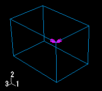
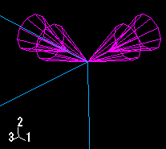
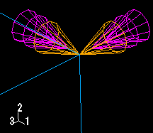

# 16.5.2 单头和双头箭头代表什么？

在许多情况下，Abaqus/CAE 使用箭头来表示视口中的规定条件。这些箭头表示规定条件的每个组成部分（流体边界条件除外，在这种情况下箭头表示合成方向）。例如，[Figure 16--8](pt03ch16s05hlb02.md#lbi-gforce2)中出现的箭头表示施加到两个顶点的集中力的三个分量。

**图 16-8** 具有三个分量的集中力。

带有单个箭头的箭头表示应用于平移自由度的规定条件的组成部分。例如，[Figure 16--8](pt03ch16s05hlb02.md#lbi-gforce2)中集中力的三个分量应用于自由度 1 至 3；因此，图中的每个箭头都有一个箭头。

当规定条件的分量应用于旋转自由度时，该分量显示为双头箭头。[Figure 16--9](pt03ch16s05hlb02.md#lbi-gbc)中的箭头表示 **速度/角速度** 边界条件应用于顶点的自由度 4 和 6。

**图 16-9** 应用于旋转自由度的边界条件。

[Figure 16--10](pt03ch16s05hlb02.md#lbi-gbc2)中出现双头箭头的放大视图。

**图 16–10** 放大的双头箭头。

如果将规定条件应用于平移和旋转自由度，则单头和双头箭头都会出现。例如，**速度/角速度**边界条件应用于[Figure 16--11](pt03ch16s05hlb02.md#lbi-gbc3)中顶点的自由度 1、3、4 和 6。

**图 16-11** 应用于平移和旋转自由度的边界条件的放大视图。

在此图中，单头箭头为沙棕色，表示顶点的自由度 1 和 3 是固定的。双头箭头为洋红色，直接出现在单头箭头后面；双头箭头表示顶点的自由度 4 和 6 是固定的。

有关箭头颜色的信息，请参阅["Understanding prescribed condition symbol type, color, and size," Section 16.5.1](pt03ch16s05hlb01.md)。有关箭头何时指向或远离某个区域的信息，请参阅["Understanding symbol location and direction," Section 16.5.3](pt03ch16s05hlb03.md)。有关相关主题的信息，请单击以下任意项目：-["Understanding symbols that represent prescribed conditions," Section 16.5](pt03ch16s05.md)-["Controlling the display of attributes," Section 76.15](pt07ch76hla14.md)

