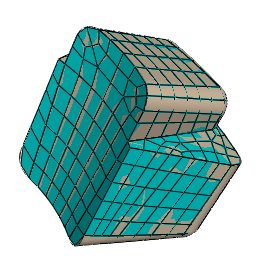

# 17.3.5 自下而上的网格划分

自下而上的网格划分使用零件几何形状作为网格外部边界的指导，但网格不需要符合几何形状。删除此限制使您可以更好地控制网格，并允许您在对于结构化或扫掠网格划分技术来说过于复杂的几何体上创建六面体或六面体主导的网格。自下而上的网格划分可以应用于任何实体模型形状。它为您提供了对网格的最大控制权，因为您可以选择驱动网格的方法和参数。但是，您还必须确定生成的网格是否是几何体的合适近似值。如果不是，您可以删除网格并尝试不同的自下而上网格划分方法，或者分区区域并使用自下而上或自上而下网格划分技术对生成的较小区域进行网格划分。

要对单个自下而上区域进行网格划分，您可能必须应用多个连续的自下而上网格。例如，您可以使用自下而上的拉伸网格来生成部分区域，然后使用拉伸网格的单元面作为起点，为拉伸网格不包含的特征生成扫掠网格。

载荷和边界条件应用于几何体。与自上而下的网格不同，自下而上的网格可能不与几何体完全关联。因此，您应该检查网格是否与施加载荷或边界条件的区域中的几何图形正确关联。正确的网格-几何关联将确保在分析过程中将载荷和边界条件正确地传递到网格。  （有关详细信息，请参阅["Mesh-geometry association," Section 17.12](pt03ch17s12.md)。）由于与自动自上而下的网格划分过程相比，用户需要付出额外的努力来创建令人满意的网格，因此仅当自上而下的网格划分无法生成合适的网格时，建议使用自下而上的网格划分。

[Figure 17--6](pt03ch17s03s05.md#mgn-bottomup)显示了自下而上网格零件的示例。虽然该零件相对简单，但需要两个区域和四个自下而上的网格来完全网格化该零件。 Abaqus/CAE 使用区域几何颜色（浅棕褐色）和网格颜色（浅蓝色）的混合来显示自下而上的网格区域，以强调几何结构和网格可能不相关。显示几何体和网格允许您查看和编辑网格-几何体关联性。

**图 17–6** 自下而上的六面体网格零件。

有关相关主题的信息，请单击以下任意项目：-["Top-down meshing," Section 17.3.4](pt03ch17s03s04.md)-["Understanding mesh generation," Section 17.7](pt03ch17s07.md)-["Assigning Abaqus element types," Section 17.5](pt03ch17s05.md)-["Verifying and improving meshes," Section 17.6](pt03ch17s06.md)-["Bottom-up meshing," Section 17.11](pt03ch17s11.md)

