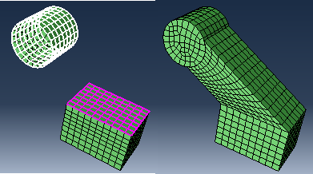
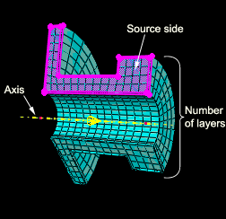

# 17.11.3 自下而上的网格划分方法

每个自下而上方法的控制参数与 Abaqus/CAE 内部使用的参数类似，用于为三维实体创建可比较的自上而下扫掠网格。自下而上的方法和相关参数定义如下：

**扫**

扫描方法通过沿扫描路径移动二维网格来创建三维网格。扫描方法如[Figure 17--95](pt03ch17s11s01.md#mgn-bottomup-swept)所示。当区域横截面在起始边和结束边之间变化时，应使用自下而上的扫描网格划分方法。要使用扫描方法，必须首先选择 **源面**，它定义 Abaqus/CAE 将在其上创建二维网格的一个或多个面。源面可以是几何面、单元面和二维单元的任意组合。您可以通过选择定义所需扫描区域的边的 **连接边** 来定义扫描路径。如果定义连接边，网格将与沿选定边的几何体或网格紧密一致。或者，对于几何体，您可以选择 **目标面** 并指定 **层数** 并允许 Abaqus/CAE 通过在源面和目标面之间进行插值来创建扫描路径。 **目标面** 是 Abaqus/CAE 用于结束网格的单个面。层数是指将放置在源边和目标边之间的单元层数 - 如果使用连接边，则连接边的二维网格定义单元层数。 Abaqus/CAE 将二维网格从源侧扫描到实体区域的体积中以创建网格。

**拉伸**

拉伸方法是扫描方法的特例，具有由方向和距离定义的线性路径。  挤出方法如[Figure 17--96](pt03ch17s11s01.md#mgn-bottomup-extrude)所示。对于具有恒定横截面和线性扫描路径的区域，您应该使用拉伸方法。自下而上的拉伸网格需要三个参数。与扫描方法一样，您选择 **源** 侧来定义 Abaqus/CAE 将在其上创建二维网格的区域。然后，您选择定义挤出方向的**矢量**的起点和终点，也可用于定义挤出距离。最后，您指定**层数**来定义源侧和拉伸网格末端之间的单元数。如果使用矢量来定义挤出距离，则定义完成。但是，您可以**指定**距离或使用**投影到目标**并选择目标侧来定义挤出距离。目标面可以从视口中的任何几何体、网格或基准平面中选择；它不必是与源相同的部件实例的一部分。 Abaqus/CAE 从源侧沿挤压矢量的方向挤压二维网格。如果选择目标侧来定义拉伸距离，Abaqus/CAE 将在目标侧结束拉伸网格。[Figure 17--97](pt03ch17s11s03.md#mgn-bu-extrudetarget)左侧显示源端和目标端；挤压矢量（未显示）从矩形源侧的中心延伸到圆柱体的中心。生成的拉伸网格是源侧网格的延伸。它与目标侧形状紧密匹配，但不会尝试匹配目标侧网格的节点位置。

**图 17–97** 可选目标侧（白色）用于定义挤出距离。

**偏置比**参数定义了自下而上拉伸网格的源侧和末端之间的单元厚度变化，其中创建了多个层。偏置比是挤压网格中第一层单元的厚度与最后一层单元的厚度的比率。`1.0`的默认偏置比在整个挤出距离内具有相等的厚度元素。

**围绕**

旋转方法是扫描方法的另一个特例。在这种情况下，扫描路径是由轴和旋转角度定义的圆形路径。  旋转方法如[Figure 17--98](pt03ch17s11s03.md#mgn-bu-revolve)所示。对于具有恒定横截面和圆形扫描路径的区域，应使用此方法。与扫描和拉伸方法一样，您选择 **源侧** 来定义 Abaqus/CAE 将在其上创建二维网格的区域。源侧不能与旋转轴相交，但它可以包含与轴重合的边。如果是这样，接触轴的单元会在旋转网格中创建一层楔形单元。源侧不应包括沿旋转轴的任何三角形元素。然后选择定义旋转轴的 **轴** 的起点和终点。最后，您指定 **角度** 和 **层数** 来定义旋转网格的源侧和末端之间的单元数。 Abaqus/CAE 从源侧旋转二维网格指定的角度，并将所得区域均匀划分为所需数量的单元层。沿着旋转轴从起点到终点观察，旋转方向为顺时针方向。

**图 17–98** 自下而上旋转方法以绕轴的指定角度扫描源侧网格。

**抵消**

偏移方法的工作原理与编辑网格工具集中的**偏移（创建实体层）**相同；它通过偏移选定的元素来创建一层或多层实体元素。仅当您使用孤立元素时，偏移才可用。要创建自下而上的偏移网格，请输入偏移单元的总厚度和所需的单元层数。您可以创建单元集或扩展现有单元集，但无法像使用“编辑网格”工具集那样创建顶部和底部曲面。如果选择壳单元作为源，则必须在提示区域中指明所需的偏移方向；您可以在两个方向上偏移壳单元。如果您的壳单元选择包含尖角，请启用**角周围的恒定厚度**，以保持单元在角处相交处的总厚度与选择的其余部分相同。使用此选项可以减少单元扭曲并防止单元折叠，特别是当单元偏移到角的内侧时（有关详细信息，请参阅["Reducing element distortion and collapse during mesh offsetting," Section 64.3.3](pt06ch64s03s03.md)）。

