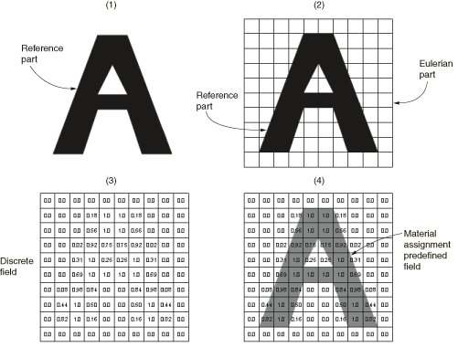
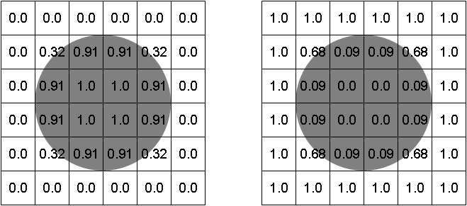

# 28.5 体积分数工具

体积分数工具通过在欧拉零件实例和与欧拉实例相交的第二个零件实例（参考零件实例）之间执行布尔比较来创建标量离散场。通过比较确定两个零件实例重叠的位置，然后根据参考实例所占用的元素的百分比为欧拉实例中的每个元素分配一个体积分数。体积分数指定为 0 到 1 之间的小数。

由体积分数工具创建的离散字段可用于将材料实例分配给欧拉零件实例（请参阅["Assigning materials to Eulerian part instances," Section 28.4](pt04ch28s04.md)）。分配的欧拉材质实例的拓扑对应于欧拉零件实例内参考零件实例的形状。

[Figure 28--7](pt04ch28s05.md#usi-adv-volfrac-proc-nls)和以下程序总结了使用体积分数工具的过程：

**图 28-7** 使用体积分数工具的程序。

1. 使用 Abaqus/CAE 中的任何建模工具和技术，创建与所需欧拉材料区域的几何形状相对应的参考零件。
2. 在欧拉零件实例中实例化参考零件。参考零件实例应在空间上对应于所需的欧拉材料区域。
3. 使用体积分数工具根据参考零件实例和欧拉零件实例的比较创建离散字段。
4. 使用体积分数工具创建的离散字段为欧拉零件实例定义材料分配预定义字段。

体积分数工具的选项控制计算的离散场是表示参考实例内部的空间（与参考实例重叠的元素中的体积分数非零）还是参考实例外部的空间（与参考实例不重叠或部分重叠的元素中的体积分数非零），如[Figure 28--8](pt04ch28s05.md#usi-adv-eulerian-volfrac-exa)中所示。

**图 28-8** 表示阴影参考区域内部（左）和外部（右）体积分数的离散字段。

通常，计算参考实例外部的体积分数用于在耦合欧拉-拉格朗日分析中围绕拉格朗日零件实例创建欧拉材料分配。计算参考实例内部的体积分数通常用于对纯欧拉零件实例内的复杂材料分配字段进行建模；在这种情况下，在分配欧拉材料后，参考实例将被抑制。您还可以计算参考实例内部的体积分数，以在耦合欧拉-拉格朗日分析中的封闭拉格朗日壳内部创建欧拉材料分配。

要使用体积分数工具，请从主菜单栏中选择****工具****离散场****体积分数工具****。有关使用该工具的分步说明，请参阅["Creating discrete fields for material volume fractions," Section 63.4](pt06ch63hla03.md)。

