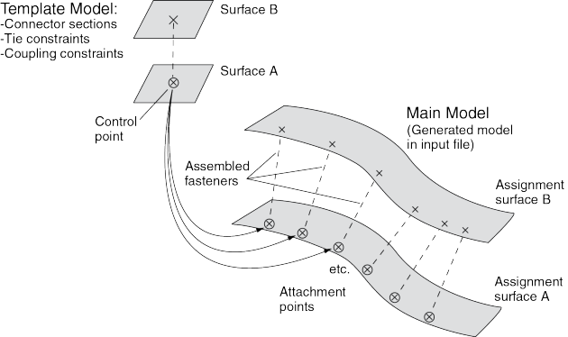
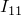
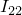
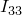
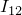
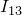
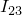
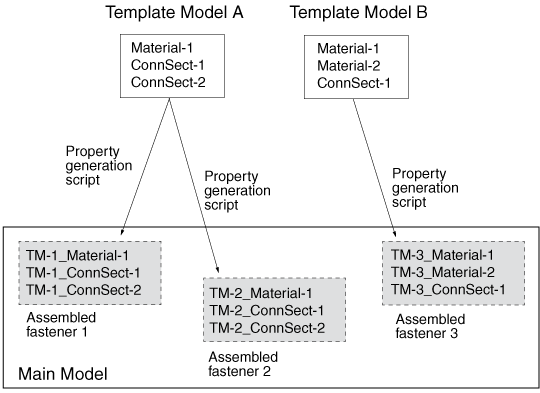
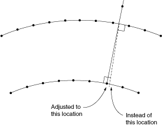

# 29.1.3 关于组装紧固件

组装紧固件允许您在大量模型位置高效分配复杂的紧固件行为。使用组装紧固件技术，您可以从模板模型读取连接器和约束行为，并将其分配到主模型中的多个位置。对于机身或汽车等大型系统，组装紧固件允许您定义一次紧固件模板，然后在主模型中多次分配。使用适当的耦合约束和调整点约束，模板模型中的从节点可以自动调整大小以适应主模型中的实际表面间距。

构建组装紧固件的总体过程如下：

1. 构建包含类似紧固件结构的模板模型：连接器截面分配、绑定约束、耦合约束以及实体或梁截面分配。您必须为参与约束的所有表面分配名称。您还必须定义一个单点集作为控制点，该点将用于将模板模型定位到主模型中。
2. 开发您的主模型，在要复制模板紧固件的位置放置连接点。模板模型控制点将被映射到主模型中连接点的位置（参见[图29-5](pt04ch29s01s03.md#eng-fasteners-assm-nls)）。
3. 在主模型中，使用**Create Fasteners**和**Edit Fasteners**对话框来定义如何读取、分配和定向模板模型。
4. （可选）使用一个或多个属性生成脚本来修改从模板模型复制到主模型的属性。同一模板模型可以与多个属性生成脚本一起使用，以在不同组装紧固件对象中获得不同结果。例如，您可以使用两个脚本将不同材料应用于同一紧固件模板。您可以使用Abaqus Scripting Interface编写属性生成脚本；参见["创建和运行您自己的脚本"，第9.5.4节](pt02ch09s05s04.md)和[Abaqus Scripting User's Guide](../cmd/cmd-link.md#cmd)。

**图29-5** 在主模型中复制模板模型。

模板模型使用全局坐标系，紧固件结构的正*Z*轴方向将与主模型中所选的法线方向对齐。

组装紧固件与Abaqus/CAE中的基于点（独立于网格）和离散紧固件不同。组装紧固件不创建单独的紧固件对象（如基于点和离散紧固件），而是允许您在许多地方复制类似紧固件的行为。在Abaqus/CAE GUI中工作时，您无法在主模型中查看或操作单个紧固件（在每个连接点处）；它们仅在Abaqus/CAE生成的输入文件中产生。模板模型集在Abaqus/CAE生成的输入文件中聚合，以帮助您管理包含大量组装紧固件的模型。

组装紧固件模板模型仅用于建模类似紧固件的结构，不提供通用子装配功能。模板模型中仅支持少量Abaqus/CAE功能，如连接器和质量惯性。模板模型中不允许使用其他Abaqus/CAE功能。

[表29-1](pt04ch29s01s03.md#usi-eng-fastener-assm-suptable)列出了从模板模型支持并读取到主模型中的功能。

**表29-1** 组装紧固件模板模型中支持的功能。
| 梁和实体部件（梁、实体和内聚单元） |
| --- |
| 梁和实体截面分配（但不是分布或复合铺层） |
| 连接器截面分配 |
| 绑定约束和耦合约束（因不兼容网格生成的绑定约束除外） |
| 调整点约束 |
| 质量惯性 |

特别是，[表29-2](pt04ch29s01s03.md#usi-eng-fastener-assm-notsuptable)中列出的Abaqus/CAE功能和属性不受组装紧固件支持，不会从模板模型中读取。

**表29-2** 组装紧固件模板模型中不支持的功能。
| 基于点（独立于网格）和离散紧固件 |
| --- |
| 连接点 |
| 解析刚性表面 |
| 孤立网格表面 |
| 因不兼容网格而在内部生成的绑定约束 |
| 绑定、耦合或调整点以外的任何约束类型 |

此外，存在以下限制：
- 模板模型中允许实体部件，但不允许材料方向。
- 模板模型中允许梁部件，但梁方向必须使用与梁截面分配相同的区域进行分配。
- 允许实体和梁部件，但复杂的部件/装配可能无法工作。
- 模板模型中允许未网格化的约束表面。
- 模板模型中不允许壳部件，参考表面除外作为约束的参考。这些约束表面在Abaqus/CAE生成输入文件时将被主模型表面有效地替换。所有约束表面都应替换为主模型表面，以实现组装紧固件的正确行为。
- 模板模型表面不会在Abaqus/CAE生成输入文件时复制到主模型中。模板模型中唯一允许的表面是那些将被主模型表面替换的表面。
- 约束表面不能是孤立网格表面。
- 模板模型中允许参考点，但不允许连接点。
- 模板模型的建模空间必须与主模型的建模空间匹配（参见["部件建模空间"，第11.4.1节](pt03ch11s04s01.md)）。
- 模板模型中的耦合约束必须约束所有自由度，并且不得指定局部坐标系。
- 模板模型中的绑定约束必须使用通用主表面和从节点区域，而不是从表面。
- 模板模型中允许点质量和旋转惯性特征。但是，对于旋转惯性，局部坐标系将被忽略；因此，唯一有用的场景是==，且==。本质上，旋转惯性特征必须具有旋转对称性。

控制点必须是模板模型中包含单个顶点或节点的预定义集。您必须在主模型中创建组装紧固件之前在模板模型中创建此集。读取模板模型时，控制点将放置在主模型中连接点的位置。

模板模型中的约束表面必须映射到主模型中的相应表面，以启用主模型中的约束行为。当您在主模型中定义组装紧固件时，**Edit Fastener**对话框将自动使用模板模型中参与绑定约束、耦合约束或调整点约束的任何模板模型表面填充表面分配表。模板表面最初使用模板模型全局坐标系中的升序*Z*轴顺序列出。您可以更改顺序以与模板紧固件设计重合；但是，除了第一个表面的选择外，表面的顺序并不重要，因为相应分配表面法线用于定向组装紧固件。在主模型中，您必须为将参与组装紧固件约束的表面分配名称。

在主模型中的每个连接点，模板模型被定位和平移，使得模板模型控制点与连接点重合。模板模型被旋转进入主模型并定向，使得模板模型全局坐标系的正*Z*轴与您指定的坐标系对齐（在**Edit Fasteners**对话框的**Orientations**标签页上）。默认是根据主模型中第一个表面的法线向量定向模板模型副本。此来自第一表面法线的默认方向在每个连接点创建*Z*轴对齐。然后通过将全局*X*轴投影到曲面上来计算*X*轴。

对于您在模板模型中创建的任何集，主模型会将该集的所有对象聚合到每个组装紧固件的单个集中。当Abaqus/CAE生成输入文件时，模板模型集将跨组装紧固件的所有连接点进行聚合。例如，考虑一个模板模型，其中包含名为*Wire-1-Set-1*的线集的连接器截面分配，该集包含单根线。如果组装紧固件随后放置在主模型中的10个连接点，则主模型将有一个名为*TM-1_Wire-1-Set-1*的集，其中包含10根线。但是，Abaqus/CAE仅在创建输入文件时才生成这些聚合集。聚合集不会直接在Abaqus/CAE中可见。

**注意：****将控制点调整到表面上**选项在您在组装紧固件模板模型中创建的耦合约束中可能有用；参见["定义耦合约束"，第15.15.4节](pt03ch15s15hlb04.md)。更通用的调整点约束也可以在组装紧固件模板模型中有用；参见["定义调整点约束"，第15.15.5节](pt03ch15s15hlb05.md)。

当主模型连接点位于螺栓孔中心点时，不应在组装紧固件模板模型中使用调整点功能。螺栓孔中心线上的任何点都将（错误地）移动到孔周长上的随机位置，而不是沿着表面法线投影到孔中心。

**注意：**模板模型表面的大小和形状无关紧要，除了关于从**Edit Fasteners**对话框渲染模板模型时这些表面的显示。建议的最佳做法是使模板模型表面呈方形或矩形，以促进主模型中的渲染速度和准确性。圆形模板模型表面或任何曲率的表面将在主模型中以粗略近似的方式渲染。

### 组装紧固件的属性生成脚本

每个组装紧固件可以选择引用一个脚本，该脚本将修改模板模型属性；例如，在组装紧固件中使用不同材料。这些属性生成脚本可用于校准或调整紧固件属性。在Abaqus/CAE中，属性定义包括材料、轮廓、截面和连接器截面定义。

您可以使用Abaqus Scripting Interface编写属性生成脚本；参见["创建和运行您自己的脚本"，第9.5.4节](pt02ch09s05s04.md)和[Abaqus Scripting User's Guide](../cmd/cmd-link.md#cmd)。

此功能允许您多次使用同一模板模型，但使用不同的属性生成脚本。模板模型的属性定义被复制到主模型中，并根据原始名称加上前缀命名。第一个创建的组装紧固件的默认前缀是*TM-1*，后续的是*TM-2*、*TM-3*等。例如，模板模型中名为*BoltSection*的连接器截面在主模型中将命名为*TM-1_BoltSection*。您可以在**Edit Fasteners**对话框的**Properties**标签页上更改此前缀。属性前缀字符串必须对您创建的所有组装紧固件唯一。

[图29-6](pt04ch29s01s03.md#eng-fasteners-assm-props-nls)显示了一个使用两个模板模型和三个不同属性生成脚本的示例。

**图29-6** 使用多个属性生成脚本。

**基于点的紧固件**

Abaqus查看连接器的第一个节点，并将其投影到第一个表面（给定数据行）。然后Abaqus垂直于面片移动，在那里找到第一个投影点，并在第二个表面上找到后续投影点。

**组装紧固件**

当组装紧固件在主模型中被实例化时，Abaqus将连接器的第一个节点放置在基于点的紧固件模型的第一个投影点所在的位置。两种紧固件类型都通过法线投影来完成此放置。但是，对于组装紧固件，对连接器的第二个节点执行调整点约束；即，垂直投影到第二个表面上。此操作与沿第一个投影点面片法线移动不同，除非两个法线完全对齐。因此，组装紧固件和基于点的紧固件的第二个（后续）连接点可能不同，这将导致分析解的差异。

在理想情况下，如果两个表面之间的距离与模板模型连接器的距离完全相同且彼此平行，Abaqus将为组装紧固件和基于点的紧固件获得相同的投影点。但是，一般情况下并非如此。
<!-- image-count-supplement:start -->

<!-- image-count-supplement:end -->
#### Example property generation script
#### Registering the property generation script
### Output requests for assembled fasteners
### Assembled fasteners vs. point-based fasteners
