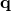
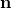
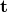
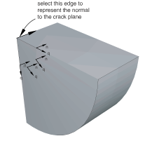
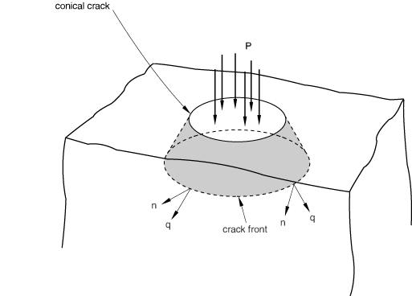
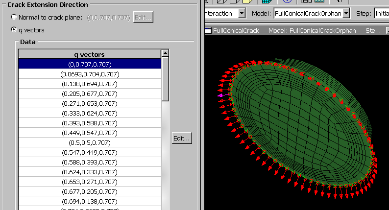

# 31.2.4 定义裂缝扩展方向

定义了裂缝前缘以及裂缝尖端或裂缝线后，Abaqus/CAE会提示您指定裂缝尖端或沿裂缝线的裂缝扩展方向。您可以指定裂缝平面的法线；或者您可以直接指定裂缝扩展方向。有关Abaqus如何使用或计算裂缝扩展方向的详细讨论，请参见["轮廓积分评估"中的"指定虚拟裂缝扩展方向"，Abaqus Analysis User's Guide第11.4.2节](../usb/usb-link.md#usb-anl-acontintegral-direction)。

**裂缝平面法线**

如果您选择**Normal to crack plane**，您可以通过从模型中选择表示裂缝平面法线起点和终点的点来定义法线。裂缝平面包含Abaqus需要计算轮廓积分的向量。在许多情况下，裂缝平面代表裂缝的对称平面。

仅当方向在裂缝线上的所有点相同时，才应定义裂缝平面的法线。如果裂缝平面的法线方向沿裂缝线变化，则不能选择单个法线来定义裂缝线上所有点的裂缝扩展方向。

要定义裂缝平面的法线，您可以从几何体（如顶点、基准点或中点）中选择点，或者可以选择孤立网格节点。或者，您可以在提示区域输入点的坐标。如果您从几何体中选择点并随后修改部件，Abaqus/CAE会重新生成点并相应地更新法线。如果您使用孤立网格节点，则必须选择表示法线起点和终点的节点。

Abaqus计算与裂缝前缘切线和法线正交的裂缝扩展方向。

**q向量**

如果您选择**q vectors**，您可以通过从模型中选择表示向量起点和终点的点来直接定义裂缝扩展方向。如果您使用孤立网格节点，则必须选择表示向量起点和终点的节点。或者，您可以在提示区域输入点的坐标。

[图31-10](pt04ch31s02s04.md#eng-crack-circular)显示了一个由圆形弧形成的裂缝前缘的示例，向量的方向不断变化。相比之下，裂缝平面的法线是恒定的。因此，对于这种情况，您应该通过指定裂缝平面的法线来定义裂缝扩展方向。

**图31-10** 向量的方向变化，但法线方向恒定。

[图31-12](pt04ch31s02s04.md#eng-crack-manualqvectors)来自["线性弹性无限半空间中锥形裂缝的轮廓积分"，Abaqus Example Problems Guide第1.4.2节](../exa/exa-link.md#exa-sta-conicalcrack)。此示例提供了一个Abaqus Scripting Interface脚本，说明如何沿裂缝前缘在每个节点处输入向量。
<!-- image-count-supplement:start -->

<!-- image-count-supplement:end -->
