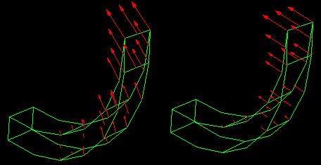
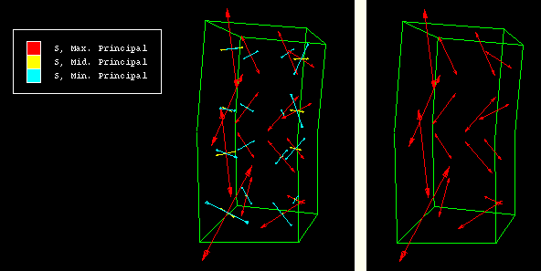
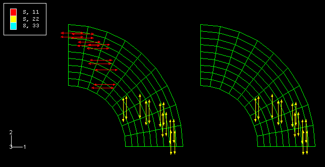

# 42.5.5 选择符号字段输出变量

您可以选择向量或张量变量分量，也可以选择要为符号图显示的分量；该变量称为符号字段输出变量。

选择输出数据库后，Abaqus/CAE 默认列出[output database](pt02ch09s06hlb02.md)的当前[step and frame](pt05ch42s01hlb01.md)处可用的所有向量和张量变量供您选择；结果值显示在矢量变量符号图中，所有主成分显示在张量变量符号图中。描述左侧的星号表示该变量包括复数结果。

当选择当前模型数据库中的模型时，Abaqus/CAE 默认会列出模型当前步骤中可用的所有载荷、预定义字段、边界条件和交互作用以供您选择。所有这些可选项目前面都有一个括号内的字母，以按类别区分它们：**(L)** 表示载荷，**(P)** 表示预定义字段，**(B)** 表示边界条件，**(I)** 表示相互作用。

使用“字段输出”对话框中的“符号变量”选项来选择所需的变量和特定组件。有关各个输出变量标识符的信息，请参阅["Output variables," Section 4.2 of the Abaqus Analysis User's Guide](../usb/usb-link.md#usbovsect)。

在符号图中显示矢量变量时，您可以从以下选项中进行选择： 
- 显示代表变量结果值的箭头。例如，总位移的符号图出现在[Figure 42--3](pt05ch42s03hlb05.md#viw-sym1)的左侧。

- 显示代表变量的特定分量值的箭头。例如，1 方向位移的符号图出现在[Figure 42--3](pt05ch42s03hlb05.md#viw-sym1)的右侧。

**图 42-3** 显示总位移（左）和 1 方向位移（右）的符号图。

同样，当您在符号图中显示张量变量时，您可以从以下选项中进行选择：
- 显示代表变量的每个主成分的箭头。例如，最大、中间（中）和最小主应力的符号图出现在[Figure 42--4](pt05ch42s03hlb05.md#viw-sym3)的左侧。
- 显示代表变量的特定主成分的箭头。例如，仅最大主应力的符号图出现在[Figure 42--4](pt05ch42s03hlb05.md#viw-sym3)的右侧。

**图 42–4** 显示所有三个主成分的符号图（左），以及仅显示最大主应力的符号图（右）。

- 显示代表变量的每个直接组成部分的箭头。 For example, a symbol plot of all direct components appears on the left side of[Figure 42--5](pt05ch42s03hlb05.md#tensor-direct).
- 显示代表变量的特定直接组成部分的箭头。 For example, a symbol plot of only S22 appears on the right side of[Figure 42--5](pt05ch42s03hlb05.md#tensor-direct).

**图 42-5** 显示所有直接组件的符号图（左）和仅显示 S22 的符号图（右）。

**选择符号字段输出变量：**

1. 找到控制符号字段输出变量的选项。从主菜单栏中，选择****结果****字段输出****。单击出现的对话框中的“**符号变量**”选项卡。将出现 **符号变量** 选项。 **提示：**您还可以通过单击出现的任何对话框中的 **字段输出** 按钮来访问这些选项。要查看所列变量的完整说明，请通过拖动一角来增加对话框的宽度。
2. 要控制哪些变量出现在 **名称** 和 **说明** 列表中： 1. 切换 **仅列出带有结果的变量** 以显示受变量存储位置限制的列表。限制列表可帮助您通过仅显示积分点数量等来选择变量。当**仅列出带有结果的变量**打开时，下拉菜单中的过滤器选项将变为可用。 2. 单击 **仅列出带有结果的变量** 箭头以显示过滤器选项。 3. 单击说明要包含在 **名称** 和 **说明** 列表中的变量位置的文本。文本显示在 **仅列出带有结果的变量** 框中，并且 **名称** 和 **说明** 列表将刷新以仅包含具有该位置的变量。
3. 从**名称**和**描述**列表中，单击所需分析变量的名称。列表中描述左侧的星号表示该变量包括复数结果。所选变量突出显示。对话框底部的“矢量数量”、“张量数量”和“分量”列表将刷新，分别显示可用的矢量数量、张量数量和分量。
4. 如果您要创建矢量变量符号图，请选择要绘制的分量。 - 选择 **结果** 以显示代表变量结果的箭头。 - 选择 **所选组件** 和要显示代表变量特定组件的箭头的组件。
5. 如果要创建张量变量符号图，请选择要绘制的分量。 - 选择 **所有主成分** 以显示代表所有可用主成分的箭头。 - 选择 **选定的主成分** 和您想要仅显示代表特定主成分的箭头的成分。 - 选择 **所有直接组件** 以显示代表所有三个直接组件的箭头。 - 选择 **选定的直接组件** 以及您想要仅显示代表特定直接组件的箭头的组件。
6. 单击“**应用**”以实施您的更改。当前视口中的符号图将更改以显示您指定的分析变量的值。如果处于活动状态，图例和状态块中的文本将发生变化以标识与绘图关联的变量。有关图例和状态块的更多信息，请参阅["Customizing the legend," Section 56.1](pt05ch56s01.md)和["Customizing the state block," Section 56.3](pt05ch56s03.md)。您的更改将在会话期间保存。

有关相关主题的信息，请单击以下项目： -[Chapter 42, "Selecting model data and analysis results to plot](pt05ch42.md)"

