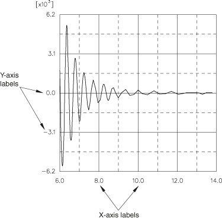

# 47.5.9 自定义 X–Y 绘图坐标轴标签

### 47.5.9 自定义 X–Y 绘图坐标轴标签

点击 **坐标轴（Axes）** 选项卡来自定义 X–Y 绘图中 X 轴和 Y 轴上主 [刻度线](pt05ch47s04hlb06.md) 旁边的数字标签。坐标轴标签示例如 [图 47–41](pt05ch47s04hlb09.md#viw-axislabel) 所示。

**图 47–41** 带坐标轴标签的 X–Y 绘图。

您可以自定义以下内容：
- 标签的格式（自动、十进制、工程或科学）。
- 标签中的小数位数或有效数字位数。
- 标签相对于主刻度线的频率。
- 标签的字体。

标签的颜色由坐标轴的颜色控制。有关更多信息，请参阅 ["自定义 X–Y 绘图坐标轴颜色和样式，" 第 47.5.10 节"](pt05ch47s04hlb10.md)。

**要控制 X–Y 绘图的坐标轴标签：**

1. 找到 **标签（Labels）** 选项。选择 ****选项（Options）****XY 选项（XY Options）****坐标轴（Axis）****；或点击 ，该图标位于可视化模块工具箱的 X–Y 绘图工具中。点击出现的对话框中的 **坐标轴（Axes）** 选项卡。坐标轴的 **标签（Labels）** 选项出现在 **坐标轴（Axes）** 页面的中间。
2. 从 **X 轴（X Axis）** 或 **Y 轴（Y Axis）** 字段中，高亮显示一个或多个轴。
3. 指定坐标轴标签的放置位置。从 **标签（Labels）** 选项中的 **放置位置（Placement）** 列表中，选择以下之一：**无（None）** Abaqus/CAE 隐藏所选轴的坐标轴标签。**内部（Inside）** Abaqus/CAE 在与 X–Y 曲线相同的轴侧显示坐标轴标签。**外部（Outside）** Abaqus/CAE 在与 X–Y 曲线相对的轴侧显示坐标轴标签。
4. 点击 **频率（Frequency）** 箭头指定标签相对于每个主刻度线的打印频率。例如，如果选择频率为 2，则标签将沿轴显示在每隔一个主刻度线处。如果选择频率为 0，则不会显示任何标签。您可以请求的标签频率最多比主刻度线数多 1。
5. 从 **标签（Labels）** 选项中，选择所选标签的格式。1. 点击 **格式（Format）** 按钮显示 X 轴标签格式选项。2. 选择以下之一：**自动（Automatic）** 非常大的值和非常小的值以科学计数法表示。所有其他值均以无指数形式表示，并使用指定的有效数字位数。**十进制（Decimal）** 所有值均以无指数形式表示，并使用指定的有效数字位数。**工程（Engineering）** 大于或等于 1000（或小于或等于 0.001）的值表示为 1 到 999 之间的数字乘以 10 的 n 次方，其中 n 是 3 的倍数（例如，`20.5E+03` 或 `17.76E+06`）。所有其他值使用指定的有效数字位数表示。**科学（Scientific）** 所有值表示为 1 到 10 之间的数字乘以 10 的适当次方（例如，`2.05E+04` 或 `1.776E+07`）。
6. 点击 **精度（Precision）** 箭头指定每个标签中有效数字（非十进制格式）或小数位（十进制格式）的所需数量。
7. 选择坐标轴标签的字体。1. 点击 。Abaqus/CAE 显示 **选择字体（Select Font）** 对话框。2. 使用 **选择字体（Select Font）** 对话框中的方法选择新字体、大小和样式。有关更多信息，请参阅 ["自定义字体，" 第 3.2.8 节"](pt01ch03s02s08.md)。3. 点击 **应用（Apply）** 查看字体选择的效果。4. 点击 **确定（OK）** 关闭 **选择字体（Select Font）** 对话框。坐标轴标签变为所选的字体、大小和样式。
8. 选择坐标轴标签的颜色。1. 点击颜色样本 。Abaqus/CAE 显示 **选择颜色（Select Color）** 对话框。2. 使用 **选择颜色（Select Color）** 对话框中的方法选择新颜色。有关更多信息，请参阅 ["自定义颜色，" 第 3.2.9 节"](pt01ch03s02s09.md)。3. 点击 **确定（OK）** 关闭 **选择颜色（Select Color）** 对话框。坐标轴标签变为所选颜色。
9. 点击 **关闭（Dismiss）** 关闭 **坐标轴选项（Axis Options）** 对话框。

有关相关信息，请点击以下任一项目：- ["自定义 X–Y 绘图坐标轴刻度线，" 第 47.5.6 节"](pt05ch47s04hlb06.md)
- ["自定义 X–Y 绘图坐标轴标题，" 第 47.5.7 节"](pt05ch47s04hlb07.md)
- ["X–Y 绘图坐标轴选项概述，" 第 47.5.1 节"](pt05ch47s04hlb01.md)
