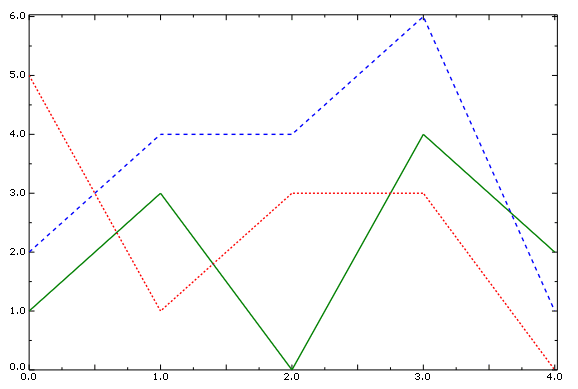

# 47.6.4 自定义 X–Y 曲线外观

### 47.6.4 自定义 X–Y 曲线外观

使用 **曲线选项（Curve Options）** 对话框来自定义在 X–Y 绘图中表示 X–Y 数据对象的线条的颜色、样式和粗细。[图 47–42](pt05ch47s05hlb03.md#usv-xyplot-curveopts) 说明了对 X–Y 数据曲线进行自定义的几种方式。

**图 47–42** 带自定义曲线的 X–Y 绘图。

您选择的颜色、样式和粗细会沿曲线显示，并在 [图例](pt05ch56s01.md) 中显示。只有当 **显示（Show）** 处于开启状态时，自定义选项才可用。

默认情况下，Abaqus/CAE 通过引用 X–Y 自动颜色列表来为绘图中 X–Y 曲线着色。您可以从 **编辑 XY 自动颜色（Edit XY-Auto-Colors）** 对话框修改此列表；请参阅 ["编辑 X–Y 绘图的自动颜色列表，" 第 47.6.6 节"](pt05ch47s05hlb05.md)。

**要自定义 X–Y 绘图中曲线的外观：**

1. 找到 **显示（Show）** 选项。**显示（Show）** 选项出现在 **曲线选项（Curve Options）** 对话框的右下角。
2. 从 **曲线（Curves）** 字段中，[选择一条或多条 X–Y 曲线](pt05ch47s05s01.md) 来自定义其属性。**注意：**要使 X–Y 曲线可供选择，您必须首先绘制它。您选择的自定义选项将应用于您选择的所有曲线；如果要更改多条曲线的外观，必须一次自定义一条。
3. 切换 **显示（Show）** 以显示或隐藏表示每条所选 X–Y 曲线的线条。当 **显示（Show）** 开启时，曲线会显示，线条属性选项会启用。
4. 选择线条颜色：1. 点击颜色样本 。Abaqus/CAE 显示 **选择颜色（Select Color）** 对话框。2. 使用 **选择颜色（Select Color）** 对话框中的方法选择新颜色。有关更多信息，请参阅 ["自定义颜色，" 第 3.2.9 节"](pt01ch03s02s09.md)。3. 点击 **确定（OK）** 关闭 **选择颜色（Select Color）** 对话框。所选的 X–Y 曲线变为所选颜色。
5. 选择线条样式：1. 点击 **样式（Style）** 按钮显示线条样式选项（实线、虚线等）。2. 从样式列表中，点击所需的线条样式。所选的 X–Y 曲线变为所选样式。
6. 选择线条粗细：1. 点击 **粗细（Thickness）** 按钮显示线条粗细选项。2. 从粗细列表中，点击所需的线条粗细。所选的 X–Y 曲线变为指定的粗细。
7. 点击 **关闭（Dismiss）** 关闭 **坐标轴选项（Axis Options）** 对话框。

有关相关信息，请点击以下项目：- ["选择要自定义的一条或多条 X–Y 曲线，" 第 47.6.2 节"](pt05ch47s05s01.md)
