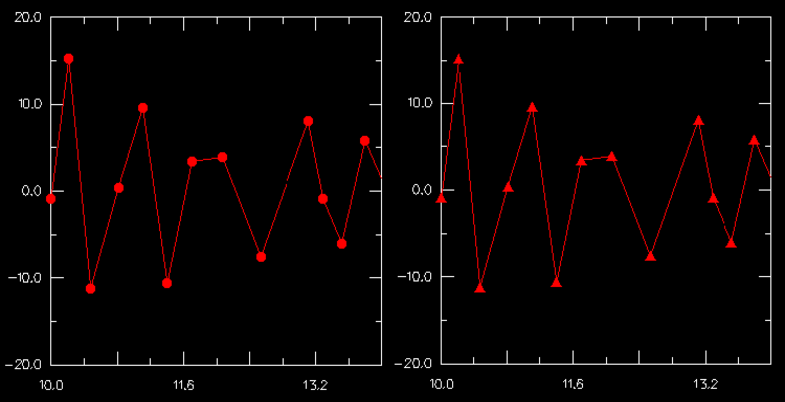

# 47.6.5 自定义 X–Y 曲线上使用的符号

### 47.6.5 自定义 X–Y 曲线上使用的符号
<!-- image-count-supplement:start -->
<!-- Supplemental image/formula references preserved from the English source for QA parity. -->

<!-- image-count-supplement:end -->
