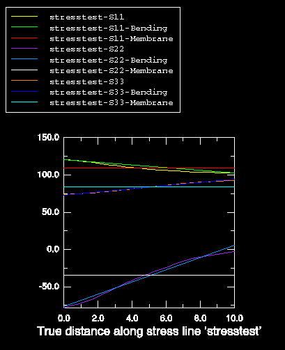

# 52.3 获取线性化应力结果

您可以沿穿过模型的线获取线性化应力。Abaqus/CAE 将沿该线的应力结果分离为恒定薄膜应力和线性弯曲应力，并以 X–Y 绘图的形式显示结果。

**获取线性化应力结果：**

1. 找到应力线性化选项。从主菜单栏中，选择 ****工具（Tools）****查询（Query）**** 或点击 **查询（Query）** 工具栏中的  工具。出现 **查询（Query）** 对话框。
2. 选择 **应力线性化（Stress linearization）**。出现 **应力线性化（Stress Linearization）** 对话框。
3. 在 **应力线名称（Stress line name）** 字段中，为应力线提供一个名称。此名称将用作线性化结果的前缀。
4. 要保存将生成的 X–Y 数据，请切换 **保存 XY 数据（Save XY data）**。数据将在您的 Abaqus/CAE 会话期间可用。
5. 要将端点和间隔点保存为路径，请切换 **将应力线保存到路径（Save stress line to path）**。应力线的点将作为点列表路径保存，名称与应力线相同，将在您的 Abaqus/CAE 会话期间可用。
6. 通过选择节点或空间中的点或选择保存的路径来选择应力线的端点。**手动（Manual）** 这是默认方法。您可以直接从视口选择节点，或在空间中键入节点标签或点。**直接从视口选择节点：** 点击 **起点（Start）** 和 **终点（End）** 字段右侧的 ，然后在视口中点击所需的节点。节点标签（包括部件实例名称）将出现在应力线的 **起点（Start）** 和 **终点（End）** 点的文本字段中。**键入节点标签或空间中的点：** 1. 在 **起点（Start）** 文本字段中，输入部件实例名称和节点标签或空间中的点的坐标。部件实例名称和节点标签必须采用 `*实例.节点*` 的形式；指定坐标值作为用空格或逗号分隔的 X、Y 和 Z 坐标。如果不知道模型中的部件实例名称，请使用前述方法直接从视口选择节点。或者，您可以选择 ****工具（Tools）****查询（Query）**** 或点击 **查询（Query）** 工具栏中的  工具，并选择 **探针值（Probe values）** 方法来确定实例名称和节点标签（有关更多信息，请参阅 ["理解探测，" 第 51.1 节"](pt05ch51s01.md)）。2. 重复前述步骤以完成 **终点（End）** 文本字段。**从路径（From a path）** 切换 **从路径（From a path）**，并从出现的列表中选择路径名称；您不能使用边列表路径来定义应力线的端点。（有关路径的更多信息，请参阅 [第 48 章，"沿路径查看结果"](pt05ch48.md)。"）Abaqus/CAE 使用保存路径的端点作为应力线的端点。点的定义方式与它们最初在路径中的定义方式相同——节点列表路径提供模型上的节点点，点列表路径或圆形路径提供空间中的点坐标。无论您使用哪种方法来选择端点，Abaqus 都会在视口中高亮显示应力线并标记起点和终点。如果您选择节点点或节点列表路径来定义应力线的端点，视口中的标签指示节点编号。**注意：**如果您在步骤 5 中选择将应力线保存为路径，Abaqus/CAE 始终保存点列表路径——即使您选择了节点、节点标签或节点列表路径来定义应力线。
7. 选择要获取应力结果的模型形状。默认是获取变形模型形状的结果。切换 **未变形（Undeformed）** 以获取未变形模型形状的结果。
8. 指定应力线应被划分的间隔数。在 **应力线上的间隔数（Number of intervals on stress line）** 文本字段中输入大于 0 的正整数。如果您不输入数字，Abaqus 将使用默认的间隔数。
9. 默认情况下，Abaqus/CAE 将线性化应力值（包括应力的所有可用分量和计算的线性化应力不变量）写入名为 `linearStress.rpt` 的文件。如果您不希望写入此报告，您可以切换关闭对话框 **报告（Report）** 区域中的 **写入文件（Write to file）**。您可以通过在 **文件名（File name）** 字段中输入名称或点击  并从出现的现有文件列表中进行选择来为报告文件指定新名称。如果您将报告写入现有文件，新数据将默认追加到文件；如果您希望覆盖文件，请切换关闭 **追加到文件（Append to file）**。
10. 点击 **计算（Computations）** 选项卡。
11. 通过切换每个薄膜和弯曲分量来选择要线性化的应力分量。
12. 选择用于计算不变量的弯曲分量。
13. 对于轴对称模型，请在应力线位置输入模型中面中平面曲率的近似值。默认值是 **无限（Infinite）**，表示缺乏曲率。要指定曲率半径，请点击 **指定（Specify）** 并在文本字段中输入数字。
14. 对于轴对称模型，请在应力线位置输入模型中面外曲率的近似值。默认值是 **计算（Compute）**，允许 Abaqus 根据轴对称形状和所选应力线的位置计算半径。要指定曲率半径，请点击 **指定（Specify）** 并在文本字段中输入数字。
15. 对于非轴对称模型，选择 Abaqus 是否应使用曲率校正。如果选择曲率校正，请指定局部坐标系或使用默认的（全局）坐标系；如果您使用局部坐标系进行曲率校正，您也可以使用该局部坐标系来评估应力线方向。
16. 点击 **确定（OK）**。类似于 [图 52–6](pt05ch52hla01.md#usv-stresslin-plot) 中所示的 X–Y 绘图出现在视口中。**图 52–6** 应力线性化结果。

有关相关信息，请点击以下项目：- [第 47 章，"X–Y 绘图"](pt05ch47.md)
