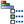

# 53.2.3 自定义层压板堆叠绘图中纤维的外观

点击 **纤维（Fiber）** 选项卡来选择是否在层压板堆叠绘图中显示纤维以及纤维的外观。纤维始终绘制在 1–2 平面中，与 1 方向成一定角度。有关更多信息，请参阅 ["理解复合叠层和取向，" 第 23.3 节"](pt04ch23s03.md)。

如果您使用坐标系来定义层的取向，Abaqus/CAE 无法在不知道单元的空间取向的情况下确定单元内的取向。因此，Abaqus/CAE 在层纤维的位置显示星号（`*`）来表示它无法在 1–2 平面中绘制表示纤维方向的线。出于同样的原因，如果层的取向使用离散场分布定义，Abaqus/CAE 无法绘制准确表示纤维方向的线；层纤维位置的脱字号（`^`）表示层取向中的附加旋转是使用离散场定义的。

在实体复合叠层中，一层中的纤维并不总是平行于 1–2 平面运行（例如，如果层取向的 3 方向与单元堆叠方向未对齐）。由于层压板堆叠绘图中的纤维始终绘制在 1–2 平面中，它们并不是实体复合层中纤维的真实描绘。相反，纤维是复合截面或叠层定义中旋转角度的图形表示：层压板堆叠绘图中绘制的角度是层表中指定的相对于单元堆叠方向轴测量的旋转角度。

**自定义层压板堆叠绘图中纤维的外观：**

1. 找到纤维选项。1. 从提示区域点击 **层压板堆叠绘图选项（Ply Stack Plot Options）** 按钮，或执行以下操作之一：- 在属性模块中，选择 ****视图（View）****层压板堆叠绘图选项（Ply Stack Plot Options）****。- 在可视化模块中，选择 ****选项（Options）****层压板堆叠绘图（Ply Stack Plot）**** 或点击工具箱中的  工具。2. 在出现的 **层压板堆叠绘图选项（Ply Stack Plot Options）** 对话框中点击 **纤维（Fiber）** 选项卡。
2. 执行以下操作：- 切换 **显示纤维（Show fibers）** 以在层压板堆叠绘图中显示纤维。- 选择在层压板堆叠绘图中表示纤维的线条的颜色、样式和粗细。- 拖动 **间距（Spacing）** 滑块来更改显示的纤维数量。
3. 点击 **应用（Apply）** 实施您的更改。层压板堆叠绘图会更改以反映您的规范。默认情况下，您的更改将在会话期间保存，并将影响该视口中所有后续层压板堆叠绘图。如果您想在后续会话中保留您的更改，请将它们保存到文件。有关更多信息，请参阅 ["保存自定义以供后续会话使用，" 第 55.1.1 节"](pt05ch55s01s01.md)。
