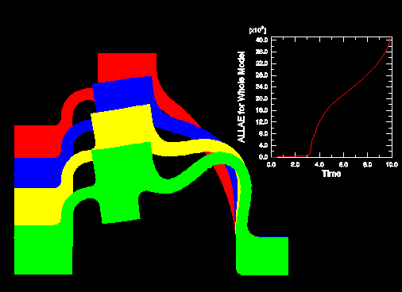
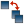

# 79.1 了解如何叠加绘图

您可以创建一个在一个视口中包含多个绘图的显示。例如，您可能想要执行以下任一操作：
- 结合等高线图和 *X--Y* 图
- 比较同一视口中两个不同输出数据库文件的变形绘图形状
- 将时间历史动画与动画*X--Y*图相结合，显示模型中多个变量随时间的变化

例如，叠加图对于在同一视口中的协同仿真中显示来自两个输出数据库的数据非常有用。

叠加图由层组成；每个图层包含一个图，并且这些图层彼此堆叠以创建组合图。[Figure 79--1](pt07ch79s01.md#uss-ovr-layerplot)显示的图包含四个不同分析增量下的变形形状图，以及模型中应变能与时间的 *X–Y* 图。

**图 79–1** 叠加图。

默认情况下，视口不包含任何图层；一次仅显示一个图。要叠加多个图，您可以在与 Abaqus/CAE 交互时为每个单独的图创建一个图层。然后，您可以选择要在当前视口中显示的图层。您可以根据需要创建任意数量的图层；同一视口中可以显示任意数量的图层。此外，您还可以打开多个输出数据库，并在单个视口的叠加图中自动显示组合内容。

使用 **叠加图图层管理器​​* 创建、显示、定位和删除图层。要访问管理器，请从主菜单栏中选择****查看****叠加图****或单击工具箱中的**叠加图图层管理器​​*工具。

创建图层时，它包含当前视口中可见的所有内容。您可以更改图层的内容、操作其视图、相对于叠加图中的其他图层重新排序该图层，以及更改应用于内容的各种显示选项。默认情况下，图层直接绘制在彼此之上。有时，直接重叠出现的线条会产生不良的视觉效果。您可以使图层相互偏移以避免此类显示异常。

仅当您单击“绘图叠加”时，**叠加绘图图层管理器​​*中的设置才会应用于当前视口的内容。然后Abaqus/CAE进入叠加绘图状态；当您单击“叠加图图层管理器​​”中的“绘制单个图”时，叠加图将从视口中消失，并且显示将恢复到之前的绘图状态。您还可以单击工具箱中的工具随时在单图和叠加图状态之间切换。

当处于叠加图状态时，Abaqus/CAE 显示相对于叠加图坐标系的图。创建图层时，Abaqus/CAE 会将创建图层的视图分配给叠加图前视图 (1–2)。您可以通过操作每个单独图层的视图来修改叠加图前视图中显示的内容，如["Manipulating the view for an overlay plot," Section 79.2.3](pt07ch79s02hlb03.md)中所述。在叠加图状态中定义的用户指定视图是相对于叠加图坐标系的。

**叠加图图层管理器​​*中的列显示有关每个图层的以下信息：

**可见的**

此列中的复选标记表示当您处于叠加绘图状态时，该图层在视口中可见。

**当前的**

此列中的复选标记表示该图层是当前图层。尽管每个图层可以包含多个绘图状态，但一次只能有一个图层处于当前状态（有关详细信息，请参阅["Displaying multiple plot states," Section 55.6](pt05ch55s06.md)）。当您处于叠加绘图状态时，绘图选项仅应用于当前图层；您可以选择是将视图操作选项应用于所有现有图层还是仅应用于当前图层。当前图层不一定是视口中的最前面的图层。

**姓名**

图层的名称。

**目的**

图层中包含的对象的名称；例如，输出数据库或 *X–Y* 图。

