# 8.2 非线性问题的求解

结构的非线性荷载-位移曲线如图8-7所示。

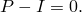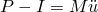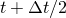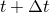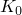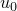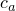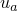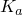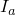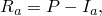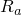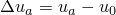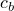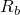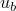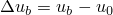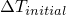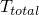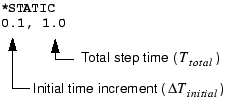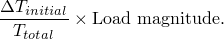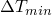。

如果增量在少于五次迭代中收敛，这表明解相当容易找到。因此，如果连续两个增量需要少于五次迭代来获得收敛解，Abaqus/Standard 自动将增量大小增加50%。

自动荷载增量方案的详细信息在消息文件中给出，详见8.4.3节"结果"。
## 8.2.1 Steps, increments, and iterations
## 8.2.2 Equilibrium iterations and convergence in Abaqus/Standard
### Convergence
## 8.2.3 Automatic incrementation control in Abaqus/Standard
